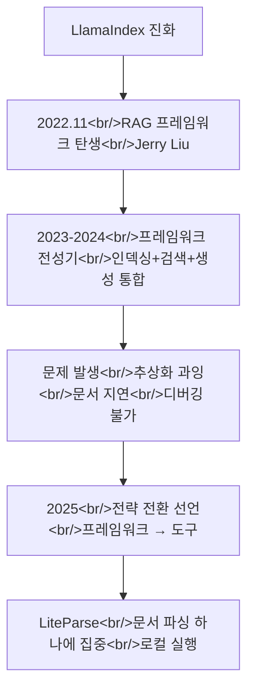

## 개요

YouTube 영상 [LiteParse - The Local Document Parser](https://www.youtube.com/watch?v=_lpYx03VVBM)를 분석했다. LiteParse 자체도 흥미로운 도구이지만, 더 중요한 것은 RAG 프레임워크의 선두 주자였던 LlamaIndex가 **"프레임워크 시대는 끝났다"**고 선언하며 단일 도구로 방향을 전환한 배경이다. 관련 포스트: [Context7 deep dive](/posts/2026-03-20-context7/)

<!--more-->

---

## LlamaIndex의 역사와 전환 배경

### RAG 프레임워크의 선구자

Jerry Liu가 2022년 11월에 만든 LlamaIndex는 **최초의 본격적인 RAG 프레임워크**였다. 문서 인덱싱, 벡터 검색, 답변 생성을 하나의 프레임워크 안에서 추상화하여, RAG 파이프라인을 빠르게 구축할 수 있게 했다. 당시 RAG가 LLM 활용의 핵심 패턴으로 떠오르면서 LlamaIndex는 이 분야의 대표 프레임워크가 되었다.

### 프레임워크 시대의 근본적 문제

영상에서 지적하는 프레임워크 시대의 문제들:

**추상화 레이어의 빠른 변화** — AI 모델과 기술이 매달 바뀌는데, 프레임워크의 추상화는 이 속도를 따라가지 못한다. 문서는 항상 뒤처지고, 6개월 전 튜토리얼이 이미 동작하지 않는다.

**디버깅의 어려움** — 프레임워크 내부에 숨겨진 복잡성 때문에, 무언가 잘못되었을 때 원인을 찾기 어렵다. "인덱스 → 검색 → 생성" 파이프라인 중 어디서 문제가 생겼는지 추상화 뒤에 가려져 있다.

**추상화가 오히려 제약** — AI 모델 자체가 빠르게 발전하면서, 프레임워크가 정해놓은 방식이 최선이 아닌 경우가 늘어난다. 프레임워크를 우회하는 코드가 늘어나면 프레임워크의 존재 의미가 희석된다.

LlamaIndex 팀 스스로가 이 문제를 인정하고 방향을 전환했다는 점이 핵심이다. **자신들이 만든 프레임워크 시대의 한계를 자신들이 선언**한 것이다.

---

## LiteParse — 하나의 문제를 잘 해결하는 도구

### 해결하는 문제

코딩 에이전트는 Python 수천 줄을 거뜬히 쓰지만, PDF나 문서를 주면 유용한 맥락이 사라진다:

- **테이블이 평탄화됨** — 행/열 구조 정보가 손실되어 데이터 의미가 왜곡
- **차트가 사라짐** — 시각적 데이터가 완전히 무시
- **숫자가 환각함** — OCR 오류로 잘못된 수치가 전달
- **PyPDF 등의 우회 방법이 불안정** — janky workaround로 기본 텍스트만 추출

기존에는 이런 문제를 해결하려면 별도 OCR 모델을 붙이거나, 여러 라이브러리를 조합하는 복잡한 파이프라인을 구축해야 했다.

### LiteParse의 접근

LiteParse는 **로컬에서 실행되는 문서 파서**로, 단 하나의 일을 한다 — PDF, DOCX 등의 문서에서 테이블 구조, 차트, 코드 블록을 **정확하게** 추출하는 것.

핵심 특성:
- **로컬 실행** — 외부 API 의존 없음, 프라이버시 보장
- **구조 보존** — 테이블의 행/열, 차트의 데이터 포인트를 유지
- **단일 목적** — RAG 파이프라인의 일부가 아닌, 독립 도구
- **아무 파이프라인에 연결 가능** — LlamaIndex에 종속되지 않음

---

## 프레임워크 vs 도구 — 패러다임 비교

| 구분 | 프레임워크 (LlamaIndex RAG) | 도구 (LiteParse) |
|------|---------------------------|-----------------|
| 범위 | 전체 RAG 파이프라인 | 문서 파싱만 |
| 추상화 | 높음 (인덱스, 검색, 생성) | 낮음 (입력 → 파싱 결과) |
| 유연성 | 프레임워크 방식에 종속 | 아무 파이프라인에 연결 가능 |
| 디버깅 | 추상화 뒤에 숨겨짐 | 입출력이 명확 |
| 유지보수 | 빈번한 breaking changes | 안정적 인터페이스 |
| 학습 곡선 | 프레임워크 전체 이해 필요 | 해당 기능만 이해 |

---

## AI 개발 생태계의 구조적 변화

LlamaIndex의 전환은 고립된 사건이 아니다. AI 개발 생태계 전반에서 같은 패턴이 반복되고 있다:

- **Context7** — LLM에게 최신 문서를 주입하는 "하나의 일"에 특화된 MCP 도구로 성공 ([Context7 deep dive](/posts/2026-03-20-context7/))
- **MCP (Model Context Protocol)** — 프레임워크가 아닌, 도구 간 표준화된 프로토콜
- **Claude Code 마켓플레이스** — 특정 기능에 특화된 플러그인들의 생태계 ([마켓플레이스 비교](/posts/2026-03-20-claude-code-marketplaces/))

2022-2024년은 "모든 것을 감싸는 프레임워크"의 시대였다면, 2025년부터는 **"하나를 잘 하는 도구"의 시대**가 되고 있다. 현재 HarnessKit과 log-blog도 이 방향 — 프레임워크가 아닌, 특정 문제를 잘 해결하는 플러그인으로 설계했다.

---

## 인사이트

LlamaIndex의 전환이 의미 있는 이유는, 프레임워크의 한계를 외부 비평가가 아닌 **프레임워크의 선구자 자신이 인정**했다는 점이다. 이는 AI 개발 도구의 방향성에 대한 강한 신호다. 에이전트 시대에는 에이전트 자체가 오케스트레이션을 담당하기 때문에, 개발자가 필요한 것은 "모든 것을 엮어주는 프레임워크"가 아니라 "에이전트가 호출할 수 있는 좋은 도구"다. LiteParse가 문서 파싱을, Context7이 문서 주입을, MCP가 도구 프로토콜을 각각 담당하듯, 잘 만든 단일 도구들의 조합이 프레임워크를 대체하고 있다.
