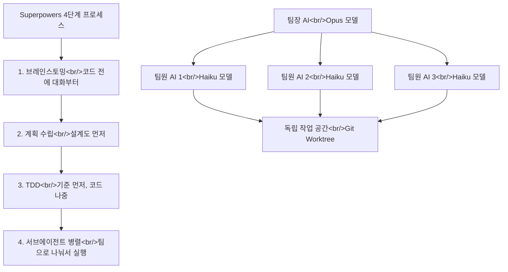

## 개요

YouTube 영상 [별 11만개 받은 AI 플러그인, 코드 한 줄이면 끝](https://www.youtube.com/watch?v=jw23empkqGg)을 분석했다. 이 11만 스타 플러그인의 정체는 **Superpowers** — 이전에 [Superpowers 완벽 가이드](/posts/2026-03-04-claude-code-superpowers/)에서 깊이 다뤘던 Claude Code 플러그인이다. 당시 69k 스타였던 것이 5개월 만에 11만을 돌파했다. 이번 포스트에서는 한국어 유튜버의 실무 관점 분석과 비판 포인트를 중심으로 정리한다. 관련 포스트: [Superpowers 완벽 가이드](/posts/2026-03-04-claude-code-superpowers/), [HarnessKit 개발기 #3](/posts/2026-03-25-harnesskit-dev3/)

<!--more-->



---

## Superpowers란 무엇인가

AI 코딩 도구(Claude Code, Cursor, Codex 등)에게 "앱 하나 만들어줘"라고 하면, 바로 코드를 짜기 시작한다. 영상의 비유가 적절하다:

> 인테리어 업자한테 "카페 느낌으로 해주세요" 했더니, 몇 인석인지, 예산은 얼마인지 물어보지도 않고 바로 벽을 부수기 시작하는 것과 같다.

Superpowers는 이 문제를 해결한다. AI에게 **작업 순서를 강제하는 매뉴얼(스킬 파일)**을 주입하여, 대화 → 계획 → 테스트 → 구현 순서를 지키게 만든다. 5개월 만에 GitHub 11만 스타를 달성했고, 제작자 Jesse Vincent는 오랫동안 오픈소스를 만들어온 개발자다.

설치는 간단하다:
```bash
# Claude Code 사용자
/plugin install superpowers

# Cursor 사용자
/plugin superpowers
```

---

## 핵심 1: 브레인스토밍 — 코드 전에 대화부터

일반적인 AI 코딩 도구에게 "로그인 기능 만들어줘"라고 하면 바로 코드를 생성한다. Superpowers가 설치되어 있으면 AI가 먼저 질문한다:

- 어떤 방식으로 로그인하게 할 건가요? 이메일? 소셜 로그인?
- 비밀번호 찾기도 필요해요?
- 세션 관리는 어떻게?

두세 가지 방법을 제안하면서 장단점을 알려주고, 사용자가 "이걸로 가자" 승인을 해야 그때서야 만들기 시작한다. 벽부터 부수던 업자가 도면부터 보여주는 업자로 바뀌는 것이다.

스킬 파일에는 AI가 이 단계를 건너뛸 수 없도록 명시되어 있다:

> "이건 선택이 아닙니다. 반드시 따르세요."

AI가 "이건 너무 간단해서 안 해도 되지 않나"라고 빠져나가려 할 때를 대비한 대응 매뉴얼까지 포함되어 있다.

---

## 핵심 2: TDD — 기준 먼저, 코드 나중

영상의 비유: 된장찌개를 만들 때 보통은 레시피대로 만들고 마지막에 맛을 본다. TDD는 **맛을 먼저 정해놓고 시작**하는 것이다. "짠맛이 이 정도, 고춧가루는 이만큼" — 이 기준을 먼저 만들고 그 기준에 맞춰 요리한다.

Superpowers에서 이것은 "철칙"으로 적혀 있다:

> "기준 없이 만들기 시작하는 거 금지. 기준 없이 먼저 만들었으면 지우고 다시 해."

기능이 어떻게 동작해야 하는지의 기준(테스트)을 먼저 만들고, 그 기준을 통과하는 코드를 작성한다. "나중에 이거 왜 안 돼요?"라고 할 일이 없다.

---

## 핵심 3: 서브에이전트 팀 — AI도 분업한다

가장 인상적인 설계 포인트다. 하나의 AI가 혼자 다 하는 것이 아니라, **팀을 나눠서 일한다**.

### 모델 분리 전략

| 역할 | 모델 | 이유 |
|------|------|------|
| 팀장 (계획 수립) | Opus (고급) | 깊이 생각해야 하는 전체 설계 |
| 팀원 (코드 작성) | Haiku (경량) | 계획이 나왔으니 빠르게 실행 |

건축에서 설계는 경력 30년 건축가가 하고, 벽돌쌓기는 숙련 기술자가 하는 것과 같다.

### 컨텍스트 분리

각 팀원 AI는 자기 작업에만 집중한다. 코드를 읽는 AI, 코드를 짜는 AI, 검토하는 AI가 분리되어 있다. 사람도 회의 3개를 동시에 하면 머리가 터지듯, AI도 이것저것 다 시키면 실수가 늘어난다.

### 독립 작업 공간 (Git Worktree)

여러 AI가 같은 프로젝트를 동시에 건드리면 충돌이 생긴다. Superpowers는 **프로젝트의 복사본을 각 AI에게 따로 제공**한다 (Git Worktree 활용). AI 1은 로그인 기능을, AI 2는 결제 기능을 각자의 작업 공간에서 만들고, 다 끝나면 합친다.

---

## Superpowers의 한계

영상에서도 솔직하게 짚는 비판 포인트:

- **정식 벤치마크가 없다** — 효과를 수치로 증명하는 비교 실험 데이터가 부족
- **브레인스토밍 질문의 깊이** — 어떤 질문을 할지의 설계가 아직 부족
- **QA 파트의 한계** — E2E(End-to-End) 테스트까지 가야 진짜 동작을 검증하는데, 현재 QA 단계가 충분하지 않음

---

## HarnessKit과의 비교

Superpowers와 [HarnessKit](/posts/2026-03-25-harnesskit-dev3/)은 같은 문제를 다른 관점에서 해결한다:

| 구분 | Superpowers | HarnessKit |
|------|------------|------------|
| 접근 | 워크플로우 강제 (스킬) | 가드레일 + 모니터링 (하네스) |
| 초점 | AI의 작업 순서 | AI의 출력 품질 |
| 방식 | 프로세스 주입 | 환경 제어 |
| 설치 | `plugin install` 한 줄 | 마켓플레이스 설치 |

둘은 경쟁이 아니라 보완 관계다. Superpowers로 작업 순서를 잡고, HarnessKit으로 품질을 관리하면 이중 안전 구조가 된다.

---

## 인사이트

Superpowers가 5개월 만에 11만 스타를 받은 이유는 기술의 혁신이 아니다. "AI에게 프로세스를 심어주면 결과가 달라진다"는 단순한 원리를 시스템으로 구현한 것이다. 영상의 핵심 메시지가 정확하다 — **AI 자체가 똑똑해지는 것보다, AI를 어떻게 쓰느냐가 더 중요하다**. 같은 Claude Code를 써도 Superpowers 유무에 따라 결과가 완전히 달라진다. 이는 코딩뿐 아니라 모든 AI 활용에 적용되는 원칙이다. 현재 우리가 만드는 HarnessKit도 같은 철학의 산물이다 — AI의 능력이 아니라 AI의 작업 환경을 설계하는 것.
