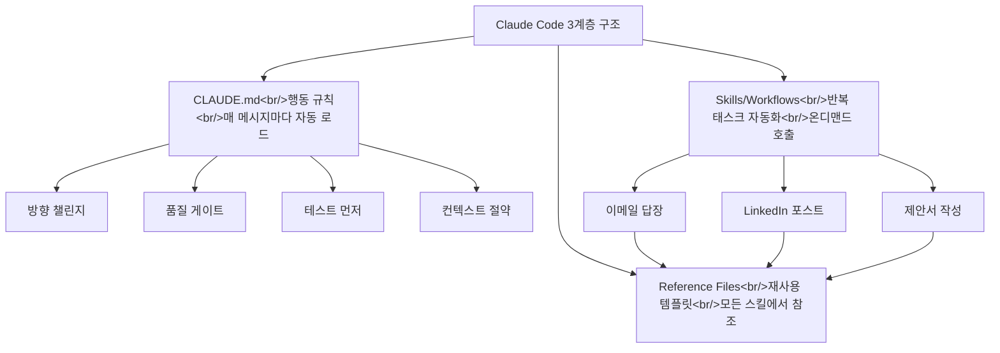

## 개요

YouTube 영상 [27 Claude Code Tips That Make You 10x Faster](https://www.youtube.com/watch?v=-IozMG9x0dI)를 분석했다. 500시간 이상 Claude Code를 사용한 경험에서 나온 27가지 팁을 초급/중급/고급으로 재분류하고, 실전 적용 관점에서 정리한다. 이전 시리즈와 이어진다:
- [Claude Code 실전 가이드 1 — 컨텍스트 관리부터 워크플로우까지](/posts/2026-03-19-claude-code-practical-guide/)
- [Claude Code 실전 가이드 2 — 최근 2개월 신기능](/posts/2026-03-24-claude-code-new-features/)

<!--more-->

---

## 초급: 시작하기

### 환경 설정

**VS Code 또는 Antigravity에 통합** — Claude Code를 단독으로 쓰는 것보다 IDE에 통합하면 코드 에디터와 AI 대화가 같은 화면에 있어 컨텍스트 전환 비용이 줄어든다. 플러그인 마켓에서 설치 한 번이면 된다.

**자동 저장 설정** — 이건 정말 중요하다. VS Code의 autosave를 켜지 않으면 Claude가 수정한 파일이 저장되지 않아 시간을 낭비하게 된다. Config에서 `autosave` 검색 후 체크.

**딕테이션 활용** — Mac에서 Fn 키 두 번으로 음성 입력 가능. 타이핑보다 빠르게 프롬프트를 입력할 수 있다.

### 방향 설정

Claude Code를 처음 쓸 때 가장 어려운 건 "뭘 물어봐야 하는지 모르는 것"이다. 영상에서 제안하는 접근:

> "I'm building a website from scratch. What questions should I be asking you?"

이렇게 하면 Claude가 "웹사이트의 목적은?", "성공 기준은?", "타겟 사용자는?" 같은 질문을 역으로 던져주고, 이 대화 체인을 따라가면 자연스럽게 요구사항이 정리된다.

---

## 중급: 생산성 극대화

### 멀티탭 병렬 작업

영상 제작자가 "너무 늦게 발견해서 부끄럽다"고 한 팁이다. **여러 탭을 열어 동시에 다른 태스크를 실행**할 수 있다. 스플릿 스크린으로 두 프로젝트를 나란히 놓고 병렬 작업이 가능하다. 수평으로도 분할할 수 있어 다수의 대화를 동시에 모니터링할 수 있다.

주의점: 20분 후 돌아왔더니 권한 승인을 기다리며 멈춰 있는 상황을 방지하려면, **bypass permissions 모드**를 활성화해야 한다. 설정에서 `bypass permissions` 검색 후 토글.

### CLAUDE.md — 두 개의 필수 파일

모든 프로젝트에 반드시 있어야 할 파일:

1. **CLAUDE.md** — Claude가 어떻게 행동해야 하는지. "직원을 고용하고 교육하는 것"과 같다
2. **project_specs** — 무엇을 만들고 있는지. "직원에게 회사가 뭘 하는지 알려주는 것"과 같다

둘 다 살아있는 문서(living document)로, 프로젝트가 진화하면서 함께 업데이트되어야 한다.

### CLAUDE.md에 넣어야 할 5가지 규칙

| 규칙 | 목적 |
|------|------|
| Challenge my direction | yes-man 방지, 최선의 결과 도출 |
| Quality gate | 품질 점수를 솔직하게 (3/10 → 9/10 개선 방법) |
| Test before delivery | 깨진 결과물을 사람이 디버깅하지 않도록 |
| Context awareness | 컨텍스트 윈도우 절약, 불필요한 토큰 사용 방지 |
| Upgrade suggestion | 매 응답마다 개선 제안, 사각지대 발견 |

### 응답 구조화

복잡한 프로젝트에서 Claude의 응답이 구조화되지 않으면 압도적이다. 영상에서 제안하는 5단계 응답 형식:

1. **무엇을 했는지** — 작업 요약
2. **나한테 필요한 것** — 내가 해야 할 액션
3. **왜 중요한지** — 15세에게 설명하듯
4. **다음 단계** — 진행 방향
5. **에러와 컨텍스트** — 발생한 문제와 이해에 필요한 정보

### 메시지 큐잉

이전 메시지가 끝나기를 기다리지 않아도 된다. **여러 메시지를 연속으로 보내면 큐에 쌓여서 순서대로 처리**된다.

---

## 고급: 시스템 설계

### 3계층 아키텍처

영상에서 제안하는 Claude Code 프로젝트의 3계층:

1. **CLAUDE.md** — 행동 규칙. 매 메시지마다 자동으로 읽힘
2. **Skills/Workflows** — 반복 태스크 자동화. 온디맨드로 호출 (`/skill-name`)
3. **Reference Files** — 재사용 템플릿. 모든 스킬에서 참조

예: 이메일 답장, LinkedIn 포스트, 제안서 작성 세 스킬이 모두 "나의 어조(tone)" 레퍼런스 파일을 참조하면, 어조를 한 번 수정하면 세 스킬 모두에 반영된다. 한 번 설정하고 영원히 재사용하며 계속 개선하는 구조다.

### 서브에이전트 활용

5페이지 웹사이트를 순차적으로 만들면 느리다. **서브에이전트를 사용하면 각 페이지를 병렬로 생성**한다:

- 홈페이지 → 서브에이전트 1
- About 페이지 → 서브에이전트 2
- Contact 페이지 → 서브에이전트 3

각 에이전트가 하나에 특화되어 컨텍스트가 분리되므로, 더 빠르고 더 좋은 결과를 낸다.

### 디자인 팁

**Dribbble 클론** — Dribbble에서 영감을 얻고, 스크린샷을 Claude Code에 첨부하면 픽셀 단위로 복제 가능. URL을 첨부해도 사이트를 분석하고 복제한다.

**Spline 3D** — 무료 3D 그래픽을 웹사이트에 추가. 커서를 따라다니는 큐브, 공 등의 인터랙티브 요소로 $10,000짜리 사이트처럼 보이게 만든다.

### 기타 고급 팁

- **Escape + Rewind** — 작업이 잘못된 방향으로 갈 때 Escape로 중단, Rewind 버튼으로 이전 단계로 복원
- **Compacting** — 컨텍스트 83% 이상 사용 시 수동으로 compact하고, 잊으면 안 되는 핵심 정보를 리마인더로 추가
- **Memory** — 프로젝트 간 지속되는 비밀 메모리 파일. `/memory`로 관리. 이름, 선호도 등을 기억
- **Insights** — `insights` 입력으로 전체 사용 통계와 피드백 리포트 확인
- **Plugins** — `/plugin`으로 프리빌트 솔루션 다운로드 (예: frontend-design)

---

## 빠른 링크

- 무료 CLAUDE.md 템플릿 — 영상 설명에 링크
- [Dribbble](https://dribbble.com) — 디자인 영감
- [Spline](https://spline.design) — 무료 3D 그래픽

---

## 인사이트

27가지 팁을 관통하는 핵심은 "Claude Code는 도구가 아니라 시스템"이라는 관점이다. CLAUDE.md로 행동을 정의하고, Skills로 워크플로우를 자동화하고, Reference Files로 일관성을 유지하는 3계층 구조는 단순한 팁 모음을 넘어 설계 패턴이다. 이전 실전 가이드 1, 2와 합치면 컨텍스트 관리(#1) → 신기능 활용(#2) → 시스템 설계(#3)로 자연스럽게 이어지는 시리즈가 된다. 특히 서브에이전트와 3계층 아키텍처는 현재 HarnessKit과 log-blog 프로젝트에서 이미 활용하고 있는 패턴이기도 하다.
