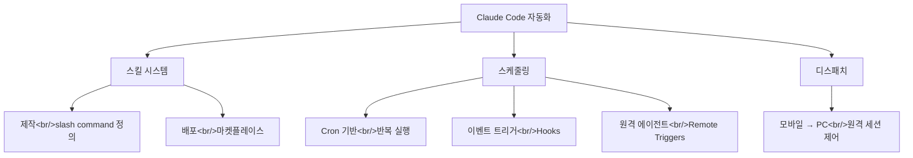

## 개요

Claude Code의 자동화 기능을 다루는 세 편의 YouTube 영상을 분석했다. 스킬 시스템의 제작~배포, n8n 대체론과 스케줄링 3가지 방식, 그리고 Dispatch를 통한 원격 제어까지 — 이 세 축이 Claude Code를 코딩 도구에서 워크플로우 자동화 플랫폼으로 확장시키고 있다. 관련 포스트: [Claude Computer Use](/posts/2026-03-25-claude-computer-use/), [HarnessKit 개발기](/posts/2026-03-25-harnesskit-dev3/)

<!--more-->



---

## 스킬 시스템 — 반복을 캡슐화

[자동화 대세 클로드 스킬! 제작부터 배포까지](https://www.youtube.com/watch?v=txa_8i-3cIs) 영상에서는 스킬의 전체 라이프사이클을 다룬다.

### 스킬이란

스킬은 반복적인 워크플로우를 markdown 파일로 캡슐화한 것이다. 슬래시 커맨드(`/skill-name`)로 호출하면 Claude가 정의된 절차를 따라 작업을 수행한다. CLAUDE.md가 "항상 적용되는 규칙"이라면, 스킬은 "필요할 때만 호출하는 전문 작업자"다.

### 제작 과정

스킬 파일은 frontmatter + 프롬프트 구조다:

```markdown
---
name: email-reply
description: 수신 이메일에 대한 답장 초안 작성
---

1. 이메일 내용을 분석하라
2. reference/tone.md의 어조를 참조하라
3. 핵심 포인트별로 답변을 구성하라
4. 공손하지만 명확한 어조로 작성하라
```

한 번 만들면 무한 재사용이 가능하고, 100번째 실행이 첫 번째보다 좋아지도록 계속 개선할 수 있다. 매번 새 채팅에서 컨텍스트를 처음부터 설명하는 것과 비교하면 엄청난 효율 차이다.

### 마켓플레이스 배포

스킬은 개인용을 넘어 마켓플레이스에 배포할 수 있다. 현재 HarnessKit과 log-blog도 이 경로로 마켓플레이스에 등록되어 있다. 플러그인 형태로 패키징하면 다른 사용자도 설치 후 바로 사용 가능하다.

---

## 스케줄링 — n8n이 사라지는 이유

[n8n 써야 할 이유가 점점 사라집니다](https://www.youtube.com/watch?v=eOVF1Rh4xE4) 영상에서는 Claude Code의 스케줄링 기능 3가지를 소개하며 n8n 같은 자동화 도구와 비교한다.

### 방법 1: Cron 기반 반복 실행

`/schedule` 또는 `/loop` 커맨드로 cron 표현식 기반의 반복 실행을 설정할 수 있다. 예를 들어 "매 30분마다 서버 로그를 확인하고 에러를 분류하라"를 cron으로 등록하면 Claude가 주기적으로 작업을 수행한다.

### 방법 2: 이벤트 트리거 (Hooks)

특정 이벤트가 발생했을 때 자동으로 스킬이나 작업을 실행한다. 파일 변경, git commit, 도구 호출 등을 트리거로 사용할 수 있다. `settings.json`에서 hook을 정의하면 된다.

### 방법 3: 원격 에이전트 (Remote Triggers)

서버에서 실행되는 Claude Code 세션을 원격으로 트리거한다. API 호출이나 웹훅으로 작업을 시작할 수 있어, CI/CD 파이프라인이나 외부 서비스와의 연동이 가능하다.

### n8n과의 비교

| 구분 | n8n | Claude Code 스케줄링 |
|------|-----|---------------------|
| 설정 | GUI 노드 에디터 | 자연어 + cron |
| 로직 | 노드 간 연결 | AI가 판단 |
| 유연성 | 사전 정의된 노드 | 자유 형식 |
| 에러 처리 | 조건 분기 | AI 자체 판단 |
| 비용 | self-host 무료 | API 비용 |

완전한 대체라기보다, **개발자 워크플로우 자동화** 영역에서 겹치는 부분이 상당하다. n8n은 정형화된 통합에 강하고, Claude Code는 비정형 판단이 필요한 자동화에 강하다.

---

## 디스패치 — 모바일에서 PC 원격 제어

[폰 하나로 PC 원격 제어하는 클로드 역대급 신기능](https://www.youtube.com/watch?v=_-yNiESnzL0) 영상에서는 Claude Dispatch를 소개한다.

Dispatch는 모바일 기기에서 PC의 Claude Code 세션을 원격으로 트리거하고 결과를 확인할 수 있는 기능이다. 출퇴근 중이나 외출 중에도 개발 환경의 에이전트에게 작업을 지시하고 모니터링할 수 있다.

이전에 다뤘던 [Claude Computer Use](/posts/2026-03-25-claude-computer-use/)와 결합하면, 물리적으로 PC 앞에 없어도 Claude가 마우스와 키보드를 제어하며 작업을 수행하는 완전 자동화가 가능해진다.

---

## 세 기능의 시너지

```
스킬 (무엇을) + 스케줄 (언제) + 디스패치 (어디서든)
= 완전 자동화 워크플로우
```

실제 예시:
1. **스킬**: "서버 로그 분석 후 에러 보고서 생성" 정의
2. **스케줄**: 매 1시간마다 cron 실행
3. **디스패치**: 에러 발견 시 모바일로 알림, 추가 지시 가능

현재 trading-agent 프로젝트에서 이 패턴을 활용 중이다 — ScheduleManager로 cron을 편집하고, MCP를 통해 에이전트에게 분석 작업을 위임하는 구조다.

---

## 인사이트

세 편의 영상을 관통하는 키워드는 "탈중앙화된 자동화"다. n8n이나 Zapier 같은 중앙 집중형 자동화 플랫폼이 정형화된 트리거-액션 파이프라인을 제공한다면, Claude Code의 자동화는 AI가 판단을 내리는 비정형 자동화를 지원한다. 스킬로 작업을 정의하고, 스케줄로 타이밍을 관리하고, 디스패치로 장소 제약을 없앤다. 이 세 축이 합쳐지면 "사람이 없어도 돌아가는 개발 환경"에 한 발 더 가까워진다.
