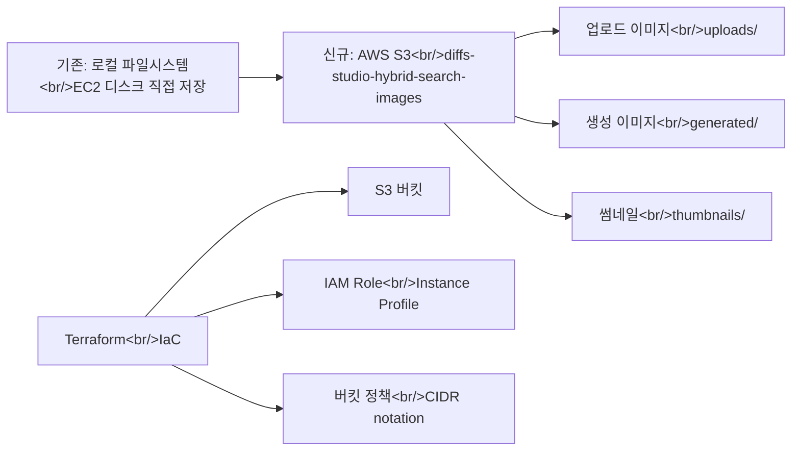

## 개요

[이전 글: #5 — Inpaint UX 개선, Dev 서버 배포, 안정성 강화](/posts/2026-03-25-hybrid-search-dev5/)

이번 #6에서는 31개 커밋에 걸쳐 세 가지 핵심 작업을 진행했다. 첫째, 로컬 파일 시스템 기반 이미지 저장을 AWS S3로 전면 마이그레이션했다. 둘째, "Diffs Image Agent"로 브랜딩을 적용하고 파비콘을 교체했다. 셋째, UI 안정성과 사용성을 개선하는 다수의 수정을 적용했다.

<!--more-->

---

## S3 이미지 스토리지 마이그레이션

### 배경

기존에는 EC2 인스턴스의 로컬 디스크에 이미지를 직접 저장하고 있었다. 이 구조는 스토리지 용량 한계, 인스턴스 교체 시 데이터 유실 위험, 로컬과 서버 간 환경 불일치 등의 문제가 있었다. S3로 마이그레이션하면 스토리지 걱정 없이 이미지를 관리할 수 있고, 로컬 개발과 프로덕션 환경에서 동일한 스토리지 레이어를 사용할 수 있다.

### 구현

마이그레이션은 설계 문서 작성부터 시작하여 체계적으로 진행했다. 먼저 S3 마이그레이션 설계 스펙과 구현 계획을 문서화한 후, 인프라부터 애플리케이션까지 순차적으로 작업했다.

**인프라 레이어 (Terraform):**
- `diffs-studio-hybrid-search-images` S3 버킷 생성
- IAM Role과 Instance Profile 설정으로 EC2에서 버킷 접근
- 버킷 정책에 EIP CIDR notation 적용

**백엔드 레이어:**
- S3 config와 boto3 의존성 추가
- S3 스토리지 래퍼 모듈 구현 — 앱 lifespan에서 초기화
- 로컬 파일 URL/경로 헬퍼를 S3 기반으로 전면 교체
- `/images/` 경로를 S3로 리다이렉트, 업로드도 S3로 전환
- 생성 이미지와 썸네일을 S3에 직접 저장
- 레퍼런스 이미지, 인페인트/편집용 소스 이미지 모두 S3에서 로드
- 썸네일 백필 스크립트를 S3 기반으로 재작성

**presigned URL 활용:**
- 탭 visibility 변경 시 presigned URL을 자동 갱신하는 기능 추가 — S3 presigned URL의 만료 시간 이슈를 우아하게 해결

### 문제 해결

Terraform 버킷 정책에서 EIP의 CIDR notation 이슈가 있었다. 단일 IP를 `/32`로 지정해야 하는데 누락되어 정책이 제대로 적용되지 않았다. 코드 리뷰에서 발견하여 CIDR notation, ref key cache, ContentType, Gemini API 관련 이슈들을 일괄 수정했다.

---

## Diffs 브랜딩 적용

### 로그인 및 헤더

로그인 페이지와 헤더에 Diffs 로고를 적용하여 기존 무미건조한 기본 UI에서 브랜드 아이덴티티를 부여했다.

### 브라우저 타이틀과 파비콘

브라우저 탭 타이틀을 "Diffs Image Agent"로 변경하고, 기존 generic 파비콘을 "D." 아이콘으로 교체했다. 파비콘은 favicon.io를 사용해 PNG에서 ICO로 변환했다.

---

## UI 안정성 및 사용성 개선

여러 세션에 걸쳐 다양한 UI 이슈를 수정했다:

- **카드 액션 버튼**: 밝은 이미지 위에서 버튼이 보이지 않는 문제 — 배경을 어둡게 조정
- **무한 스크롤**: 빈 상태에서 무한 스크롤 로딩이 페이지 바운스를 일으키는 버그 수정
- **레퍼런스 이미지 순서**: 사용자가 올린 레퍼런스가 시스템 주입 이미지보다 앞에 오도록 정렬
- **업로드 이미지 표시**: 검색 팝업과 수직 브라우즈 그리드에서 업로드 이미지를 카드로 표시
- **타입 라벨**: '베이스 재생성'으로 라벨을 변경하여 버튼과의 혼동 방지
- **베이스 이미지 인디케이터**: 보라색에서 회색으로 중립적 색상 전환
- **IMAGE_SAFETY 에러**: 프론트엔드에 구체적인 사유를 표시하도록 개선 (기존 generic 500 에러)
- **카드/디테일 UI**: 중립적이고 미니멀한 스타일로 통일

---

## DB 마이그레이션과 사용자 데이터

EC2 서버에서 Alembic 마이그레이션 동기화 작업을 진행했다. 서버 풀링 전에 마이그레이션 버전을 확인하고, 로컬과 서버 간 마이그레이션 버전을 동기화했다. 또한 기존에 `user_id` 없이 생성된 이미지들을 특정 사용자에게 재할당하는 작업도 수행했다.

---

## Gemini 라벨링 파이프라인

이미지 레퍼런스에 대한 라벨링 작업을 진행했다. Gemini API를 사용한 라벨링 파이프라인의 상태를 확인하고, 30분 간격으로 진행률을 모니터링했다. 새 이미지 라벨을 추가하는 작업도 포함되었다.

---

## 커밋 로그

| 메시지 | 변경 |
|--------|------|
| fix: terraform bucket policy CIDR notation for EIPs | infra |
| add new image label | data |
| chore: add APP_ENVIRONMENT to ecosystem config and .env | config |
| fix: address code review issues — CIDR, ref key cache, ContentType, Gemini | multi |
| feat: refresh presigned image URLs on tab visibility change | frontend |
| feat: rewrite thumbnail backfill script to use S3 | backend |
| feat: add S3 image source support to labeling pipeline | backend |
| feat: load source images from S3 for inpaint/edit | backend |
| feat: load reference images from S3 for generation | backend |
| feat: write generated images and thumbnails to S3 | backend |
| feat: redirect /images/ to S3, upload to S3 | backend |
| feat: replace local file URL/path helpers with S3-based versions | backend |
| feat: initialize S3 storage in app lifespan, remove local dir constants | backend |
| feat: add S3 storage wrapper module | backend |
| feat: add S3 config and boto3 dependency | backend |
| infra: add S3 bucket, IAM role, and instance profile for image storage | infra |
| docs: add S3 image migration implementation plan | docs |
| docs: add S3 image migration design spec | docs |
| feat: replace generic favicon with branded Diffs "D." icon | frontend |
| feat: update browser tab title to "Diffs Image Agent" | frontend |
| fix: darken card action button backgrounds for visibility | frontend |
| fix: prevent infinite scroll loading on empty state | frontend |
| refactor: reorder reference images so user refs come before system-injected | backend |
| feat: rebrand login page and header with Diffs logo | frontend |
| fix: hide info button and scroll arrows on uploaded image cards | frontend |
| feat: show uploaded images as cards in search popup + vertical browse grid | frontend |
| fix: rename type label to '베이스 재생성' | frontend |
| refactor: neutralize base image indicator colors from purple to gray | frontend |
| fix: surface IMAGE_SAFETY reason to frontend instead of generic 500 | full-stack |
| refactor: unify card and detail UI to neutral, minimal style | frontend |

---

## 인사이트

이번 개발 사이클의 핵심은 S3 마이그레이션이다. 설계 문서 → Terraform 인프라 → 백엔드 래퍼 → API 엔드포인트 → 프론트엔드 URL 갱신까지 전 레이어를 체계적으로 전환한 점이 잘 진행되었다. presigned URL 만료 문제를 탭 visibility 이벤트로 해결한 것은 사용자 경험 관점에서 깔끔한 접근이었다. 브랜딩 작업은 단순해 보이지만, 파비콘과 타이틀 하나만 바꿔도 앱의 완성도 인상이 크게 달라진다. 31개 커밋 중 절반 이상이 S3 관련인 것을 보면, 스토리지 레이어 교체가 생각보다 많은 접점을 가지고 있음을 실감했다.
