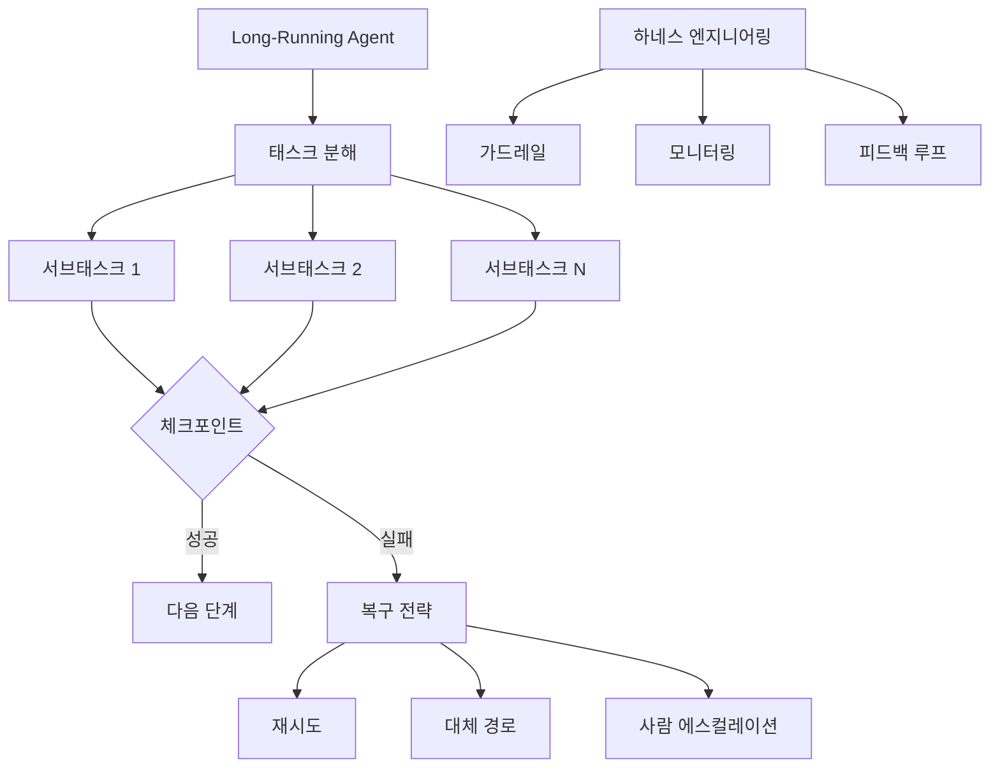

## 개요

AI 에이전트의 아키텍처와 품질 관리를 다루는 두 편의 YouTube 영상을 분석했다. 첫 번째는 Anthropic이 발표한 장기 실행 에이전트 블루프린트로, 몇 시간에서 며칠에 걸친 복잡한 태스크를 자율적으로 수행하는 설계 가이드다. 두 번째는 하네스 엔지니어링 실천으로, 에이전트의 품질을 체계적으로 관리하는 방법론이다. 관련 포스트: [서브에이전트 시대의 도래](/posts/2026-03-20-subagent-era/), [HarnessKit 개발기 #3](/posts/2026-03-25-harnesskit-dev3/)

<!--more-->

---

## Anthropic의 Long-Running Agent 블루프린트

[Anthropic Just Dropped the New Blueprint for Long-Running AI Agents](https://www.youtube.com/watch?v=9d5bzxVsocw) 영상에서는 Anthropic이 공개한 장기 실행 에이전트 설계 가이드를 심층 분석한다.

### 단발성 vs 장기 실행

기존 AI 에이전트 대부분은 단발성(one-shot)이다 — 질문을 받고, 답하고, 끝. 하지만 실제 업무는 "이 코드베이스를 리팩토링해줘", "이 데이터 파이프라인을 구축해줘" 같은 **몇 시간에서 며칠이 걸리는 복합 태스크**다.

장기 실행 에이전트는 이런 태스크를 자율적으로 수행하되, 중간에 실패하거나 방향을 잃었을 때 스스로 복구할 수 있어야 한다. Anthropic의 블루프린트는 이를 위한 설계 원칙을 제시한다.

### 핵심 설계 원칙

**1. 태스크 분해 (Task Decomposition)**

복잡한 태스크를 독립적인 서브태스크로 분해한다. 각 서브태스크는:
- 명확한 입력과 출력
- 독립적으로 실행 및 검증 가능
- 실패 시 다른 서브태스크에 영향 최소화

**2. 체크포인트와 상태 관리**

장기 실행에서 가장 위험한 것은 중간 결과의 유실이다. 각 서브태스크 완료 시 체크포인트를 저장하여:
- 실패 시 마지막 체크포인트부터 재개
- 컨텍스트 윈도우 압축 시 핵심 상태 보존
- 사람 리뷰 포인트 제공

**3. 실패 복구 전략**

세 단계 복구:
1. **재시도** — 일시적 오류(API 타임아웃 등)에 대해 자동 재시도
2. **대체 경로** — 같은 목표를 다른 방법으로 달성 (Deterministic Fallback과 유사)
3. **사람 에스컬레이션** — 에이전트가 자체적으로 해결할 수 없을 때 사람에게 판단 위임

**4. 진행 보고와 투명성**

장기 실행 중 사용자가 "지금 뭘 하고 있는지" 알 수 있어야 한다. 주기적인 진행 보고, 현재 단계 표시, 예상 완료 시간 등을 제공한다.

### 실제 적용 사례

현재 Claude Code 자체가 이 블루프린트의 구현체다. 대규모 리팩토링이나 기능 구현 시:
- 태스크를 서브태스크로 분해 (Plan 모드)
- 각 파일 수정마다 체크포인트 (git commit)
- 실패 시 rewind로 이전 상태 복원
- 진행 상황을 사용자에게 보고

---

## 하네스 엔지니어링 — 에이전트 품질 관리

[하네스 엔지니어링 따라하기](https://www.youtube.com/watch?v=kSlYNeEkdAM) 영상에서는 AI 에이전트의 품질을 체계적으로 관리하는 하네스 엔지니어링 방법론을 실무 관점에서 설명한다.

### 하네스란 무엇인가

하네스(harness)는 원래 "마구"를 뜻한다. 말의 힘을 제어하고 방향을 잡아주는 장치처럼, AI 에이전트의 출력을 제어하고 품질을 보장하는 시스템이다. 에이전트가 강력할수록 하네스도 견고해야 한다.

### 하네스의 3요소

**1. 가드레일 (Guard Rails)**

에이전트가 하면 안 되는 것을 정의한다:
- 파일 삭제 금지 영역
- 자동 커밋 조건
- 외부 API 호출 제한
- 비용 한도

**2. 모니터링**

에이전트의 행동을 실시간으로 추적한다:
- 도구 호출 패턴
- 에러 발생률
- 토큰 사용량
- 작업 완료율

**3. 피드백 루프**

에이전트의 결과를 평가하고 개선한다:
- 자동 테스트 결과 수집
- 사용자 피드백 반영
- 실패 패턴 학습
- 설정 자동 조정

### 매니지먼트 관점

영상은 기술적 구현뿐 아니라 매니지먼트 관점도 다룬다. 에이전트 팀을 관리하는 것은 인간 팀을 관리하는 것과 유사한 면이 있다:
- 명확한 역할과 책임 정의
- 주기적인 성과 리뷰 (eval)
- 문제 발생 시 에스컬레이션 경로
- 지속적 교육 (프롬프트 개선)

---

## 두 접근법의 교차점

Long-Running Agent 블루프린트와 하네스 엔지니어링은 같은 문제를 다른 각도에서 본다:

| 관점 | Long-Running Agent | 하네스 엔지니어링 |
|------|-------------------|-----------------|
| 초점 | 에이전트 내부 설계 | 에이전트 외부 제어 |
| 목표 | 자율적 태스크 완수 | 품질 보장 |
| 실패 대응 | 자체 복구 전략 | 가드레일 + 에스컬레이션 |
| 개선 방식 | 체크포인트 기반 | 피드백 루프 기반 |

둘을 합치면: 에이전트는 내부적으로 체크포인트와 복구 전략을 갖추고, 외부에서 하네스가 가드레일과 모니터링으로 품질을 보장하는 **이중 안전 구조**가 된다.

현재 HarnessKit 프로젝트가 정확히 이 교차점에 있다 — Claude Code 에이전트의 외부 하네스를 플러그인 형태로 구현하여, 가드레일과 모니터링을 자동화하고 있다.

---

## 인사이트

AI 에이전트가 단발성에서 장기 실행으로 진화하면서, "똑똑한 에이전트"보다 "신뢰할 수 있는 에이전트"가 더 중요해지고 있다. Anthropic의 블루프린트는 내부 설계로, 하네스 엔지니어링은 외부 제어로 이 신뢰성을 구축한다. 두 접근법이 결합된 이중 안전 구조가 프로덕션 에이전트의 표준이 될 것으로 보인다. 이 관점은 [AI 앱 프로덕션 설계 패턴](/posts/2026-03-25-ai-app-production-patterns/) 포스트의 Deterministic Fallback, HITL과도 맥이 닿는다 — 결국 "실패를 전제한 설계"가 핵심이다.
