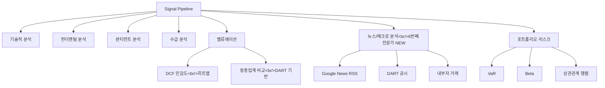

## 개요

[이전 글: #6](/posts/2026-03-25-trading-agent-dev6/)

이번 #7에서는 34개 커밋에 걸쳐 트레이딩 에이전트의 분석 역량을 대폭 확장했다. DCF 밸류에이션과 민감도 히트맵, 포트폴리오 리스크 분석(VaR, 베타, 섹터 집중도), 시그널 파이프라인에 6번째 전문가(뉴스/매크로 애널리스트) 추가, DART 공시 연동, 그리고 투자 메모 내보내기 기능을 구현했다.

<!--more-->

---

## DCF 밸류에이션과 민감도 분석

### 배경

기존 시그널 파이프라인에는 정량적 밸류에이션 모델이 없었다. 종목의 적정 가치를 추정하려면 DCF(Discounted Cash Flow) 모델이 필수적이고, 단일 값이 아닌 다양한 시나리오에서의 민감도를 보여줘야 투자 판단에 유용하다.

### 구현

DCF 밸류에이션 서비스를 구현하고, 할인율(WACC)과 성장률 조합에 따른 민감도 히트맵 테이블을 `ValuationView`에 추가했다. 프론트엔드에서는 히트맵 형태로 시각화하여 어떤 가정 하에서 현재가가 저평가/고평가인지 직관적으로 파악할 수 있다.

또한 동종업계 비교(peer comparison) 기능도 추가했다. DART에서 같은 섹터의 기업 밸류에이션 데이터를 가져와 상대적 위치를 비교할 수 있도록 했다.

단위 테스트도 추가하여 DCF 밸류에이션과 포트폴리오 리스크 서비스의 핵심 로직을 검증했다.

---

## 포트폴리오 리스크 분석

### VaR, 베타, 섹터 집중도

포트폴리오 레벨의 리스크 분석 기능을 구현했다:

- **VaR (Value at Risk)**: 일정 신뢰구간에서의 최대 예상 손실
- **Beta**: 실제 포트폴리오 데이터 기반 베타 계산
- **섹터 집중도**: 특정 섹터에 과도하게 집중되어 있는지 분석
- **상관관계 행렬 히트맵**: 보유 종목 간 상관관계를 시각화

KOSPI200 구성 종목의 섹터 데이터를 NAVER Finance에서 수집하여 섹터 분류에 활용했다.

---

## 시그널 파이프라인 확장

### 6번째 전문가: 뉴스/매크로 애널리스트

기존 5명의 전문가(기술적, 펀더멘털, 센티먼트, 수급, 밸류에이션)에 뉴스/매크로 애널리스트를 추가했다. 이 전문가는 거시경제 뉴스와 종목별 이벤트를 분석하여 시그널에 반영한다.

**Google News RSS 연동** — 뉴스 수집의 안정성을 높이기 위해 Google News RSS를 fallback으로 추가했다. 기존 뉴스 소스가 불안정할 때 자동으로 전환된다.

### DART 공시 연동

- **촉매 캘린더(Catalyst Calendar)**: DART 공시 일정을 타임라인 UI로 표시하여 향후 중요 이벤트를 한눈에 파악
- **내부자 거래**: DART 내부자 거래 데이터를 시그널 파이프라인에 통합
- **외국인/기관 투자자 동향**: 수급 분석에 외국인·기관 매매 동향 데이터 추가

### DB 스키마 확장

8개 신규 테이블과 ANALYST 역할, 메타데이터 초기화를 추가했다. 새 기능들에 필요한 데이터 모델을 한 번에 정의했다.

---

## 시그널 히스토리와 비교

시그널 히스토리 스냅샷과 타임라인 비교 기능을 추가했다. 과거 시그널과 현재를 비교하여 시간에 따른 변화 추이를 추적할 수 있다. 이는 시그널의 일관성과 예측력을 사후 평가하는 데 활용된다.

---

## 프론트엔드 UI 개선

- **SignalCard 확장**: 전문가 의견 확장 표시, `risk_notes` 표시, compact/expanded 뷰 토글
- **SignalDetailModal**: 관련 주문 내역을 드릴다운으로 확인
- **ReportViewer**: 거래 PnL 컬럼과 `rr_score` 색상 코딩 추가
- **ScheduleManager**: cron 편집과 즉시 실행(run-now) 버튼, 에이전트 이름과 친숙한 태스크 라벨 표시
- **DashboardView**: `report.generated` 이벤트 핸들링, 성능 엔드포인트 기간 선택

---

## 투자 메모 내보내기

시그널 데이터를 기반으로 한 투자 메모를 HTML과 DOCX 형식으로 내보내는 기능을 추가했다. `python-docx`를 사용하여 Word 문서 형식의 투자 메모를 생성할 수 있다.

---

## 서버 안정성

MCP(Model Context Protocol) 연결 안정성을 개선했다:
- 비동기 MCP 컨텍스트 메서드에 `await` 누락 수정
- 연결 실패 시 자동 재연결 로직 추가

서버 로그를 주기적으로 모니터링하며 websockets 라이브러리의 deprecated API 경고와 기타 런타임 에러를 분류하고 코드베이스 이슈만 선별 수정했다.

---

## 설정 확장

- `initial_capital`과 `min_rr_score`를 설정과 risk-config API에 추가
- 기존 디자인 시스템과 일관된 스타일로 새 컴포넌트 정렬
- Vite ESM 해석 오류 수정 (`import type` 사용)
- lint 에러(unused vars) 정리

---

## 커밋 로그

| 메시지 | 변경 |
|--------|------|
| feat: show agent name and friendly task labels in ScheduleManager | frontend |
| style: align new components with existing design system | frontend |
| fix: use import type for ScheduledTask to fix Vite ESM resolution | frontend |
| feat: add Google News RSS fallback for news collection stability | backend |
| feat: add compact/expanded view toggle to SignalCard | frontend |
| feat: add DOCX investment memo export with python-docx | backend |
| feat: add real portfolio beta calculation and correlation matrix heatmap | backend + frontend |
| feat: add DCF sensitivity heatmap table to ValuationView | frontend |
| test: add unit tests for DCF valuation and portfolio risk services | test |
| feat: populate kospi200_components sector data from NAVER Finance | backend |
| fix: await async MCP context methods and add auto-reconnect on failure | backend |
| fix: replace explicit any types with proper interfaces in SignalCard | frontend |
| feat: add investment memo HTML export from signal data | backend |
| feat: add VaR, beta, sector concentration risk analysis | backend |
| feat: add DCF valuation with sensitivity table | backend |
| feat: add signal history snapshots and timeline comparison | full-stack |
| feat: add peer comparison with sector-based DART valuation | backend |
| feat: add news/macro analyst as 6th expert in signal pipeline | backend |
| feat: add catalyst calendar with DART disclosures and timeline UI | full-stack |
| feat: add DART insider trading data to signal pipeline | backend |
| feat: add foreign/institutional investor trend to signal pipeline | backend |
| feat: add 8 new DB tables, ANALYST role, and metadata init | backend |
| fix: resolve lint errors (unused vars) in DashboardView and SignalCard | frontend |
| feat: add report.generated event handling in DashboardView | frontend |
| feat: add initial_capital and min_rr_score to settings and risk-config API | full-stack |
| feat: add ScheduleManager with cron editing and run-now button | frontend |
| feat: add trade PnL column and rr_score color coding to ReportViewer | frontend |
| feat: add SignalDetailModal with related orders drilldown | frontend |
| feat: add expert opinion expansion and risk_notes display to SignalCard | frontend |
| feat: use correct performance endpoint with period selector and metrics | frontend |

---

## 인사이트

34개 커밋은 이번 시리즈에서 가장 많은 양이다. 트레이딩 에이전트가 단순한 시그널 생성 도구에서 포트폴리오 리스크 관리, 밸류에이션 분석, 공시 모니터링까지 아우르는 종합 분석 플랫폼으로 진화하고 있다. 특히 6번째 전문가(뉴스/매크로)의 추가와 DART 연동은 한국 주식시장에 특화된 데이터 소스를 적극 활용한다는 점에서 의미가 크다. DCF 민감도 히트맵과 포트폴리오 상관관계 행렬은 시각적으로 복잡한 데이터를 직관적으로 전달하는 좋은 사례다. 서버 안정성 측면에서 MCP 자동 재연결과 주기적 로그 모니터링 패턴이 정착된 것도 프로덕션 수준 향상에 기여하고 있다.
