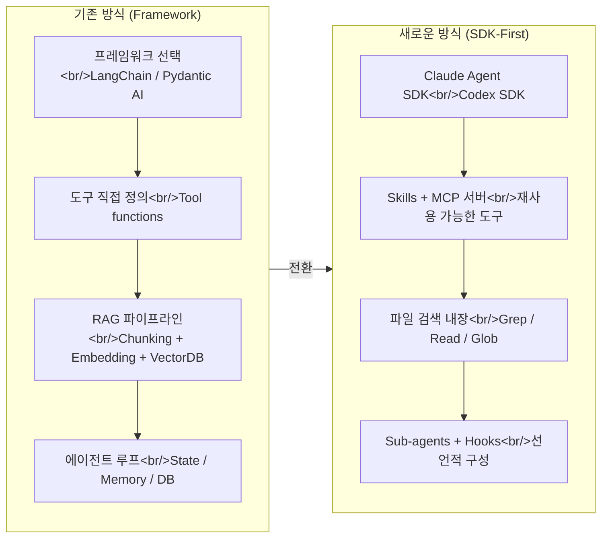

2024~2025년까지 AI 에이전트를 만들려면 프레임워크 선택부터 RAG 파이프라인, 상태 관리까지 직접 구축해야 했다. 하지만 2026년 현재, Claude Agent SDK와 Codex SDK 같은 "batteries-included" SDK가 등장하면서 에이전트 구축의 출발점 자체가 바뀌고 있다. 이번 포스트에서는 에이전트 아키텍처의 Old vs New 패러다임 전환과 RAG의 역할 변화를 분석한다. 관련 포스트: [Excalidraw 다이어그램 스킬](/posts/2026-04-01-excalidraw-skill/), [NotebookLM 실전 활용법](/posts/2026-04-01-notebooklm-guide/)

<!--more-->

## 1. Old vs New: 에이전트 구축 패러다임의 전환

### 기존 방식 (2024~2025)

전통적인 에이전트 구축 흐름은 다음과 같았다:

1. **프레임워크 선택** — LangChain, LangGraph, Pydantic AI, N8N 등에서 하나를 고른다
2. **도구 정의** — 파일 시스템 접근, 이메일 조회 등 에이전트 capability를 직접 구현한다
3. **RAG 구성** — chunking, embedding, retrieval 전략을 설계하고 벡터 DB에 연결한다
4. **에이전트 루프 구축** — 상태 관리, 대화 기록 저장, 메모리 시스템까지 직접 배선한다

이 방식의 핵심 문제는 **glue code가 너무 많다**는 것이다. DB 테이블 설계, 세션 관리, ingestion pipeline 등 에이전트의 "지능"과 무관한 인프라 코드가 전체 코드베이스의 상당 부분을 차지했다.

### 새로운 방식: SDK-First

Claude Agent SDK나 Codex SDK를 기반으로 구축하면 상황이 완전히 달라진다:

- **대화 기록 관리**가 SDK에 내장되어 있어 별도 DB 불필요
- **파일 검색 도구**(Grep, Read 등)가 이미 포함되어 있어 소규모 지식 베이스에 RAG가 불필요
- **Skills**와 **MCP 서버**로 도구를 재사용 가능한 형태로 추가
- **Sub-agent**, **Hooks**, **권한 설정**까지 단일 TypeScript/Python 파일에서 선언적으로 구성

실제로 Claude Agent SDK를 사용하면 이전보다 **더 많은 기능을 더 적은 코드로** 구현할 수 있다. Second Brain 시스템처럼 메모리 구축, 일일 리플렉션, 통합 관리까지 하나의 SDK 위에서 동작한다.

### 아키텍처 비교

### 언제 프레임워크가 여전히 필요한가?

SDK-First가 만능은 아니다. 다음 세 가지 한계가 명확하다:

| 기준 | SDK (Claude Agent SDK 등) | 프레임워크 (Pydantic AI 등) |
|---|---|---|
| **속도** | 추론 오버헤드로 느림 (10초+) | Sub-second 응답 가능 |
| **비용** | 토큰 소모 큼, 다수 사용자 시 API 비용 폭증 | 직접 제어로 비용 최적화 |
| **제어권** | 대화 기록/관찰성 제한적 | 모든 것을 직접 관리 |

**판단 기준은 두 가지다:**

1. **누가 쓰는가?** — 본인만 쓰면 SDK, 다수가 프로덕션에서 쓰면 프레임워크
2. **속도/규모 요구사항은?** — 지연 허용이면 SDK, 빠른 응답이 필수면 프레임워크

실무적으로는 **SDK로 프로토타이핑** 후 검증된 워크플로를 **프레임워크로 이식**하는 패턴이 가장 현실적이다. Skills와 MCP 서버는 양쪽 모두에서 재사용 가능하므로 전환 비용이 낮다.

### RAG는 죽었는가?

결론부터 말하면 **아니다** — 하지만 역할이 바뀌었다.

- **소규모 코드/문서**: 파일 검색(Grep)이 semantic search를 능가한다는 것이 증명됨 (LlamaIndex 연구)
- **대규모 지식 베이스**: 여전히 벡터 DB 기반 RAG가 필요 — 수천 개 문서를 Grep으로 탐색하는 건 비현실적
- **Skills가 RAG를 대체하는 영역**: 코드 컨텍스트 작업에서 `skill.md`가 chunking + embedding을 대체. 에이전트가 필요할 때 스킬을 로드하면 충분

핵심은 "RAG냐 아니냐"가 아니라, **지식의 규모와 접근 패턴에 맞는 검색 전략을 선택**하는 것이다.

## 인사이트

**에이전트 구축의 본질이 변하고 있다.** "어떤 프레임워크를 쓸까?"에서 "에이전트에게 어떤 Skills를 줄까?"로 질문이 이동했다. SDK가 인프라를 추상화하면서, 개발자의 시간은 glue code가 아니라 **에이전트의 능력 설계**에 집중된다.

1. **선언적 도구 구성의 승리** — Skills, MCP 서버 모두 "이것을 할 수 있다"를 선언하는 방식이다. 절차적으로 에이전트 루프를 짜는 시대에서 벗어나고 있다.
2. **SDK로 프로토타이핑, 프레임워크로 프로덕션** — 이 패턴이 가장 현실적이다. Skills와 MCP는 양쪽에서 재사용 가능하므로 전환 비용이 낮다.
3. **RAG는 사라지는 게 아니라 민주화되고 있다** — 개발자는 파일 검색과 Skills로 RAG를 대체하고, 비개발자는 [NotebookLM](/posts/2026-04-01-notebooklm-guide/)으로 코드 없이 동일한 효과를 얻는다.

이 주제의 실전 적용은 별도 포스트에서 다룬다:
- [Excalidraw 다이어그램 스킬 — 코딩 에이전트의 시각적 논증](/posts/2026-04-01-excalidraw-skill/)
- [NotebookLM 실전 활용법 12가지](/posts/2026-04-01-notebooklm-guide/)

---

**참고 영상:**
- [Everything You Thought About Building AI Agents is Wrong](https://www.youtube.com/watch?v=gmaHRwijOXs) — Cole Medin
