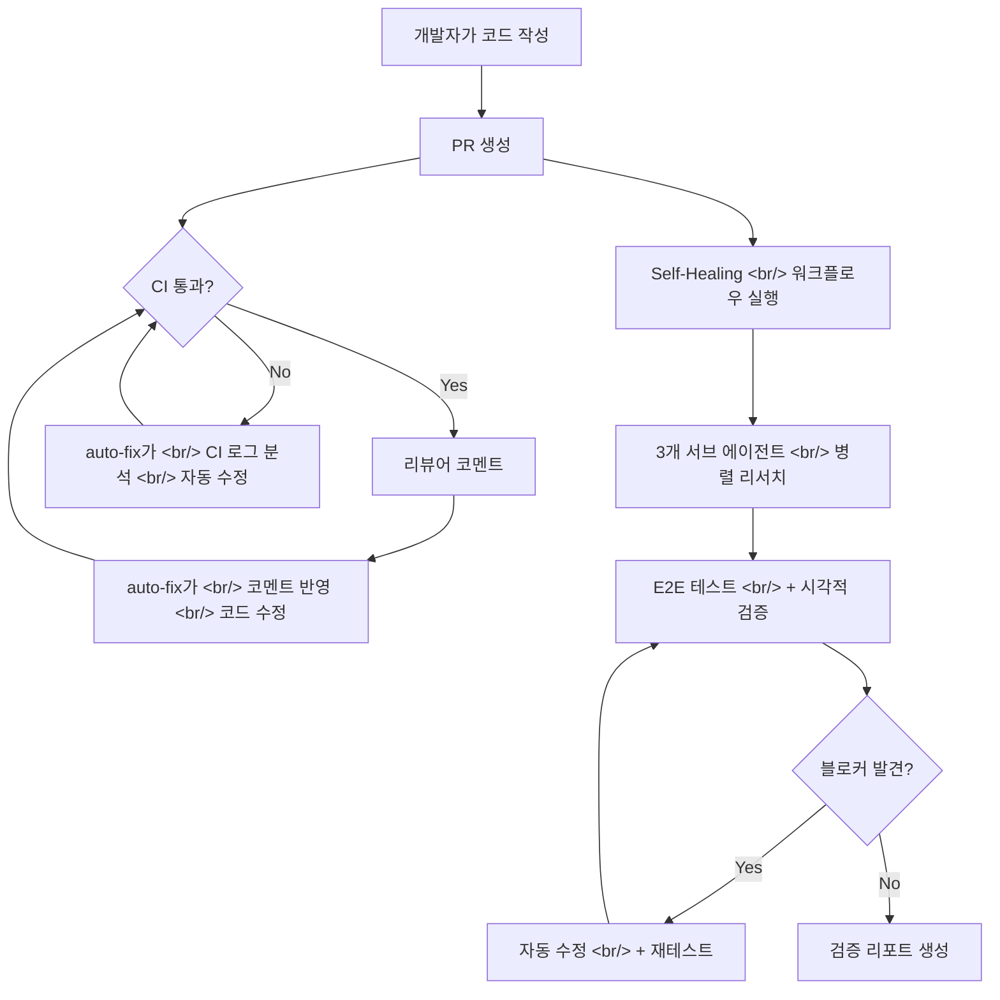

## 개요

[Claude Code 실전 가이드](https://ice-ice-bear.github.io/categories/tech-log/) 시리즈의 네 번째 글입니다. 이전 글에서는 컨텍스트 관리와 워크플로우([1편](https://ice-ice-bear.github.io/p/claude-code-실전-가이드-컨텍스트-관리부터-워크플로우까지/)), 최신 기능 정복([2편](https://ice-ice-bear.github.io/p/claude-code-실전-가이드-2-최근-2개월-신기능-완전-정복/)), 500시간 사용자의 27가지 팁([3편](https://ice-ice-bear.github.io/p/claude-code-실전-가이드-3-500시간-사용자의-27가지-팁/))을 다뤘습니다.

이번 편에서는 두 가지 핵심 주제를 다룹니다. 첫째, Anthropic이 공식 출시한 **Claude Code auto-fix** 기능으로 PR 생성부터 CI 실패 해결, 리뷰 코멘트 반영까지 자동화하는 방법. 둘째, Cole Medin이 공개한 **Self-Healing AI Coding Workflow**로 코딩 에이전트가 자기 작업을 시각적으로 검증하고 스스로 버그를 수정하는 프로세스입니다.

<!--more-->

## 전체 워크플로우 개요

아래 다이어그램은 auto-fix와 Self-Healing 워크플로우가 개발 사이클에서 어떻게 연결되는지 보여줍니다.



## 1. Claude Code auto-fix: 원격 자동 수정의 시대

### PR 자동 추적과 CI 실패 해결

Claude Code auto-fix는 웹이나 모바일 환경에서 Pull Request를 자동으로 추적하고, CI 실패를 감지해 스스로 해결하는 기능입니다. 핵심은 **모든 작업이 원격으로 진행**된다는 점입니다. 개발자가 PR을 올리고 자리를 비워도, 돌아오면 CI가 통과된 상태의 PR을 확인할 수 있습니다.

작동 방식은 다음과 같습니다. auto-fix는 GitHub Actions 로그를 가져와 실패 원인을 정확히 진단합니다. 빌드 오류인지 lint 에러인지, 코드의 문제인지 인프라의 문제인지를 구분합니다. PHP 메모리 부족 같은 흔한 인프라 오류에 대해서는 해결 템플릿도 갖추고 있어 불필요한 코드 수정을 방지합니다.

### 세 가지 사용 방법

auto-fix를 활용하는 구체적인 방법은 세 가지입니다:

1. **웹 버전**: Claude Code 웹에서 생성한 PR의 CI 메뉴에서 `auto-fix`를 선택
2. **모바일**: AI 에이전트에게 직접 auto-fix를 지시 (모바일용 빠른 실행 버튼도 추가 예정)
3. **PR 링크 붙여넣기**: 모니터링하고 싶은 PR 링크를 복사해서 에이전트에게 auto-fix 요청

사용을 시작하려면 **Claude GitHub App**을 설치해야 하며, 자동 수정 기능을 쓰려면 저장소 설정에서 이를 활성화해야 합니다.

### 보안 시스템

자율적으로 코드를 수정하는 기능인 만큼 보안이 중요합니다. auto-fix는 Claude Sonnet 4.6 기반의 **독립적인 안전 분류기(safety classifier)**를 사용합니다. 이 분류기의 특징은 AI의 내부 추론 과정을 보지 않고 요청만 검사한다는 점입니다. 즉, 프롬프트 인젝션으로 내부 로직을 우회하더라도 실제 실행되는 액션 자체를 별도로 검증합니다. 권한을 넘어서는 작업이나 민감한 데이터 유출은 원천적으로 차단됩니다.

```yaml
# .github/settings.yml 예시 — auto-fix 활성화
claude_code:
  auto_fix:
    enabled: true
    on_ci_failure: true        # CI 실패 시 자동 수정
    on_review_comment: true    # 리뷰 코멘트 반영
    allowed_branches:
      - "feature/*"
      - "fix/*"
```

## 2. Self-Healing 워크플로우: 에이전트가 스스로 검증하는 시대

### Cole Medin의 접근법

Cole Medin이 "This One Command Makes Coding Agents Find All Their Mistakes"에서 공개한 Self-Healing 워크플로우는 핵심 문제를 정확히 짚습니다: **코딩 에이전트는 코드를 빠르게 생성하지만, 자기 작업을 검증하는 데는 형편없습니다.** 개발자가 프레임워크를 제공하지 않으면 검증을 대충 넘기거나 아예 건너뛰기 때문입니다.

이 워크플로우는 Claude Code의 skill(커맨드) 형태로 패키징되어 있으며, `/e2e-test` 명령 하나로 6단계 프로세스가 시작됩니다. 프론트엔드가 있는 거의 모든 코드베이스에서 즉시 사용할 수 있습니다.

### 6단계 검증 프로세스

**Phase 0 - 사전 점검**: Vercel Agent Browser CLI 설치 여부, OS 환경(Windows면 WSL 필요) 등을 확인합니다.

**Phase 1 - 리서치**: 3개의 서브 에이전트가 **병렬로** 실행됩니다:
- 코드베이스 구조 파악 + 사용자 여정(user journey) 식별
- 데이터베이스 스키마 분석
- 코드 리뷰 (로직 에러 탐색)

**Phase 2 - 테스트 계획**: 리서치 결과를 바탕으로 task list를 정의합니다. 각 task가 하나의 사용자 여정입니다.

**Phase 3 - E2E 테스트 루프**: 각 사용자 여정을 순서대로 실행하며, Agent Browser CLI로 페이지를 탐색하고 DB 쿼리로 백엔드 상태를 검증합니다.

```bash
# Vercel Agent Browser CLI 사용 예시
npx @anthropic-ai/agent-browser snapshot   # 현재 페이지 상태 캡처
npx @anthropic-ai/agent-browser click "Sign In"
npx @anthropic-ai/agent-browser screenshot ./screenshots/login.png
```

**Phase 4 - 자가 수정**: 블로커 이슈만 자동 수정하고 재테스트합니다. 중요한 설계 철학은 **모든 이슈를 고치지 않는다**는 것입니다. 큰 블로커만 수정해서 테스트를 계속 진행할 수 있게 하고, 나머지는 리포트에 남겨서 개발자가 판단합니다.

**Phase 5 - 리포트**: 구조화된 형식으로 결과를 출력합니다 -- 수정한 사항, 남은 이슈, 전체 테스트 경로. 스크린샷과 함께 리뷰하면 에이전트가 실제로 어떤 경로를 테스트했는지 빠르게 확인할 수 있습니다.

### 시각적 검증의 힘

이 워크플로우에서 가장 인상적인 부분은 **스크린샷 기반 시각적 검증**입니다. 에이전트가 각 단계마다 스크린샷을 촬영하고, AI의 이미지 분석 능력으로 UI가 정상인지 확인합니다. 이는 단순히 "에러가 없으면 통과" 수준을 넘어, 실제 사용자가 보는 화면이 의도대로 렌더링되는지까지 검증하는 것입니다.

또한 반응형 검증도 포함되어 있어 모바일, 태블릿, 데스크톱 뷰포트에서 페이지가 정상적으로 보이는지 가볍게 확인합니다. 전통적인 E2E 테스트 프레임워크(Cypress, Playwright)로는 구현하기 어려운 "눈으로 보고 판단하는" 검증을 AI가 대신하는 셈입니다.

### 실전 활용 팁

이 워크플로우는 두 가지 방식으로 사용할 수 있습니다:

1. **독립 실행**: 임의의 시점에 전체 E2E 테스트를 돌리고 싶을 때
2. **기능 구현 파이프라인에 통합**: 에이전트가 기능을 구현한 직후 자동으로 regression testing 실행

컨텍스트 윈도우가 커지므로, 테스트 완료 후 리포트를 **새 세션에 넘겨서** 후속 작업을 하는 것이 권장됩니다.

## 인사이트

**auto-fix와 Self-Healing은 같은 방향을 가리킵니다.** 코드 생성 속도가 검증 속도를 압도하는 시대에서, 검증 자체를 자동화하는 것이 핵심 과제입니다. auto-fix는 CI/리뷰라는 기존 인프라에 AI를 얹은 방식이고, Self-Healing은 브라우저 자동화로 사용자 관점의 검증까지 확장한 방식입니다.

실무에서 두 접근을 함께 쓰면 강력합니다. Self-Healing 워크플로우로 로컬에서 사전 검증을 마치고, PR을 올린 뒤에는 auto-fix가 CI 실패와 리뷰 코멘트를 자동 처리합니다. 개발자는 최종 리포트와 스크린샷만 확인하면 됩니다.

다만 한 가지 주의할 점이 있습니다. **AI가 생성한 코드의 책임은 여전히 개발자에게 있습니다.** Cole Medin도 강조했듯이, 이 워크플로우는 "vibe coding"을 지향하는 것이 아니라 검증의 부담을 덜어주는 것입니다. 자동 수정이 만능이 아니므로 최종 판단은 사람이 해야 합니다.

## 빠른 링크

| 주제 | 링크 |
|------|------|
| Claude Code auto-fix 한국어 영상 | [Nova AI Daily - auto-fix 출시](https://www.youtube.com/watch?v=6aqUUr4mKsQ) |
| Self-Healing 워크플로우 영상 | [Cole Medin - Find All Mistakes](https://www.youtube.com/watch?v=YeCHI1dmpZY) |
| Claude Code 공식 문서 | [docs.anthropic.com](https://docs.anthropic.com/en/docs/claude-code) |
| Vercel Agent Browser CLI | [npmjs.com/@anthropic-ai/agent-browser](https://www.npmjs.com/package/@anthropic-ai/agent-browser) |
| 시리즈 1편 - 컨텍스트 관리 | [Claude Code 실전 가이드 1](https://ice-ice-bear.github.io/p/claude-code-실전-가이드-컨텍스트-관리부터-워크플로우까지/) |
| 시리즈 2편 - 신기능 정복 | [Claude Code 실전 가이드 2](https://ice-ice-bear.github.io/p/claude-code-실전-가이드-2-최근-2개월-신기능-완전-정복/) |
| 시리즈 3편 - 27가지 팁 | [Claude Code 실전 가이드 3](https://ice-ice-bear.github.io/p/claude-code-실전-가이드-3-500시간-사용자의-27가지-팁/) |
