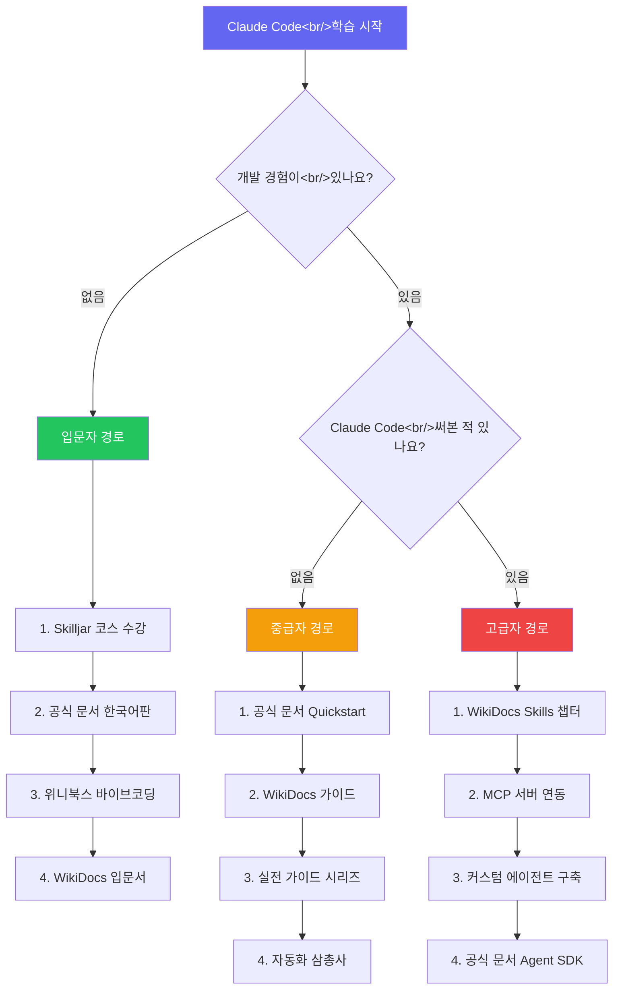

## 개요

Claude Code 사용자가 빠르게 늘고 있지만, 학습 리소스는 영어 공식 문서에 집중되어 있어 한국어 사용자에게 진입 장벽이 존재한다. 최근 들어 WikiDocs 커뮤니티 가이드, 위니북스의 바이브코딩 에센셜 같은 한국어 리소스가 등장하면서 상황이 달라지고 있다.

이 글에서는 현재 사용 가능한 Claude Code 학습 리소스 4가지를 비교 분석하고, 수준별 추천 학습 경로를 정리한다. 이미 [Claude Code 실전 가이드 시리즈 #1~#5](/tags/claude-code/)와 [Claude Code 자동화 삼총사 — 스킬, 스케줄, 디스패치](/posts/2026-03-06-claude-code-harness/) 포스트를 읽은 분들이라면, 이 로드맵으로 빈 곳을 채울 수 있다.

<!--more-->

## 1. 공식 문서 — code.claude.com/docs

가장 먼저 확인해야 할 곳은 [Anthropic 공식 문서](https://code.claude.com/docs/ko/overview)다. Overview에서 Claude Code가 무엇인지 파악하고, Quickstart로 첫 번째 실습을 진행한 뒤, Reference 문서에서 세부 기능을 확인하는 흐름이다.

### 주요 구성

- **개요(Overview)**: Claude Code의 정의, 할 수 있는 것, 환경별 설치 가이드
- **빠른 시작(Quickstart)**: 코드베이스 탐색에서 수정 커밋까지 첫 실제 작업
- **핵심 개념**: 작동 방식, Context Window, 권한 모드
- **워크플로우 및 모범 사례**: CLAUDE.md 설정, 일반적인 패턴
- **플랫폼 및 통합**: VS Code, JetBrains, Slack, GitHub Actions 등

### 한국어 버전

공식 문서에 `/docs/ko/` 경로로 한국어 버전이 존재한다. 번역 품질이 준수하며, 원문과 거의 동시에 업데이트된다. 영어가 부담스러운 경우 한국어 문서로 시작해도 충분하다.

### 장단점

| 장점 | 단점 |
|------|------|
| 항상 최신 상태 유지 | 실전 예제가 부족 |
| Anthropic이 직접 관리 — 가장 정확 | 기능 나열 위주, "왜" 쓰는지 설명 부족 |
| 한국어 버전 존재 | 초보자에게 정보량이 과다 |
| 무료 | 커뮤니티 토론/Q&A 없음 |

> **추천 시점**: 새 기능이 나왔을 때 가장 먼저 확인하는 레퍼런스. 처음 배울 때보다 이미 쓰고 있는 사용자가 "이 기능 정확히 어떻게 동작하지?"를 확인할 때 최적이다.

## 2. Anthropic Skilljar — Claude Code in Action

[Claude Code in Action](https://anthropic.skilljar.com/claude-code-in-action)은 Anthropic이 Skilljar 플랫폼에서 제공하는 무료 온라인 코스다. "What is a coding assistant?"라는 근본적인 질문에서 시작해 실제 데모까지 단계적으로 진행한다.

### 코스 특징

- **무료**: 계정만 만들면 모든 콘텐츠 이용 가능
- **체계적 구성**: 개념 → 데모 → 실습 순서로 진행
- **공식 교육**: Anthropic이 직접 제작한 커리큘럼
- **진도 추적**: Skilljar LMS가 학습 진행률을 관리

### 장단점

| 장점 | 단점 |
|------|------|
| 무료, 공식 교육 자료 | 영어로만 제공 |
| 체계적 커리큘럼 | 기본 수준에 머무름 |
| 인터랙티브 학습 경험 | 고급 사용법 (Skills, MCP) 미포함 |
| 수료증 발급 가능 | 업데이트 주기가 문서보다 느림 |

> **추천 시점**: Claude Code를 처음 접하는 사람이 "이게 뭔지, 왜 쓰는지"를 이해하는 첫 단계. 영어에 거부감이 없다면 공식 문서보다 이 코스를 먼저 수강하는 것을 추천한다.

## 3. WikiDocs 클로드 코드 가이드

[WikiDocs 클로드 코드 가이드](https://wikidocs.net/book/19104)는 한국어 커뮤니티에서 만든 실전 중심 가이드다. Skills 개발, MCP 서버 연동 등 공식 문서에서 다루지 않는 실무 챕터가 포함되어 있어 중급 이상 사용자에게 특히 유용하다.

### 주요 내용

- Claude Code 설치 및 기본 설정
- **Skills 개발**: 커스텀 스킬 작성, 테스트, 배포
- **MCP 서버 연동**: 외부 도구와의 통합
- 프로젝트별 CLAUDE.md 작성 전략
- 실전 트러블슈팅 사례

### 함께 보면 좋은 입문서

WikiDocs에는 [클로드 코드 입문서](https://wikidocs.net/book/19202)도 있다. 완전한 초보자라면 입문서(19202)를 먼저 보고, 본 가이드(19104)로 넘어가는 것이 좋다.

### 장단점

| 장점 | 단점 |
|------|------|
| 한국어 — 언어 장벽 없음 | 커뮤니티 작성이라 정확도 편차 |
| 실무/실전 중심 | 업데이트가 공식 문서보다 느릴 수 있음 |
| Skills, MCP 등 고급 주제 포함 | 체계적 구성이 공식 코스보다 느슨함 |
| 무료, 누구나 접근 가능 | 집필자에 따라 문체/깊이 차이 |

> **추천 시점**: 기본 사용법을 익힌 후 Skills나 MCP 연동 같은 고급 주제를 한국어로 학습하고 싶을 때. 실전 가이드 시리즈를 읽은 분들이 다음 단계로 가기에 적합하다.

## 4. 바이브코딩 에센셜 with Claude Code (위니북스)

[위니북스(WeniVooks)](https://www.books.weniv.co.kr/essentials-vibecoding)에서 제공하는 **비개발자 대상** Claude Code 가이드다. "바이브코딩"이라는 이름답게, 코딩 경험이 없는 사람도 Claude Code로 무언가를 만들어보는 것을 목표로 한다.

### 챕터 구성

| 챕터 | 내용 | 대상 |
|-------|------|------|
| 0장 | 위니브 서비스 소개 | 전체 |
| 1~2장 | Claude Code 설치, 기본 사용법 | 입문자 |
| 3~4장 | 실전 프로젝트 (웹사이트, 자동화) | 초급~중급 |
| 5장 | 고급 활용 (확장, 커스터마이징) | 중급 |

### 장단점

| 장점 | 단점 |
|------|------|
| 한국어, 비개발자 친화적 | 일부 콘텐츠 유료일 수 있음 |
| 기본 → 실전 → 고급 단계적 구성 | 개발자에게는 내용이 얕을 수 있음 |
| 프로젝트 기반 학습 | 고급 주제 (MCP, Skills) 제한적 |
| 위니브 커뮤니티 지원 | 업데이트 주기 불확실 |

> **추천 시점**: 개발 경험이 없지만 Claude Code로 무언가를 만들어보고 싶은 사람. PM, 디자이너, 기획자 등 비개발 직군에서 AI 코딩 도구를 입문할 때 최적이다.

## 리소스 종합 비교

| 구분 | 공식 문서 | Skilljar | WikiDocs | 위니북스 |
|------|-----------|----------|----------|----------|
| **언어** | 영어 + 한국어 | 영어 | 한국어 | 한국어 |
| **비용** | 무료 | 무료 | 무료 | 무료/일부 유료 |
| **대상** | 전 수준 | 입문자 | 중급~고급 | 비개발자~초급 |
| **강점** | 정확성, 최신성 | 체계적 교육 | 실전, 고급 주제 | 비개발자 친화 |
| **약점** | 실전 예제 부족 | 기본 수준 | 정확도 편차 | 깊이 제한 |
| **Skills 다룸** | O (Reference) | X | O (실전) | 제한적 |
| **MCP 다룸** | O (Reference) | X | O (실전) | 제한적 |
| **형식** | 웹 문서 | 온라인 코스 | 위키 | 이북 |

## 추천 학습 경로

수준별로 어떤 순서로 학습하면 효과적인지 정리했다.

### 입문자 (비개발자/코딩 초보)

1. **Skilljar** — "코딩 어시스턴트란 무엇인가"부터 이해
2. **공식 문서 한국어판** — 설치 및 기본 개념 확인
3. **위니북스 바이브코딩** — 프로젝트 기반으로 실제 만들어보기
4. **WikiDocs 입문서** — 추가 실습과 커뮤니티 Q&A

### 중급자 (개발 경험 있음, Claude Code 첫 사용)

1. **공식 문서 Quickstart** — 빠르게 설치하고 첫 작업 수행
2. **WikiDocs 가이드** — 실전 활용법과 CLAUDE.md 전략
3. **실전 가이드 시리즈** — 컨텍스트 관리, 워크플로우 패턴
4. **자동화 삼총사** — Skills, 스케줄, 디스패치 활용

### 고급자 (Claude Code 사용 중, 확장 원함)

1. **WikiDocs Skills 챕터** — 커스텀 스킬 개발 실습
2. **MCP 서버 연동** — 외부 도구 통합
3. **커스텀 에이전트 구축** — Agent SDK 활용
4. **공식 문서 Reference** — 세부 API 확인

## 인사이트

Claude Code 학습 생태계를 살펴보면서 몇 가지 흥미로운 점을 발견했다.

**한국어 리소스가 빠르게 성장하고 있다.** 불과 몇 달 전만 해도 영어 공식 문서가 유일한 선택지였지만, 지금은 WikiDocs 가이드, 위니북스, 그리고 공식 문서의 한국어 번역까지 선택지가 다양해졌다. 이는 한국에서 Claude Code 채택이 빠르게 진행되고 있음을 보여준다.

**"공식 문서 = 최고" 공식이 성립하지 않는다.** 공식 문서는 정확하고 최신이지만, "이걸 왜 써야 하는지", "실전에서 어떻게 조합하는지"를 알려주지 않는다. WikiDocs처럼 커뮤니티가 만든 가이드가 이 빈자리를 채운다. 이상적인 학습은 공식 문서와 커뮤니티 가이드를 병행하는 것이다.

**비개발자 시장이 열리고 있다.** 위니북스의 "바이브코딩 에센셜"은 개발자가 아닌 사람들을 정면으로 겨냥한다. Claude Code가 단순한 개발 도구를 넘어 "누구나 코딩할 수 있게 해주는 도구"로 포지셔닝되고 있다는 신호다. PM이 직접 프로토타입을 만들고, 마케터가 데이터 분석 스크립트를 작성하는 시대가 오고 있다.

**학습 자료의 생명주기를 고려하라.** AI 도구는 빠르게 변한다. 오늘 정확한 가이드가 한 달 뒤에는 구식이 될 수 있다. 공식 문서는 항상 최신을 유지하지만, 커뮤니티 가이드나 이북은 그렇지 않을 수 있다. 학습할 때 항상 "이 내용이 현재 버전에도 적용되는가?"를 스스로 검증하는 습관이 필요하다.

---

**관련 포스트**:
- [Claude Code 실전 가이드 시리즈](/tags/claude-code/) — 컨텍스트 관리부터 워크플로우까지
- [Claude Code 자동화 삼총사 — 스킬, 스케줄, 디스패치](/posts/2026-03-06-claude-code-harness/) — Skills와 자동화 심화
