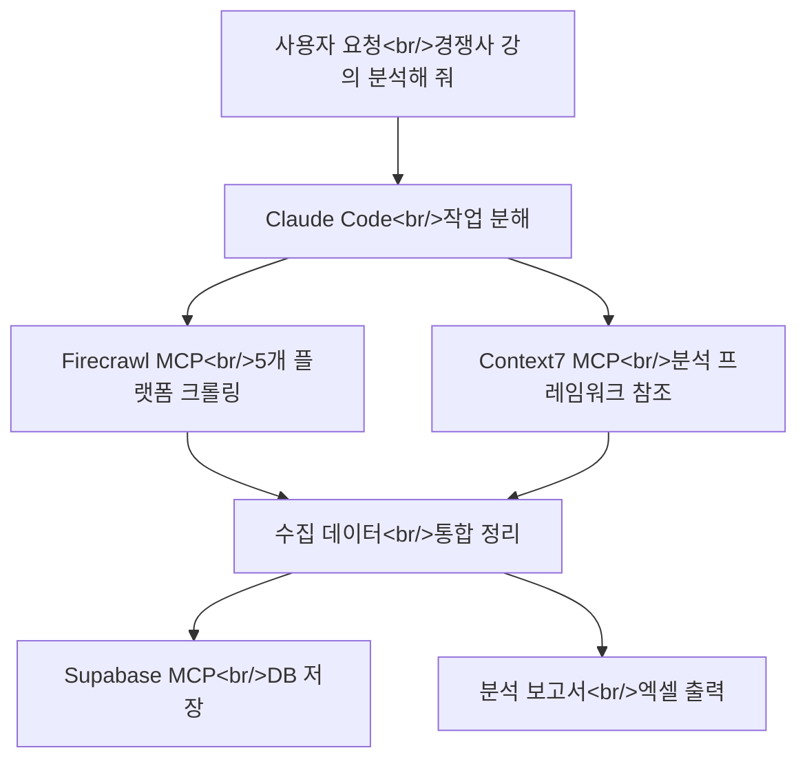
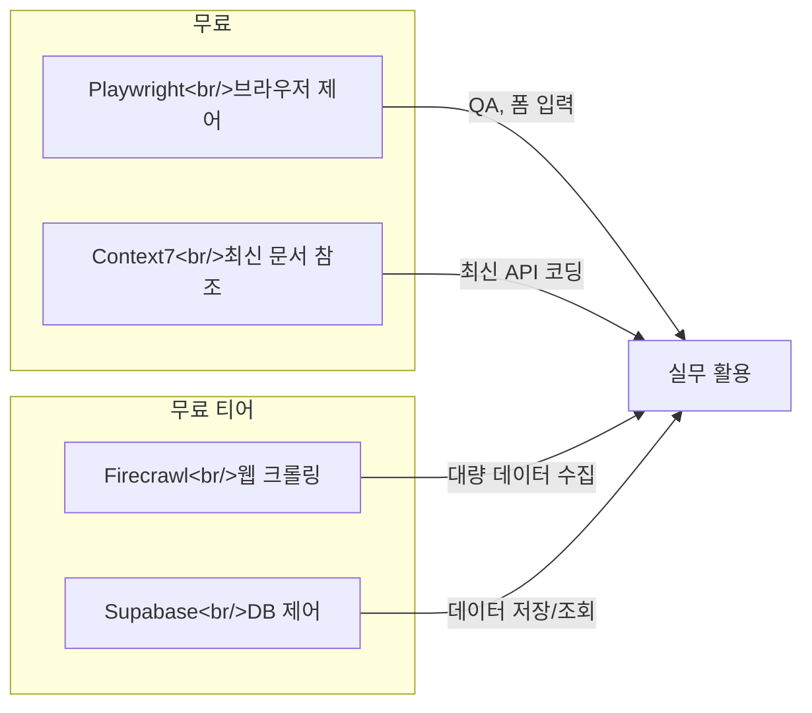

Claude Code는 그 자체로 강력하지만, MCP 서버를 연결하면 브라우저 제어, 웹 크롤링, 최신 문서 참조, 데이터베이스 조작까지 가능해진다. 이 포스트에서는 실무에서 바로 쓸 수 있는 MCP 서버 네 가지를 설치 방법과 실전 프롬프트 포함하여 정리한다. [AI 사용성연구소](https://www.youtube.com/@Theuxlabs)의 영상 "[클로드 코드 고수들은 이미 쓰고 있는 MCP 4가지 | EP.02](https://www.youtube.com/watch?v=Pbtp17aZ7k4)"를 참고했다.

<!--more-->

## MCP란 무엇인가 — 스마트폰 비유

MCP(Model Context Protocol)를 이해하는 가장 쉬운 방법은 **스마트폰 비유**다.

스마트폰을 처음 샀을 때를 떠올려 보자. 하드웨어 자체는 훌륭하지만, 앱을 설치하기 전에는 전화와 문자 정도밖에 할 수 없다. 카카오톡도 없고, 네이버 지도도 없고, 유튜브도 없다. **앱을 설치하는 순간** 비로소 스마트폰이 진짜 "스마트"해진다.

Claude Code도 똑같다.

| 비유 | 실제 |
|------|------|
| 스마트폰 | Claude Code |
| 앱스토어에서 앱 설치 | MCP 서버 연결 |
| USB-C 케이블 (표준 규격) | MCP (표준 프로토콜) |
| 앱이 알아서 알림을 보냄 | Claude가 맥락에 맞게 MCP를 자동 선택 |

MCP는 **Claude Code에 외부 도구를 연결해 주는 표준 규격**이다. USB-C 케이블처럼 하나의 프로토콜로 수백 가지 도구를 연결할 수 있다.

### 작동 원리


핵심은 **사용자가 MCP를 직접 호출할 필요가 없다**는 점이다. 카카오톡을 설치해 두면 메시지가 올 때 자동으로 알림이 오듯, MCP를 설치해 두면 Claude가 "이건 브라우저를 열어야 하는 일이구나" 하고 알아서 Playwright를 쓴다.

> 단, 특정 MCP를 **강제 발동**시키고 싶으면 프롬프트에 명시하는 것이 더 확실하다.

### MCP 설치 후 반드시 재시작

MCP를 설치한 뒤에는 Claude Code를 **껐다 켜야** 한다. `/exit` 후 다시 `claude`를 실행하면 된다.

---

## 1. Playwright MCP — 브라우저를 직접 제어하는 손과 발

### 어떤 MCP인가

Playwright MCP는 Claude가 **직접 브라우저를 열고 클릭하고 입력하는** 것을 가능하게 한다. 웹사이트 접속, 버튼 클릭, 폼 입력, 스크린샷 촬영까지 — 평소 우리가 브라우저에서 하는 모든 것을 Claude가 대신 해준다.

### 설치

Claude Code 안에서 자연어로 설치할 수 있다:

```
플레이라이트 MCP 설치해 줘
```

또는 터미널에서 직접:

```bash
claude mcp add playwright -- npx @anthropic-ai/mcp-playwright
```

### 활용 시나리오

- **QA 테스트**: 내가 만든 웹사이트를 Claude가 직접 브라우저에서 열어 테스트
- **데이터 수집**: 네이버 지도에서 맛집 검색 후 구글 시트에 정리
- **API 키 발급 대행**: Firecrawl 같은 서비스의 웹사이트를 열어 API 키 발급까지 보조
- **시각적 검증**: 스크린샷을 찍어 레이아웃이 맞는지 스스로 판단

### 실전 프롬프트

```
플레이라이트 MCP를 써서 네이버 지도에서 "강남역 맛집"을 검색하고,
평점이 좋은 곳 10개를 구글 시트에 정리해 줘.
항목: 가게명, 평점, 리뷰 수, 주소
```

```
내가 만든 웹사이트 http://localhost:3000 을 Playwright로 열어서
모든 페이지의 링크가 정상 작동하는지 QA 테스트해 줘.
깨진 링크가 있으면 목록으로 정리해 줘.
```

> Playwright는 한 페이지씩 직접 탐색하므로, 대량 크롤링보다는 **정밀한 상호작용**에 적합하다.

---

## 2. Firecrawl MCP — 대규모 웹 크롤링의 끝판왕

### 어떤 MCP인가

Playwright가 한 페이지씩 직접 클릭하며 탐색한다면, Firecrawl은 **웹사이트 전체를 한 번에 크롤링**한다. 긁어온 내용을 Markdown이나 JSON 같은 정리된 형태로 변환해 주며, AI 기반 분석까지 내장되어 있다.

### 설치

Firecrawl은 API 키가 필요하다. 무료 티어로 약 2,000회 크롤링이 가능하다.

```bash
# API 키 발급: https://firecrawl.dev 에서 가입 후 발급
claude mcp add firecrawl -- npx firecrawl-mcp --api-key YOUR_API_KEY
```

또는 Claude Code 안에서:

```
파이어크롤 MCP를 설치해 줘
```

API 키 발급이 어려우면 Playwright MCP에게 대행을 맡길 수도 있다:

```
플레이라이트를 써서 firecrawl.dev에 접속해서 API 키 발급받는 방법 알려 줘.
네가 직접 진행해 줘.
```

### Playwright vs Firecrawl

| 항목 | Playwright | Firecrawl |
|------|-----------|-----------|
| 방식 | 한 페이지씩 직접 제어 | 사이트 전체 일괄 크롤링 |
| 속도 | 느림 (상호작용 포함) | 빠름 (대량 처리 최적화) |
| 출력 | 스크린샷, DOM 접근 | Markdown, JSON, CSV |
| 적합한 작업 | QA 테스트, 폼 입력 | 데이터 수집, 경쟁사 분석 |
| 비용 | 무료 | 무료 티어 (2,000회) |

### 실전 프롬프트

```
파이어크롤 MCP를 써서 toss.tech 블로그에서 최신 아티클 10개를 수집해 줘.
수집 항목: 제목, 작성자, 카테고리, 요약, URL
최신 순서로 정렬해서 CSV 파일로 만들어 줘.
```

```
무신사 랭킹 페이지(https://www.musinsa.com/ranking)에서
1위부터 50위까지 크롤링해 줘.
수집 항목: 순위, 브랜드명, 상품명, 할인율, 판매 가격, 상품 URL
엑셀 파일로 정리하고 이미지 URL도 포함해 줘.
```

Firecrawl에 대한 더 깊은 분석은 별도 포스트 [Firecrawl — AI 시대의 웹 스크래핑 끝판왕](/posts/2026-04-01-firecrawl-web-scraping/)에서 다룬다.

---

## 3. Context7 MCP — 최신 공식 문서를 실시간 참조

### 어떤 MCP인가

AI에게 코드를 부탁하면 가끔 "그런 함수 없는데?"라는 상황이 발생한다. AI의 학습 데이터에는 **유통 기한**이 있기 때문이다. 예를 들어 Next.js가 15로 업데이트되었는데 Claude가 13 버전 문법으로 코드를 짜고 있는 상황.

Context7 MCP는 이 문제를 **근본적으로 해결**한다. 프롬프트를 입력하면 해당 라이브러리의 **현재 최신 공식 문서**를 실시간으로 가져와서 Claude에게 보여 준다. 학습 데이터가 아니라 **실제 공식 문서를 보고 코드를 짜게** 만드는 것이다.

### 설치

무료이며 API 키가 필요 없다.

```bash
claude mcp add context7 -- npx @context7/mcp
```

또는:

```
컨텍스트7 MCP 설치해 줘
```

### 실전 프롬프트

```
Next.js의 App Router를 사용해서 블로그 목록 페이지의 서버 컴포넌트를 만들어 줘.
use context7
```

```
Prisma ORM으로 PostgreSQL 연결하는 코드 작성해 줘.
최신 문서 기준으로 use context7
```

```
Tailwind CSS v4의 새로운 설정 방식으로 다크 모드 구현해 줘.
use context7
```

> `CLAUDE.md`에 "컨텍스트7 MCP를 써서 최신 문서를 참조해라"고 지시를 넣어 두면, 매번 프롬프트에 명시하지 않아도 자동으로 최신 문서를 참조하게 할 수 있다.

---

## 4. Supabase MCP — 데이터베이스를 자연어로 제어

### 어떤 MCP인가

Supabase MCP는 Claude가 **데이터베이스를 직접 조작**할 수 있게 해준다. 테이블 생성, 데이터 삽입, 쿼리 실행, 스키마 변경까지 — SQL을 몰라도 자연어로 데이터베이스를 다룰 수 있다.

### 설치

Supabase 프로젝트의 연결 정보가 필요하다.

```bash
claude mcp add supabase -- npx @supabase/mcp-server \
  --supabase-url https://YOUR_PROJECT.supabase.co \
  --supabase-key YOUR_SERVICE_ROLE_KEY
```

또는:

```
수파베이스 MCP 설치해 줘. 내 프로젝트 URL은 https://xxx.supabase.co 이고
서비스 롤 키는 eyJ... 야.
```

### 활용 시나리오

- **테이블 설계**: "회원, 주문, 상품 테이블을 만들어 줘. 관계 설정까지."
- **데이터 마이그레이션**: CSV 데이터를 Supabase 테이블에 일괄 삽입
- **RLS 정책 설정**: Row Level Security를 자연어로 설정
- **크롤링 → DB 저장**: Firecrawl로 수집한 데이터를 바로 DB에 저장

### 실전 프롬프트

```
Supabase에 블로그 시스템용 테이블을 만들어 줘.
- posts: id, title, content, author_id, created_at, published
- comments: id, post_id, user_id, body, created_at
- users: id, email, display_name, avatar_url
외래 키 관계까지 설정하고, RLS 정책도 추가해 줘.
```

```
크롤링해서 만든 products.csv를 Supabase의 products 테이블에 일괄 삽입해 줘.
중복 상품명은 건너뛰고 새로운 것만 추가해.
```

---

## MCP 조합의 진짜 위력

MCP의 진정한 가치는 **여러 개를 조합할 때** 나타난다. Claude Code에 MCP를 여러 개 연결해 두면, Claude가 상황에 맞게 자동으로 적절한 MCP를 선택한다.



### 조합 예시: 경쟁사 강의 분석

```
1단계 — 데이터 수집 (Firecrawl):
아래 교육 플랫폼에서 "클로드 코드" 관련 강의를 크롤링해 줘.
- 인프런, 패스트캠퍼스, 클래스101, 콜로소, 러닝스푼즈
수집 항목: 강의명, 강사명, 가격, 수강생 수, 리뷰 수, 평점, URL

2단계 — 분석:
수집한 데이터를 기반으로 단계별 분석을 진행해 줘.
- 강점/약점 비교
- 가격대별 포지셔닝
- 시장에 비어 있는 포지션 분석

최종 출력은 엑셀 파일로.
```

---

## 추천 MCP 설정 요약



| MCP | 용도 | 비용 | API 키 |
|-----|------|------|--------|
| Playwright | 브라우저 제어, QA | 무료 | 불필요 |
| Firecrawl | 웹 크롤링, 데이터 수집 | 무료 2,000회 | 필요 |
| Context7 | 최신 공식 문서 참조 | 무료 | 불필요 |
| Supabase | 데이터베이스 조작 | 무료 티어 | 필요 |

---

## 인사이트

**MCP는 Claude Code의 "앱 생태계"다.** 스마트폰이 앱 없이는 전화기에 불과하듯, Claude Code도 MCP 없이는 텍스트 생성기에 불과하다. MCP를 연결하는 순간 Claude는 브라우저를 제어하고, 웹을 크롤링하고, 최신 문서를 읽고, 데이터베이스를 조작하는 **진짜 에이전트**가 된다.

특히 인상적인 점은 **진입 장벽의 낮음**이다. "플레이라이트 MCP 설치해 줘"라는 한 문장이면 설치가 끝나고, 설치 후에는 명시적으로 호출하지 않아도 Claude가 맥락에 맞게 자동으로 적절한 MCP를 선택한다. 비개발자도 자연어만으로 브라우저 자동화, 웹 크롤링, 데이터베이스 조작이 가능해지는 것이다.

한 가지 실전 팁: MCP를 강제 발동시키고 싶으면 프롬프트에 MCP 이름을 명시하는 것이 확실하다. "플레이라이트를 써서", "파이어크롤로", "use context7"처럼 직접 지정하면 의도한 도구가 발동될 확률이 높아진다.

앞으로 Notion MCP, Figma MCP, Linear MCP 등 더 많은 MCP가 생태계에 추가될수록, Claude Code는 단순한 코딩 도구를 넘어 **범용 업무 자동화 플랫폼**으로 진화할 것이다.
