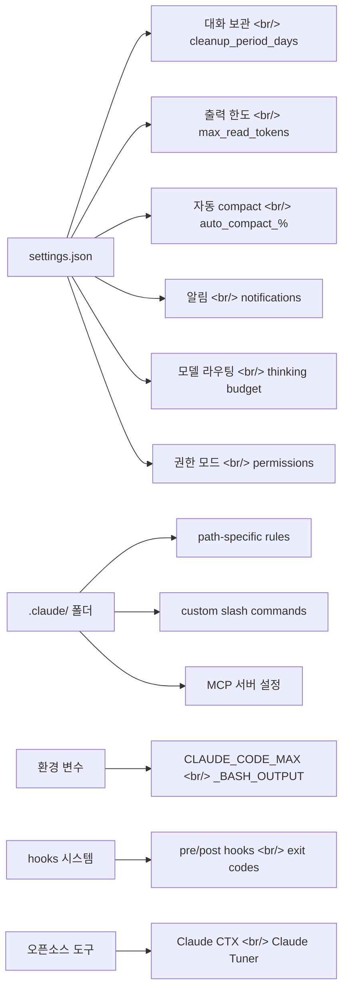

## 개요

[Claude Code 실전 가이드](https://www.youtube.com/@AILABS-393) 시리즈의 다섯 번째 글입니다.
이전 글에서는 컨텍스트 관리(#1, 03/19), 최근 신기능(#2, 03/24), 500시간 사용자의 27가지 팁(#3, 03/30), auto-fix와 Self-Healing 워크플로우(#4, 04/01)를 다뤘습니다.

이번 포스트에서는 AI LABS 채널의 [12 Hidden Settings To Enable In Your Claude Code Setup](https://www.youtube.com/watch?v=pDoBe4qbFPE) 영상을 기반으로, `settings.json`과 환경 변수에 숨겨진 12가지 설정을 하나씩 파헤칩니다. 대부분의 사용자가 모르고 지나가는 설정이지만, 이것들을 켜면 Claude Code의 성능과 사용 경험이 확연히 달라집니다.

<!--more-->

## 전체 설정 구조

아래 다이어그램은 이번 포스트에서 다루는 12가지 설정이 Claude Code의 어떤 영역에 속하는지 보여줍니다.



---

## 1. cleanup_period_days -- 대화 보관 기간

`/insights` 명령이나 `--resume` 플래그를 사용할 때, 기본적으로 최근 **30일**의 대화만 표시됩니다. Claude Code가 그 이전 데이터를 시스템에서 삭제하기 때문입니다.

Opus 4.6의 1M 토큰 컨텍스트 윈도우를 활용해 더 긴 기간의 인사이트 분석을 하고 싶다면, 이 설정을 바꿔야 합니다.

**설정 위치**: `~/.claude/settings.json`

```json
{
  "cleanup_period_days": 365
}
```

| 값 | 동작 |
|---|---|
| `365` | 1년치 대화 보관 |
| `90` | 3개월 보관 (권장 중간값) |
| `0` | 대화를 전혀 보관하지 않음 -- insights/resume 불가 |

> **주의**: 값을 너무 크게 설정하면 `~/.claude/` 폴더 용량이 상당히 커질 수 있습니다. 디스크 여유 공간을 확인하세요.

---

## 2. Path-Specific Rules -- 경로별 규칙

프로젝트의 `.claude/` 폴더 안에 **경로 패턴에 따라 로드되는 규칙 파일**을 만들 수 있습니다. 에이전트가 특정 파일을 읽거나 수정할 때, 해당 경로 패턴과 매칭되는 규칙만 컨텍스트에 로드됩니다.

### 왜 필요한가?

많은 사람들이 `CLAUDE.md` 하나에 모든 지시사항을 몰아넣습니다. 프로젝트가 커지면 이 파일 자체가 너무 방대해져서, Claude가 어떤 지시를 따라야 할지 혼란을 겪습니다. 프론트엔드 작업 중인데 백엔드 규칙까지 로드할 필요는 없습니다.

### 설정 예시

`.claude/rules/` 디렉토리에 파일별 규칙을 분리합니다:

```
.claude/
  rules/
    react-components.md    # src/components/** 패턴에 매칭
    api-routes.md          # src/api/** 패턴에 매칭
    database.md            # prisma/** 또는 drizzle/** 패턴에 매칭
```

각 규칙 파일은 해당 경로의 파일을 작업할 때만 컨텍스트에 주입됩니다. 이렇게 하면:

- **관심사 분리** (Separation of Concerns)가 자연스럽게 이루어지고
- 에이전트가 현재 작업에 **집중**할 수 있으며
- 컨텍스트 윈도우를 **효율적으로** 사용합니다

---

## 3. 출력 토큰 한도와 대형 파일 읽기

### Bash 출력 한도

Claude Code가 bash 명령 결과를 읽을 때, 기본 한도는 **30,000자**입니다. 테스트 스위트, 빌드 로그, 데이터베이스 마이그레이션처럼 대량의 출력을 생성하는 명령은 잘려나갑니다.

```json
{
  "max_output_chars": 150000
}
```

1M 토큰 컨텍스트 윈도우가 있는 지금, 30K 제한은 200K 시절의 유산입니다. 150K 정도로 올리면 전체 출력을 읽을 수 있습니다.

### 파일 읽기 토큰 한도

기본적으로 Claude는 파일을 읽을 때 **25K 토큰**만 읽습니다. 더 큰 파일은 100K 이상으로 설정할 수 있습니다:

```json
{
  "max_read_file_tokens": 100000
}
```

### 2,000줄 제한 우회

여기서 중요한 함정이 있습니다. 토큰 한도를 아무리 올려도, Claude는 한 번에 **최대 2,000줄**만 읽고 나머지가 있다는 사실조차 모릅니다. Anthropic이 이 제한을 변경할 수 있는 설정을 제공하지 않습니다.

**우회 방법**: `CLAUDE.md`에 다음 지시를 추가합니다:

```markdown
## 대형 파일 읽기 규칙
파일을 읽을 때 먼저 줄 수를 확인하세요. 2,000줄을 초과하는 파일은
offset과 limit 파라미터를 사용해 전체를 읽으세요.
```

추가로, `Read` 도구가 실행될 때마다 트리거되는 hook을 설정하여 파일 줄 수를 체크하고, 2,000줄 초과 시 분할 읽기를 강제할 수도 있습니다.

---

## 4. CLAUDE_CODE_MAX_BASH_OUTPUT -- Bash 출력 전용 한도

환경 변수 `CLAUDE_CODE_MAX_BASH_OUTPUT`을 설정하면 bash 명령 출력의 최대 문자 수를 별도로 제어할 수 있습니다.

```bash
# ~/.zshrc 또는 ~/.bashrc에 추가
export CLAUDE_CODE_MAX_BASH_OUTPUT=150000
```

이 환경 변수는 `settings.json`의 설정과 함께 작동하며, 특히 CI/CD 파이프라인이나 대형 로그를 다룰 때 유용합니다. 기본값 30K는 테스트 결과의 앞부분만 보여주고 실제 에러가 있는 뒷부분을 잘라버리는 경우가 많습니다.

```json
// settings.json에서도 동일하게 설정 가능
{
  "env": {
    "CLAUDE_CODE_MAX_BASH_OUTPUT": "150000"
  }
}
```

---

## 5. 자동 Compact와 컨텍스트 관리

Claude Code는 컨텍스트 윈도우가 **95%**에 도달하면 자동으로 compact를 실행합니다. 하지만 1M 토큰 윈도우에서도 **70% 이후부터 출력 품질이 저하**되기 시작합니다.

### 최적 설정

```json
{
  "auto_compact_percentage_override": 75
}
```

75%에서 자동 compact를 트리거하면, 에이전트가 항상 충분한 여유 컨텍스트를 확보한 상태에서 작업합니다. 95%까지 기다리면 이미 품질이 떨어진 상태에서 compact가 일어나므로, 그 사이 구간에서 생성된 코드 품질이 보장되지 않습니다.

> **팁**: 특별히 전체 1M 컨텍스트가 필요한 대형 코드베이스 분석 작업이 아니라면, 70-80% 범위를 권장합니다.

---

## 6. 알림 설정

Claude Code가 장시간 작업을 수행할 때, 완료 알림을 놓치기 쉽습니다. `settings.json`에서 알림 동작을 제어할 수 있습니다.

```json
{
  "notifications": {
    "enabled": true,
    "sound": true,
    "on_complete": true
  }
}
```

### Telemetry와 프라이버시

Claude Code는 기본적으로 Statsig(사용 패턴/지연 시간)과 Sentry(에러 로깅)에 데이터를 전송합니다. 옵트아웃하려면:

```json
{
  "disable_telemetry": true,
  "disable_error_reporting": true,
  "disable_feedback_display": true
}
```

> **주의**: CLI 플래그 `--disable-non-essential-traffic`도 비슷해 보이지만, 이건 **자동 업데이트까지 차단**합니다. 위 세 가지 설정을 개별로 사용하는 것이 더 안전합니다.

---

## 7. 모델 라우팅과 Thinking Budget

### effort 파라미터

sub-agent를 실행할 때 `--effort` 플래그로 thinking 수준을 조절할 수 있습니다. 모든 작업에 최대 thinking이 필요한 것은 아닙니다.

```bash
# 가벼운 작업에는 낮은 effort
claude --agent formatter --effort low

# 복잡한 아키텍처 결정에는 높은 effort
claude --agent architect --effort high
```

### Sub-agent 고급 설정

sub-agent는 단순히 모델과 MCP 도구만 설정할 수 있는 것이 아닙니다:

```json
{
  "agents": {
    "formatter": {
      "model": "claude-sonnet-4-20250514",
      "effort": "low",
      "background": true,
      "skills": ["lint-fix"],
      "hooks": {
        "post_tool_use": "./hooks/format-check.sh"
      }
    },
    "architect": {
      "model": "claude-opus-4-20250514",
      "effort": "high",
      "isolation": true,
      "permitted_agent_names": ["formatter", "tester"]
    }
  }
}
```

| 옵션 | 설명 |
|---|---|
| `skill` | sub-agent에 특정 skill 상속 |
| `effort` | thinking 토큰 사용량 조절 |
| `background` | 백그라운드 실행 여부 |
| `isolation` | 별도 worktree에서 격리 실행 |
| `permitted_agent_names` | 생성 가능한 하위 에이전트 제한 |

### Agent Teams (실험적 기능)

Sub-agent와 달리, Agent Teams에서는 팀 멤버끼리 **서로 통신**할 수 있습니다. 팀 리더가 작업을 조율하고, 각 멤버는 독립된 Claude 세션으로 동작하면서도 정보를 공유합니다.

---

## 8. 권한 모드와 Auto-Accept

Claude Code의 권한 시스템은 파일 수정, bash 실행 등의 작업마다 사용자 승인을 요구합니다. 신뢰할 수 있는 프로젝트에서는 이를 자동화할 수 있습니다.

```json
{
  "permissions": {
    "allow": [
      "Read",
      "Glob",
      "Grep",
      "Bash(git *)",
      "Bash(npm test)",
      "Bash(npx prettier *)"
    ],
    "deny": [
      "Bash(rm -rf *)",
      "Bash(git push --force *)"
    ]
  }
}
```

### 프로필별 권한 관리 -- Claude CTX

여러 프로젝트에서 다른 권한 설정이 필요하다면, 오픈소스 도구 **Claude CTX**가 유용합니다:

```bash
# 설치 (macOS)
brew install claude-ctx

# 현재 프로필 확인
claude ctx -c

# 프로필 전환
claude ctx work        # 업무용 설정으로 전환
claude ctx personal    # 개인 프로젝트 설정으로 전환
```

Claude CTX는 `~/.claude/profiles/` 폴더에 프로필별 `settings.json`과 `CLAUDE.md`를 관리합니다. 전환 시 현재 상태를 자동 백업하므로 설정이 섞일 걱정이 없습니다.

---

## 9. MCP 서버 설정

MCP(Model Context Protocol) 서버를 `settings.json`에서 직접 설정할 수 있습니다. sub-agent별로 다른 MCP 도구를 할당하는 것도 가능합니다.

```json
{
  "mcpServers": {
    "filesystem": {
      "command": "npx",
      "args": ["-y", "@modelcontextprotocol/server-filesystem", "/path/to/project"]
    },
    "github": {
      "command": "npx",
      "args": ["-y", "@modelcontextprotocol/server-github"],
      "env": {
        "GITHUB_PERSONAL_ACCESS_TOKEN": "${GITHUB_TOKEN}"
      }
    },
    "postgres": {
      "command": "npx",
      "args": ["-y", "@modelcontextprotocol/server-postgres"],
      "env": {
        "DATABASE_URL": "${DATABASE_URL}"
      }
    }
  }
}
```

프로젝트 레벨(`.claude/settings.json`)과 글로벌 레벨(`~/.claude/settings.json`) 모두에서 설정할 수 있으며, 프로젝트 레벨이 우선합니다.

---

## 10. Custom Slash Commands

`.claude/commands/` 디렉토리에 마크다운 파일을 만들면 커스텀 슬래시 명령을 정의할 수 있습니다.

```
.claude/
  commands/
    review.md      → /review로 호출
    deploy.md      → /deploy로 호출
    e2e-test.md    → /e2e-test로 호출
```

### 예시: /review 명령

```markdown
# Code Review

현재 staged된 변경사항을 리뷰합니다:
1. `git diff --cached`로 변경사항 확인
2. 보안 취약점 체크
3. 성능 이슈 확인
4. 코드 스타일 검토
5. 리뷰 결과를 구조화된 형태로 출력
```

이 파일은 별도의 등록 과정 없이, 디렉토리에 넣기만 하면 Claude Code가 자동으로 인식합니다. skill과 달리 단순한 프롬프트 템플릿으로 동작하며, 반복적인 워크플로우를 명령 하나로 축약할 때 유용합니다.

---

## 11. Pre/Post Hooks와 Exit Codes

Hooks는 Claude Code의 도구 실행 전후에 커스텀 스크립트를 실행합니다. 핵심은 **exit code**에 따라 동작이 달라진다는 점입니다.

### Exit Code 체계

| Exit Code | 동작 | 용도 |
|---|---|---|
| `0` | 성공, 컨텍스트에 삽입 안 됨 | 정상 완료 확인 |
| `2` | **블로킹** -- 에러 메시지가 Claude에 피드백됨 | 금지된 명령 차단 |
| 그 외 | 비블로킹, verbose 모드에서만 표시 | 경고성 메시지 |

### 실전 예시: 패키지 매니저 강제

Claude가 학습 데이터의 패턴 때문에 `pip`을 사용하려 할 때, `uv`를 강제하는 hook:

```json
{
  "hooks": {
    "pre_tool_use": [
      {
        "tool": "Bash",
        "command": "./hooks/enforce-uv.sh"
      }
    ]
  }
}
```

```bash
#!/bin/bash
# hooks/enforce-uv.sh
if echo "$CLAUDE_TOOL_INPUT" | grep -q "pip install"; then
  echo "ERROR: pip 대신 uv를 사용하세요. 'uv pip install' 또는 'uv add'를 사용해주세요."
  exit 2  # 블로킹 -- Claude가 이 메시지를 읽고 명령을 수정함
fi
exit 0
```

### 대형 파일 읽기 강제 hook

```json
{
  "hooks": {
    "pre_tool_use": [
      {
        "tool": "Read",
        "command": "./hooks/check-file-lines.sh"
      }
    ]
  }
}
```

이 hook은 `Read` 도구가 실행될 때마다 파일 줄 수를 체크하고, 2,000줄 초과 시 exit code 2로 분할 읽기를 강제합니다.

---

## 12. 오픈소스 대안 도구

### Claude CTX -- 프로필 매니저

앞서 권한 모드에서 언급했듯이, 여러 설정 프로필을 관리합니다:

```
~/.claude/
  profiles/
    work/
      settings.json
      CLAUDE.md
    personal/
      settings.json
      CLAUDE.md
    client-a/
      settings.json
      CLAUDE.md
  backups/
    2026-04-01T10:00:00/
```

### Attribution 커스터마이징

Claude가 GitHub 커밋에 자동으로 co-author를 추가하는 것이 불편하다면:

```json
{
  "attribution": {
    "commit": "",
    "pr": ""
  }
}
```

빈 문자열로 설정하면 co-author 태그가 추가되지 않습니다. 커스텀 문자열을 넣으면 원하는 이름으로 표시됩니다.

### 기타 유용한 팁

- **Prompt Stashing**: `Ctrl+S`로 현재 프롬프트를 임시 저장하고, 다른 작업을 먼저 수행한 후 자동으로 복원
- **Sub-agent 직접 실행**: `claude --agent <name>` 플래그로 특정 sub-agent를 직접 호출하여 로딩 오버헤드 제거

---

## 나의 settings.json 종합 설정

위 내용을 종합한 실전 `settings.json` 예시입니다:

```json
{
  "cleanup_period_days": 90,
  "max_read_file_tokens": 100000,
  "auto_compact_percentage_override": 75,

  "notifications": {
    "enabled": true,
    "on_complete": true
  },

  "permissions": {
    "allow": [
      "Read", "Glob", "Grep",
      "Bash(git *)",
      "Bash(uv *)",
      "Bash(npm test)"
    ],
    "deny": [
      "Bash(rm -rf *)",
      "Bash(git push --force *)"
    ]
  },

  "attribution": {
    "commit": "",
    "pr": ""
  },

  "disable_telemetry": true,
  "disable_error_reporting": true,

  "hooks": {
    "pre_tool_use": [
      {
        "tool": "Bash",
        "command": "./hooks/enforce-uv.sh"
      }
    ]
  }
}
```

---

## 인사이트

1. **설정의 계층 구조를 이해하라**: `~/.claude/settings.json`(글로벌) -> `.claude/settings.json`(프로젝트) -> 환경 변수 순으로 우선순위가 높아집니다. 프로젝트별 특성에 맞게 설정을 분리하면 충돌이 줄어듭니다.

2. **30K 기본 한도는 과거의 유산**: 200K 컨텍스트 시절의 보수적 기본값이 아직 적용되어 있습니다. 1M 토큰 시대에는 출력 한도와 파일 읽기 한도를 적극적으로 올려야 Claude의 잠재력을 제대로 활용할 수 있습니다.

3. **Auto-compact 75%는 품질 보험**: 95% 기본값은 "가능한 한 많이 기억하겠다"는 전략이지만, 70% 이후 품질 저하를 감안하면 75%가 실용적인 균형점입니다.

4. **Exit code 2가 hooks의 핵심**: 단순한 전처리/후처리가 아니라, Claude의 행동을 **능동적으로 교정**하는 메커니즘입니다. 팀 전체의 코딩 표준을 hook으로 강제하면 AI가 생성하는 코드의 일관성이 크게 향상됩니다.

5. **Path-specific rules는 미래 투자**: 프로젝트 초기에는 과잉 설계처럼 보이지만, 코드베이스가 성장하면서 `CLAUDE.md` 하나로 모든 걸 관리하는 것이 병목이 됩니다. 일찍 분리해두면 나중에 큰 효과를 봅니다.

---

## 참고 자료

- [12 Hidden Settings To Enable In Your Claude Code Setup](https://www.youtube.com/watch?v=pDoBe4qbFPE) -- AI LABS
- [Claude Code 공식 문서](https://docs.anthropic.com/en/docs/claude-code)
- [Claude CTX GitHub](https://github.com/anthropics/claude-ctx)
