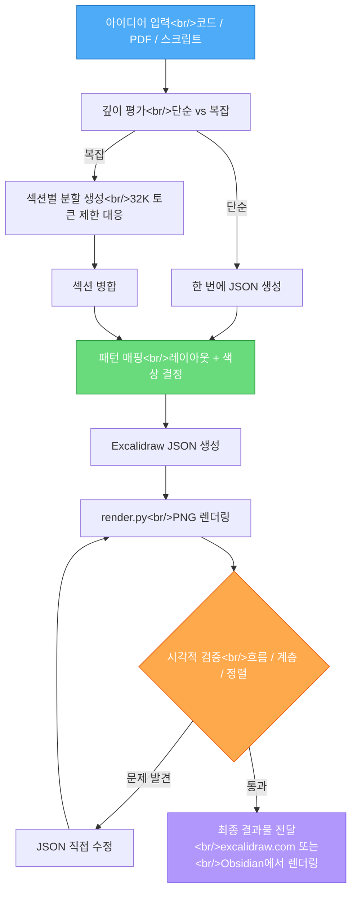

코딩 에이전트는 텍스트에 강하지만 시각적 표현에는 약하다. Claude Code의 Skills 시스템은 이 한계를 체계적으로 극복하는 프레임워크다. Excalidraw 다이어그램 스킬을 사례로, Skills의 구조부터 "visual argumentation" 철학까지 깊이 파고든다.

<!--more-->

## Claude Code Skills 시스템 개요

### Skills란 무엇인가

Skills는 **재사용 가능한 프롬프트 + 리소스 패키지**다. 코딩 에이전트에게 특정 작업을 수행하는 방법을 가르치는 "지침서"를 디렉토리 하나로 묶은 것이다.

핵심은 `skill.md` 파일이다. 이 마크다운 파일이 에이전트의 행동을 정의한다 — 무엇을 입력으로 받고, 어떤 단계를 거치며, 어떤 품질 기준으로 결과물을 검증할지가 모두 여기에 담긴다.

```
.claude/skills/
├── excalidraw-diagram/
│   ├── skill.md              # 핵심 지침서
│   ├── reference/            # 참조 리소스
│   │   ├── color-palette.json
│   │   └── element-templates/
│   └── render.py             # 보조 스크립트
├── code-review/
│   └── skill.md
└── documentation/
    └── skill.md
```

Skills는 slash command(예: `/diagram`)로 호출된다. Claude Code가 프롬프트 의도를 파악하면 자동으로 해당 skill.md를 로드하고, 거기 정의된 워크플로를 따른다.

### Skills vs MCP vs CLAUDE.md — 언제 뭘 쓰는가

이 세 가지는 모두 에이전트의 행동을 확장하지만, 용도가 다르다.

| 구분 | 용도 | 범위 | 예시 |
|------|------|------|------|
| **CLAUDE.md** | 프로젝트 전체에 적용되는 규칙 | 항상 로드됨 | 코딩 컨벤션, 빌드 명령어 |
| **Skills** | 특정 작업의 체계적 워크플로 | 필요할 때만 로드 | 다이어그램 생성, 코드 리뷰 |
| **MCP** | 외부 서비스 연동 (API 호출) | 도구 수준 | Slack 메시지 전송, DB 쿼리 |

**CLAUDE.md**는 "이 프로젝트에서는 항상 이렇게 해라"이고, **Skills**는 "이 작업을 할 때는 이 절차를 따라라"이며, **MCP**는 "이 외부 시스템과 이렇게 통신해라"다.

Skills의 장점은 명확하다:
- **컨텍스트 효율성** — 필요할 때만 로드되므로 토큰을 낭비하지 않는다
- **재사용성** — 한 번 만들면 어떤 프로젝트에서든 사용 가능
- **공유 가능** — GitHub repo로 배포하면 누구나 clone해서 쓸 수 있다

## Excalidraw 다이어그램 스킬 상세 분석

### 문제 정의: LLM의 시각적 한계

코딩 에이전트에게 "아키텍처 다이어그램을 그려줘"라고 요청하면 어떤 일이 벌어지는가?

스킬 없이 생성하면 결과물은 판에 박힌 박스와 화살표의 나열이다. 색상 선택은 무작위에 가깝고, 레이아웃에 정보 계층(hierarchy)이 없으며, 어떤 다이어그램이든 거의 동일한 모양이 나온다. LLM은 텍스트 토큰을 생성하는 데 최적화되어 있지, **시각적 의사결정**(색상 조합, 공간 배치, 시선 흐름)에는 체계적 지침이 필요하다.

Excalidraw 스킬은 이 문제를 해결한다. "어떤 색을 쓸지", "어떤 레이아웃 패턴을 적용할지", "결과물을 어떻게 검증할지"를 모두 체계화하여 skill.md에 담았다.

### 디렉토리 구조

```
.claude/skills/excalidraw-diagram/
├── skill.md                    # 워크플로 전체 정의
├── reference/
│   ├── color-palette.json      # 브랜드 컬러 시스템
│   └── element-templates/      # 재사용 가능한 도형 템플릿
└── render.py                   # PNG 렌더링 스크립트 (검증용)
```

각 파일의 역할:

- **`skill.md`** — 에이전트가 다이어그램을 생성하는 전체 과정을 지시. 입력 분석부터 검증 루프까지 포함
- **`color-palette.json`** — 일관된 색상 체계. 주요색, 보조색, 배경색 등을 hex 코드로 정의
- **`element-templates/`** — 자주 쓰이는 시각 패턴(flow diagram, architecture map 등)의 JSON 스니펫
- **`render.py`** — Excalidraw JSON을 PNG로 변환. 에이전트가 자체 검증에 사용

### skill.md 핵심 내용 분석

skill.md의 핵심 워크플로를 단계별로 살펴보자.

#### 1단계: 입력 소스 처리

스킬은 다양한 입력을 처리할 수 있도록 설계되었다:

```markdown
## Input Processing
- **Code file** → 아키텍처, 데이터 플로우, 클래스 관계 추출
- **PDF document** → 핵심 개념과 관계 구조 파악
- **YouTube transcript** → 설명 흐름을 시각적 구조로 변환
- **Raw text/notes** → 개념 간 관계 매핑
```

코드 파일이라면 함수 호출 그래프나 모듈 의존성을, YouTube 스크립트라면 설명의 논리적 흐름을 시각화한다.

#### 2단계: 깊이 평가 (Depth Assessment)

이 단계가 존재하는 이유는 실용적이다. Claude Code에는 **32K 토큰 출력 제한**이 있다. 복잡한 다이어그램의 Excalidraw JSON은 이 한도를 쉽게 초과한다.

```markdown
## Depth Assessment
IF simple diagram (single concept, few elements):
  → Build entire JSON in one pass
IF complex diagram (multiple sections, many relationships):
  → Build section by section, merging incrementally
```

단순한 다이어그램은 한 번에 생성하고, 복잡한 것은 섹션별로 나누어 생성한 후 병합한다.

#### 3단계: 패턴 매핑

에이전트가 "박스와 화살표만 반복"하는 것을 방지하는 핵심 단계다:

```markdown
## Pattern Mapping
입력의 성격에 따라 시각 패턴을 선택:
- System architecture → 계층형 레이어 다이어그램
- Data flow → 방향성 있는 파이프라인
- Decision process → 분기형 트리
- Comparison → 병렬 배치 + 대비 색상
- Timeline → 수평/수직 시간축
```

여기에 "박스의 반복을 피하라", "Multi-zoom architecture를 활용하라" 같은 디자인 원칙도 포함된다.

#### 4단계: JSON 생성

Excalidraw의 네이티브 포맷은 JSON이다. skill.md는 JSON 생성 시 따라야 할 규칙을 명시한다:

```json
{
  "type": "excalidraw",
  "version": 2,
  "elements": [
    {
      "type": "rectangle",
      "x": 100,
      "y": 200,
      "width": 240,
      "height": 80,
      "backgroundColor": "#a5d8ff",
      "strokeColor": "#1971c2",
      "roundness": { "type": 3 },
      "boundElements": [],
      "label": {
        "text": "Content Fetcher"
      }
    }
  ]
}
```

컬러 팔레트에서 색상을 가져오고, 요소 간 간격과 정렬 규칙을 따르며, 화살표 연결의 시작점/끝점을 정확히 계산해야 한다.

#### 5단계: 검증 루프 (Self-Validation)

이 스킬의 가장 강력한 부분이다:

```markdown
## Validation Loop (2-4 iterations)
1. render.py로 JSON → PNG 렌더링
2. 생성된 PNG 스크린샷을 직접 확인
3. 다음 기준으로 평가:
   - 시각적 흐름이 자연스러운가?
   - 정보 계층이 명확한가?
   - 화살표 연결이 정확한가?
   - 색상 대비가 충분한가?
   - 텍스트가 잘려나가지 않았는가?
4. 문제 발견 시 JSON을 직접 수정 (재생성 아님)
5. 2-4회 반복
```

에이전트가 자기 작업물을 "눈으로 확인"하고 수정하는 것이다. `render.py`가 PNG를 생성하면, Claude Code의 멀티모달 능력으로 이미지를 분석하고 개선점을 찾는다. 중요한 점은 매번 처음부터 다시 만드는 게 아니라 **기존 JSON을 직접 편집**한다는 것이다.

### 전체 워크플로 시각화



## Visual Argumentation 철학

Excalidraw 스킬의 핵심 철학은 "visual argumentation" — **시각적 논증**이다. 단순히 예쁜 그림을 만드는 것이 아니라, 다이어그램의 구조 자체가 논점을 전달해야 한다.

### 두 가지 핵심 질문

skill.md는 에이전트에게 매 단계마다 두 가지를 자문하도록 지시한다:

1. **"시각적 구조가 개념의 동작을 반영하는가?"** (Does the visual structure mirror the concept's behavior?)
2. **"누군가 이 다이어그램에서 구체적인 것을 배울 수 있는가?"** (Could someone learn something concrete from this diagram?)

첫 번째 질문은 **구조적 정합성**에 관한 것이다. 예를 들어 파이프라인을 설명하는데 순환형 레이아웃을 쓰면 개념과 시각이 어긋난다. 데이터가 A에서 B로 흐르면, 다이어그램도 왼쪽에서 오른쪽으로(또는 위에서 아래로) 흘러야 한다.

두 번째 질문은 **교육적 가치**에 관한 것이다. 다이어그램이 단순히 문서의 장식이 아니라, 독자가 실제로 개념을 이해하는 데 도움이 되어야 한다.

### 텍스트 제거 테스트

가장 인상적인 검증 기법이다:

> 다이어그램에서 모든 설명 텍스트를 제거했을 때, **구조와 레이아웃만으로 논점이 전달되어야 한다.**

박스 안의 텍스트를 다 지워도 화살표의 방향, 요소의 크기 차이, 색상의 구분, 공간적 배치만으로 "무엇이 중요하고 무엇이 부차적인지", "데이터가 어디서 어디로 흘러가는지"가 드러나야 한다는 것이다.

이것이 "visual argumentation"의 핵심이다. 텍스트는 부연일 뿐, 시각적 구조 자체가 주장을 담아야 한다.

### 적용 예시

| 시각화 대상 | 구조가 반영해야 할 것 | 나쁜 예 |
|------------|---------------------|---------|
| 마이크로서비스 아키텍처 | 서비스 간 독립성, 통신 경로 | 모든 서비스를 동일 크기 박스로 일렬 배치 |
| 데이터 파이프라인 | 단방향 흐름, 변환 단계의 순서 | 양방향 화살표, 무작위 배치 |
| 의사결정 트리 | 분기의 조건, 경로별 결과 차이 | 모든 분기를 동일하게 표현 |
| 계층형 시스템 | 상위/하위 관계, 의존성 방향 | 평면적 나열 |

## 실전 데모 워크플로

실제로 이 스킬을 사용하는 과정을 단계별로 따라가 보자.

### Step 1: 프롬프트 입력

Claude Code에서 다음과 같이 요청한다:

```
이 파일의 아키텍처를 다이어그램으로 만들어줘
/path/to/content_fetcher.py
```

또는 더 구체적으로:

```
이 YouTube 스크립트를 기반으로 데이터 파이프라인 다이어그램을 만들어줘.
핵심 개념 간의 관계에 집중해줘.
```

### Step 2: skill.md 로드

Claude Code는 프롬프트 의도를 파악하고 `.claude/skills/excalidraw-diagram/skill.md`를 자동으로 로드한다. 이 시점에서 에이전트의 행동이 완전히 바뀐다 — skill.md에 정의된 워크플로를 단계별로 따르기 시작한다.

### Step 3: JSON 생성 및 검증

에이전트가 입력을 분석하고, 깊이를 평가하고, 패턴을 선택하여 Excalidraw JSON을 생성한다. 그 다음 `render.py`를 실행하여 PNG를 만들고, 자체적으로 검증한다.

```bash
# 에이전트가 내부적으로 실행하는 과정
python render.py output.excalidraw --output preview.png
# → PNG 생성 후 이미지 분석
# → "화살표 간격이 좁다" → JSON 수정
# → 재렌더링 → 재검증
# → 2-4회 반복
```

### Step 4: 결과물 렌더링

최종 JSON 파일을 두 가지 방법으로 열 수 있다:

1. **excalidraw.com** — 브라우저에서 바로 열기. 무료. "Open" → 로컬 `.excalidraw` 파일 선택
2. **Obsidian Excalidraw 플러그인** — 노트 시스템과 통합. `.excalidraw` 파일을 Vault에 넣으면 바로 렌더링

### Step 5: 반복 수정

첫 결과물은 완벽하지 않다. 이건 **의도된 것**이다. LLM이 하나의 다이어그램을 만들 때 내려야 하는 미시적 결정의 수를 생각해 보라:

- 모든 요소의 x, y 좌표
- 모든 색상 선택
- 모든 화살표의 시작점과 끝점
- 텍스트 크기와 배치
- 요소 간 간격

이 모든 결정이 동시에 완벽할 수는 없다. 하지만 **시작점이 80% 완성도**라면 나머지 20%는 2-3번의 지시로 도달할 수 있다:

```
- 화살표가 너무 짧아, 간격을 넓혀줘
- 색상 대비를 더 높여줘, 배경과 텍스트가 구분이 안 돼
- "Data Layer" 섹션을 더 크게 만들어서 중요도를 강조해줘
```

핵심은 **처음부터 직접 그리는 것 대비 시간을 극적으로 절약**한다는 것이다. 매주 수십 개의 다이어그램을 만드는 워크플로에서 이 차이는 수 시간에 달한다.

## 나만의 Skills 만들기 가이드

Excalidraw 스킬의 구조를 이해했다면, 자신만의 스킬을 만들 수 있다.

### skill.md 작성 팁

```markdown
# My Custom Skill

## Purpose
이 스킬이 해결하는 문제를 한 문장으로 정의

## Inputs
- 어떤 종류의 입력을 받는가
- 입력의 형식과 제약 조건

## Workflow
1. 분석 단계 — 입력을 어떻게 해석하는가
2. 생성 단계 — 무엇을 어떤 순서로 만드는가
3. 검증 단계 — 결과물을 어떻게 확인하는가

## Quality Criteria
- 구체적이고 측정 가능한 품질 기준
- "좋은 결과물"의 정의

## Anti-patterns
- 에이전트가 빠지기 쉬운 함정
- "이렇게 하지 마라"의 구체적 예시
```

핵심 원칙은 **구체성**이다. "좋은 다이어그램을 만들어라"가 아니라 "정보 계층이 3단계 이하이면 단일 패스로 생성하고, 색상은 color-palette.json에서 가져오며, 텍스트 제거 테스트를 통과해야 한다"처럼 써야 한다.

### reference 디렉토리 활용법

skill.md만으로 부족한 정보를 reference 디렉토리에 담는다:

```
reference/
├── color-palette.json    # 색상 코드 정의
├── element-templates/    # 재사용 가능한 패턴
├── examples/             # 좋은 결과물 예시
└── anti-patterns/        # 나쁜 결과물 예시
```

특히 **예시**가 강력하다. "이런 결과물을 만들어라"보다 실제 JSON이나 마크다운 예시를 보여주는 것이 에이전트를 정확하게 유도한다.

### 검증 루프 설계 원칙

Excalidraw 스킬에서 가장 배울 점은 **자체 검증 루프**다. 모든 스킬에 이 패턴을 적용할 수 있다:

1. **결과물을 외부에서 실행/렌더링한다** — JSON이면 파싱, 코드면 실행, 이미지면 렌더링
2. **실행 결과를 에이전트가 직접 확인한다** — 에러 메시지를 읽거나, 스크린샷을 분석
3. **문제를 발견하면 기존 결과물을 수정한다** — 처음부터 재생성하지 않음
4. **반복 횟수를 제한한다** — 무한 루프 방지. 2-4회가 적절

### 실전 스킬 아이디어

| 스킬 이름 | 용도 | 검증 방법 |
|----------|------|----------|
| Code Review | PR diff를 구조적으로 분석 | 체크리스트 항목별 근거 확인 |
| Documentation | 코드에서 API 문서 생성 | 생성된 예제 코드 실행 |
| Test Generator | 함수 시그니처에서 테스트 생성 | 생성된 테스트 실행 |
| Commit Message | diff에서 의미 있는 커밋 메시지 | conventional commits 규격 검증 |
| Architecture Audit | 코드베이스 의존성 분석 | 순환 의존성 탐지 스크립트 실행 |

## 인사이트

**Skills 시스템의 본질은 "에이전트의 약점을 구조로 보완하는 것"이다.** LLM은 범용 능력이 높지만 특정 도메인에서는 체계적 지침 없이 일관된 품질을 내지 못한다. Skills는 그 체계를 패키지로 만들어 재사용 가능하게 한다.

Excalidraw 스킬에서 가장 주목할 점은 **검증 루프**다. "만들고 끝"이 아니라 "만들고 → 확인하고 → 고치고"를 자동화한 것이다. 이 패턴은 다이어그램에만 적용되는 것이 아니다. 코드 생성, 문서 작성, 데이터 분석 등 거의 모든 에이전트 작업에 적용할 수 있다. 에이전트가 자기 작업물을 검증할 수 있는 외부 피드백 루프를 설계하는 것이 스킬 제작의 핵심이다.

"Visual argumentation"이라는 개념도 다이어그램을 넘어선다. **구조 자체가 메시지를 담아야 한다**는 원칙은 코드 아키텍처, 문서 구조, API 설계에도 그대로 적용된다. 코드의 디렉토리 구조만 봐도 프로젝트의 관심사 분리가 보여야 하듯, 다이어그램의 레이아웃만 봐도 시스템의 핵심 흐름이 보여야 한다.

마지막으로, Skills를 만드는 행위 자체가 **자신의 전문 지식을 코드화하는 과정**이다. "나는 다이어그램을 이렇게 만든다"는 암묵지를 명시적 워크플로로 변환하면, 그 지식이 에이전트를 통해 확장 가능(scalable)해진다. 이것이 agentic engineering의 핵심 가치다 — 전문가의 판단을 자동화하는 것이 아니라, 전문가의 프로세스를 자동화하는 것.

---

> **출처**: [Build BEAUTIFUL Diagrams with Claude Code (Full Workflow)](https://www.youtube.com/watch?v=m3fqyXZ4k4I) — Cole Medin
