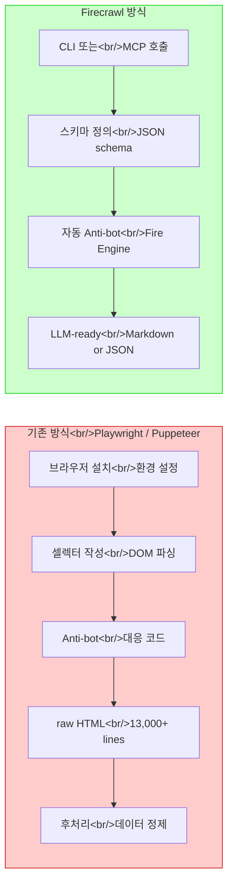

## 개요

AI 코딩 에이전트 시대에 웹 스크래핑은 단순한 데이터 수집을 넘어 경쟁 분석, 리드 발굴, 시장 조사의 핵심 인프라가 되었다. 하지만 Claude Code의 내장 `web fetch`만으로는 JavaScript 렌더링 사이트나 anti-bot 보호가 적용된 페이지를 제대로 처리할 수 없다. Firecrawl은 이 문제를 정면으로 해결하는 도구다. 웹 데이터를 LLM이 바로 소화할 수 있는 마크다운과 구조화된 JSON으로 변환해 주며, Claude Code와 MCP 서버로 매끄럽게 연동된다.

<!--more-->

## Claude Code의 web fetch, 어디가 부족한가

Claude Code에 내장된 `web fetch`는 기본적으로 HTML을 직접 가져오는 방식이다. 이 접근법에는 세 가지 명확한 한계가 있다.

1. **JavaScript 렌더링 실패** — SPA(Single Page Application)나 동적 콘텐츠를 가진 사이트에서 빈 껍데기만 가져온다. SimilarWeb 같은 경쟁 분석 도구에서 통계 데이터를 가져오려 하면 JavaScript로 렌더링되는 수치를 전혀 읽지 못한다.
2. **Anti-bot 차단** — Yellow Pages, Booking.com 등 봇 탐지 시스템이 있는 사이트에서 403 에러가 연속으로 발생한다. 실제 테스트에서 Yellow Pages 플러머 검색 시 web fetch는 반복적인 403 에러로 아무 데이터도 가져오지 못했다.
3. **속도와 토큰 비효율** — Amazon 상품 4개 페이지를 스크래핑할 때, web fetch는 5분 30초가 걸린 반면 Firecrawl은 45초 만에 동일한 작업을 완료했다. raw HTML 13,000줄을 LLM에 던지는 것은 토큰 낭비다.

## Firecrawl이란

[Firecrawl](https://www.firecrawl.dev/)은 웹 데이터를 LLM 친화적인 형식으로 변환해 주는 웹 스크래핑 플랫폼이다. 핵심 특징은 다음과 같다.

- **마크다운 변환**: 웹페이지를 깔끔한 마크다운으로 추출
- **스키마 지원**: 원하는 필드만 정의하면 구조화된 JSON으로 반환
- **Anti-bot 우회**: 자체 Fire Engine으로 봇 탐지 시스템 통과
- **토큰 효율성**: 로컬 파일 시스템 저장 + 필요한 데이터만 추출하여 토큰 사용 최소화
- **오픈소스**: 셀프호스팅 가능 (단, anti-bot 우회와 agent 기능은 유료 전용)

## Firecrawl vs 전통적 스크래핑 비교



| 항목 | Playwright / Puppeteer | Firecrawl |
|------|----------------------|-----------|
| 설치 복잡도 | 브라우저 바이너리 + 드라이버 설정 | `npx firecrawl` 한 줄 |
| Anti-bot | 직접 구현 필요 | Fire Engine 내장 |
| JS 렌더링 | 지원 (headless 브라우저) | 지원 (관리형 샌드박스) |
| 출력 형식 | raw HTML / DOM 객체 | Markdown / 구조화 JSON |
| LLM 연동 | 별도 파이프라인 필요 | MCP 서버로 직접 연결 |
| 토큰 효율 | 낮음 (전체 HTML) | 높음 (스키마 기반 추출) |
| 대규모 크롤링 | 직접 구현 | crawl / map 명령으로 내장 |

## 5가지 핵심 명령어

Firecrawl CLI는 다섯 가지 주요 명령어를 제공한다.

### 1. `scrape` — 단일 페이지 추출

가장 기본적인 명령. URL 하나를 지정하면 해당 페이지의 콘텐츠를 마크다운으로 가져온다.

```bash
npx firecrawl scrape https://www.amazon.com/dp/B0CZJR9KCZ
```

### 2. `search` — 웹 검색 + 스크래핑

URL을 모를 때 사용한다. 키워드로 검색한 뒤 결과 페이지를 자동으로 스크래핑한다.

```bash
npx firecrawl search "2026 best noise cancelling headphones review"
```

### 3. `browse` — 클라우드 브라우저 상호작용

클라우드 브라우저 세션을 열어 클릭, 폼 입력, 스냅샷 촬영 등을 수행한다. Playwright의 Firecrawl 버전이라고 보면 된다.

```bash
npx firecrawl browse https://example.com --action "click login button"
```

### 4. `crawl` — 사이트 전체 크롤링

시작 URL에서 출발해 링크를 따라가며 사이트 전체를 체계적으로 스크래핑한다.

```bash
npx firecrawl crawl https://docs.example.com --limit 100
```

### 5. `map` — 도메인 URL 탐색

도메인 내 모든 URL을 발견하여 사이트맵을 생성한다. crawl 전에 구조를 파악할 때 유용하다.

```bash
npx firecrawl map https://example.com
```

## Claude Code와 MCP 서버 연동

Firecrawl을 Claude Code에서 사용하는 가장 강력한 방법은 MCP(Model Context Protocol) 서버로 연동하는 것이다. 설정 방법은 간단하다.

### 설치

```bash
# Firecrawl CLI 설치
npx firecrawl setup

# Claude Code에서 MCP 서버 추가
claude mcp add firecrawl -- npx -y firecrawl-mcp
```

### 사용 예시

MCP로 연동하면 자연어로 바로 사용할 수 있다.

```
# Claude Code에서 자연어로 요청
"이 Amazon 상품 페이지 5개에서 제품명, 가격, 평점, 리뷰 수를 표로 정리해줘"

# Claude Code가 자동으로 Firecrawl scrape 스킬을 선택하여 실행
```

### 스키마 기반 추출 예시

원하는 데이터 필드를 JSON 스키마로 정의하면 정확히 그 필드만 추출한다.

```json
{
  "type": "object",
  "properties": {
    "product_name": { "type": "string" },
    "price": { "type": "string" },
    "rating": { "type": "number" },
    "review_count": { "type": "integer" },
    "seller": { "type": "string" }
  },
  "required": ["product_name", "price", "rating"]
}
```

이 스키마를 적용하면 Amazon 상품 페이지에서 13,000줄의 HTML 대신 깔끔한 JSON 5줄을 받게 된다.

```json
{
  "product_name": "Sony WH-1000XM5 Wireless Headphones",
  "price": "$278.00",
  "rating": 4.5,
  "review_count": 12847,
  "seller": "Amazon.com"
}
```

## 실전 데모: Amazon 상품 스크래핑

실제 테스트 결과를 비교해 보자.

**테스트 조건**: Amazon 상품 페이지 4개에서 제품 정보 추출

| 항목 | Claude Code (web fetch) | Claude Code + Firecrawl |
|------|------------------------|------------------------|
| 소요 시간 | ~5분 30초 | ~45초 |
| 성공률 | 부분 성공 (HTML 파싱 불안정) | 100% |
| 토큰 사용 | 높음 (raw HTML 전체) | 낮음 (스키마 필드만) |
| 출력 형식 | 비정형 텍스트 | 구조화된 JSON |

**SimilarWeb 테스트** (JavaScript 렌더링 사이트):
- web fetch: 4분 30초 후 타임아웃, 빈 껍데기만 수집
- Firecrawl: 42초, 트래픽 지표/국가별 분류/소셜 미디어 비중까지 완벽 수집

**Yellow Pages 테스트** (anti-bot 보호):
- web fetch: 연속 403 에러, 데이터 0건
- Firecrawl: 53초, 16건의 업체 정보 수집 완료

## 요금제

| 플랜 | 크레딧 | 가격 | 비고 |
|------|--------|------|------|
| **Free** | 500 | 무료 | 1회성, 체험용 |
| **Hobby** | 3,000/월 | $16/월 | 개인 프로젝트 |
| **Standard** | 100,000/월 | $83/월 | 스타트업 |
| **Growth** | 500,000/월 | $333/월 | 대규모 운영 |

오픈소스 셀프호스팅도 가능하지만, 다음 기능은 유료 전용이다:
- Fire Engine (anti-bot 우회)
- Agent 모드
- Browser Interact
- Docker 환경 세팅 필요

## 실전 활용 시나리오

### 경쟁사 분석
SimilarWeb에서 경쟁사 트래픽 데이터를 주기적으로 수집하여 대시보드 구성. web fetch로는 JavaScript 렌더링 때문에 불가능하지만 Firecrawl은 42초면 끝난다.

### 리드 발굴 (Lead Enrichment)
기업 웹사이트를 crawl하여 의사결정자 정보, 기술 스택, 채용 공고 등을 구조화된 데이터로 추출. 50개 기업 사이트를 한 번에 처리 가능.

### 시장 조사
Amazon, 쿠팡 등 이커머스 플랫폼에서 경쟁 제품의 가격/평점/리뷰를 스키마 기반으로 수집. 정기적으로 실행하면 가격 변동 추이 파악 가능.

### 콘텐츠 수집
기술 블로그, 문서 사이트를 crawl하여 RAG(Retrieval-Augmented Generation) 파이프라인의 지식 베이스 구축.

## 인사이트

Firecrawl을 살펴보면서 느낀 점은, 웹 스크래핑의 패러다임이 "브라우저를 직접 조작하는 것"에서 "원하는 데이터의 스키마를 선언하는 것"으로 전환되고 있다는 것이다.

Playwright나 Puppeteer로 셀렉터를 작성하고, anti-bot을 우회하고, HTML을 파싱하는 과정은 결국 **"원하는 데이터를 얻기 위한 수단"**이었다. Firecrawl은 이 수단을 추상화하고, 개발자가 **"무엇을 원하는지"**만 선언하면 나머지를 알아서 처리한다. 이것은 SQL이 파일 시스템 직접 접근을 대체한 것과 비슷한 방향성이다.

다만 무료 크레딧이 500회로 제한되어 있고, 핵심 차별점인 anti-bot 우회가 유료 전용이라는 점은 고려해야 한다. 셀프호스팅 오픈소스 버전은 anti-bot이 빠지므로, 결국 Firecrawl의 진짜 가치는 Fire Engine이라는 독점 기술에 있다. 이 부분이 장기적으로 어떤 가격 구조로 발전할지 지켜볼 필요가 있다.

그래도 MCP 서버 연동으로 Claude Code 안에서 자연어로 웹 스크래핑을 지시할 수 있다는 점은 개발 워크플로우를 확실히 바꿔놓을 잠재력이 있다. 특히 대규모 데이터 수집이 필요한 프로젝트에서는 투자 대비 시간 절약 효과가 명확하다.

---

**참고 영상**
- [Claude Code + Firecrawl = UNLIMITED Web Scraping](https://www.youtube.com/watch?v=phuyYL0L7AA) — Chase AI
- [퍼페티어는 이제 그만! AI 웹 스크래핑 끝판왕 Firecrawl CLI 등장](https://www.youtube.com/watch?v=PHHPJaWbK8Q) — Nova AI Daily
