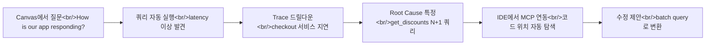

## 개요

이전 포스트에서 [Observability vs Monitoring 비교 분석](/p/observability-vs-monitoring-honeycomb-vs-grafana-비교-분석/)과 [Honeycomb과 Observability 입문 — 오픈소스 대안 비교](/p/honeycomb과-observability-입문-오픈소스-대안-비교/)를 다뤘다. 이번에는 한 단계 더 나아가 Honeycomb이 MCP(Model Context Protocol) Server를 GA로 출시하면서, observability 데이터를 AI 도구에 직접 연결하는 새로운 워크플로우를 살펴본다. Canvas(인앱 AI)와 IDE 연동까지 포함하면, "데이터 확인 -> 원인 분석 -> 코드 수정"이 하나의 흐름으로 이어진다.

<!--more-->

## Honeycomb MCP Server GA - AI와 Observability의 연결

Honeycomb의 MCP Server가 GA(General Availability)로 출시되었다. Austin Parker(Honeycomb MCP 프로덕트 리드)가 소개한 핵심 컨셉은 간단하다: **observability 데이터를 AI 도구가 있는 곳으로 가져온다.**

MCP(Model Context Protocol)는 AI 에이전트가 외부 도구와 통신하는 표준 프로토콜이다. Honeycomb MCP Server를 설정하면 Claude Desktop, Cursor, VS Code Copilot, Claude Code 등 다양한 AI 환경에서 production 데이터에 직접 접근할 수 있다.

MCP Server가 제공하는 주요 기능:

- **환경 정보 조회**: 서비스 맵, dataset, environment 상세 정보
- **쿼리 실행**: 자연어로 Honeycomb 쿼리를 생성하고 실행
- **SLO 모니터링**: SLO 상태 확인 및 보드(Board) 조회
- **트레이스 탐색**: trace ID로 상세 trace waterfall 확인
- **OpenTelemetry 가이드**: 최신 계측(instrumentation) 정보 제공

## Canvas: 인앱 AI 어시스턴트

Canvas는 Honeycomb 내부에 탑재된 AI 어시스턴트다. 대화 인터페이스로 observability 데이터를 탐색한다.

### 작동 방식

1. Canvas를 열고 자연어로 질문한다: "How is our app responding?"
2. Canvas가 적절한 environment와 service를 파악한다
3. 필요한 쿼리를 자동으로 생성하고 실행한다
4. 결과 그래프가 대화 옆에 나란히 표시된다
5. AI가 데이터의 스토리를 서술한다 -- 예: "latency가 증가하고 있다"

Honeycomb이 2016년 설립 당시부터 고수한 원칙이 여기서 빛을 발한다: **어떤 attribute에 대해서든, 어떤 쿼리든 빠르게 실행할 수 있어야 한다.** AI는 분당 수십 개의 쿼리를 연속으로 던질 수 있고, Honeycomb의 빠른 쿼리 엔진이 이를 뒷받침한다.

### AI 결과 검증의 중요성

Canvas가 제공하는 모든 그래프는 클릭 가능하다. 쿼리가 정확한지 직접 확인할 수 있고, trace waterfall로 드릴다운하여 원본 데이터를 검토할 수 있다. AI의 결론을 맹목적으로 신뢰하지 않고 근거를 검증하는 것이 핵심이다.

## IDE 연동: VS Code/Cursor + Copilot

Honeycomb MCP의 진정한 강점은 IDE 안에서 production 데이터와 코드를 동시에 볼 수 있다는 점이다.

### 커스텀 Slash Commands

MCP Server를 설정하면 IDE에서 Honeycomb 전용 slash command를 사용할 수 있다:

- **`/otel-analysis`**: 코드의 OpenTelemetry 계측 상태를 분석한다. AI가 학습 시점의 오래된 정보가 아니라, MCP를 통해 최신 정보를 참조한다.
- **`/otel-instrumentation`**: 계측 가이드를 제공한다. 어떤 span을 추가해야 하는지, 어떤 attribute가 유용한지 안내한다.

이 slash command들의 핵심 가치는 **정보의 최신성**이다. AI 에이전트가 학습한 OpenTelemetry 지식은 시간이 지나면 outdated 된다. MCP는 항상 최신 문서와 best practice를 참조할 수 있는 경로를 제공한다.

## Demo: 새 팀원 온보딩 시나리오

MCP Server GA 발표 데모에서 인상적이었던 것은 온보딩 시나리오다.

Claude Desktop에 Honeycomb MCP를 연결한 뒤, "첫 출근한 신입 개발자가 시스템을 파악할 수 있도록 interactive artifact를 만들어 달라"고 요청했다. 결과물:

- **Dataflow Architecture**: 시스템 간 데이터 흐름을 시각화한 인터랙티브 다이어그램
- **Critical SLOs**: 핵심 SLO 목록과 현재 상태
- **주요 Board 링크**: 모니터링 대시보드로 바로 이동
- **Trace/Query 바로가기**: 클릭 한 번으로 실제 trace나 쿼리로 점프

이 모든 것이 MCP의 `get_environment_details`, `get_service_map`, `get_slos`, `get_boards`, `run_query` 같은 도구를 조합해서 자동으로 생성된다. 수동으로 wiki를 작성하고 스크린샷을 첨부하는 것과는 차원이 다르다.

## Real Debugging Flow: Canvas에서 코드 수정까지

가장 실용적인 시나리오는 end-to-end 디버깅 흐름이다. 데모에서 보여준 실제 플로우를 정리하면:

### 단계별 상세

**1단계 -- Canvas에서 이상 감지**

Canvas에 "How is our app responding?"이라고 질문하면, 여러 서비스의 latency와 error rate를 자동으로 쿼리한다. 이 과정에서 checkout 서비스의 P99 latency가 비정상적으로 높은 것을 발견한다.

**2단계 -- Trace 드릴다운**

Canvas가 느린 trace ID를 찾아 trace waterfall을 로드한다. Checkout 부분을 확대하면 `get_discounts` 함수에서 대부분의 시간이 소비되고 있음을 확인한다.

**3단계 -- IDE로 전환**

여기서 Canvas의 한계가 나온다. 코드를 직접 수정하려면 IDE로 넘어가야 한다. VS Code + Copilot에 Honeycomb MCP를 설정한 상태에서, "Honeycomb에서 checkout latency 문제를 확인하고 코드에서 원인을 찾아라"고 요청한다.

**4단계 -- MCP가 쿼리 실행**

IDE의 AI 에이전트가 MCP를 통해 Honeycomb에 쿼리를 실행한다. 동일한 latency 패턴을 확인하고, trace 데이터에서 `get_discounts`의 N+1 쿼리 패턴을 식별한다.

**5단계 -- 코드 탐색 및 수정 제안**

에이전트가 코드베이스에서 `get_discounts` 함수를 찾고, 반복문 안에서 개별 DB 쿼리를 실행하는 패턴을 발견한다. Batch query로 변환하는 구체적인 수정안을 제시한다.

## MCP의 효율적 통신 방식

Honeycomb MCP는 AI 에이전트와의 통신에서 **토큰 효율성**을 극대화하도록 설계되었다.

일반적으로 API 응답은 JSON 형태로 돌아오지만, Honeycomb MCP는 상황에 따라 다양한 포맷을 조합한다:

| 포맷 | 용도 |
|------|------|
| **Text** | 서술형 설명, 컨텍스트 전달 |
| **CSV** | 표 형태 쿼리 결과 (행/열 데이터) |
| **JSON** | 구조화된 메타데이터 |
| **ASCII Art** | trace waterfall, 간단한 시각화 |

이 혼합 포맷 전략의 목적은 명확하다. LLM이 소비하는 토큰을 최소화하면서 필요한 정보를 최대한 전달하는 것이다. 그래프 이미지를 통째로 보내는 대신 CSV 데이터를 보내면 토큰이 훨씬 적게 들고, AI가 수치를 정확히 파악할 수 있다.

Canvas(인앱)에서는 그래프가 자동으로 렌더링되지만, MCP를 통한 IDE 연동에서는 그래프 대신 쿼리 링크를 제공한다. 필요하면 해당 링크를 클릭해서 Honeycomb UI에서 직접 확인하면 된다.

## OpenTelemetry Instrumentation Guidance

MCP가 단순히 "데이터를 읽는" 도구를 넘어서는 지점이 여기다. Honeycomb은 OpenTelemetry 전문 지식을 MCP를 통해 AI 에이전트에게 제공한다.

실질적으로 이것이 의미하는 바:

- 코드에 어떤 span을 추가해야 하는지 AI가 제안할 때, **Honeycomb의 최신 best practice를 참조**한다
- `otel-instrumentation` slash command를 통해, 사용 중인 언어/프레임워크에 맞는 계측 가이드를 받을 수 있다
- AI 모델의 학습 데이터가 아니라 **실시간으로 업데이트되는 가이드**를 기반으로 조언한다

이는 OpenTelemetry의 빠른 버전 변화를 고려하면 매우 실용적이다. SDK 버전에 따라 API가 달라지는 상황에서 outdated된 정보로 계측하면 오히려 문제를 만든다.

## 인사이트

**Observability의 소비 방식이 바뀌고 있다.** 기존에는 대시보드를 열고, 그래프를 보고, 의심되는 trace를 수동으로 찾았다. Honeycomb Canvas와 MCP는 이 과정을 "질문하면 답이 오는" 형태로 바꾼다.

**IDE 연동이 game changer다.** Production 데이터와 코드가 같은 화면에 있으면 context switching이 사라진다. 데모에서 보여준 N+1 쿼리 디버깅처럼, trace에서 발견한 문제를 바로 코드에서 수정할 수 있다. 이건 Honeycomb 웹 UI만으로는 불가능했던 워크플로우다.

**MCP의 토큰 효율성 설계가 인상적이다.** Text + CSV + JSON + ASCII art를 조합해서 최소 토큰으로 최대 정보를 전달하는 접근은, 다른 MCP 서버 구현에도 참고할 만한 패턴이다. AI 시대에 API 설계는 "사람이 읽기 편한 것"뿐 아니라 "AI가 효율적으로 소비할 수 있는 것"도 고려해야 한다.

**새 팀원 온보딩 시나리오가 현실적이다.** 시스템 아키텍처, SLO 현황, 주요 대시보드를 한 번의 프롬프트로 파악할 수 있다면, 온보딩에 걸리는 시간이 극적으로 줄어든다. 이것은 observability 도구가 "장애 대응 전용"에서 "일상적 개발 도구"로 확장되는 사례다.

---

**참고 자료**

- [Introducing Honeycomb Intelligence MCP Server - Now GA!](https://www.youtube.com/watch?v=i6jhbs-RG6U) -- Honeycomb 공식 GA 발표
- [AI for Observability: Honeycomb Canvas & MCP](https://www.youtube.com/watch?v=UMG-JphuH4M) -- Canvas + MCP 디버깅 데모
