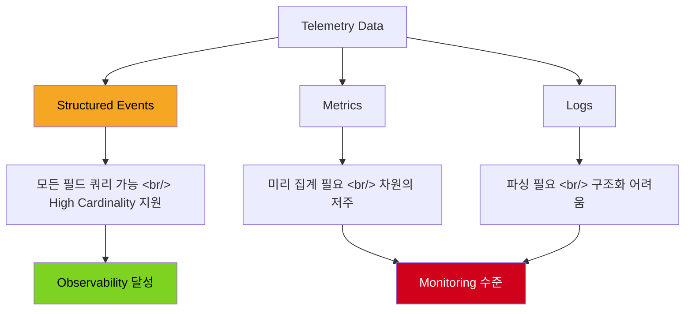
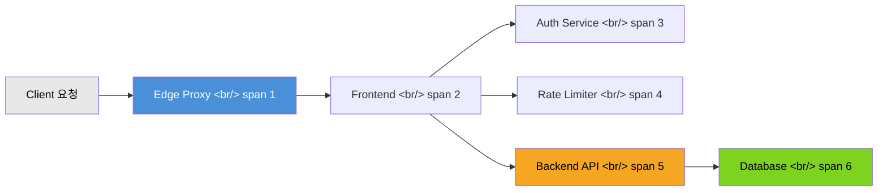

이전 글에서 Observability와 Monitoring의 차이, Honeycomb과 Grafana의 접근 방식을 비교했다. 이번에는 Honeycomb 공식 문서를 깊이 파고들어 observability의 핵심 개념을 정리하고, 셀프호스팅 가능한 오픈소스 대안들을 실무 관점에서 비교해 본다.

> [이전 글: Observability vs Monitoring — Honeycomb vs Grafana](/posts/2026-02-25-observability-honeycomb-vs-grafana/)

<!--more-->

## Observability 핵심 개념

Honeycomb 문서에서 가장 강조하는 정의는 이것이다:

> **Observability is about being able to ask arbitrary questions about your environment without having to know ahead of time what you wanted to ask.**

Monitoring은 이미 알고 있는 문제에 대한 threshold를 설정하고 alert을 받는 것이다. 반면 observability는 **예상하지 못한 질문**을 던질 수 있어야 한다. 마이크로서비스 환경에서 장애의 원인은 무한히 조합될 수 있기 때문에, 미리 정의한 dashboard만으로는 새로운 유형의 문제를 진단할 수 없다.

Observability를 개선하려면 두 가지가 필요하다:

1. **풍부한 런타임 컨텍스트를 포함한 텔레메트리 데이터 수집**
2. **그 데이터를 반복적으로 쿼리하여 인사이트를 발견하는 능력**

## Structured Events vs Metrics vs Logs

Honeycomb의 데이터 모델 핵심은 **structured event**다. Event, metric, log 각각의 차이를 이해하는 것이 observability 입문의 출발점이다.

### Structured Event

Event는 하나의 작업 단위(unit of work)를 완전하게 설명하는 JSON 객체다. HTTP 요청을 받아 처리하고 응답을 돌려주는 전체 과정이 하나의 event가 된다.

```json
{
  "service.name": "retriever",
  "duration_ms": 0.011668,
  "dataset_id": "46829",
  "global.env": "production",
  "global.instance_type": "m6gd.2xlarge",
  "global.memory_inuse": 671497992,
  "trace.trace_id": "845a4de7-...",
  "trace.span_id": "84c82b34..."
}
```

핵심은 **모든 필드가 쿼리 가능**하다는 것이다. `duration_ms`로 느린 요청을 찾고, `instance_type`별로 그룹핑하고, `memory_inuse`와의 상관관계를 한 번에 탐색할 수 있다.

### Pre-aggregated Metrics의 한계

Metrics 방식은 데이터를 미리 집계해서 보낸다:

```json
{
  "time": "4:03 pm",
  "total_hits": 500,
  "avg_duration": 113,
  "p95_duration": 236
}
```

만약 "storage engine cache hit 여부에 따른 latency 차이"를 보고 싶다면? `avg_duration_cache_hit_true`, `p95_duration_cache_hit_true` 같은 조합을 미리 만들어야 한다. 이것이 **차원의 저주(curse of dimensionality)** — 차원이 늘어날수록 필요한 metric 수가 기하급수적으로 증가한다.

### Unstructured Logs의 한계

로그는 사람이 읽기엔 편하지만 쿼리하기 어렵다. "어떤 서비스가 시작하는 데 가장 오래 걸리나?"를 알려면 여러 줄의 timestamp를 파싱하고 빼야 한다. Structured event는 `duration_ms` 필드 하나로 즉시 답할 수 있다.



## Distributed Tracing

Tracing은 분산 시스템의 여러 서비스에서 발생하는 계측(instrumentation)을 하나로 연결하여 크로스 서비스 장애를 파악할 수 있게 해준다. 프록시, 앱, 데이터베이스만 있어도 이미 분산 시스템이다.

### Trace의 동작 원리

**Trace**는 시스템 내 완전한 작업 단위의 이야기를 담는다. 사용자가 페이지를 로드하면 요청이 edge proxy, frontend, auth, rate limiter, backend, DB를 거치게 된다. 이 이야기의 각 부분을 **span**이 담당한다.

Span은 코드의 특정 위치에서 수행되는 하나의 작업 단위를 나타내며, 다음 정보를 포함한다:

- **serviceName** — 해당 span이 속한 서비스
- **name** — span의 역할 (함수명, 메서드명)
- **timestamp**와 **duration** — 시작 시점과 소요 시간
- **traceID** — 이 span이 속한 trace 식별자
- **parentID** — 이 span을 호출한 부모 span



같은 `traceID`를 공유하는 모든 span이 모여 하나의 요청이 전체 시스템을 어떻게 흘렀는지 완전한 그림을 만든다. Span의 duration을 분석하면 정확히 어떤 서비스가 병목인지 파악할 수 있다 — 전통적인 로그나 메트릭만으로는 불가능한 일이다.

## High Cardinality의 중요성

Cardinality란 특정 필드가 가질 수 있는 고유 값의 수를 말한다. `user_id`, `trace_id`, `request_id` 같은 필드는 수백만 개의 고유 값을 가진다 — 이것이 **high cardinality**다.

전통적인 metrics 도구(Prometheus, Graphite 등)는 high cardinality를 잘 처리하지 못한다. Label 조합이 폭발적으로 증가하면 성능이 급격히 저하된다. 하지만 observability에서는 "이 특정 사용자에게 왜 느린가?"처럼 개별 값을 추적해야 하는 질문이 핵심이다.

Honeycomb은 columnar storage 기반으로 high cardinality 데이터를 효율적으로 처리한다. **BubbleUp** 기능은 이상치(outlier)를 자동으로 감지하고, 어떤 필드 조합이 문제와 상관있는지 찾아준다.

## Core Analysis Loop

Honeycomb이 제안하는 디버깅 방법론은 **Core Analysis Loop**다:

1. **관찰(Observe)**: 시스템의 전체 상태를 시각화한다
2. **가설 수립(Hypothesize)**: 이상 패턴을 발견하면 원인에 대한 가설을 세운다
3. **검증(Validate)**: 데이터를 GROUP BY, WHERE로 쪼개어 가설을 검증하거나 기각한다
4. **반복(Iterate)**: 새로운 질문으로 돌아가 반복한다

이것은 "dashboard를 보고 alert를 기다리는" monitoring 방식과 근본적으로 다르다. Query Builder에서 SELECT, WHERE, GROUP BY, ORDER BY, LIMIT, HAVING 절을 조합하여 자유롭게 데이터를 탐색한다.

## Honeycomb Intelligence — AI 기반 분석

Honeycomb Intelligence는 엔지니어가 더 빠르게 조사할 수 있도록 돕는 AI 기능 모음이다. 주요 기능은 다음과 같다:

- **Canvas** — 자연어로 시스템에 대한 질문을 할 수 있는 대화형 조사 도구. 쿼리, 시각화, 설명을 자동으로 생성하여 대화형 디버깅 경험을 제공한다
- **Query Assistant** — 자연어 설명으로 Honeycomb 쿼리를 자동 생성한다. "show me the slowest endpoints grouped by service" 같은 입력이 실행 가능한 쿼리가 된다
- **Hosted MCP Service** — Honeycomb이 Model Context Protocol (MCP) 서버를 제공하여 AI 에이전트와 도구(Claude, Cursor 등)가 Honeycomb 데이터를 직접 쿼리할 수 있다

Honeycomb의 AI 원칙은 어떤 기능이 AI를 사용하는지 투명하게 공개하고, 고객 데이터를 모델 학습에 사용하지 않으며, AI 기능을 선택적으로 사용할 수 있도록 보장한다. 서드파티 AI 제공업체(OpenAI, Anthropic)에 전송되는 데이터는 학습 금지 조항이 포함된 데이터 처리 계약 하에 처리된다.

## OpenTelemetry로 데이터 전송

Honeycomb은 **OpenTelemetry**를 네이티브로 지원한다. 처음 계측을 시작한다면 OpenTelemetry로 시작하는 것을 권장한다.

### 주요 연동 포인트

- **OTLP 프로토콜**: gRPC, HTTP/protobuf, HTTP/JSON을 통한 OTLP 데이터 수신 지원
- **직접 전송**: 간단한 구성에서는 별도 collector 없이 Honeycomb 엔드포인트로 직접 전송 가능
- **Collector 지원**: OpenTelemetry Collector로 레거시 포맷(OpenTracing, Zipkin, Jaeger)을 OTLP로 변환

최소 설정은 환경 변수 두 개면 충분하다:

```bash
export OTEL_EXPORTER_OTLP_ENDPOINT="https://api.honeycomb.io:443"
export OTEL_EXPORTER_OTLP_HEADERS="x-honeycomb-team=YOUR_API_KEY"
```

Go, Python, Java, .NET, Node.js, Ruby 등 다양한 언어의 OpenTelemetry SDK가 제공되며, 각 SDK는 주요 프레임워크에 대한 자동 계측을 지원한다. 최소한의 코드 변경으로 trace와 metric을 수집할 수 있다.

### 레거시 시스템에서의 마이그레이션

이미 Jaeger, Zipkin, OpenTracing으로 계측된 시스템이 있다면, OpenTelemetry Collector가 브릿지 역할을 한다 — 레거시 포맷 데이터를 받아 OTLP로 변환하여 Honeycomb에 전송한다. 전체 재계측 없이 점진적 마이그레이션이 가능하다.

## eBPF와 Observability

**eBPF(extended Berkeley Packet Filter)** 는 Linux 커널을 수정하지 않고 확장 기능을 실행할 수 있는 기술이다. Observability 관점에서 중요한 이유는 **코드 변경 없이 텔레메트리를 수집**할 수 있기 때문이다.

### 동작 원리

- **JIT Compiler**: eBPF 프로그램은 커널 내 JIT 컴파일러로 실행되어 고성능을 보장한다
- **Hook Points**: system call, 함수 진입/종료, kernel tracepoint, network event 등 미리 정의된 hook에 연결된다
- **Kprobes / Uprobes**: 미리 정의된 hook이 없으면 커널 프로브(Kprobes)나 유저 프로브(Uprobes)를 생성하여 거의 모든 지점에 eBPF 프로그램을 부착할 수 있다

### Observability에서의 활용

자동 계측(automatic instrumentation) 도구가 없는 언어(C++, Rust 등)에서 eBPF는 특히 유용하다. 애플리케이션 외부에서 커널 프로브를 통해 네트워크 활동, CPU/메모리 사용률, 네트워크 인터페이스 메트릭 등을 수집할 수 있다.

OpenTelemetry는 현재 **Go 언어용 eBPF 기반 자동 계측 도구**를 개발 중이며, HTTP client/server, gRPC, gorilla/mux 라우터 등을 지원한다. C++과 Rust 지원도 계획되어 있다.

## 오픈소스 대안 비교

Honeycomb은 강력하지만 SaaS 종속성과 비용이 부담될 수 있다. 셀프호스팅 가능한 오픈소스 대안을 살펴보자.

### Jaeger

- **개발사**: Uber
- **백엔드**: Cassandra / Elasticsearch
- **특징**: 스팬(span) 단위 호출 시간/지연 분석이 핵심 강점. Zipkin과 호환되며, OpenTelemetry 네이티브 지원
- **배포**: Kubernetes Helm 차트, Jaeger Operator로 쉬운 배포
- **UI**: 16686 포트에서 서비스별 duration 쿼리, 트레이스 타임라인 시각화

```bash
# All-in-one 실행 (개발/테스트용)
./jaeger-all-in-one --memory-max-table-size=100000

# EKS 배포
kubectl create namespace observability
kubectl apply -f jaeger-operator.yaml
```

### Zipkin

- **개발사**: Twitter
- **백엔드**: Elasticsearch / MySQL
- **특징**: 가볍고 심플한 트레이싱 서버. **Spring Cloud Sleuth**와 네이티브 연동
- **배포**: Docker 한 줄로 실행 가능

```bash
docker run -d -p 9411:9411 openzipkin/zipkin
```

서비스 호출 그래프와 의존성(dependency) 다이어그램을 자동 생성하며, 장애 분석에 유용하다. 다만 OpenTelemetry 지원은 브릿지 방식이라 네이티브에 비해 설정이 더 필요하다.

### SigNoz

- **특징**: **OpenTelemetry 네이티브** 오픈소스 APM. Honeycomb 스타일의 쿼리와 대시보드를 셀프호스팅으로 제공
- **백엔드**: ClickHouse (고성능 columnar DB)
- **장점**: 로그, 메트릭, 트레이스를 **하나의 플랫폼**에서 통합. Honeycomb의 가장 가까운 오픈소스 대안
- **배포**: AWS ECS CloudFormation 템플릿, Kubernetes 풀스택 배포 지원

SigNoz는 OTLP(OpenTelemetry Protocol)을 직접 수신하므로 별도 변환 없이 OpenTelemetry Collector에서 데이터를 보낼 수 있다.

### Pinpoint

- **개발사**: Naver
- **백엔드**: HBase
- **특징**: **대규모 Java 애플리케이션** 트레이싱에 최적화. 바이트코드 계측으로 코드 변경 없이 에이전트 적용
- **강점**: Scatter/Timeline 차트로 호출 흐름과 시간을 상세 분석. 한국 대기업 환경에서 검증된 안정성

```bash
# 에이전트 적용 (JVM 옵션)
java -javaagent:pinpoint-agent.jar \
  -Dpinpoint.agentId=myapp-01 \
  -Dpinpoint.applicationName=my-service \
  -jar my-application.jar
```

## 비교 테이블

| 도구 | 백엔드 | OTel 지원 | K8s 배포 | 핵심 강점 |
|------|--------|-----------|----------|-----------|
| **Honeycomb** | SaaS (AWS) | 네이티브 | N/A (SaaS) | High cardinality 쿼리, BubbleUp, AI 분석 |
| **Jaeger** | ES / Cassandra | 네이티브 | Helm / Operator | 고트래픽 스팬 트레이싱 |
| **Zipkin** | ES / MySQL | 브릿지 | 기본 Deployment | 간단 배포, Spring 연동 |
| **SigNoz** | ClickHouse | 네이티브 | 풀스택 | 올인원 관찰성 (로그+메트릭+트레이스) |
| **Pinpoint** | HBase | 부분 지원 | 지원 | 대규모 Java APM, 바이트코드 계측 |

## Honeycomb 가격 (2026 기준)

| 플랜 | 월 비용 | 이벤트 한도 | 보관 기간 | 대상 |
|------|---------|-------------|-----------|------|
| **Free** | 무료 | 20M/월 | 60일 | 소규모 팀, 테스트 |
| **Pro** | $100~ | 1.5B/월 | 60일 | 성장 팀, SLO 필요 |
| **Enterprise** | 맞춤 | 무제한 | 확장 | 대규모, Private Cloud |

연간 계약 시 15~20% 할인이 적용된다. Free 플랜의 20M 이벤트는 소규모 서비스 검증에 충분하다.

## 인사이트

**Observability의 본질은 도구가 아니라 사고방식의 전환이다.** "어떤 dashboard를 만들까?"가 아니라 "어떤 질문이든 던질 수 있는가?"가 핵심이다. Honeycomb은 이 철학을 structured event와 high cardinality 쿼리로 구현했다.

**Honeycomb Intelligence**의 등장은 업계의 방향을 보여준다 — 자연어로 쿼리를 생성하고 Canvas를 통한 조사 가이드를 제공하는 AI 기반 디버깅. MCP 연동은 AI 에이전트가 프로덕션 텔레메트리를 직접 쿼리할 수 있게 하여 효과적인 observability의 진입 장벽을 더욱 낮춘다.

실무에서의 선택 기준을 정리하면:

- **빠른 시작**: Honeycomb Free 플랜 (20M 이벤트/월)으로 observability 경험을 먼저 쌓고
- **셀프호스팅 올인원**: SigNoz가 Honeycomb에 가장 가까운 오픈소스 대안. ClickHouse 백엔드의 쿼리 성능이 좋고 OTel 네이티브
- **Java 중심 레거시**: Pinpoint가 바이트코드 계측으로 코드 변경 없이 적용 가능
- **이미 Kubernetes에 익숙하다면**: Jaeger + OpenTelemetry Collector 조합이 생태계가 가장 넓음
- **마이그레이션 경로**: OpenTelemetry Collector가 레거시 계측(Jaeger/Zipkin 포맷)을 모든 현대 백엔드로 브릿지하여 점진적 도입이 가능

eBPF는 아직 초기 단계지만, 코드 변경 없는 계측이라는 점에서 Go, C++, Rust 생태계에서 점점 중요해질 기술이다. OpenTelemetry의 eBPF 기반 자동 계측이 성숙하면 observability 도입 비용이 크게 낮아질 것이다.

## 참고 자료

- [Honeycomb Docs: Introduction to Observability](https://docs.honeycomb.io/get-started/basics/observability/introduction)
- [Honeycomb Docs: Events, Metrics, and Logs](https://docs.honeycomb.io/get-started/basics/observability/concepts/events-metrics-logs)
- [Honeycomb Docs: Distributed Tracing](https://docs.honeycomb.io/get-started/basics/observability/concepts/distributed-tracing)
- [Honeycomb Docs: eBPF](https://docs.honeycomb.io/get-started/basics/observability/concepts/ebpf)
- [Honeycomb Docs: Build a Query](https://docs.honeycomb.io/investigate/query/build)
- [Honeycomb Docs: Send Data with OpenTelemetry](https://docs.honeycomb.io/send-data/opentelemetry)
- [Honeycomb Docs: Honeycomb Intelligence](https://docs.honeycomb.io/security-compliance/honeycomb-intelligence)
- [Jaeger - Distributed Tracing](https://www.jaegertracing.io/)
- [Zipkin](https://zipkin.io/)
- [SigNoz - Open Source APM](https://signoz.io/)
- [Pinpoint - Application Performance Management](https://pinpoint-apm.gitbook.io/)
