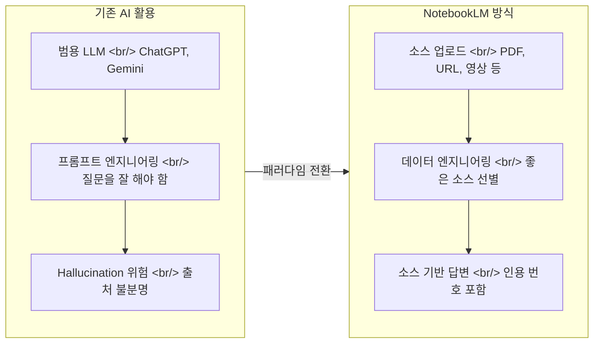

Google NotebookLM은 "코드 없는 RAG"라는 개념을 현실로 만든 도구입니다. 자신의 문서, 영상, URL을 소스로 올리면 그 데이터만을 기반으로 답변하는 커스텀 AI 비서를 만들 수 있습니다. 이 글에서는 오빠두엑셀 채널의 실전 튜토리얼 영상을 바탕으로, 1년 이상 사용 경험에서 나온 12가지 활용법과 데이터 준비 노하우를 상세히 정리합니다.

<!--more-->

## NotebookLM이란 무엇인가

### "코드 없는 RAG" — 자신의 데이터로 만드는 커스텀 AI

RAG(Retrieval-Augmented Generation)는 외부 데이터를 검색해서 LLM의 답변에 근거를 부여하는 기술입니다. 전통적으로 RAG를 구현하려면 문서를 chunking하고, embedding 벡터를 생성하고, 벡터 DB에 저장한 뒤 retrieval 파이프라인을 구축해야 합니다. NotebookLM은 이 모든 과정을 UI 하나로 해결합니다. 사용자는 소스를 업로드하기만 하면 되고, Google이 내부적으로 RAG 파이프라인을 처리합니다.

핵심은 **"내 데이터만을 기반으로 답변한다"**는 점입니다. ChatGPT나 Gemini에게 질문하면 학습 데이터 전체에서 답변을 생성하지만, NotebookLM은 사용자가 업로드한 소스 범위 안에서만 답변합니다. 이것이 바로 hallucination 문제를 구조적으로 해결하는 방식입니다.

### ChatGPT의 Hallucination 문제와 소스 기반 답변

유명한 "세종대왕 맥북 사건"이 좋은 예시입니다. ChatGPT에게 "세종대왕이 맥북을 던진 이유"를 물으면, 실제로는 존재하지 않는 사건임에도 그럴듯한 답변을 생성합니다. 이것이 hallucination입니다. LLM이 학습 데이터에서 패턴을 조합해 사실이 아닌 내용을 자신있게 출력하는 현상이죠.

NotebookLM은 이 문제를 원천적으로 차단합니다. 소스에 없는 내용은 "해당 정보가 소스에 없습니다"라고 답변하며, 모든 답변에 소스 인용 번호가 붙어 있어 출처를 바로 확인할 수 있습니다. 업무 보고서나 논문 리뷰처럼 **정확성이 중요한 작업**에서 이 차이는 결정적입니다.

### 프롬프트 엔지니어링에서 데이터 엔지니어링으로

기존 AI 활용의 핵심은 "어떻게 질문할 것인가", 즉 프롬프트 엔지니어링이었습니다. NotebookLM에서는 패러다임이 바뀝니다. **"어떤 데이터를 넣을 것인가"**가 답변 품질을 결정합니다. 좋은 프롬프트보다 좋은 소스가 더 중요한 세상입니다. 이것을 **데이터 엔지니어링**이라 부를 수 있으며, NotebookLM 활용의 핵심 역량이 됩니다.

## 데이터 준비가 핵심

### 소스 종류

NotebookLM이 지원하는 소스 유형은 다양합니다:

- **텍스트 문서**: Google Docs, 복사-붙여넣기 텍스트
- **PDF 파일**: 논문, 보고서, 계약서 등
- **URL**: 웹페이지, 블로그 글
- **영상**: YouTube 동영상 (자막 기반 분석)
- **이미지**: 스크린샷, 도표 (OCR 기반)
- **오디오**: 녹음 파일, 팟캐스트

특히 YouTube 영상을 소스로 넣으면 자막을 자동으로 추출해서 분석합니다. 1시간짜리 강의 영상도 URL 하나로 소스화할 수 있어, 영상 학습의 효율이 극적으로 올라갑니다.

### Deep Research로 소스 자동 수집

NotebookLM에는 **Deep Research** 기능이 내장되어 있습니다. 특정 주제에 대해 웹을 검색하고, 관련 소스를 자동으로 수집해서 노트북에 추가합니다. 두 가지 모드가 있습니다:

- **빠른 검색**: 키워드 기반으로 빠르게 관련 소스를 찾아줍니다. 간단한 조사에 적합합니다.
- **딥 리서치 모드**: 여러 소스를 교차 분석하며 심층적으로 조사합니다. "2026년 반도체 산업 전망"처럼 복잡한 주제를 조사할 때 유용합니다.

수집된 소스는 노트북에 자동으로 추가되므로, 일일이 URL을 찾아서 넣는 수고를 덜 수 있습니다. 다만 자동 수집된 소스의 신뢰성은 반드시 교차 검증해야 합니다.

### 소스 한도와 관리

- **무료 플랜**: 노트북당 최대 **50개** 소스
- **Pro 플랜**: 노트북당 최대 **300개** 소스

대부분의 업무 용도에서 50개면 충분합니다. 핵심은 소스의 양이 아니라 **질**입니다. 관련 없는 소스가 많으면 오히려 답변 품질이 떨어집니다.

### 데이터 정제 프로세스 (1년+ 사용 경험 기반)

영상의 발표자는 1년 이상 NotebookLM을 사용하면서 체득한 데이터 정제 프로세스를 공유합니다:

1. **주제 명확화**: 노트북 하나에 하나의 주제만 담기. "AI 전반"이 아니라 "2026년 생성형 AI 시장 전망"처럼 구체적으로.
2. **소스 큐레이션**: 신뢰할 수 있는 소스만 선별. 블로그 글보다 논문, 공식 보고서, 1차 자료 우선.
3. **중복 제거**: 같은 내용을 다루는 소스가 여러 개이면 가장 포괄적인 것 하나만 남기기.
4. **노트 활용**: 소스를 넣은 뒤 핵심 내용을 노트로 정리해두면, 이후 질문의 맥락이 더 풍부해집니다.

## 12가지 실전 활용법

### 1. 맞춤형 AI 비서 (업무 매뉴얼 기반)

회사의 업무 매뉴얼, 사내 규정, 표준 운영 절차(SOP)를 소스로 올리면, 해당 조직 전용 AI 비서가 됩니다. 신입 사원이 "출장비 정산 절차가 어떻게 되나요?"라고 물으면, 사내 규정 문서를 기반으로 정확한 절차를 안내합니다.

기존에는 이런 질문에 답하려면 선배에게 묻거나 인트라넷을 뒤져야 했습니다. NotebookLM으로 매뉴얼을 올려두면, 24시간 즉시 답변이 가능한 사내 도우미가 만들어집니다. 특히 반복적으로 동일한 질문을 받는 팀(HR, IT 헬프데스크)에서 효과가 큽니다.

실전 팁으로, 매뉴얼 외에 과거 FAQ나 자주 묻는 질문 모음도 함께 소스로 넣으면, 매뉴얼에 명시되지 않은 엣지 케이스까지 커버할 수 있습니다.

### 2. Deep Research 보고서

"2026년 한국 경제 산업 전망"처럼 복잡한 주제의 보고서를 작성할 때, Deep Research 기능으로 관련 소스를 자동 수집한 뒤 분석을 요청할 수 있습니다. 한국은행 보고서, 산업연구원 자료, 주요 증권사 리포트를 소스로 넣고 "핵심 리스크 요인 3가지를 비교 분석해줘"라고 요청하면, 각 소스의 관점을 인용과 함께 정리해줍니다.

보고서 작성 시간이 수일에서 수 시간으로 단축됩니다. 중요한 것은 NotebookLM이 보고서를 "대신 써주는" 것이 아니라, **분석의 뼈대**를 잡아준다는 점입니다. 최종 판단과 문맥은 여전히 사람의 몫입니다.

### 3. 소스 신뢰성 교차 검증

하나의 주장에 대해 3~5개 소스를 넣고 "이 주장에 대한 각 소스의 입장을 비교해줘"라고 요청하면, 동의/반대/조건부 동의 등으로 분류해서 정리해줍니다. 예를 들어 "AI가 일자리를 줄일 것인가"라는 주제에 대해 맥킨지 보고서, OECD 리포트, 학술 논문을 넣으면 각각의 관점 차이를 한눈에 파악할 수 있습니다.

팩트 체크나 리서치 초기 단계에서 특히 유용합니다. 모든 소스가 동일한 결론을 내리는지, 아니면 상충하는 부분이 있는지 빠르게 파악할 수 있어, 분석의 깊이가 달라집니다.

### 4. 회의록/녹음 분석

회의 녹음 파일이나 자동 생성된 회의록을 소스로 올리면, 단순 요약을 넘어서 **액션 아이템 추출**, **결정 사항 정리**, **미해결 이슈 목록**까지 뽑아줍니다. "이번 회의에서 김 팀장이 맡기로 한 업무를 정리해줘"처럼 구체적인 질문도 가능합니다.

주간 회의가 많은 팀에서는 매주 회의록을 누적해서 넣어두면, "지난 한 달간 결정된 사항 중 아직 완료되지 않은 것"을 추적하는 용도로도 쓸 수 있습니다. 회의 기록이 쌓일수록 노트북의 가치가 올라가는 구조입니다.

### 5. 논문 리뷰 및 비교 분석

관련 논문 여러 편을 소스로 올리고 "각 논문의 연구 방법론과 결론을 비교해줘"라고 요청하면, 체계적인 비교표를 생성합니다. 대학원생이나 연구자에게 literature review 시간을 대폭 줄여줍니다.

특히 유용한 기능은 **인용 추적**입니다. "논문 A의 핵심 주장을 뒷받침하는 근거가 다른 소스에서도 확인되나?"라고 물으면, 교차 검증 결과를 소스 번호와 함께 보여줍니다. 논문 하나를 읽는 것보다 여러 논문의 맥락 속에서 읽는 것이 이해도를 높여줍니다.

### 6. 학습 가이드/퀴즈 자동 생성

교재나 강의 자료를 소스로 올리고 "이 내용을 기반으로 20문항 퀴즈를 만들어줘"라고 요청하면, 객관식/주관식/OX 문제를 자동 생성합니다. 각 문제에는 정답과 해설이 포함되며, 해설은 소스의 어느 부분에서 나왔는지 인용으로 표시됩니다.

시험 준비뿐 아니라 팀 교육 자료 제작에도 활용됩니다. 신규 입사자 온보딩 자료를 소스로 넣고 이해도 확인 퀴즈를 만들면, 교육 담당자의 업무 부담을 크게 줄일 수 있습니다. 학습 가이드 기능은 "이 자료의 핵심 개념 10가지를 뽑아서 각각 한 문단으로 설명해줘"처럼 요약형으로도 활용 가능합니다.

### 7. 오디오 오버뷰 (팟캐스트 형식 변환)

NotebookLM의 시그니처 기능 중 하나입니다. 소스를 업로드하면 두 명의 AI 호스트가 **팟캐스트 형식으로 대화하며 내용을 설명**하는 오디오를 생성합니다. 복잡한 보고서도 출퇴근길에 귀로 들을 수 있는 콘텐츠로 변환됩니다.

영어뿐 아니라 한국어로도 생성이 가능하며, 대화체로 풀어주기 때문에 딱딱한 보고서보다 이해하기 쉽습니다. 팀 전체가 읽어야 하는 긴 문서가 있을 때, 오디오 오버뷰를 생성해서 공유하면 실제 읽는 비율이 올라갑니다.

### 8. 계약서/법률 문서 분석

계약서를 소스로 올리고 "갑에게 불리한 조항을 찾아줘", "위약금 관련 조항을 정리해줘"라고 요청할 수 있습니다. NotebookLM은 소스 내에서만 답변하므로, 존재하지 않는 조항을 만들어내지 않습니다.

비법률 전문가가 계약서를 검토할 때 1차 필터로 활용하기 좋습니다. 물론 최종 법률 검토는 전문가에게 맡겨야 하지만, "어디를 집중적으로 봐야 하는지" 파악하는 데 걸리는 시간을 절약합니다. 여러 계약서를 동시에 올려서 조건 비교도 가능합니다.

### 9. 경쟁사 분석 매트릭스

경쟁사 IR 자료, 뉴스 기사, 산업 보고서를 소스로 넣고 "경쟁사 A, B, C의 매출, 주력 제품, 시장 점유율을 비교 매트릭스로 정리해줘"라고 요청하면 구조화된 비교표를 생성합니다.

사업 기획이나 전략 회의 준비에 유용합니다. 특히 해외 경쟁사 자료를 영문 그대로 넣어도 한국어로 분석 결과를 받을 수 있어, 영문 보고서를 일일이 번역하지 않아도 됩니다. 분기마다 소스를 업데이트하면 경쟁 환경 변화를 추적하는 대시보드 역할도 합니다.

### 10. 이력서/자기소개서 작성

채용 공고와 자신의 경력 기술서를 함께 소스로 올리면, "이 공고에 맞는 자기소개서 초안을 작성해줘"라고 요청할 수 있습니다. 소스 기반이므로 존재하지 않는 경력을 만들어내지 않고, 실제 경험을 공고의 요구사항에 맞게 재구성합니다.

여러 채용 공고를 동시에 올려서 "A 회사와 B 회사 공고에서 공통으로 요구하는 역량"을 분석하는 것도 가능합니다. 커리어 전환을 준비할 때, 기존 경력과 새 분야의 접점을 찾는 데도 도움이 됩니다.

### 11. 블로그/콘텐츠 기획

콘텐츠 제작자에게 NotebookLM은 리서치 어시스턴트 역할을 합니다. 참고할 자료, 경쟁 콘텐츠, 키워드 리서치 결과를 소스로 넣고 "이 주제로 블로그 글의 목차를 잡아줘"라고 요청하면, 소스에 기반한 구조화된 아웃라인을 받을 수 있습니다.

핵심은 "내가 넣은 자료의 범위 안에서" 기획이 나온다는 점입니다. ChatGPT로 콘텐츠 기획을 하면 일반적인 내용이 나오지만, NotebookLM은 사용자가 수집한 특정 자료들을 기반으로 차별화된 관점을 제안합니다. SEO 분석 자료와 함께 넣으면 검색 의도에 맞는 콘텐츠 구조를 잡을 수도 있습니다.

### 12. 프로젝트 문서화

프로젝트의 기획서, 회의록, 기술 문서, 이메일 스레드를 모아서 소스로 올리면, 프로젝트 전체 맥락을 이해하는 AI가 만들어집니다. "이 프로젝트의 주요 마일스톤과 현재 진행 상황을 정리해줘"라고 요청하면, 흩어져 있던 정보를 통합해서 보여줍니다.

팀원 교체 시 인수인계 문서 생성, 프로젝트 회고 자료 정리, 스테이크홀더 보고용 요약 등 다양한 형태의 산출물을 만들 수 있습니다. 개발 팀에서는 PRD, 기술 스펙, API 문서를 넣어서 프로젝트 컨텍스트를 한 곳에 모아두는 용도로도 활용합니다.

## 무료 vs Pro 비교

### 무료로도 충분한 이유

NotebookLM의 무료 플랜은 놀랍도록 관대합니다. 핵심 기능인 소스 기반 질의응답, 오디오 오버뷰, 노트 생성이 모두 무료로 제공됩니다. 소스 50개 한도도 하나의 프로젝트나 주제를 다루기에 충분한 양입니다. 개인 사용자나 소규모 팀이라면 무료 플랜만으로 위 12가지 활용법을 모두 실행할 수 있습니다.

### Pro에서 추가되는 기능

Google One AI Premium 또는 Workspace 요금제에 포함되는 Pro 기능:

| 항목 | 무료 | Pro |
|------|------|-----|
| 노트북당 소스 수 | 50개 | 300개 |
| 오디오 오버뷰 | 기본 | 커스텀 지시 가능 |
| Deep Research | 제한적 | 확장 사용 |
| 응답 품질 | Gemini 기본 | Gemini 고급 모델 |
| 팀 공유 | 제한적 | 팀 협업 기능 |

### 실전 시나리오: 2026년 경제 산업 전망 보고서 만들기

영상에서 시연된 예시 흐름입니다:

1. Deep Research로 "2026년 한국 경제 전망" 관련 소스 자동 수집
2. 수집된 소스 중 신뢰도 높은 것만 선별 (한국은행, KDI, 주요 증권사)
3. "핵심 경제 지표별 전망을 비교 분석해줘" 질의
4. 산업별(반도체, 자동차, 바이오) 세부 분석 요청
5. 오디오 오버뷰로 팟캐스트 형식 요약 생성
6. 최종 보고서 초안 작성 요청

이 전체 과정이 **2~3시간** 안에 완료됩니다. 동일한 작업을 수동으로 하면 2~3일은 걸릴 분량입니다.

## 개발자 관점에서의 NotebookLM

### RAG와의 비교: Chunking/Embedding 없이 동일 효과

개발자 입장에서 NotebookLM의 가치를 정확히 이해하려면, 직접 RAG 파이프라인을 구축해본 경험이 있으면 좋습니다. 일반적인 RAG 구현에는 다음 단계가 필요합니다:

1. 문서 로드 및 전처리
2. 텍스트 chunking (overlap 포함)
3. Embedding 모델로 벡터 변환
4. 벡터 DB (Pinecone, Chroma 등) 저장
5. 쿼리 시 similarity search
6. 검색된 chunk + 원본 질문 → LLM 프롬프트 조합
7. 답변 생성 및 후처리

NotebookLM은 이 7단계를 **소스 업로드 → 질문** 2단계로 압축합니다. 개발자가 chunking 전략을 고민할 필요도, embedding 모델을 선택할 필요도, 벡터 DB를 운영할 필요도 없습니다. Google이 내부적으로 최적화된 파이프라인을 돌려주기 때문입니다.

### 비개발자에게 RAG를 민주화한 도구

NotebookLM의 진짜 혁신은 기술적 탁월함이 아니라 **접근성**입니다. 마케터, 기획자, 연구자 등 코드를 모르는 사람도 자신의 데이터로 RAG 수준의 AI를 만들 수 있게 되었습니다. 이전에는 "우리 회사 문서를 학습한 AI 챗봇"을 만들려면 개발팀에 요청해야 했지만, 이제 누구나 5분 안에 만들 수 있습니다.

이것은 스프레드시트가 데이터 분석을 민주화한 것과 같은 맥락입니다. 전문 도구가 필요했던 작업을 누구나 할 수 있게 만드는 것, 그것이 NotebookLM이 AI 생태계에서 차지하는 위치입니다.

### 프로젝트 문서 관리 도구로서의 가능성

개발 팀에서 NotebookLM을 프로젝트 문서 허브로 활용하는 시나리오도 흥미롭습니다. PRD, 기술 스펙, API 문서, 아키텍처 결정 기록(ADR)을 소스로 올려두면, 새로 합류한 팀원이 "이 프로젝트에서 Redis를 선택한 이유가 뭐야?"라고 물었을 때 관련 ADR을 인용하며 답변해줍니다.

다만 한계도 있습니다. NotebookLM은 코드 자체를 소스로 넣기에는 적합하지 않고, 실시간 동기화도 되지 않습니다. 문서 기반 프로젝트 컨텍스트 관리 도구로서의 가능성은 크지만, Codebase 분석 도구(Cursor, Claude Code 등)와는 역할이 다릅니다.

## 인사이트

NotebookLM을 사용하면서 느끼는 가장 큰 전환은 **AI와의 상호작용 모델** 자체가 바뀐다는 점입니다. 범용 AI에게 "잘 질문하는 법"을 연구하던 시대에서, **"좋은 데이터를 큐레이션하는 법"**이 핵심 역량이 되는 시대로 이동하고 있습니다.

이 변화에는 중요한 함의가 있습니다. 프롬프트 엔지니어링은 진입 장벽이 높습니다. 좋은 프롬프트를 쓰려면 LLM의 작동 방식을 어느 정도 이해해야 하기 때문입니다. 반면 데이터 큐레이션은 도메인 전문가의 기존 역량과 직결됩니다. 회계사는 어떤 재무 문서가 중요한지 알고, 연구자는 어떤 논문이 핵심인지 압니다. NotebookLM은 이 도메인 지식을 AI 활용 역량으로 직접 전환해줍니다.

개발자 관점에서 한 가지 더 주목할 점은, NotebookLM이 보여주는 것이 **RAG의 최종 형태가 아니라 시작점**이라는 것입니다. 현재는 소스를 수동으로 올려야 하지만, 향후 실시간 데이터 소스 연동, API 기반 자동 업데이트, 팀 단위 지식 그래프 구축 등으로 발전할 가능성이 큽니다. Google이 Gemini 생태계의 핵심 접점으로 NotebookLM을 포지셔닝하고 있다는 점에서, 이 도구의 진화를 계속 추적할 가치가 있습니다.

---

> **출처**: [직장인이라면 지금 당장 써야 할 무료 AI | 노트북LM 실전 활용법 12가지 (최신 가이드)](https://www.youtube.com/watch?v=eeJz8HAyTk0) — 오빠두엑셀
