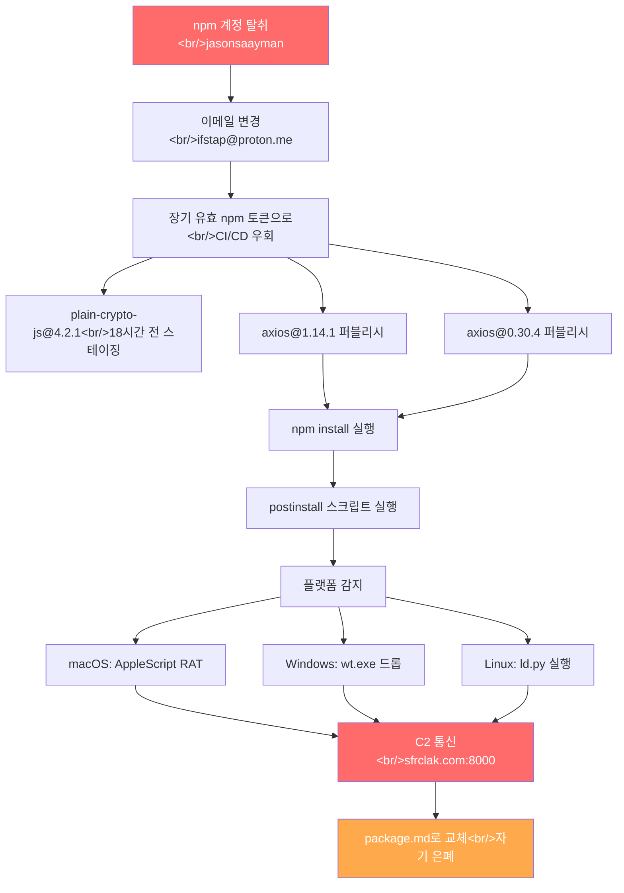

2026년 3월 마지막 주, 오픈소스 생태계에 연쇄 공급망 공격이 터졌습니다. 주간 1억 다운로드의 axios가 npm에서 감염되고, 월간 9,700만 다운로드의 LiteLLM이 PyPI에서 뚫렸으며, Claude Code의 소스 코드가 npm `.map` 파일을 통해 유출되었습니다. 이 글에서는 각 사건의 기술적 세부사항과 공통 패턴, 그리고 실무 대응법을 정리합니다.

<!--more-->

## 1. axios 공급망 공격 (2026-03-31)

### 공격 경위

axios 리드 메인테이너 **jasonsaayman**의 npm 계정이 탈취되었습니다. 공격자는 계정 이메일을 ProtonMail 주소(`ifstap@proton.me`)로 변경한 뒤, **장기 유효 npm 토큰**을 이용해 GitHub Actions CI/CD를 완전히 우회하고 npm CLI로 직접 퍼블리시했습니다.

두 릴리스 브랜치(1.x, 0.x)가 **39분 이내**에 동시 감염되었습니다:

| 감염 버전 | 안전 버전 |
|-----------|-----------|
| `axios@1.14.1` | `axios@1.14.0` |
| `axios@0.30.4` | `axios@0.30.3` |

악성 의존성 `plain-crypto-js@4.2.1`은 공격 **18시간 전**에 npm 계정 `nrwise`(`nrwise@proton.me`)로 미리 스테이징되어 있었습니다. 3개 OS용 페이로드가 사전 빌드된 치밀한 공격이었습니다.

### 악성 동작

감염된 axios 버전은 `plain-crypto-js@4.2.1`이라는 가짜 의존성을 주입합니다. 이 패키지는 axios 소스 어디에서도 import되지 않으며, 유일한 목적은 `postinstall` 스크립트를 통해 **크로스플랫폼 RAT**(원격 접근 트로이목마)를 배포하는 것입니다.

#### 플랫폼별 페이로드

| OS | 동작 | 흔적 파일 |
|----|------|-----------|
| macOS | AppleScript로 C2 서버에서 트로이목마 다운로드 | `/Library/Caches/com.apple.act.mond` |
| Windows | ProgramData에 실행 파일 드롭 | `%PROGRAMDATA%\wt.exe` |
| Linux | Python 스크립트 실행 | `/tmp/ld.py` |

#### 자기 은폐 메커니즘

실행 후 악성코드가 스스로를 삭제하고, `package.json`을 미리 준비해둔 깨끗한 버전(`package.md`)으로 교체하여 포렌식 탐지를 회피합니다. 감염 후 `node_modules`를 열어봐도 정상적으로 보이도록 설계되어 있었습니다.

### 공격 흐름 다이어그램



### 침해 지표 (IOC)

| 항목 | 값 |
|------|-----|
| C2 도메인 | `sfrclak.com` |
| C2 IP | `142.11.206.73` |
| C2 포트 | `8000` |
| 악성 npm 계정 | `nrwise` (`nrwise@proton.me`) |
| 악성 패키지 | `plain-crypto-js@4.2.1` |
| 탈취된 계정 이메일 | `ifstap@proton.me` |

### 추가 감염 패키지

동일 악성코드를 배포하는 추가 패키지도 확인되었습니다:

- `@shadanai/openclaw` (버전 2026.3.28-2, 2026.3.28-3, 2026.3.31-1, 2026.3.31-2)
- `@qqbrowser/openclaw-qbot@0.0.130` (변조된 `axios@1.14.1`을 `node_modules`에 포함)

### 사건 대응 경과

GitHub issue [axios/axios#10604](https://github.com/axios/axios/issues/10604)에서 실시간으로 상황이 공유되었습니다. 다른 협력자 DigitalBrainJS는 jasonsaayman의 권한이 더 높아 직접 대응이 불가능한 상황이었으며, npm 관리팀에 전체 토큰 폐기를 요청한 뒤에야 상황이 수습되었습니다.

---

## 2. LiteLLM 공급망 공격 (2026-03-24)

### 배경: TeamPCP 연쇄 공격

이 사건은 **TeamPCP** 해킹 그룹이 벌인 연쇄 공급망 공격 캠페인의 일부였습니다. 시작점은 보안 스캐너 **Trivy**였습니다.

| 날짜 | 대상 |
|------|------|
| 2026-02-28 | Trivy 저장소 초기 침투 |
| 2026-03-19 | Trivy GitHub Actions 태그 76개 변조 |
| 2026-03-20 | npm 패키지 28개 이상 탈취 |
| 2026-03-21 | Checkmarx KICS GitHub Action 침해 |
| **2026-03-24** | **LiteLLM PyPI 패키지 침해** |

LiteLLM은 CI/CD 보안 스캔에 Trivy를 **버전 고정 없이** 사용하고 있었고, 변조된 Trivy가 실행되면서 PyPI 배포 토큰이 공격자에게 넘어갔습니다.

### 공격 방식

공격자는 탈취한 PyPI 토큰으로 `litellm` v1.82.7(10:39 UTC)과 v1.82.8(10:52 UTC)을 직접 업로드했습니다.

핵심 공격 벡터는 `.pth` 파일이었습니다. Python의 `.pth` 파일은 `site-packages`에 위치하면 **Python 인터프리터 시작 시 자동 실행**되는 특성이 있어, `import litellm` 없이도 해당 환경에서 Python을 실행하기만 하면 악성 코드가 동작합니다.

```python
# litellm_init.pth (34,628 bytes) - 한 줄짜리 코드
import os, subprocess, sys; subprocess.Popen([sys.executable, "-c", "import base64; exec(base64.b64decode('...'))"])
```

디코딩된 페이로드는 **332줄짜리 인증 정보 수집 스크립트**로, 다음을 수집했습니다:

- SSH 키 (RSA, Ed25519, ECDSA, DSA 등 전 유형)
- AWS/GCP/Azure 클라우드 인증 정보 (인스턴스 메타데이터 포함)
- 쿠버네티스 서비스 계정 토큰 및 시크릿
- PostgreSQL, MySQL, Redis, MongoDB 설정 파일
- 비트코인, 이더리움, 솔라나 등 암호화폐 지갑
- `.bash_history`, `.zsh_history` 등 셸 히스토리

수집된 데이터는 AES-256-CBC + RSA-4096으로 이중 암호화되어 `https://models.litellm.cloud/`로 전송되었습니다. 이 도메인은 공격 하루 전에 등록된 사칭 도메인이었습니다.

### 피해 규모

- **월간 다운로드**: ~9,700만 건 (하루 ~340만 건)
- **PyPI 노출 시간**: 약 3시간
- **클라우드 환경 존재율**: ~36% (Wiz Research 분석)
- 영향받은 하류 프로젝트: DSPy(스탠퍼드), CrewAI, Google ADK, browser-use 등

### 발각 경위

공교롭게도 **공격자의 버그**로 발각되었습니다. `.pth` 파일이 Python 시작 시마다 자식 프로세스를 생성하고, 그 자식이 다시 `.pth`를 실행하는 **포크 폭탄** 구조가 되어 메모리가 급격히 고갈되었습니다. FutureSearch.ai의 Callum McMahon이 이 이상 현상을 발견하고 이슈를 등록했으나, 공격자는 봇넷 73개를 동원해 102초간 스팸 댓글 88개를 쏟아부어 이슈를 묻으려 시도했습니다.

Andrej Karpathy는 이 사건을 **"software horror"**라고 평했습니다.

### LiteLLM 감염 확인 방법

```bash
# 설치된 버전 확인 — 1.82.7 또는 1.82.8이면 감염
pip show litellm | grep Version

# .pth 파일 존재 여부
find / -name "litellm_init.pth" 2>/dev/null

# 백도어 확인
ls ~/.config/sysmon/sysmon.py 2>/dev/null
ls ~/.config/systemd/user/sysmon.service 2>/dev/null

# Kubernetes 환경
kubectl get pods -n kube-system | grep node-setup
```

---

## 3. Claude Code 소스 유출

같은 시기에 npm 보안과 관련된 또 다른 사건이 보고되었습니다. Anthropic의 **Claude Code CLI** 소스 코드가 npm 레지스트리에 포함된 `.map` 파일(소스맵)을 통해 **전체 복원 가능한 형태로 유출**되었습니다.

이 사건은 악의적 공격은 아니었지만, npm 패키지 배포 시 `.map` 파일이 포함되면 난독화/번들링된 코드의 원본 소스가 그대로 노출될 수 있다는 점을 보여주는 사례입니다. `.npmignore`나 `files` 필드 설정의 중요성을 다시 한번 상기시켜 줍니다.

---

## 4. 공통 교훈과 대응

### 세 사건의 공통 패턴

세 사건 모두 **패키지 레지스트리(npm/PyPI)에 대한 신뢰**를 악용한 공격입니다:

| 패턴 | axios | LiteLLM | Claude Code |
|------|-------|---------|-------------|
| 공격 경로 | npm 계정 탈취 | PyPI 토큰 탈취 (via Trivy) | 소스맵 미제거 |
| 레지스트리 | npm | PyPI | npm |
| CI/CD 우회 | 직접 퍼블리시 | 직접 퍼블리시 | N/A |
| 악성 동작 | postinstall RAT | .pth 자동실행 | 소스 노출 |
| 은폐 시도 | package.md 교체 | 봇넷 스팸 | 없음 |

### 즉시 대응 체크리스트

#### npm (axios) 대응

```bash
# 1. 감염 버전 확인
npm ls axios

# 2. 안전 버전으로 고정
npm install axios@1.14.0

# 3. lockfile 커밋
git add package-lock.json && git commit -m "fix: pin axios to safe version"

# 4. 보안 감사
npm audit

# 5. IOC 네트워크 확인
# sfrclak.com 또는 142.11.206.73으로의 아웃바운드 연결 확인
```

#### PyPI (LiteLLM) 대응

```bash
# 1. 안전 버전으로 고정
pip install "litellm<=1.82.6"

# 2. 감염 시 시크릿 전체 로테이션
# SSH 키, AWS/GCP/Azure 인증 정보, DB 비밀번호, API 키 전부 교체
```

### 장기 방어 조치

1. **버전 핀 고정**: `^`이나 `~` 대신 정확한 버전 사용. lockfile은 반드시 커밋.
2. **postinstall 스크립트 차단**: CI/CD에서 `npm install --ignore-scripts` 적용 고려.
3. **MFA 필수화**: npm/PyPI 메인테이너 계정에 TOTP 기반 2FA 활성화.
4. **토큰 수명 관리**: 장기 유효 토큰 대신 OIDC 기반 단기 토큰 사용. 정기적으로 로테이션.
5. **CI/CD 도구 버전 고정**: LiteLLM이 Trivy를 버전 고정 없이 쓴 것이 화근. 보안 스캐너도 예외 아님.
6. **소스맵 제거**: 프로덕션 npm 패키지에 `.map` 파일 포함 여부 확인.
7. **의존성 모니터링**: Socket, Snyk, `npm audit` 등으로 공급망 지속 감시.

---

## 인사이트

일주일 사이에 npm과 PyPI에서 동시다발적으로 터진 이 사건들은 몇 가지 불편한 진실을 드러냅니다.

**첫째, 메인테이너가 단일 실패점(SPOF)이다.** axios의 경우 한 명의 계정이 뚫리자 두 릴리스 브랜치가 39분 만에 감염되었고, 다른 협력자는 권한이 부족해 아무것도 할 수 없었습니다. npm/PyPI의 OIDC 기반 퍼블리시가 아직 널리 채택되지 않은 현실에서, 장기 유효 토큰은 시한폭탄입니다.

**둘째, 보안 도구도 공격 벡터가 된다.** LiteLLM 사건에서 보안 스캐너 Trivy가 오히려 공격의 진입점이 되었습니다. CI/CD 파이프라인에서 `apt-get install -y trivy`처럼 버전 고정 없이 도구를 설치하는 패턴은, 편의성을 위해 보안을 포기하는 것과 같습니다.

**셋째, 공격자는 점점 정교해지고 있다.** axios 공격에서 18시간 전 페이로드 스테이징과 자기 은폐 메커니즘, LiteLLM 공격에서 봇넷을 동원한 이슈 은폐 시도와 AI 에이전트를 활용한 취약점 스캐닝까지 — 공급망 공격이 산업화되고 있습니다.

**결론적으로**, `npm install`이나 `pip install` 한 줄이 실행되는 순간 우리는 수천 명의 메인테이너를 신뢰하는 것입니다. lockfile 커밋, 버전 핀 고정, `--ignore-scripts`, 토큰 로테이션 같은 기본적인 위생 조치가 그 어느 때보다 중요해졌습니다.
