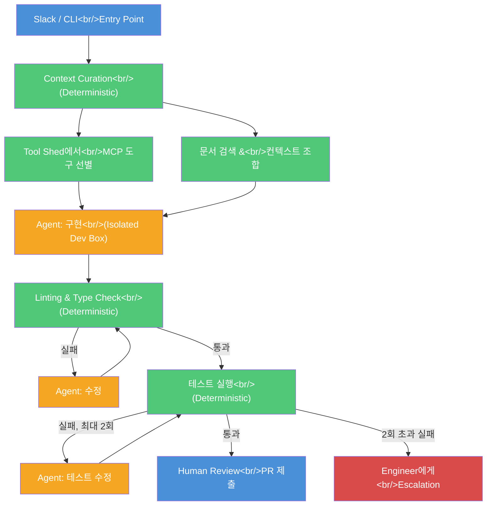
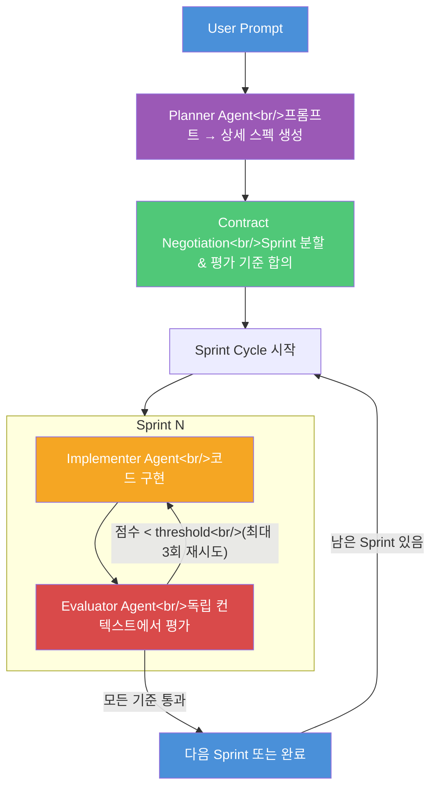

Stripe가 매주 1,300개 이상의 PR을 AI 코딩 에이전트로 작성하고 있다는 사실이 공개되었다. 사람은 코드를 한 줄도 작성하지 않고 리뷰만 담당한다. 동시에, Anthropic의 연구에서 영감을 받은 **적대적 개발(Adversarial Development)** 기법이 코딩 에이전트의 신뢰성을 극적으로 끌어올리고 있다. 이 글에서는 Stripe Minions의 내부 구조와 적대적 개발 아키텍처를 분석하고, 직접 구축하는 방법까지 다룬다.

<!--more-->

## Stripe Minions — 주당 1,300+ PR의 비밀

### 왜 Stripe인가

Stripe는 코딩 에이전트를 운영하기에 가장 까다로운 환경 중 하나다.

- **Ruby 백엔드** — LLM에게 익숙하지 않은 uncommon stack
- **방대한 자체 라이브러리** — 오픈소스가 아닌 homegrown 코드베이스
- **연간 $1T 이상의 결제 처리량** — 코드 한 줄의 오류가 치명적

이런 환경에서 AI가 작성한 PR이 매주 1,300개 이상 머지되고 있다는 것은, 워크플로우의 신뢰성이 그만큼 높다는 의미다. Stripe의 3,400명 이상 엔지니어가 주당 8,000개 PR을 올리는 것 중 일부지만, 그 비중은 빠르게 성장 중이다.

### Structured Workflow의 핵심 원리

Stripe Minions의 핵심은 **에이전트가 시스템을 제어하는 것이 아니라, 시스템이 에이전트를 제어**한다는 점이다.

일반적인 AI 코딩 워크플로우에서는 에이전트가 계획, 구현, 검증을 모두 담당한다. 문제는 에이전트가 우리가 원하는 검증을 반드시 수행한다는 보장이 없다는 것이다. Stripe는 이를 해결하기 위해 **deterministic node**와 **agent node**를 조합한 blueprint 기반 워크플로우를 만들었다.

> "In our experience, writing code to deterministically accomplish small decisions we can anticipate — like we always want to lint changes at the end of a run — is far more reliable than asking an agent to do it."

**녹색 = Deterministic Node**, **주황 = Agent Node**로, 에이전트는 워크플로우의 일부에서만 동작한다.

### Context Curation — 500개 MCP 도구에서 필요한 것만

Stripe는 내부 시스템과 SaaS 플랫폼을 연결하는 **Tool Shed**라는 단일 MCP 서버를 운영한다. 약 500개의 MCP 도구가 등록되어 있지만, 에이전트에게 전부 주면 오히려 혼란을 일으킨다.

워크플로우의 첫 번째 deterministic node에서 요청을 분석한 뒤:

1. 관련 문서와 티켓을 검색해서 컨텍스트를 조합
2. 필요한 MCP 도구의 **subset만 선별**하여 에이전트에게 전달

이 과정이 에이전트가 아닌 코드로 처리된다는 점이 핵심이다.

### Isolated Dev Box — Cattle, Not Pets

모든 Minion 실행은 **격리된 AWS EC2 인스턴스**에서 이루어진다. Stripe 코드베이스, lint 캐시 등이 미리 로드되어 빠르게 시작되며, 실행이 끝나면 바로 폐기된다.

- Work tree나 로컬 컨테이너 방식 대비 **권한 관리와 확장성**이 우수
- 한 엔지니어가 동시에 여러 Minion을 병렬 실행 가능
- 3백만 개 이상의 테스트 중 **관련 subset만 선별**하여 실행

테스트 실패 시 에이전트가 최대 2회 수정을 시도하고, 그래도 실패하면 사람에게 에스컬레이션한다. **무한 루프 방지**가 설계에 내장되어 있다.

## 다른 기업들의 움직임

Stripe만이 아니다. 주요 테크 기업들이 비슷한 structured workflow engine을 구축하고 있다.

| 기업 | 도구 | 특징 |
|------|------|------|
| **Shopify** | Roast | 오픈소스로 공개, structured AI workflow engine |
| **Airbnb** | 내부 도구 | 테스트 마이그레이션에 특화 |
| **AWS** | 내부 도구 | 블로그 포스트를 통해 일부 공개 |

공통점은 모두 **에이전트에게 전체를 맡기지 않고, 결정론적 단계와 에이전트 단계를 명확히 분리**한다는 것이다.

## 적대적 개발(Adversarial Development) — 에이전트가 논쟁할 때

### Sycophancy 문제 — 더 강해질수록 더 나빠진다

AI의 가장 큰 문제 중 하나는 **sycophancy(아첨)**다. LLM은 사용자의 의견에 동의하고, 자기 자신의 결과물도 과대평가하는 경향이 있다. 문제는 모델이 강력해질수록 이 현상이 **더 심해진다**는 점이다.

코딩 에이전트에서 이것은 치명적이다:

- 에이전트가 자신이 작성한 코드를 스스로 평가하면 → **"학생이 자기 숙제를 채점하는 것"**
- 몇 가지 사소한 문제만 지적하며 리뷰가 합격한 것처럼 보이게 함
- 진짜 심각한 문제는 은폐됨

### 해결책: 별도의 Sparring Partner

GAN(Generative Adversarial Network)에서 영감을 받은 접근법이다. GAN에서 Generator가 이미지를 만들고 Discriminator가 진위를 판별하듯이, 코딩 에이전트도 **구현자(Implementer)**와 **평가자(Evaluator)**를 분리한다.

핵심은 평가자가 **완전히 별도의 컨텍스트 세션**을 가진다는 것이다. 구현 과정에서 축적된 bias가 없기 때문에 진짜 객관적인 평가가 가능하다.

### 아키텍처 상세

**1단계: Planner Agent**
- 사용자의 간단한 프롬프트를 받아 상세한 Product Specification으로 확장
- 기술 스택, 기능 요구사항, 구조까지 정의

**2단계: Contract Negotiation**
- Implementer와 Evaluator가 **사전에 합의**
- 스펙을 여러 Sprint로 분할
- 각 Sprint별 평가 기준(criteria)과 threshold(1~10점) 설정
- "적대적이지만 공정한" 규칙을 먼저 정함

**3단계: Sprint Cycle**
- **Implementer**: 합의된 Sprint의 기능을 구현
- **Evaluator**: 독립된 컨텍스트에서 각 criteria를 1~10점으로 채점
- Threshold 미달 시 Implementer에게 피드백과 함께 재시도 요청 (최대 3회)
- 모든 criteria 통과 시 다음 Sprint로 진행

### Cross-Model 평가도 가능

흥미로운 점은 Implementer와 Evaluator에 **서로 다른 모델**을 사용할 수 있다는 것이다.

- Claude가 구현 → Codex가 평가
- Codex가 구현 → Claude가 평가

서로 다른 모델의 bias가 다르기 때문에, cross-evaluation은 단일 모델의 sycophancy 문제를 더 효과적으로 해소할 수 있다. 이 접근법은 Anthropic의 multi-agent evaluation 연구에서 직접적으로 영감을 받은 것이다.

## 직접 Structured Workflow 구축하기

Stripe 규모가 아니더라도 핵심 원리는 동일하게 적용할 수 있다.

### 설계 원칙

1. **예측 가능한 작업은 deterministic하게** — linting, type checking, 테스트 실행은 코드로 강제
2. **에이전트는 창의적 작업에만** — 구현, 버그 수정 등 판단이 필요한 부분
3. **재시도 횟수 제한** — 무한 루프 방지를 위해 최대 재시도 횟수를 설정하고 초과 시 에스컬레이션
4. **컨텍스트를 사전에 큐레이션** — 에이전트에게 모든 도구를 주지 말고, 작업에 필요한 subset만 전달
5. **격리된 실행 환경** — 프로덕션 코드에 영향을 주지 않는 sandbox에서 실행

### 적대적 개발 도입 시 고려사항

| 장점 | 비용 |
|------|------|
| 단일 에이전트 대비 훨씬 높은 신뢰성 | 토큰 사용량 증가 (2~3배) |
| Sycophancy 문제 해소 | 실행 시간 증가 |
| 더 저렴한 모델로도 좋은 결과 가능 | 초기 harness 구축 비용 |
| 사람의 리뷰 부담 감소 | Contract negotiation 오버헤드 |

핵심은 **신뢰성과 비용의 트레이드오프**다. Stripe처럼 높은 안정성이 필요한 환경에서는 이 오버헤드가 충분히 정당화된다. PoC나 프로토타입 수준에서도 적대적 개발을 적용하면 단일 에이전트 대비 완성도가 크게 올라간다.

## 인사이트

1. **"System controls the agent" 패러다임 전환** — 에이전트에게 전부 맡기는 시대는 끝나가고 있다. Stripe, Shopify, Airbnb, AWS 모두 에이전트를 워크플로우의 일부로 삽입하는 방식을 채택했다. 에이전트의 자유도를 줄이는 것이 오히려 신뢰성을 높이는 역설이다.

2. **Sycophancy는 기술적으로 해결해야 할 문제** — 더 강한 모델이 나와도 sycophancy가 줄어들지 않는다면, 아키텍처 수준에서 해결해야 한다. 적대적 개발은 단순한 트릭이 아니라, GAN에서 검증된 원리를 코딩 에이전트에 적용한 것이다.

3. **Context curation이 곧 경쟁력** — Stripe의 500개 MCP 도구 중 필요한 것만 선별하는 과정, 3백만 테스트 중 관련 subset만 실행하는 과정 — 이 "선별"의 정확도가 워크플로우 전체의 성능을 결정한다.

4. **Cross-model evaluation의 가능성** — Claude + Codex처럼 서로 다른 모델을 조합하면 단일 모델의 blind spot을 보완할 수 있다. 앞으로 모델 선택은 "어떤 모델이 최고인가"가 아니라 "어떤 조합이 최적인가"의 문제가 될 것이다.

---

> **참고 영상**: [Stripe's Coding Agents Ship 1,300 PRs EVERY Week](https://www.youtube.com/watch?v=NMWgXvm--to) / [Coding Agent Reliability EXPLODES When They Argue](https://www.youtube.com/watch?v=HAkSUBdsd6M) — Cole Medin
