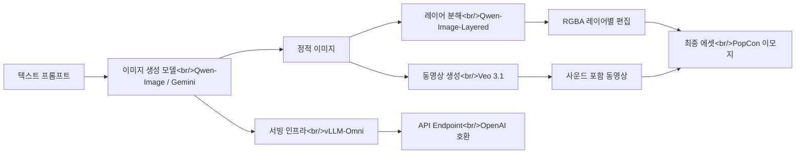

## 개요

AI 이미지 생성 분야가 빠르게 진화하고 있다. 단순한 text-to-image를 넘어서 **레이어 분해**, **실시간 편집**, **동영상 생성**, **멀티모달 서빙**까지 스택 전체가 재편되는 중이다. 이 글에서는 최근 주목할 만한 네 가지 프로젝트를 분석한다.

- **Qwen-Image-Layered** — 이미지를 RGBA 레이어로 분해해 편집 가능성을 내재화
- **Nano Banana 2** — Gemini 3.1 Flash 기반, Pro급 품질을 Flash 속도로 제공
- **Veo 3.1** — 사운드 포함 동영상 생성, 참고 이미지 기반 스타일 가이드
- **vLLM-Omni** — 텍스트/이미지/오디오/비디오를 하나의 서빙 프레임워크로 통합

이 기술들이 PopCon 프로젝트에서 어떻게 결합되는지는 [PopCon 개발기 #1](/ko/posts/2026-04-02-popcon-dev1/)에서 다룬다.

<!--more-->

## AI 이미지 파이프라인 아키텍처

현재 AI 이미지 생성 에코시스템을 하나의 파이프라인으로 정리하면 다음과 같다.



핵심은 **생성 -> 분해/편집 -> 서빙**이라는 3단계 구조가 명확해지고 있다는 점이다. 각 단계의 도구를 살펴보자.

---

## Qwen-Image-Layered — 레이어 분해로 편집 가능성 내재화

| 항목 | 내용 |
|------|------|
| GitHub | [QwenLM/Qwen-Image-Layered](https://github.com/QwenLM/Qwen-Image-Layered) |
| Stars | 1,741 |
| 언어 | Python |
| 라이선스 | Apache 2.0 |
| 논문 | [arXiv:2512.15603](https://arxiv.org/abs/2512.15603) |

### 핵심 아이디어

기존 이미지 편집은 마스크 기반 inpainting이 주류였다. Qwen-Image-Layered는 발상을 전환해서, 이미지를 처음부터 **여러 RGBA 레이어로 분해**한다. Photoshop의 레이어 개념을 AI가 자동으로 수행하는 셈이다.

### 아키텍처 분석

- **기반 모델**: Qwen2.5-VL 위에 fine-tuning한 diffusion 모델
- **파이프라인**: `QwenImageLayeredPipeline` (HuggingFace diffusers 통합)
- **출력 형식**: RGBA PNG 레이어 + PSD/PPTX 내보내기 지원
- **추론 설정**: `num_inference_steps=50`, `true_cfg_scale=4.0`, 해상도 640 권장

```python
from diffusers import QwenImageLayeredPipeline
import torch

pipeline = QwenImageLayeredPipeline.from_pretrained("Qwen/Qwen-Image-Layered")
pipeline = pipeline.to("cuda", torch.bfloat16)

inputs = {
    "image": image,
    "layers": 4,           # 분해할 레이어 수 (가변)
    "resolution": 640,
    "cfg_normalize": True,
}
output = pipeline(**inputs)
```

### 설계 패턴에서 주목할 점

1. **가변 레이어 수**: 3개든 8개든 원하는 만큼 분해 가능하다. 재귀적 분해도 지원해서, 한 레이어를 다시 분해하는 "무한 분해"가 가능하다.
2. **편집 파이프라인 분리**: 분해 후 개별 레이어는 Qwen-Image-Edit로 편집하고, `combine_layers.py`로 다시 합성한다. 관심사 분리가 깔끔하다.
3. **PSD 내보내기**: `psd-tools` 라이브러리를 활용해서 디자이너 워크플로우와 바로 연결된다.

### PopCon 활용 포인트

애니메이션 이모지를 만들 때, 캐릭터/배경/소품을 레이어로 분해하면 각 요소를 독립적으로 애니메이션할 수 있다. 예를 들어 캐릭터만 움직이고 배경은 고정하는 식이다.

---

## Qwen-Image 생태계 — 20B MMDiT 파운데이션 모델

Qwen-Image-Layered를 이해하려면 상위 프로젝트인 [Qwen-Image](https://github.com/QwenLM/Qwen-Image)도 봐야 한다.

| 항목 | 내용 |
|------|------|
| GitHub | [QwenLM/Qwen-Image](https://github.com/QwenLM/Qwen-Image) |
| Stars | 7,694 |
| 모델 크기 | 20B MMDiT |
| 최신 버전 | Qwen-Image-2.0 (2026.02) |

Qwen-Image는 **텍스트 렌더링**(특히 중국어)과 **정밀 이미지 편집**에 강점을 가진 파운데이션 모델이다. 2026년 2월에 발표된 Qwen-Image-2.0은 다음을 개선했다:

- **전문 타이포그래피 렌더링** — PPT, 포스터, 만화 등 인포그래픽 직접 생성
- **네이티브 2K 해상도** — 사람, 자연, 건축물의 세밀한 디테일
- **이해+생성 통합** — 이미지 생성과 편집을 하나의 모드로 통합
- **경량화 아키텍처** — 더 작은 모델 크기, 더 빠른 추론 속도

AI Arena 10,000회 이상 블라인드 테스트에서 **오픈소스 이미지 모델 1위**를 기록했다.

---

## Nano Banana 2 — Gemini Flash 속도의 이미지 생성

### Google의 공식 발표

2026년 2월 Google이 공개한 **Nano Banana 2**(정식명 Gemini 3.1 Flash Image)는 Nano Banana Pro의 품질을 Flash 속도로 제공하는 모델이다.

주요 특징:

- **고급 세계 지식**: Gemini의 실시간 웹 검색 정보를 활용한 정확한 렌더링
- **정밀 텍스트 렌더링 및 번역**: 마케팅 목업, 인포그래픽에 정확한 텍스트 생성
- **주체 일관성**: 최대 5개 캐릭터, 14개 오브젝트의 일관성 유지
- **프로덕션 스펙**: 512px ~ 4K, 다양한 aspect ratio 지원
- **SynthID + C2PA**: AI 생성 이미지 출처 추적 기술 내장

### nano-banana-2-skill CLI 분석

| 항목 | 내용 |
|------|------|
| GitHub | [kingbootoshi/nano-banana-2-skill](https://github.com/kingbootoshi/nano-banana-2-skill) |
| Stars | 299 |
| 언어 | TypeScript (Bun 런타임) |
| 라이선스 | MIT |

이 프로젝트는 Nano Banana 2를 CLI로 감싼 도구인데, 설계가 꽤 영리하다.

### 아키텍처 특징

1. **멀티 모델 지원**: `--model flash` (기본), `--model pro` 등 모델 전환이 쉽다
2. **Green Screen 파이프라인**: `-t` 플래그 하나로 투명 배경 에셋 생성
   - AI가 green screen 위에 생성 -> FFmpeg `colorkey` + `despill` -> ImageMagick `trim`
   - 코너 픽셀에서 키 색상을 자동 감지 (AI가 정확한 `#00FF00` 대신 `#05F904` 같은 근사값을 쓰기 때문)
3. **비용 추적**: 모든 생성을 `~/.nano-banana/costs.json`에 기록
4. **Claude Code Skill**: Claude Code 플러그인으로도 동작해서, "generate an image of..." 같은 자연어 명령으로 이미지를 생성할 수 있다

### 비용 구조

| 해상도 | Flash 비용 | Pro 비용 |
|---------|-----------|----------|
| 512x512 | ~$0.045 | N/A |
| 1K | ~$0.067 | ~$0.134 |
| 2K | ~$0.101 | ~$0.201 |
| 4K | ~$0.151 | ~$0.302 |

4K 이미지 한 장에 $0.15면 매우 저렴하다. 대량 에셋 생성에 현실적인 가격이다.

### PopCon 활용 포인트

PopCon 이모지 에셋을 대량 생성할 때 Nano Banana 2의 `-t` (투명 배경) 모드가 바로 쓸 수 있다. 캐릭터 에셋을 green screen으로 생성하고, FFmpeg 파이프라인으로 배경을 자동 제거하는 흐름이다.

---

## Veo 3.1 — 사운드 포함 AI 동영상 생성

Google의 Veo 3.1은 텍스트 프롬프트에서 **사운드가 포함된 동영상**을 생성하는 모델이다.

### 주요 기능

- **네이티브 오디오 생성**: 별도의 TTS/사운드 모델 없이 동영상에 사운드가 포함된다
- **참고 이미지 기반 스타일 가이드**: 여러 이미지를 업로드해서 캐릭터/장면의 스타일을 지정할 수 있다
- **세로 동영상 지원**: 세로 이미지를 업로드하면 소셜 미디어용 세로 동영상을 생성한다
- **8초 분량**: 현재 최대 8초 동영상 생성

### 가격 티어

| 모델 | 요금제 | 특징 |
|------|--------|------|
| Veo 3.1 Fast | AI Pro | 고화질 + 속도 최적화 |
| Veo 3.1 | AI Ultra | 최고 수준 동영상 품질 |

### PopCon 활용 포인트

정적 이모지에서 한 발 나아가, Veo 3.1로 이모지에 짧은 애니메이션과 사운드 이펙트를 추가할 수 있다. "웃는 캐릭터가 손을 흔드는 2초 애니메이션 + 효과음" 같은 시나리오에 적합하다.

---

## vLLM-Omni — 멀티모달 서빙 프레임워크

| 항목 | 내용 |
|------|------|
| GitHub | [vllm-project/vllm-omni](https://github.com/vllm-project/vllm-omni) |
| Stars | 4,094 |
| 언어 | Python |
| 최신 릴리스 | v0.18.0 (2026.03) |
| 논문 | [arXiv:2602.02204](https://arxiv.org/abs/2602.02204) |

### 왜 중요한가

위에서 살펴본 모델들(Qwen-Image, Qwen-Image-Layered 등)이 모두 좋지만, 프로덕션에서 서빙하는 것은 별개의 문제다. vLLM-Omni는 이 gap을 메운다.

### 아키텍처 핵심

기존 vLLM은 텍스트 기반 autoregressive 생성만 지원했다. vLLM-Omni는 세 가지를 확장한다:

1. **Omni-modality**: 텍스트, 이미지, 비디오, 오디오 데이터 처리
2. **Non-autoregressive 아키텍처**: Diffusion Transformers (DiT) 등 병렬 생성 모델 지원
3. **이종 출력**: 텍스트 생성에서 멀티모달 출력까지

### 성능 최적화

- **KV 캐시 관리**: vLLM의 효율적인 KV 캐시를 그대로 활용
- **파이프라인 스테이지 오버래핑**: 높은 throughput
- **OmniConnector 기반 완전 분리**: 스테이지 간 동적 리소스 할당
- **분산 추론**: Tensor, pipeline, data, expert parallelism 모두 지원

### 지원 모델 (2026.03 기준)

v0.18.0에서 지원하는 주요 모델:

- **Qwen3-Omni / Qwen3-TTS**: 텍스트+이미지+오디오 통합
- **Qwen-Image / Qwen-Image-Edit / Qwen-Image-Layered**: 이미지 생성/편집/분해
- **Bagel, MiMo-Audio, GLM-Image**: 기타 멀티모달 모델
- **Diffusion (DiT) 스택**: 이미지/비디오 생성

### Day-0 지원 패턴

vLLM-Omni의 주목할 점은 **새 모델 출시와 동시에 서빙 지원**을 제공하는 "Day-0 support" 패턴이다. Qwen-Image-2512 출시일에 바로 vLLM-Omni 지원이 나왔고, Qwen-Image-Layered도 마찬가지였다. 이는 모델 개발팀과 서빙 인프라팀 간의 긴밀한 협력을 보여준다.

### PopCon 활용 포인트

PopCon 서비스에서 이모지 생성 API를 구축할 때, vLLM-Omni를 서빙 레이어로 사용하면 Qwen-Image로 이미지를 생성하고, Qwen-Image-Layered로 분해하는 전체 파이프라인을 하나의 OpenAI 호환 API 뒤에 숨길 수 있다.

---

## 빠른 링크

- [Qwen-Image-Layered GitHub](https://github.com/QwenLM/Qwen-Image-Layered) — 이미지 레이어 분해 모델
- [Qwen-Image GitHub](https://github.com/QwenLM/Qwen-Image) — 20B 이미지 파운데이션 모델
- [Qwen-Image-Layered 논문](https://arxiv.org/abs/2512.15603)
- [nano-banana-2-skill GitHub](https://github.com/kingbootoshi/nano-banana-2-skill) — Gemini 기반 이미지 생성 CLI
- [Nano Banana 2 공식 블로그](https://blog.google/innovation-and-ai/technology/ai/nano-banana-2/) — Google 공식 발표
- [Veo 3.1 소개 페이지](https://gemini.google/kr/overview/video-generation/?hl=ko) — 사운드 포함 동영상 생성
- [vLLM-Omni GitHub](https://github.com/vllm-project/vllm-omni) — 멀티모달 서빙 프레임워크
- [vLLM-Omni 논문](https://arxiv.org/abs/2602.02204)

---

## 인사이트

**에코시스템이 수직 통합되고 있다.** Qwen 팀은 파운데이션 모델(Qwen-Image) -> 특화 모델(Layered, Edit) -> 서빙(vLLM-Omni Day-0 지원)까지 전체 스택을 커버한다. Google은 Nano Banana 2로 생성, Veo 3.1로 동영상, SynthID/C2PA로 출처 추적까지 묶었다. 개별 모델의 성능보다 **파이프라인 전체의 완성도**가 경쟁력을 좌우하는 단계에 들어섰다.

**편집 가능성(Editability)이 새로운 차별점이다.** 단순히 "좋은 이미지를 생성하는 것"에서 "생성된 이미지를 얼마나 쉽게 수정할 수 있는가"로 경쟁 축이 이동하고 있다. Qwen-Image-Layered의 레이어 분해는 이 방향의 대표적인 사례다. 레이어 단위로 분리하면 recolor, resize, repositon 같은 기본 조작이 **물리적으로 다른 콘텐츠에 영향을 주지 않는다**.

**서빙 인프라가 병목이다.** 아무리 좋은 모델이 있어도 프로덕션에서 서빙할 수 없으면 의미가 없다. vLLM-Omni가 autoregressive 전용이던 vLLM을 Diffusion Transformer까지 확장한 것은 이 병목을 해소하려는 시도다. 특히 long sequence parallelism, cache acceleration 같은 최적화가 이미지 생성 모델의 서빙 비용을 현실적인 수준으로 낮추고 있다.

**도구 체인이 개발자 경험을 결정한다.** nano-banana-2-skill 같은 CLI 래퍼가 299 star를 받은 이유가 있다. `nano-banana "robot mascot" -t -o mascot` 한 줄로 투명 배경 에셋이 나오는 경험은, API 문서를 읽고 코드를 작성하는 것과 차원이 다르다. Claude Code skill로도 동작하니 AI 코딩 어시스턴트에서 바로 이미지를 생성할 수 있다.
