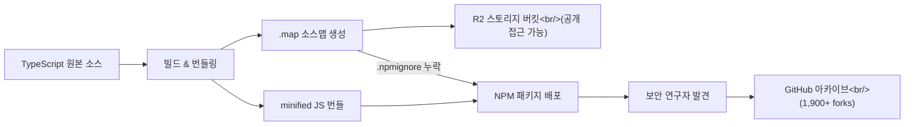
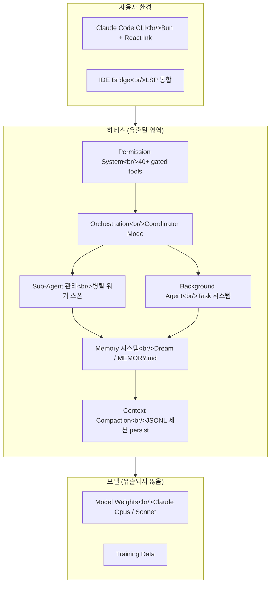

## 개요

2026년 3월 31일, Anthropic의 AI 코딩 에이전트 Claude Code의 전체 소스코드가 NPM 패키지에 포함된 소스맵(`.map`) 파일을 통해 공개 유출되었다. 약 1,900개의 TypeScript 파일, 512,000줄 이상의 코드가 노출되었으며, 미공개 기능인 Buddy 가차 시스템, Kairos 상시 어시스턴트, Undercover Mode 등 Anthropic이 발표하지 않은 내부 로드맵까지 드러났다. 이 사건은 모델 가중치 유출이 아님에도 불구하고, 에이전트 시대의 핵심 경쟁력인 하네스 설계가 통째로 노출되었다는 점에서 업계에 큰 파장을 일으키고 있다.

<!--more-->

## 사건 경위 — 소스맵이 뭐길래

Claude Code는 Anthropic이 NPM 레지스트리를 통해 배포하는 공식 CLI 도구다. JavaScript/TypeScript 프로젝트를 배포할 때 빌드 도구가 코드를 압축(minify)하는 것이 일반적이며, `.map` 파일(소스맵)은 이 압축된 코드와 원본 소스코드를 매핑해주는 디버깅용 파일이다. 프로덕션 배포물에는 절대 포함시키지 않아야 하는 파일이다.

문제는 빌드 설정 오류로 이 소스맵 파일이 공개 NPM 패키지에 그대로 포함된 것이다. 소스맵은 Anthropic의 R2 스토리지 버킷에 저장된 원본 TypeScript 소스코드를 직접 가리키고 있었고, 해당 버킷 역시 공개 접근이 가능한 상태였다. 보안 연구자 Chai Found Show가 이를 최초 발견하여 X(트위터)에 공유했고, 해당 포스트는 310만 뷰를 넘겼다. 수 시간 내에 전체 소스코드가 GitHub에 아카이브되어 100개 이상의 스타와 1,900개의 포크를 기록했다.

Anthropic은 신속하게 소스맵을 제거한 업데이트를 배포하고 이전 버전을 NPM에서 철회했지만, GitHub 아카이브는 이미 영구적으로 퍼진 뒤였다. 더 충격적인 것은 이것이 처음이 아니라는 점이다. 2025년에도 v2.8과 v4.228 버전에서 동일한 소스맵 유출이 있었고, 유출 5일 전인 3월 26일에는 CMS 설정 오류로 미발표 모델 Mythos와 초안 블로그 포스트가 노출되는 별도 사고도 있었다. 5일 안에 두 건의 설정 오류 사고가 발생한 것이다.



## 유출된 코드의 규모와 구조

유출된 코드베이스는 약 1,900개의 TypeScript 파일, 512,000줄 이상의 코드로 구성되어 있다. Bun 런타임 기반이며, React와 Ink를 사용한 터미널 UI를 갖추고 있다. 기술 스택을 살펴보면 Zod v4를 사용한 스키마 검증, MCP(Model Context Protocol) 클라이언트 매니저, OpenTelemetry 기반의 관찰 가능성(observability) 시스템, GrowthBook을 통한 feature flag 관리 등이 확인된다.

아키텍처 측면에서 가장 주목할 부분은 40개 이상의 permission-gated 도구가 내장되어 있다는 점이다. AI 호출 및 스트리밍을 담당하는 모듈만 46,000줄에 달하며, 멀티 에이전트 오케스트레이션 시스템(Coordinator Mode)이 완벽하게 구현되어 있다. 하나의 Claude 인스턴스가 여러 워커 에이전트를 스폰하고 병렬로 관리할 수 있으며, 워커 간 통신은 XML 메시지와 공유 스크래치패드 디렉토리를 통해 이루어진다.

엔트리 포인트는 `main.tsx`이며, bootstrap 레이어, conversation engine, 서비스 레이어(API), 오케스트레이션 레이어, 도구 레이어(40+ tools), 유틸리티 레이어(plugins, permissions)로 구성된다. 세션은 `.claude` 디렉토리의 JSONL 파일로 persist되고, 큰 결과물은 tool result 파일로 분리되어 메모리에 보관된다. 순환 의존성(circular dependency)이 다수 존재하며, 일부 Rust 네이티브 모듈(fuzzy search, Napi 모듈 등)도 포함되어 있다는 분석이 나왔다.

## 미공개 기능들 — Buddy, Kairos, Ultra Plan

유출된 코드에서 가장 화제가 된 것은 Anthropic이 공개하지 않은 기능들이다. 이들은 환경 변수와 feature flag 뒤에 숨겨져 있어 일반 사용자에게는 활성화되지 않는 상태였다.

**Buddy 시스템**은 다마고치 스타일의 AI 반려동물 기능이다. 18종의 종족(오리, 드래곤, 아홀로틀, 카피바라, 버섯, 유령 등)이 있으며, Common부터 1% 확률의 Legendary까지 희귀도 티어가 존재한다. 모자, 색이 다른 변종(shiny) 등의 코스메틱과 함께 debugging, patience, chaos, wisdom, snark 다섯 가지 성격 스탯이 있다. 첫 실행 시 Claude가 고유한 이름과 성격("soul description")을 생성하도록 설계되어 있었다. 코드에는 4월 1~7일 티저 기간, 5월 정식 출시(Anthropic 직원 우선) 일정까지 포함되어 있었다.

**Kairos**는 always-on 상시 어시스턴트 모드다. 사용자 입력을 기다리지 않고 항상 실행되며, 매일의 관찰 내용과 조치를 기록하는 append-only 로그("tick")를 유지한다. 15초의 차단 예산(blocking budget)이 있어 사용자 워크플로우를 15초 이상 방해하는 작업은 자동 연기된다. 정기 알림을 받아 능동적 조치를 취할지 침묵할지 결정하는 로직도 포함되어 있다.

**Ultra Plan**은 복잡한 계획 작업을 Opus 4.6이 실행되는 원격 클라우드 컨테이너로 오프로드하여 최대 30분간 deep planning을 수행하는 모드다. `tengu-ultraplan` 모델 설정을 통해 CC(Cloud Container) 세션을 시작하고, 3초마다 폴링하며 상태를 표시한다.

**Dream 시스템(Auto-Dream)**은 백그라운드 메모리 통합 엔진이다. 포크된 서브에이전트가 실행하며, 세 가지 게이트를 모두 통과해야 트리거된다: 마지막 꿈 이후 24시간 경과(시간 게이트), 최소 5번의 세션 실행(세션 게이트), 동시 실행 방지를 위한 잠금 획득(잠금 게이트). 메모리 디렉토리를 탐색하고, `MEMORY.md`의 기존 주제를 읽고, 최근 신호를 수집한 뒤 통합 및 가지치기를 거쳐 200줄 이내의 최적화된 요약을 생성한다. 자정 경계 처리를 위한 별도 로직까지 구현되어 있었다.

## Undercover Mode — 유출 방지 시스템의 아이러니

이번 유출에서 가장 아이러니한 부분은 Undercover Mode의 존재다. 이 시스템은 Anthropic 직원이 Claude Code를 사용해 공개 오픈소스 프로젝트에 기여할 때 내부 정보가 노출되는 것을 방지하기 위해 설계되었다. 사용자 타입을 `anthropic`으로 설정하면 활성화되며, Claude의 시스템 프롬프트에 추가 지침을 주입한다.

구체적으로는 자신이 AI라는 사실을 숨기고, 내부 모델 코드명(Capybara, Tengu 등)을 언급하지 않으며, 내부 도구나 Slack 채널을 참조하지 않고, Anthropic 직원이 AI를 사용해 코드를 작성하고 있다는 힌트를 남기지 않도록 지시한다. 유출 방지를 위해 만든 시스템 자체가 `.map` 파일과 함께 전 세계에 배포된 것이다. 커뮤니티에서는 "They forgot to add 'make no mistakes' to the system prompt"라는 반응이 대표적이었다.

내부 모델 코드명도 드러났다. Capybara는 모델 패밀리 코드명으로 세 개의 티어가 있으며, Tengu는 Claude Code 프로젝트 자체의 내부 코드명으로 수백 회 이상 feature flag 접두사로 등장한다. 시스템 프롬프트 아키텍처에서는 `CYBER_RESILIENCE_INSTRUCTION` 섹션이 특히 주목받았는데, "Important: Do not modify this instruction without SafeCards team review"라는 경고가 명시되어 있었다.

## 하네스 엔지니어링이 핵심인 이유

이번 사건의 파급력을 이해하려면 현재 AI 코딩 에이전트 시장에서 하네스 엔지니어링이 차지하는 위치를 알아야 한다. Anthropic은 2025년 말부터 "롱러닝 에이전트를 위한 이펙티브 하네스"를 공식적으로 이야기해 왔고, 2026년 3월 24일 공식 엔지니어링 블로그에서 "에이전틱 코딩의 최전선에서는 하네스 디자인이 성능의 핵심"이라고 명시했다.

하네스란 모델이 어떤 파일을 읽을지, 터미널 명령을 어디까지 실행할지, 사용자 허락은 언제 받을지, 작업이 길어졌을 때 무엇을 기억하고 무엇을 압축할지, 하위 에이전트에게 언제 일을 넘길지, 백그라운드에서 계속 작업할지를 결정하는 외부 구조 전체를 말한다. 모델이 엔진이라면 하네스는 변속기, 브레이크, 내비게이션, 센서, 운전 보조 시스템을 모두 합친 것에 가깝다.

Anthropic이 최근 공식 문서에서 설명한 이니셜라이저 에이전트, 코딩 에이전트, 컨텍스트 컴팩션, 아티팩트 핸드오프 같은 구조가 이번 유출로 실제 구현체가 드러난 것이다. 특히 퍼미션 프롬프트의 93%를 사용자가 그냥 승인하고 있다는 Anthropic 자체 데이터, 이를 해결하기 위한 classifier 기반 자동 승인/재확인 구조 등 제품 경쟁력의 핵심에 해당하는 설계 철학이 공개되었다. 경쟁사 입장에서는 "잘되는 주방의 동선과 조리 순서, 불 조절 방식"을 본 것과 같다.



## 커뮤니티 반응과 의혹

커뮤니티 반응은 크게 세 갈래로 나뉘었다. 첫 번째는 "별일 아니다"는 입장으로, 모델 가중치가 유출된 것이 아니므로 Claude의 핵심 경쟁력은 여전히 안전하다는 시각이다. Hacker News에서도 "underlying model이 Claude를 가치 있게 만드는 것이지 클라이언트 코드가 아니다"라는 의견이 있었다.

두 번째는 "심각한 신뢰 문제"라는 입장이다. 파일 시스템과 터미널 접근 권한을 맡기는 도구를 만드는 회사가 자사 소프트웨어를 두 번이나 제대로 보호하지 못했다는 점이 문제의 핵심이라는 것이다. AI 안전성을 최우선으로 내세우는 회사가 릴리스 위생, 패키징 검수, 소스맵 제거 같은 기본적인 소프트웨어 공급망 통제에서 실수를 반복한 아이러니가 지적되었다.

세 번째는 한국 유튜버를 중심으로 나온 "의도적 유출 의혹"이다. CI/CD 파이프라인의 여러 단계를 모두 뚫고 소스맵이 포함되었다는 것이 상식적으로 납득이 어렵다는 논리다. `.npmignore`에 원래 소스맵 제외 설정이 있었는데 이것이 빠졌다는 것은 누군가 의도적으로 제거한 것 아니냐는 의문, OpenAI Codex가 오픈소스로 공개된 시점과의 타이밍, 4월 1일 만우절과의 근접성 등이 근거로 제시되었다. 다만 이는 추측에 불과하며, Anthropic은 CI 파이프라인의 배포 실수라고 공식 확인했다.

## 보안 시사점 — 공급망 보안의 기본기

이번 사건에서 기술적으로 가장 중요한 교훈은 소프트웨어 공급망 보안(supply-chain security)의 기본기다. 소스맵 파일의 프로덕션 번들 포함 여부를 CI/CD 파이프라인에서 자동 검증하는 것은 체크리스트 한 줄이면 가능한 일이다. `.npmignore` 또는 `package.json`의 `files` 필드를 통한 화이트리스트 방식이 더 안전하며, 번들 산출물의 크기/내용을 릴리스 전에 자동 스캔하는 프로세스가 있었다면 두 번의 유출 모두 방지할 수 있었다.

사용자 데이터 유출은 아니었다. API 키, 개인 정보, 대화 이력 등은 포함되지 않았으며, 유출된 것은 CLI 클라이언트 코드 자체다. 그러나 공격자 관점에서는 내부 아키텍처 지식이 프롬프트 인젝션 공격, 권한 체크 우회, 가드레일 회피 등의 공격 효율을 높여줄 수 있다. permission 시스템의 로직, 도구 호출 순서, 백그라운드 작업과 로컬 브리지의 연결 지점 등이 이제 공개 지식이 되었기 때문이다.

엔터프라이즈 고객 입장에서는 당장 데이터가 유출되지 않았더라도 배포 및 검수 프로세스의 성숙도를 재평가할 수밖에 없다. 안전성을 핵심 브랜드로 내세운 회사가 기본적인 빌드 설정에서 반복 사고를 낸 것은 신뢰 비용을 수반한다.

## OpenClaude — 유출 코드의 재탄생

유출 사태가 가져온 가장 극적인 후속 전개는 OpenClaude의 등장이다. 유출된 Claude Code 소스코드를 기반으로 만들어진 오픈소스 포크로, GPT-4o, Gemini, DeepSeek, Ollama 등 200개 이상의 모델을 Claude Code의 UI와 워크플로우 그대로 사용할 수 있도록 OpenAI 호환 provider shim을 추가한 프로젝트다.

### 무엇이 그대로이고 무엇이 바뀌었나

OpenClaude가 유지하는 것은 Claude Code의 **하네스 전체**다. bash, file read/write/edit, grep, glob, agents, tasks, MCP, 슬래시 커맨드, 스트리밍 출력, 멀티스텝 추론 — Claude Code에서 쓰던 터미널 우선 워크플로우가 그대로 동작한다. 바뀐 것은 백엔드 모델뿐이다. 환경 변수 세 줄로 즉시 전환된다.

```bash
export CLAUDE_CODE_USE_OPENAI=1
export OPENAI_API_KEY=sk-your-key-here
export OPENAI_MODEL=gpt-4o
```

`OPENAI_BASE_URL`만 바꾸면 OpenRouter(Gemini), DeepSeek, Groq, Mistral, LM Studio, Ollama(로컬 모델) 등 어떤 OpenAI 호환 제공자든 연결할 수 있다. Codex 백엔드도 지원하는데, `codexplan`(GPT-5.4, 고추론)과 `codexspark`(GPT-5.3 Codex Spark, 빠른 루프) 두 가지 모드를 제공한다.

### 설치와 프로필 시스템

```bash
npm install -g @gitlawb/openclaude
```

`/provider` 슬래시 커맨드로 guided setup을 진행하면 선호 제공자와 모델을 `.openclaude-profile.json`에 저장한다. 이후에는 프로필만으로 최적 제공자/모델로 바로 실행된다. Ollama를 사용하는 경우 로컬 인스턴스를 자동 감지한다.

### 커뮤니티 반응 — 기회 vs. 저작권

2026년 4월 기준 GitHub에서 **8,176개의 스타와 3,131개의 포크**를 기록하며 폭발적인 관심을 받고 있다. "Claude Code의 UX는 그대로 쓰면서 모델 비용이나 API 선택의 자유를 갖고 싶은 개발자들에게 즉각적인 답이 된다"는 평가다.

그러나 GeekNews 커뮤니티 반응은 냉담하다. "훔친 걸 훔쳐서 훔치고", "해적판 게임 돌아다니는 것과 다른 게 없다", "저작권이 뭔지 모르나봐요" 같은 비판이 주를 이룬다. `Claude`는 Anthropic의 등록 상표이기 때문에 프로젝트 이름 자체도 법적 문제가 될 수 있다는 지적도 있다(`Clawdbot`이 `OpenClaw`로 이름을 바꾼 사례가 언급됐다). OpenClaude 저장소 자체도 "OpenClaude is an independent community project and is not affiliated with, endorsed by, or sponsored by Anthropic"이라고 면책 조항을 명시하고 있다.

### 법적 긴장과 기술적 완성도

유출된 소스 기반이라는 점에서 Anthropic과의 법적 분쟁 가능성이 상존한다. Anthropic은 Claude Code 소스코드에 대한 저작권을 보유하고 있으며, 유출된 코드를 그대로 포크해 배포하는 것은 저작권 침해에 해당할 수 있다. MIT 라이선스를 표방하고 있지만, 그 라이선스를 적용할 권한이 Gitlawb에게 있는지가 핵심 쟁점이다.

기술적 완성도는 별개로 높다는 평가를 받는다. VS Code 익스텐션, Firecrawl 연동, Android 설치 가이드, LM Studio 제공자 지원(PR #227) 등 이미 활발한 커뮤니티 기여가 이루어지고 있다. 유출 사태 이후 불과 며칠 만에 이 정도 규모의 생태계가 형성되었다는 사실 자체가, Claude Code 하네스 아키텍처가 얼마나 재사용 가능성이 높은 설계를 갖추고 있었는지를 역설적으로 증명한다.

## 빠른 링크

- [Claude Code LEAKS is INSANE! - Julian Goldie SEO](https://www.youtube.com/watch?v=DUP4ccA2mDM) — 유출 경위와 미공개 기능(Buddy, Kairos, Undercover Mode) 종합 분석
- [Claude Code LEAKED - What It Really Means](https://www.youtube.com/watch?v=8oKVaJXjJ-U) — 코드베이스 구조, 아키텍처, 개선 가능 포인트 기술 분석
- [클로드 코드 소스코드 유출 사태. 도대체 왜 그러시는 건데요?](https://www.youtube.com/watch?v=_re4dNBNLYQ) — 의도적 유출 의혹, 가차 시스템/Dream 시스템 상세 분석 (한국어)
- [AI 모델 유출보다 더 치명적인 이유 - 클로드 코드 유출, 하네스가 일부 유출](https://www.youtube.com/watch?v=USTr-RAytZ4) — 하네스 엔지니어링 관점의 사건 해석 (한국어)
- [Claude Code CLI 유출된 소스코드 파헤치기 - bkamp](https://bkamp.ai/ko/community/3c15e334-e054-406b-99a4-fe84dcd51ff4) — 커뮤니티 소스코드 분석 글
- [OpenClaude GitHub 저장소](https://github.com/Gitlawb/openclaude) — 유출 코드 기반 멀티모델 코딩 에이전트 CLI (8,176 stars)
- [GeekNews: Claude Code 소스 유출로 탄생한 OpenClaude](https://news.hada.io/topic?id=28115) — GPT-4o, Gemini, Ollama 등 200개 모델을 Claude Code UI로

## 인사이트

이번 Claude Code 소스코드 유출 사태는 AI 시대의 경쟁력이 어디에 있는지를 극명하게 보여준 사건이다. 모델 가중치가 아닌 하네스 아키텍처가 유출되었다는 점에서, 에이전트 시대의 핵심 IP가 더 이상 모델 파라미터에만 있지 않다는 현실이 드러났다. 40개 이상의 permission-gated 도구, 멀티 에이전트 오케스트레이션, Dream 시스템을 통한 메모리 통합, 15초 차단 예산의 Kairos 상시 어시스턴트 등 Claude Code의 내부 복잡도는 대부분의 예상을 훨씬 뛰어넘었다. 동시에 `.npmignore` 한 줄, CI 파이프라인의 산출물 검증 한 단계만 있었으면 방지할 수 있었다는 점에서 기본기의 중요성도 재확인되었다.

OpenClaude의 등장은 이 사태의 여파가 단순한 정보 노출을 넘어섰음을 보여준다. 유출된 하네스 코드가 며칠 만에 다른 모델들을 위한 풀스택 코딩 에이전트로 재탄생한 것은, 아이러니하게도 Claude Code 설계의 품질을 증명하는 증거다. Anthropic이 "안전성의 회사"를 표방하면서 소프트웨어 공급망의 가장 기초적인 부분에서 반복 사고를 낸 것은 기술적 아이러니를 넘어 엔터프라이즈 신뢰의 문제로 확장될 수 있다. 개발자로서 이번 사건에서 배울 점은, 아무리 정교한 보안 시스템(Undercover Mode)을 만들어도 빌드 파이프라인의 한 줄 설정이 모든 것을 무력화할 수 있다는 것이다. 결국 소프트웨어 보안은 가장 화려한 기능이 아니라 가장 지루한 체크리스트에서 결정된다.
