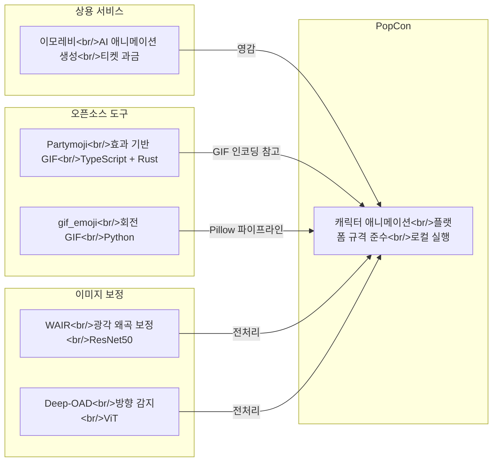

## 개요

애니메이션 이모지와 스티커는 모바일 메신저 생태계에서 핵심 수익원이자 사용자 표현 수단이다. 카카오톡 이모티콘 시장은 연간 수천억 원 규모이며, LINE Creators Market은 전 세계 크리에이터가 참여하는 개방형 플랫폼이다. 이 글에서는 플랫폼별 기술 규격, 기존 제작 도구, 오픈소스 대안, 그리고 이미지 보정 기술까지 조사하여 PopCon 프로젝트가 어떤 틈새를 공략할 수 있는지 분석한다.

PopCon이 이 시장에서 어떻게 구현되었는지는 [PopCon 개발기 #1](/ko/posts/2026-04-02-popcon-dev1/)에서 다룬다.

<!--more-->

## 시장 현황

### 카카오톡 이모티콘

카카오톡 이모티콘 스토어는 국내 최대의 디지털 스티커 마켓이다. 주요 특징은 다음과 같다:

- **심사 기반 등록**: 크리에이터가 제출하면 카카오 측 심사를 거쳐 출시
- **움직이는 이모티콘(움티)**: 24프레임 기반 애니메이션, APNG 또는 GIF 포맷
- **수익 배분**: 크리에이터 35% (플랫폼 수수료가 높은 편)
- **경쟁 심화**: 월 수천 개의 신규 이모티콘 세트가 제출되며, 승인률은 낮음

### LINE Creators Market

LINE은 글로벌 크리에이터에게 개방된 마켓을 운영한다. 애니메이션 스티커와 이모티콘 두 가지 카테고리가 있으며, 각각 규격이 다르다.

**애니메이션 스티커 규격:**

| 항목 | 규격 |
|------|------|
| 이미지 크기 | 최대 320 x 270px (한 변 최소 270px) |
| 프레임 수 | 5~20프레임 (APNG) |
| 재생 시간 | 최대 4초 |
| 반복 횟수 | 1~4회 |
| 파일 크기 | 개당 1MB 이하, ZIP 전체 60MB 이하 |
| 파일 형식 | APNG (.png 확장자) |
| 세트 구성 | 8종, 16종, 24종 중 택1 |
| 배경 | 투명 필수 |
| 색 공간 | RGB |

**이모티콘 규격:**

| 항목 | 규격 |
|------|------|
| 이미지 크기 | 180 x 180px |
| 세트 구성 | 8~40개 (일반), 문자 이모티콘 포함 시 최대 305개 |
| 파일 크기 | 개당 1MB 이하, ZIP 20MB 미만 |
| 해상도 | 최소 72dpi, RGB |
| 디자인 권장 | 굵고 짙은 테두리, 심플한 형태 |

LINE의 심사 가이드라인에서 특히 주목할 점은 **이모티콘이 단독 전송 시 스티커처럼 크게 표시**된다는 점이다. 따라서 작은 크기에서도 식별 가능하면서 큰 크기에서도 보기 좋은 디자인이 필요하다.

## 기존 제작 도구 분석

### 이모레비 (Emorevi)

[이모레비](https://tokti.ai/emorevi)는 AI 기반 애니메이션 이모티콘 제작 SaaS다.

**핵심 기능:**
- **AI Generation**: 단일 이미지에서 애니메이션 자동 생성
- **Smart Interpolation**: 프레임 간 자연스러운 보간 알고리즘
- **Platform Optimized**: 카카오톡, LINE, Discord 등 플랫폼별 프리셋
- **다중 포맷 지원**: MP4, GIF, APNG, WebP 내보내기
- **Style Transfer**: 애니메이션 스타일 커스터마이징
- **Real-time Preview**: 편집 중 실시간 미리보기

**가격 정책:**
| 플랜 | 가격 | 티켓 수 | 티켓 단가 |
|------|------|---------|-----------|
| Basic | $9.99 | 1,000 | $0.01 |
| Standard | $29.99 | 3,600 (+600 보너스) | $0.008 |
| Premium | $99.99 | 14,000 (+4,000 보너스) | $0.007 |

이모레비는 "이미지 한 장에서 애니메이션까지"라는 워크플로우를 제공하지만, 티켓 기반 과금 모델이라 대량 제작 시 비용이 누적된다. 또한 생성 결과물의 품질 제어가 제한적이다.

## 오픈소스 솔루션

### Partymoji

[Partymoji](https://github.com/MikeyBurkman/partymoji)는 TypeScript + Rust로 만든 웹 기반 애니메이션 GIF 생성기다.

- **스택**: TypeScript (219K LoC), Rust (GIF 인코더), 웹 브라우저에서 실행
- **기능**: 이미지에 파티 효과(무지개, 회전, 반짝임 등)를 적용하여 애니메이션 GIF 생성
- **라이브 데모**: https://mikeyburkman.github.io/partymoji/
- **특징**: IndexedDB 기반 프로젝트 저장, Bezier 커브로 애니메이션 제어
- **한계**: 이모티콘/스티커 플랫폼 규격에 맞춘 출력 기능 없음, 효과 중심(원본 캐릭터 애니메이션 아님)

### gif_emoji

[gif_emoji](https://github.com/tomarrell/gif_emoji)는 Python(Pillow)으로 만든 미니멀 도구로, 이미지를 회전하는 GIF로 변환한다.

- **출력**: 32x32 GIF, 36프레임 (10도씩 회전)
- **용도**: Slack 커스텀 이모지 (60KB 제한 준수)
- **코드량**: Python 1,655줄 — 매우 간결
- **한계**: 회전 애니메이션만 지원, 크기/프레임 수 하드코딩

두 프로젝트 모두 "이미지에 효과를 입히는" 접근 방식이다. 캐릭터 자체를 움직이게 하는 것(표정 변화, 손 흔들기 등)과는 근본적으로 다르다.

## 이미지 보정 기술

애니메이션 이모지 제작 파이프라인에서 입력 이미지의 품질은 결과물에 직접적인 영향을 미친다. 두 가지 관련 기술을 살펴본다.

### WAIR — Wide-angle Image Rectification

[WAIR](https://github.com/loong8888/WAIR)는 광각/어안 렌즈 왜곡을 보정하는 딥러닝 모델이다.

- **아키텍처**: ResNet50 기반, ImageNet pretrained
- **왜곡 모델**: FOV, Division Model, Equidistant 세 가지 지원
- **성능**: ADE20k 데이터셋 기준 PSNR 26.43 / SSIM 0.85 (FOV 모델)
- **실용성**: 256x256 입력으로 추정한 왜곡 파라미터 k를 1024x1024 원본에 적용 가능 (워핑 5.3ms)
- **이모지 관련성**: 사용자가 스마트폰 광각 카메라로 촬영한 사진을 이모지 소스로 쓸 때 왜곡 보정에 활용 가능

### Deep-OAD — Image Orientation Angle Detection

[Deep-OAD](https://github.com/pidahbus/deep-image-orientation-angle-detection)는 이미지의 회전 각도를 감지하고 자동으로 바로잡는 모델이다.

- **V2 업데이트**: ViT(Vision Transformer) 적용으로 SOTA 달성
- **정확도**: 0~359도 범위에서 test MAE 6.5도
- **학습 데이터**: MS COCO 대부분의 이미지로 학습
- **활용**: 사용자 업로드 이미지의 방향을 자동 감지하여 전처리 단계에서 보정

이 두 기술은 "사용자가 제공하는 원본 이미지를 자동으로 정규화"하는 전처리 파이프라인에 통합할 수 있다.

## 도구 비교

## PopCon과의 차별점

기존 도구들의 한계를 정리하면 PopCon이 차지할 포지션이 보인다:

| 측면 | 기존 도구 | PopCon |
|------|-----------|--------|
| **애니메이션 방식** | 효과 적용(회전, 파티) 또는 AI 블랙박스 | 캐릭터 리깅 기반 의도된 움직임 |
| **플랫폼 규격** | 범용 GIF 출력 | LINE/카카오 규격 프리셋 내장 |
| **비용** | SaaS 과금 (이모레비) | 로컬 실행, 무료 |
| **제어 수준** | 제한적 파라미터 | 프레임 단위 세밀한 제어 |
| **이미지 전처리** | 없음 | 왜곡 보정 + 방향 감지 파이프라인 통합 가능 |
| **출력 포맷** | 주로 GIF | APNG, GIF, WebP 멀티 포맷 |

핵심 차별점은 세 가지로 요약된다:

1. **규격 준수 자동화** — LINE 애니메이션 스티커의 320x270px, 5~20프레임, 4초 제한 등을 프리셋으로 제공하여 제출 시행착오를 줄인다
2. **캐릭터 중심 애니메이션** — 효과를 "입히는" 것이 아니라 캐릭터가 "움직이는" 애니메이션을 생성한다
3. **전처리 파이프라인** — WAIR, Deep-OAD 같은 보정 모델을 통합하여 다양한 품질의 입력 이미지를 정규화한다

## 빠른 링크

- [이모레비 — AI 애니메이션 이모티콘 제작](https://tokti.ai/emorevi)
- [LINE Creators Market 애니메이션 스티커 가이드라인](https://creator.line.me/ko/guideline/animationsticker/)
- [LINE Creators Market 이모티콘 가이드라인](https://creator.line.me/ko/guideline/emoji/)
- [Partymoji — 웹 기반 애니메이션 GIF 생성기](https://github.com/MikeyBurkman/partymoji)
- [gif_emoji — Python 회전 GIF 생성기](https://github.com/tomarrell/gif_emoji)
- [WAIR — 광각 이미지 왜곡 보정](https://github.com/loong8888/WAIR)
- [Deep-OAD — 이미지 방향 자동 감지](https://github.com/pidahbus/deep-image-orientation-angle-detection)

## 인사이트

- **시장 진입 장벽은 "심사"에 있다** — 기술적으로 애니메이션을 만드는 것보다, 카카오/LINE 심사를 통과하는 품질을 일관되게 내는 것이 더 어렵다. 자동화 도구가 규격을 정확히 지키는 것이 첫 번째 과제다.
- **오픈소스 공백이 크다** — partymoji나 gif_emoji는 "장난감" 수준이다. 플랫폼 규격을 준수하면서 캐릭터 애니메이션을 생성하는 오픈소스 도구는 사실상 없다.
- **이모레비의 한계가 기회** — SaaS 모델은 대량 제작에 비용이 쌓이고, AI 생성 결과물의 세밀한 제어가 어렵다. 로컬에서 실행되면서 프레임 단위 제어가 가능한 도구에 수요가 있다.
- **전처리 자동화가 UX를 결정한다** — 사용자가 올린 사진이 기울어져 있거나 광각 왜곡이 있으면, 아무리 좋은 애니메이션 엔진이 있어도 결과물이 어색하다. WAIR + Deep-OAD 같은 모델의 전처리 통합이 체감 품질을 크게 높일 수 있다.
- **APNG가 핵심 포맷이다** — LINE과 카카오 모두 APNG를 공식 지원한다. GIF보다 색상 표현이 풍부하고(알파 채널 지원), 파일 크기 효율도 좋다. PopCon의 기본 출력 포맷은 APNG여야 한다.
