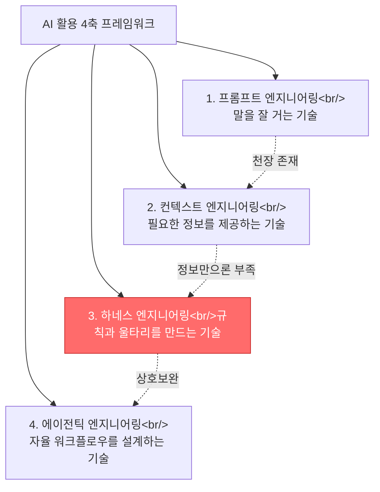
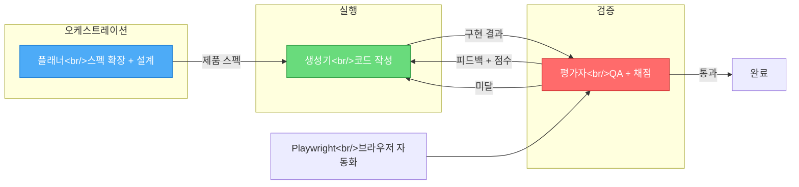

## 개요

이전 포스트들에서 하네스의 기본 개념(가드레일/모니터링/피드백 루프 3요소), 장기 실행 에이전트의 체크포인트와 상태 관리, 그리고 플러그인 생태계를 다뤘다. 이번 포스트에서는 **기존에 다루지 않은 두 가지 관점**을 정리한다. 첫째, 실베개발자의 YouTube 영상에서 제시하는 **프롬프트 → 컨텍스트 → 하네스 → 에이전틱 4축 프레임워크**와 "프롬프트는 부탁, 하네스는 물리적 차단"이라는 핵심 철학. 둘째, Anthropic의 하네스 디자인 문서를 분석한 TILNOTE 아티클에서 나온 **플래너-생성기-평가자 3인조 아키텍처**와 스프린트 계약 패턴. 관련 포스트: [Long-Running Agents와 하네스 엔지니어링](/ko/posts/2026-03-30-long-running-agents/), [HarnessKit 개발기 #3](/ko/posts/2026-03-25-harnesskit-dev3/)

<!--more-->

---

## 4축 프레임워크 — 프롬프트부터 에이전틱까지

[프롬프트 엔지니어링은 끝났습니다: 이제 '하네스'의 시대입니다](https://www.youtube.com/watch?v=6gvnDSAcZww) 영상에서 실베개발자는 AI 활용 방법론을 네 가지 축으로 정리한다. 이 축들은 순서대로 졸업하는 것이 아니라 **전부 동시에 필요한 상호보완적 관계**다.

### 프롬프트의 천장

프롬프트 엔지니어링은 AI에게 "말을 잘 거는 기술"이다. "계산기 만들어줘" 대신 "공학용 계산기, 사인/코사인 지원, GUI 포함"으로 구체화하면 결과가 달라진다. 하지만 천장이 있다. 아무리 정교한 프롬프트를 써도 프로젝트 기술 스택, 코드 구조, DB 스키마를 모르면 좋은 코드가 나올 수 없다.

### 컨텍스트만으로 부족한 이유

컨텍스트 엔지니어링은 프로젝트 구조, 기존 코드, API 문서, 디자인 규칙을 함께 제공한다. Anthropic의 정의: "AI가 일할 때 필요한 정보를 적절하게 골라서 제공하는 기술." 핵심은 많이 주는 것이 아니라 **지금 필요한 것만 정확하게** 주는 것이다.

그런데 컨텍스트를 아무리 잘 설계해도 해결 안 되는 문제가 있다. AI가 정보를 다 알고 있는데 **엉뚱한 짓을 하는 경우**다. 결제 시스템을 맡겼더니 DB 스키마를 마음대로 바꾸거나, 신용카드 번호를 로그에 찍어 버리는 상황. 이것은 정보의 문제가 아니라 **규칙과 울타리의 문제**다.

### 하네스 vs 에이전틱 — 마구 vs 말 훈련

이전 포스트에서 하네스의 기본 개념은 다뤘지만, 에이전틱 엔지니어링과의 관계는 명확히 정리하지 않았다. 영상의 정리가 깔끔하다:

| 관점 | 에이전틱 엔지니어링 | 하네스 엔지니어링 |
|------|-------------------|-----------------|
| 비유 | 말을 훈련시키는 기술 | 마구를 만드는 기술 |
| 초점 | AI가 **어떻게 생각하는가** | AI가 **무엇을 할 수 있고 없는가** |
| 실패 대응 | 프롬프트 변경, 추론 루프 조정 | 규칙/테스트 자동 추가 |
| 인간 역할 | 위임자, 감독자 | 설계자, 경계 설정자 |

핵심은 한 줄: **아무리 잘 훈련된 말이라도 마구 없이는 밭을 갈 수 없다.**

---

## 구조적 반복 불가능성 — 하네스의 핵심 철학

이전 포스트에서 가드레일과 피드백 루프를 다뤘지만, 영상이 제시하는 **가장 중요한 문장**은 별도로 정리할 가치가 있다:

> 에이전트가 규칙을 어겼을 때 "더 잘해봐"라고 프롬프트를 고치는 것이 아니다. **그 실패가 구조적으로 반복 불가능하도록 하네스를 고치는 것**이다.

### 부탁 vs 물리적 차단

AI 에이전트가 프론트엔드 코드에서 DB를 직접 호출했다고 하자.

- **프롬프트 접근**: "DB를 직접 호출하지 마"를 프롬프트에 추가 → 다음번에 또 실수한다. **프롬프트는 부탁이지 강제가 아니기 때문이다.**
- **하네스 접근**: 아키텍처 테스트를 추가해서 프론트엔드 폴더에서 DB를 임포트하는 순간 **빌드가 실패**하도록 만든다. 구조적으로 불가능해진다.

이 구분이 중요한 이유는 기존 포스트에서 "가드레일"을 다룰 때 개념적 수준에 머물렀기 때문이다. "프롬프트는 부탁, 도구적 경계는 물리적 차단"이라는 프레이밍은 실무에서 어떤 수준의 제약을 걸어야 하는지를 판단하는 기준이 된다.

---

## 하네스의 4기둥 — 기존 3요소를 넘어서

이전 포스트에서 가드레일/모니터링/피드백 루프 3요소를 다뤘다. 영상에서는 마틴 파울러가 체계화한 4기둥 구조를 소개하는데, 기존 3요소와 겹치는 부분이 있지만 **새로운 두 가지**가 눈에 띈다.

### 새로운 기둥 1: 도구 경계 (Tool Boundaries)

AI 에이전트가 어떤 도구를 쓸 수 있고 어디까지 접근할 수 있는지를 물리적으로 제한한다:

- **파일 시스템**: `src/` 폴더는 읽기/쓰기, `config/` 폴더는 읽기만 가능
- **API**: 내부 API 호출은 가능, 외부 서비스 호출은 불가
- **데이터베이스**: SELECT는 가능, DROP TABLE은 절대 불가
- **터미널**: 화이트리스트된 명령만 실행 가능

이전 포스트의 "가드레일"은 "하면 안 되는 것을 정의"하는 수준이었다면, 도구 경계는 **접근 자체를 시스템적으로 차단**하는 물리적 계층이다.

### 새로운 기둥 2: 가비지 컬렉션 (코드 품질 자동 정리)

마틴 파울러가 명명한 이 개념은 기존 포스트에서 다루지 않았다. AI가 기존 코드를 참고해서 새 코드를 짜는데, **기존 코드에 나쁜 패턴이 있으면 그대로 따라한다**. 나쁜 패턴이 눈덩이처럼 불어나는 것을 막기 위한 자동 청소 시스템이다:

- 코딩 규칙 위반 자동 감지
- 중복 코드 발견 및 리팩토링 PR 자동 생성
- 데드 코드 자동 제거
- 아키텍처 안티패턴 주기적 체크

핵심: **에이전트가 실수할 때마다 그 실수가 새로운 규칙이 된다.** 린터 규칙 추가, 테스트 추가, 제약 추가 — 하네스가 점점 더 정교해지는 진화적 특성이다.

---

## 플래너-생성기-평가자 아키텍처

여기서부터는 [Anthropic의 하네스 디자인: 플래너-생성기-평가자 아키텍처](https://tilnote.io/pages/69cde2f8516a33dd7927c5c8) 아티클의 내용이다. 이전 포스트에서 다루지 않은 **완전히 새로운 아키텍처 패턴**이다.

### 왜 단일 에이전트가 무너지는가

장시간 작업에서 두 가지 붕괴 원인이 있다:

1. **컨텍스트 불안**: 컨텍스트 창이 차면서 앞서 한 결정이 뒤엉기고, 모델이 한계가 다가온다고 "느끼면" 일을 서둘러 마무리하려는 경향을 보인다
2. **자기평가의 관대함**: 에이전트에게 자기 결과를 평가하라고 하면, 실제 품질이 결함이 있어도 "괜찮다"고 결론내리기 쉽다

이전 포스트에서 다룬 체크포인트/상태 관리는 첫 번째 문제의 해결책이었다. 두 번째 문제의 해결책이 바로 **역할 분리** — GAN에서 빌린 생성기-평가자 루프다.

### GAN의 직관을 엔지니어링으로

GAN(Generative Adversarial Network)에서 생성자와 판별자가 경쟁하며 품질을 올리듯:

- **생성기**: 결과물을 만든다
- **평가자**: 기준에 따라 채점하고 비평한다
- **생성기**: 피드백을 받아 다음 버전을 만든다

"막연한 개선"이 아니라 **"특정 기준을 만족시키는 개선"**이 반복된다. 평가자가 독립적일수록 '봐주기'가 줄어든다. 다만 평가자도 LLM이므로 기본 성향은 관대하다 — 퓨샷 예시와 점수 분해로 채점 습관을 교정해야 한다.

### 플래너의 역할

3인조에서 플래너는 1~4문장짜리 요청을 "충분히 큰" 제품 스펙으로 확장한다. 핵심 원칙:

- **너무 이른 구현 세부사항을 넣지 않는다** — 틀린 결정이 아래로 전염된다
- 제품 맥락과 큰 설계를 중심으로 쓰되, 구현은 여지를 남긴다
- AI 기능을 제품에 섞을 기회를 적극적으로 찾게 만든다

---

## 스프린트 계약 — 완료 정의의 계약화

이전 포스트에서 체크포인트를 다뤘지만, **"뭘 만들면 완료인지"를 어떻게 정의하는가**는 다루지 않았다. Anthropic의 하네스에서 이 간극을 메우는 장치가 스프린트 계약이다.

### 계약 프로세스

각 스프린트 시작 전에 생성기와 평가자가 협상한다:

1. **생성기가 제안**: 구현 계획과 검증 방법을 제시
2. **평가자가 점검**: 스펙에 부합하는지, 테스트 가능한지 확인
3. **합의 후 실행**: 합의된 뒤에만 코드 작성 시작

이 패턴의 핵심은 에이전트 간 의사소통을 **파일 기반 산출물로 고정**하는 것이다. 한쪽이 파일 작성, 다른 쪽이 읽고 수정/추가. 컨텍스트가 흔들려도 작업 상태가 명시적으로 남아 장기 실행에 유리하다.

### 비용 대비 품질

| 방식 | 시간 | 결과 |
|------|------|------|
| 단일 에이전트 | 20분 | 겉보기엔 그럴듯하지만 핵심 기능이 깨짐 |
| 플래너-생성기-평가자 하네스 | 6시간 | 더 많은 기능, 실제 동작하는 수준 |

차이를 만든 결정적 요소: 평가자의 **실제 조작 기반 QA**와 **계약 기반 완료 정의**.

---

## 평가자는 스크린샷이 아니라 직접 조작

평가자가 정지 이미지 한 장만 보고 판단하면 상호작용, 레이아웃, 상태 변화에서 드러나는 품질을 놓친다. Anthropic의 해법:

- 평가자에게 **Playwright 같은 브라우저 자동화 도구**를 붙인다
- 평가자가 스스로 클릭하고, 이동하고, 화면을 관찰한다
- 기준별 점수와 상세 비평을 작성한다

주관적 디자인 품질도 채점 가능하게 만든다. 4개 축:

1. **전체적 디자인 완성도** — 일관된 무드/정체성
2. **독창성** — 템플릿/기본 컴포넌트 느낌 탈피
3. **공예적 완성** — 타이포, 간격, 대비 같은 기본기
4. **기능성** — 사용성

모델은 기능성과 기본기는 무난히 달성하는 경향이 있으므로, 실제로 부족한 **완성도와 독창성에 더 큰 가중치**를 걸어야 안전지대에서 벗어난다.

---

## 모델이 좋아지면 하네스를 덜어내라

이전 포스트에서 다루지 않은 중요한 통찰: **하네스의 각 구성 요소는 "모델이 혼자 못 하는 것"에 대한 가정이다.** 모델이 발전하면 그 가정이 틀어진다.

### 스프린트 제거 사례

더 강해진 모델에서는:
- 스프린트 분해 없이도 2시간 넘게 일관된 빌드가 가능해짐
- 스프린트 구조를 제거하고, 평가도 "마지막에 한 번"으로 축소
- 불필요한 장치가 비용만 늘리는 결과를 방지

다만 평가자가 완전히 불필요해지는 것은 아니다. 과제가 모델의 신뢰 경계 밖에 걸릴 때 — 예를 들어 핵심 상호작용이 자꾸 스텁으로 남는 경우 — 평가자는 여전히 값비싼 보험이다.

**실천 원칙**: 새 모델이 나올 때마다 하네스를 스트레스 테스트하고, 짐이 된 부분을 떼어내는 재설계를 수행한다.

---

## 빠른 링크

- [프롬프트 엔지니어링은 끝났습니다: 이제 '하네스'의 시대입니다 (YouTube)](https://www.youtube.com/watch?v=6gvnDSAcZww) — 실베개발자, 4축 프레임워크와 하네스 4기둥 구조
- [Anthropic의 하네스 디자인: 플래너-생성기-평가자 아키텍처 (TILNOTE)](https://tilnote.io/pages/69cde2f8516a33dd7927c5c8) — Anthropic 하네스 디자인 문서 분석
- [Harness design for long-running application development (Anthropic)](https://docs.anthropic.com/en/docs/build-with-claude/prompt-engineering) — 원문 참고
- [Long-Running Agents와 하네스 엔지니어링](/ko/posts/2026-03-30-long-running-agents/) — 이전 포스트: 체크포인트, 상태 관리, 3요소
- [HarnessKit 개발기 #3](/ko/posts/2026-03-25-harnesskit-dev3/) — 이전 포스트: 플러그인 트리거, 마켓플레이스

---

## 인사이트

이전 포스트들이 하네스의 **"무엇을"**(가드레일, 모니터링, 피드백 루프)에 집중했다면, 이번 두 소스는 **"왜"와 "어떻게"**를 보완한다.

"왜" 측면에서, 4축 프레임워크는 하네스가 프롬프트나 컨텍스트와 어떤 관계에 있는지를 명확히 한다. 프롬프트는 부탁이고 하네스는 물리적 차단이라는 구분은, 실무에서 "이 규칙을 CLAUDE.md에 쓸 것인가, 린터 규칙으로 강제할 것인가"를 판단하는 기준이 된다.

"어떻게" 측면에서, 플래너-생성기-평가자 아키텍처는 하네스의 구체적 구현 패턴을 제시한다. 특히 스프린트 계약으로 완료 정의를 계약화하고, 평가자에게 Playwright를 붙여 실제 조작 기반 QA를 수행하는 패턴은 바로 적용 가능한 수준이다. 그리고 "모델이 좋아지면 하네스를 덜어내라"는 통찰은 하네스를 영구 불변의 인프라가 아니라 **모델 능력에 대한 가정의 집합**으로 바라보게 한다. HarnessKit 개발에서도 새 모델 출시 때마다 각 스킬의 필요성을 재검증하는 프로세스가 필요하겠다.
