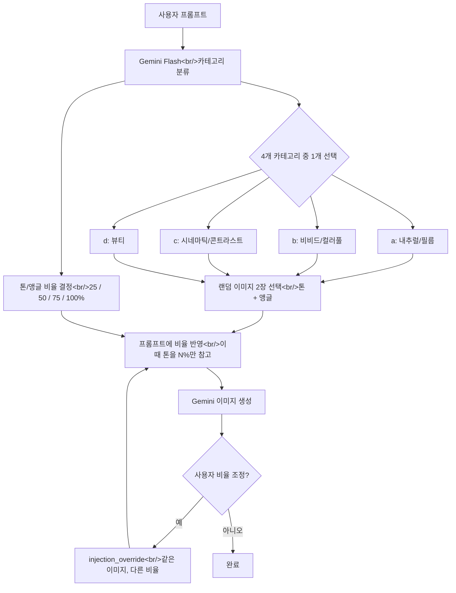

## 개요

[이전 글: #6 — S3 이미지 스토리지 마이그레이션과 브랜딩](/ko/posts/2026-03-30-hybrid-search-dev6/)

이번 #7에서는 7개 커밋에 걸쳐 세 가지 핵심 작업을 진행했다. 첫째, 기존 검색 점수 기반 톤/앵글 이미지 주입 로직을 Gemini Flash LLM 카테고리 분류 방식으로 전면 교체했다. 둘째, S3 마이그레이션 이후 깨진 다운로드 버튼을 백엔드 프록시로 수정했다. 셋째, 사용자가 톤/앵글 반영 비율을 조정하여 이미지를 재생성할 수 있는 기능을 추가했다. 부수적으로 레포에서 대용량 이미지 데이터를 제거하고 `pyproject.toml`로 패키지 관리를 마이그레이션했다.

<!--more-->



---

## LLM 카테고리 분류로 톤/앵글 주입 전면 교체

### 배경

기존 톤/앵글 자동 주입 시스템은 하이브리드 검색 파이프라인을 사용해 후보 이미지를 찾고, `images.json`의 `tone_score`/`angle_score`로 점수를 매겨 상위 20%에서 선택하는 방식이었다. 이 방식은 두 가지 문제가 있었다:

1. 톤/앵글 이미지가 기존 검색용 이미지 풀과 혼재되어 있어 부적절한 이미지가 선택될 수 있었다
2. 프롬프트의 분위기와 무관하게 검색 점수만으로 선택하다 보니 일관성이 떨어졌다

새로운 방식에서는 전용 톤/앵글 레퍼런스 이미지 299장을 4개 카테고리로 분류하여 별도 관리하고, LLM이 프롬프트를 분석해 카테고리와 반영 비율을 결정하도록 했다.

| 카테고리 | 설명 | 이미지 수 |
|---|---|---|
| `a(natural,film)` | 자연스럽고 필름 느낌, 따뜻한 색감 | 129장 |
| `b(vivid,colorful)` | 선명하고 화려한, 높은 채도 | 39장 |
| `c(cinematic,contrast)` | 영화적 무드, 강한 명암 대비 | 80장 |
| `d(beauty)` | 뷰티/인물 스타일, 부드러운 조명 | 51장 |

### 구현

**`injection.py` 전면 재작성:**

기존의 검색+점수 로직(`_search_candidates_for_injection`, `_select_best_category_ref`)을 모두 제거하고, Gemini Flash를 활용한 경량 분류 호출로 교체했다. LLM에게 프롬프트를 분석시키면 카테고리 하나와 톤/앵글 비율(25/50/75/100%)을 JSON으로 반환한다.

```python
CLASSIFICATION_PROMPT = """\
당신은 이미지 생성 프롬프트를 분석하여 가장 적합한 톤/앵글 카테고리를 선택하고,
톤과 앵글의 반영 비율을 결정하는 전문가입니다.

## 반영 비율 가이드
- 25%: 프롬프트가 이미 매우 구체적인 스타일/톤을 명시 → 최소한만 참고
- 50%: 어느 정도 스타일 방향은 있지만 보강 필요
- 75%: 주제 중심이고 스타일 지정이 약해서 많이 참고 필요
- 100%: 스타일 관련 언급이 전혀 없어 전적으로 참고

## 응답 형식 (JSON만 출력)
{{"category": "...", "tone_ratio": N, "angle_ratio": N}}
"""
```

분류 결과에 따라 해당 카테고리 폴더에서 톤용, 앵글용 이미지를 각각 랜덤 선택한다. 같은 카테고리에서 선택하되 서로 다른 이미지를 사용한다.

**스키마 변경:**

`InjectedReference`에서 `score: float`을 제거하고 `category: str` + `ratio: int`를 추가했다. `InjectionInfo`에도 `category` 필드를 추가하여 프론트엔드에서 어떤 카테고리로 분류됐는지 표시할 수 있게 했다.

```python
class InjectedReference(BaseModel):
    filename: str
    category: str = ""
    ratio: int = 100
```

**프롬프트 구성 변경:**

비율 정보를 직접 프롬프트에 반영하도록 `build_generation_prompt()`를 업데이트했다:

```
톤/색감 레퍼런스. 무조건 이 이미지의 색감, 톤, 무드만 참고하세요.
이때 톤을 {N}%만 참고하여 반영하세요.
이 이미지의 구도, 피사체, 형태, 배경 등 색감 외 요소는 절대로 반영하지 마세요.
```

**S3 통합:**

299장의 톤/앵글 레퍼런스 이미지를 S3에 업로드하고, `ref_dirs`에 4개 카테고리 서브디렉토리를 등록하여 기존 `image_ref_1~4`와 동일한 방식으로 서빙되도록 했다. S3 키 구조는 `refs/tone_angle_image_ref/{category}/{filename}`으로, 로컬 디렉토리 구조를 그대로 반영한다.

### 문제 해결

처음 S3에 업로드할 때 키 구조가 `refs/a(natural,film)/...`으로 플랫하게 들어가 기존 `image_ref_1~4` 이미지와 같은 레벨에 혼재됐다. 사용자 피드백에 따라 `refs/tone_angle_image_ref/a(natural,film)/...`으로 상위 폴더를 추가하여 레포 구조와 일치시키고, `build_ref_key_cache`에서 `Path.relative_to("data")`를 사용해 중첩 디렉토리도 올바르게 캐싱하도록 수정했다.

```python
# 기존: p.name만 사용 → "a(natural,film)"
# 수정: data/ 기준 상대경로 → "tone_angle_image_ref/a(natural,film)"
try:
    ref_subdir = str(p.relative_to("data"))
except ValueError:
    ref_subdir = p.name
```

---

## S3 이미지 다운로드 버튼 수정

### 배경

#6에서 S3로 이미지 스토리지를 마이그레이션한 후, 다운로드 버튼이 작동하지 않는 문제가 발견됐다. 버튼을 누르면 이미지가 새 탭에서 열리거나 화면에 확대되기만 할 뿐, 파일로 저장되지 않았다.

### 원인 분석

HTML `<a download>` 속성은 **same-origin URL에서만 동작**한다. S3 마이그레이션 전에는 `/images/filename`으로 같은 도메인에서 서빙되어 문제가 없었지만, 마이그레이션 후에는 `https://<bucket>.s3.<region>.amazonaws.com/...` 형태의 cross-origin URL로 바뀌면서 브라우저가 `download` 속성을 무시하게 됐다.

추가로, 새로 생성된 이미지는 data URI(`data:image/png;base64,...`)를 사용하므로 `fetch()`가 정상 동작했지만, 히스토리 이미지는 presigned S3 URL이라 CORS 정책에 의해 `fetch()`도 차단됐다.

### 구현

2단계로 수정했다:

**1단계 -- 프론트엔드 `downloadImage` 헬퍼 추가:**

`<a href download>` 태그를 `<button>`으로 교체하고, JavaScript로 blob을 fetch하여 프로그래매틱 다운로드를 트리거하도록 변경했다.

```typescript
export const downloadImage = async (filename: string): Promise<void> => {
  const downloadUrl = `/images/${encodeURIComponent(filename)}/download`;
  const response = await fetch(downloadUrl, { credentials: 'include' });
  if (!response.ok) throw new Error(`Download failed: ${response.status}`);
  const blob = await response.blob();
  const blobUrl = URL.createObjectURL(blob);
  const a = document.createElement('a');
  a.href = blobUrl;
  a.download = filename;
  document.body.appendChild(a);
  a.click();
  document.body.removeChild(a);
  URL.revokeObjectURL(blobUrl);
};
```

**2단계 -- 백엔드 다운로드 프록시 엔드포인트:**

`GET /images/{filename}/download` 엔드포인트를 추가하여 S3에서 이미지 바이트를 직접 스트리밍하고 `Content-Disposition: attachment` 헤더를 붙여 반환한다. 기존 `/images/{filename}`은 302 리다이렉트 방식이라 CORS 문제를 해결할 수 없었기 때문에, 별도 프록시가 필요했다.

소유권 검증(`check_file_ownership`)과 `Content-Disposition` 헤더 인젝션 방어(따옴표 제거)도 포함했다.

---

## 사용자 비율 조정 재생성

### 배경

LLM이 결정한 톤/앵글 반영 비율이 사용자의 의도와 다를 수 있다. 예를 들어 LLM이 톤 75%로 판단했지만, 사용자는 25%로 낮추고 싶을 수 있다. 첫 번째 생성은 AI가 판단하되, 생성된 이미지를 클릭해 상세 화면에서 비율을 변경하여 재생성할 수 있어야 한다.

### 구현

**`InjectionOverride` 스키마 추가:**

백엔드에 `InjectionOverride` 모델을 추가하고, `GenerateImageRequest`에 `injection_override` 옵셔널 필드를 추가했다. 이 필드가 있으면 LLM 분류를 건너뛰고 사용자가 지정한 비율과 같은 이미지 파일로 바로 생성한다.

```python
class InjectionOverride(BaseModel):
    tone_filename: str
    angle_filename: str
    category: str
    tone_ratio: int = Field(ge=25, le=100)
    angle_ratio: int = Field(ge=25, le=100)
```

**프론트엔드 비율 조정 UI:**

`GeneratedImageDetail` 컴포넌트에 톤/앵글 비율 뱃지를 클릭하면 25 -> 50 -> 75 -> 100 -> 25로 순환하는 인터랙션을 추가했다. 원래 비율과 달라지면 "비율 변경 재생성" 버튼이 나타나고, 클릭 시 `injection_override`를 포함한 생성 요청을 보낸다.

```typescript
const RATIO_STEPS = [25, 50, 75, 100] as const;
const nextRatio = (current: number) => {
    const idx = RATIO_STEPS.indexOf(current as typeof RATIO_STEPS[number]);
    return RATIO_STEPS[(idx + 1) % RATIO_STEPS.length];
};
```

---

## 레포 경량화와 패키지 관리 마이그레이션

S3에 모든 이미지가 올라간 상태에서, 레포에 남아있던 대용량 이미지 레퍼런스 데이터(zip 분할 파일들)를 모두 제거하고 `.gitignore`에 레퍼런스 이미지 디렉토리와 zip 파일을 추가했다. 또한 `requirements.txt` 기반 의존성 관리를 `pyproject.toml`로 마이그레이션하여 표준 Python 패키지 관리 방식으로 전환했다.

---

## 커밋 로그

| 순서 | 유형 | 메시지 | 변경 파일 수 |
|:---:|:---:|---|:---:|
| 1 | chore | ignore ref image dirs and zip files from repo | 1 |
| 2 | chore | migrate to pyproject.toml for package management | 3 |
| 3 | feat | replace score-based injection with LLM category classification | 11 |
| 4 | fix | use tone_angle_image_ref parent folder in S3 key structure | 2 |
| 5 | remove | get rid of all the image reference data from the repo | 20 |
| 6 | fix | download button now works for S3-hosted images | 4 |
| 7 | feat | allow user to adjust tone/angle ratios and regenerate | 5 |

---

## 인사이트

**LLM을 분류기로 활용하면 키워드 매핑보다 훨씬 유연하다.** 처음에는 키워드 기반으로 카테고리를 매핑하려 했지만, 프롬프트가 "감성적인 카페 인테리어" 같이 간접적인 표현을 쓰는 경우가 많아 대부분의 프롬프트에서 제대로 동작하지 않을 것이 분명했다. Gemini Flash를 경량 분류기로 쓰면 호출 한 번에 카테고리와 비율을 동시에 결정할 수 있고, 응답 형식을 JSON으로 고정하면 파싱도 간단하다.

**S3 마이그레이션의 숨은 비용은 CORS다.** 로컬 파일 서빙에서 S3로 바꾸는 것 자체는 비교적 단순하지만, 기존에 same-origin을 암묵적으로 가정하던 기능들이 하나씩 깨진다. `<a download>` 속성이 cross-origin에서 무시되는 것은 HTML 스펙에 명시되어 있지만 실제로 겪기 전까지는 간과하기 쉽다. 백엔드 프록시 엔드포인트를 두면 CORS를 완전히 우회할 수 있지만, 트래픽이 서버를 경유하게 되므로 대용량 파일이 많다면 별도 CDN 설정이 필요할 수 있다.

**사용자 오버라이드는 처음부터 설계에 포함시키는 것이 좋다.** AI가 결정한 값을 사용자가 조정할 수 있는 인터페이스를 처음부터 고려하면, 나중에 기능 추가 시 스키마를 크게 바꾸지 않아도 된다. 이번에는 `injection_override` 필드를 한 번에 추가했지만, 만약 처음 설계 시 비율 파라미터를 분리해뒀다면 더 자연스러운 확장이 됐을 것이다.
