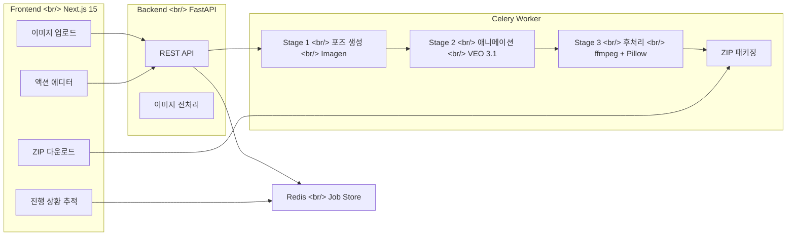

## 개요

PopCon(Pop + Icon)은 캐릭터 이미지 **한 장**을 입력받아 LINE 규격에 맞는 **애니메이션 이모지 세트**를 자동으로 생성하는 웹 애플리케이션이다. Google의 Imagen(Nano Banana 2)으로 포즈를 생성하고, VEO 3.1로 애니메이션을 만들고, ffmpeg + Pillow로 후처리하는 3단계 AI 파이프라인을 하루 만에 처음부터 끝까지 구축했다.

이 포스트는 사전 조사 포스트와 함께 읽으면 좋다:
- [AI 이미지 생성 에코시스템](/ko/posts/2026-04-02-ai-image-gen-ecosystem/) — 기술 서베이
- [애니메이션 이모지 시장 조사](/ko/posts/2026-04-02-emoji-market-research/) — 시장 분석

<!--more-->

---

## 프로젝트 구조와 파이프라인

### 배경

LINE 애니메이션 이모지는 180x180px APNG 포맷으로, 세트당 8~40개, 파일당 300KB 이하라는 엄격한 규격이 있다. 수작업으로 만들면 캐릭터당 수일이 걸리는 작업을 AI로 자동화하는 것이 목표다.

### 아키텍처

전체 시스템은 4개 서비스로 구성된다:



Docker Compose로 전체 서비스를 관리한다:

```yaml
services:
  redis:
    image: redis:7-alpine
  backend:
    build: ./backend
    ports: ["8000:8000"]
    environment:
      - POPCON_GOOGLE_API_KEY=${POPCON_GOOGLE_API_KEY}
      - POPCON_REDIS_URL=redis://redis:6379/0
    volumes:
      - /tmp/popcon:/tmp/popcon
  worker:
    build: ./backend
    command: celery -A worker.celery_app worker --loglevel=info --concurrency=2
  frontend:
    build: ./frontend
    ports: ["3000:3000"]
```

---

## In-Memory 상태에서 Redis로 전환

### 배경

초기 구현에서는 `JOB_STORE`를 Python dict로 관리했다. FastAPI 프로세스에서 job을 생성하고 Celery worker에서 상태를 업데이트하는 구조였는데, 문제가 있었다 — Docker Compose에서 backend와 worker는 **별도 프로세스**다. 같은 이미지를 사용하더라도 메모리는 공유되지 않는다.

### 문제 해결

Worker가 `update_job`을 호출해도 backend의 `/api/job/{job_id}/status` 엔드포인트에서는 여전히 `queued` 상태로 보였다. 프론트엔드의 polling이 영원히 "Generating..."에 머물러 있었다.

해결은 Redis를 상태 저장소로 사용하는 것이었다:

```python
# job_store.py — Redis-backed job store
def save_job(status: JobStatus) -> None:
    """Persist a JobStatus to Redis."""
    r = _get_redis()
    r.set(_key(status.job_id), status.model_dump_json(), ex=86400)

def get_job(job_id: str) -> JobStatus | None:
    """Load a JobStatus from Redis."""
    r = _get_redis()
    data = r.get(_key(job_id))
    if data is None:
        return None
    return JobStatus.model_validate_json(data)
```

Pydantic의 `model_dump_json()`과 `model_validate_json()`으로 직렬화/역직렬화를 처리하고, TTL 24시간을 설정해 자동 정리되게 했다. 기존 코드의 `JOB_STORE[job_id]` 접근을 모두 `get_job()` / `save_job()` 호출로 교체하면서 5개 파일, 175줄 추가에 58줄 삭제가 발생했다.

---

## VEO 3.1 API와의 사투

### 배경

VEO 3.1은 Image-to-Video (I2V) 생성 모델로, 시작 이미지와 모션 프롬프트를 받아 영상을 생성한다. 원래 계획은 시작/끝 프레임을 모두 제공하는 dual-frame I2V를 사용하는 것이었다.

### 연속된 4개의 fix 커밋

VEO API 연동에서 연속으로 4개 이슈가 발생했다:

**1. 모델 ID 오류** — 문서에 나온 모델명이 실제 API에서 거부당했다. `veo-3.1-generate-preview`가 올바른 ID였다.

**2. 최소 duration** — VEO 3.1의 최소 영상 길이가 4초인데, LINE 이모지는 최대 4초다. 정확히 맞아떨어지긴 했지만, 처음에 2초로 설정했다가 API 에러가 발생했다.

**3. dual-frame 미지원** — `last_frame` 파라미터가 VEO 3.1 preview에서 아직 지원되지 않았다. 시작 프레임 + 강한 모션 프롬프트로 우회했다:

```python
# NOTE: last_frame (dual-frame I2V) is not yet supported on VEO 3.1 preview.
# We rely on the start frame + strong motion prompt instead.
async def animate(self, start_image, end_image, action, output_dir):
    full_motion = (
        f"{action.motion_prompt} "
        f"The character transitions to: {action.end_prompt}"
    )
    prompt = build_motion_prompt(full_motion)
    video_bytes = await self._generate_video(prompt, start_image, end_image)
```

**4. video_bytes가 None** — VEO는 영상을 inline bytes가 아닌 download URI로 반환했다. `video.video.uri`에서 `httpx.get`으로 다운로드하는 분기를 추가하고, 리다이렉트 따라가기도 켜야 했다:

```python
for video in operation.result.generated_videos:
    if video.video.video_bytes:
        return video.video.video_bytes
    if video.video.uri:
        resp = await asyncio.to_thread(
            httpx.get,
            video.video.uri,
            headers={"x-goog-api-key": self.api_key},
            timeout=120,
            follow_redirects=True,
        )
        resp.raise_for_status()
        return resp.content
```

---

## APNG 압축 전략

### 배경

LINE 이모지는 파일당 300KB 제한이 있다. VEO가 생성하는 영상에서 12프레임을 추출하면 180x180 APNG가 쉽게 300KB를 넘는다.

### 구현

반복 압축 전략을 구현했다. 프레임 수와 색상 수를 단계적으로 줄여가며 300KB 이하가 될 때까지 시도한다:

```python
strategies = [
    (total_frames, None),   # 전체 프레임, 풀 컬러
    (10, None),             # 10프레임, 풀 컬러
    (10, 128),              # 10프레임, 128색
    (8, 64),                # 8프레임, 64색
    (5, 32),                # 5프레임, 32색
]

for frame_count, colors in strategies:
    n = min(frame_count, total_frames)
    # 균등 간격으로 프레임 선택
    indices = [round(i * (total_frames - 1) / (n - 1)) for i in range(n)]
    selected = [frame_paths[i] for i in indices]
    
    # 프레임 수에 맞춰 delay 비례 조정
    adjusted_delay_ms = max(1, round(original_duration_ms / n))
    
    if colors is not None:
        _quantize_frames(copies, colors)
    
    build_apng(copies, output_path, delay_ms=adjusted_delay_ms)
    if output_path.stat().st_size <= max_size:
        return output_path
```

프레임을 줄일 때 균등 간격으로 선택하고, delay를 비례적으로 늘려서 전체 재생 시간이 유지되도록 했다.

---

## 배경 제거의 실패와 전략 전환

### 배경

초기 설계에서는 rembg로 배경을 제거하고 투명 APNG를 만들 계획이었다. VEO 영상에서 프레임을 추출한 후 rembg(`u2net`)로 배경을 제거하는 파이프라인이었다.

### 문제 해결

실제 결과물을 검수하면서 여러 문제가 연쇄적으로 발생했다:

**1단계 — 배경 아티팩트**: rembg가 VEO 영상의 바닥/그림자를 완전히 제거하지 못해 회색 얼룩이 남았다. 모션 프롬프트에 `"Plain solid white background. No shadows, no ground, no floor"` 를 추가하고, rembg 모델을 `isnet-general-use`로 변경했다.

**2단계 — 구름 효과**: isnet 모델이 배경을 더 공격적으로 제거하면서 캐릭터의 일부분까지 날려버렸다. rembg confidence와 pixel brightness를 조합한 커스텀 alpha 마스크를 시도했지만, 모자이크 패턴처럼 보이는 부작용이 생겼다.

**3단계 — 전략 전환**: rembg를 완전히 제거하기로 결정했다. 대신:
- 포즈 생성 프롬프트에 `"Plain solid white (#FFFFFF) background. NOT transparent, NOT checkerboard pattern"` 명시
- VEO 모션 프롬프트에도 동일한 배경 지시 추가
- 배경 제거 대신 brightness 기반 content crop으로 전환

```python
def resize_frame(input_path, output_path, size=None, padding_ratio=0.05):
    """Crop to content via brightness detection, scale to fill."""
    img = Image.open(input_path).convert("RGB")
    arr = np.array(img)

    # 흰색/검정색이 아닌 콘텐츠 픽셀 검출
    brightness = arr.astype(float).mean(axis=2)
    content_mask = (brightness > 10) & (brightness < 245)

    rows = np.any(content_mask, axis=1)
    cols = np.any(content_mask, axis=0)

    if rows.any() and cols.any():
        y_min, y_max = np.where(rows)[0][[0, -1]]
        x_min, x_max = np.where(cols)[0][[0, -1]]
        img = img.crop((x_min, y_min, x_max + 1, y_max + 1))

    # 캔버스 채우기 (5% 패딩)
    pad = int(min(size) * padding_ratio)
    target_w = size[0] - pad * 2
    target_h = size[1] - pad * 2
    scale = min(target_w / img.width, target_h / img.height)
    img = img.resize((int(img.width * scale), int(img.height * scale)), Image.LANCZOS)
```

결과적으로 rembg 의존성(`onnxruntime` 포함)을 완전히 제거하여 Docker 이미지 크기와 처리 시간이 크게 줄었다.

---

## LINE 규격 검증과 파일 네이밍 수정

### 배경

LINE Creators Market 가이드라인을 Firecrawl로 스크래핑해서 현재 config와 대조했다.

### 구현

대부분의 규격은 맞았지만 두 가지 불일치가 발견됐다:

| 항목 | LINE 공식 | 기존 구현 | 상태 |
|------|-----------|-----------|------|
| 파일 네이밍 | `001.png` ~ `040.png` | `00_happy.png` | 불일치 |
| 최소 세트 수 | 8개 | 1개 (테스트용) | 불일치 |

패키저에서 파일명을 LINE 규격에 맞게 변환하도록 수정했다:

```python
with zipfile.ZipFile(zip_path, "w", compression=zipfile.ZIP_DEFLATED) as zf:
    zf.write(tab_path, "tab.png")
    for i, emoji_path in enumerate(emoji_paths):
        line_name = f"{i + 1:03d}.png"  # 001.png, 002.png, ...
        zf.write(emoji_path, line_name)
```

내부 작업 파일은 `00_happy.png` 같은 설명적 이름을 유지하되, ZIP 아카이브에 추가할 때만 LINE 규격 이름으로 변환하는 전략이다.

---

## 이미지 전처리 파이프라인

### 배경

사용자가 업로드하거나 AI가 생성한 캐릭터 이미지가 정사각형이 아니거나 여백이 많은 경우가 있었다. Imagen이 1:1 비율이 아닌 이미지를 생성하는 경우도 있었고, 한 번은 이미지 상단에 캐릭터가 복제되어 나타나는 문제도 있었다.

### 구현

두 갈래 수정을 진행했다:

**1. 업로드 이미지 전처리** — numpy 기반 content detection으로 여백을 자르고 정사각형 패딩 후 512x512로 리사이즈:

```python
def preprocess_character_image(image_path: Path) -> None:
    img = Image.open(image_path).convert("RGB")
    arr = np.array(img)
    
    brightness = arr.astype(float).mean(axis=2)
    content_mask = (brightness > 10) & (brightness < 245)
    
    # ... bounding box 검출 후 crop ...
    
    max_side = max(img.width, img.height)
    pad = int(max_side * 0.05)
    canvas_size = max_side + pad * 2
    canvas = Image.new("RGB", (canvas_size, canvas_size), (255, 255, 255))
    canvas = canvas.resize((512, 512), Image.LANCZOS)
    canvas.save(image_path)
```

**2. Imagen 1:1 비율 강제** — API의 `aspect_ratio` 파라미터를 활용:

```python
config=types.GenerateContentConfig(
    response_modalities=["IMAGE"],
    image_config=types.ImageConfig(aspect_ratio="1:1"),
)
```

**3. 캐릭터 복제 방지** — 프롬프트에 명시적 지시 추가:

```
"Draw exactly ONE character, centered and filling the frame.
 Do NOT create multiple copies, sticker sheets, or sprite sheets."
```

---

## 프론트엔드 진행 상황 UX 개선

### 배경

이모지 24개를 생성하는 데 수 분이 걸리는데, 기존 UI는 단순한 progress bar와 작은 회색 점으로만 상태를 표시했다. 어떤 이모지가 어느 단계인지 전혀 알 수 없었다.

### 구현

Backend에서 이미 제공하고 있지만 UI에서 활용하지 않던 데이터가 있었다:
- `EmojiResult`의 per-emoji `status` (`generating_pose`, `animating`, `processing`, `done`, `failed`)
- `EmojiResult`의 `action` name (happy, laugh, cry...)

`ProgressTracker` 컴포넌트를 전면 재작성했다:

1. **Stage pipeline** — 3단계(Poses / Animation / Processing) 미니 스텝퍼로 현재 위치를 시각화
2. **Emoji grid** — 각 이모지를 이름 + 상태 아이콘 + 컬러 보더로 표시. 활성 이모지는 펄스 애니메이션
3. **경과 시간** — 우측 상단에 실시간 타이머
4. **한글 stage 라벨** — `generating_poses` 대신 "캐릭터 포즈 생성 중"

---

## Docker 환경 이슈

### 배경

개발 과정에서 Docker 관련 이슈가 반복적으로 발생했다.

### 문제 해결

**Favicon이 안 보이는 문제** — Next.js App Router의 `app/favicon.ico`가 `public/favicon.ico`보다 우선한다는 것을 몰랐다. `app/favicon.ico`를 교체한 후에도 Docker 컨테이너가 이전 빌드를 사용하고 있어서 반영되지 않았다.

```bash
# 컨테이너 리빌드 필수
docker compose build frontend && docker compose up -d frontend
```

**API 키 오염** — `.env` 파일의 `POPCON_GOOGLE_API_KEY` 값 끝에 ` venv`가 붙어있었다. 복사-붙여넣기 실수로 발생한 문제였는데, 에러 메시지가 `400 INVALID_ARGUMENT: API key not valid`로만 나와서 원인 파악에 시간이 걸렸다.

**Worker 재시작 누락** — `docker compose restart`는 이미지 변경을 감지하지 않는다. Worker는 backend과 같은 이미지를 사용하므로 backend만 빌드하면 worker도 새 이미지를 사용하지만, compose가 이를 감지하지 못할 수 있다. `--force-recreate` 플래그가 필요했다.

---

## VEO 영상의 엣지 아티팩트

### 배경

생성된 이모지의 좌우 가장자리에 검은 선이 나타나는 문제가 있었다. VEO 3.1이 영상 생성 시 경계 부분에 아티팩트를 남기는 것으로 보였다.

### 구현

ffmpeg의 crop 필터를 추가해서 영상 가장자리 2%를 잘라냈다:

```python
# 기존
"-vf", f"fps={fps}",

# 수정 — 2% 엣지 크롭 후 프레임 추출
"-vf", f"crop=in_w*0.96:in_h*0.96:in_w*0.02:in_h*0.02,fps={fps}",
```

---

## 커밋 로그

| 메시지 | 변경 |
|--------|------|
| docs: add design spec and implementation plan | 신규 |
| feat: project scaffolding with config and LINE emoji constants | +186 |
| feat: add Pydantic models for job status, emoji results, and action presets | +109 |
| feat: add 24 default emoji action presets with prompt templates | +219 |
| feat: add frame processor for resize, bg removal, and frame extraction | +204 |
| fix: use rembg[cpu] for onnxruntime backend | +1 -1 |
| feat: add APNG builder with iterative compression strategy | +195 |
| feat: add ZIP packager with tab image generation | +96 |
| feat: add Nano Banana 2 pose generator with subject consistency | +107 |
| feat: add VEO 3.1 animator with dual-frame I2V support | +98 |
| feat: add Celery worker with 3-stage emoji generation pipeline | +251 |
| feat: add FastAPI routes for emoji generation, status, preview, and download | +186 |
| feat: add Docker Compose setup for backend, worker, and Redis | +34 |
| feat: scaffold Next.js frontend with PopCon brand colors | +6890 |
| feat: add frontend components, editor flow, and landing page | +887 -58 |
| docs: add bilingual English/Korean README | +307 |
| fix: align frontend API URLs with backend routes | +23 -11 |
| fix: replace in-memory JOB_STORE with Redis-backed job store | +175 -58 |
| fix: correct character image URL double-prefixing and align status types | +11 -2 |
| fix: use config.last_frame instead of end_image for VEO 3.1 dual-frame API | +16 -8 |
| fix: use correct VEO model ID veo-3.1-generate-preview | +1 -1 |
| fix: set VEO duration to 4s (API minimum), trim in post-processing | +1 -1 |
| fix: disable last_frame (unsupported on VEO 3.1 preview), use start frame + strong prompt | +9 -5 |
| chore: temporarily allow 1 emoji per set for testing | +2 -2 |
| fix: download VEO video from URI when video_bytes is None | +15 -1 |
| fix: follow redirects when downloading VEO video from URI | +1 |
| fix: serve emoji files via API endpoint, convert file paths to URLs | +22 -2 |

---

## 인사이트

**AI API는 문서를 믿지 말고 직접 쳐봐야 한다.** VEO 3.1은 모델 ID, 최소 duration, dual-frame 지원, 응답 형식 등 4가지가 문서와 달랐다. 각각 별도의 fix 커밋이 필요했다.

**프로세스 격리를 간과하면 아끼려던 시간보다 더 소모한다.** Docker Compose의 backend와 worker가 같은 이미지를 쓰더라도 메모리는 공유하지 않는다는 사실을 깨닫는 데 시간이 걸렸다. 처음부터 Redis를 job store로 사용했으면 5개 파일 리팩토링을 피할 수 있었다.

**배경 제거는 과감하게 포기하는 것이 나을 때가 있다.** rembg(`u2net` -> `isnet-general-use` -> 커스텀 alpha 마스크)를 3번 바꿔가며 시도했지만, 결국 배경을 제거하지 않고 흰 배경 이미지를 생성하는 전략이 가장 깔끔했다. 의존성(onnxruntime)도 줄이고 처리 시간도 단축됐다.

**프롬프트 엔지니어링은 부정문이 핵심이다.** "solid white background"만으로는 AI 모델이 체커보드 패턴이나 그라데이션을 생성하기도 했다. `"NOT transparent, NOT checkerboard pattern"`, `"Do NOT create multiple copies"` 같은 명시적 부정문이 훨씬 효과적이었다.

**LINE 규격은 파일 이름까지 검사한다.** API 응답 포맷이나 이미지 크기만 맞추면 될 줄 알았는데, ZIP 내부 파일명이 `001.png` ~ `040.png`이어야 하는 등 세세한 규격이 있었다. 제출 전에 공식 가이드라인을 정독하는 것이 중요하다.
