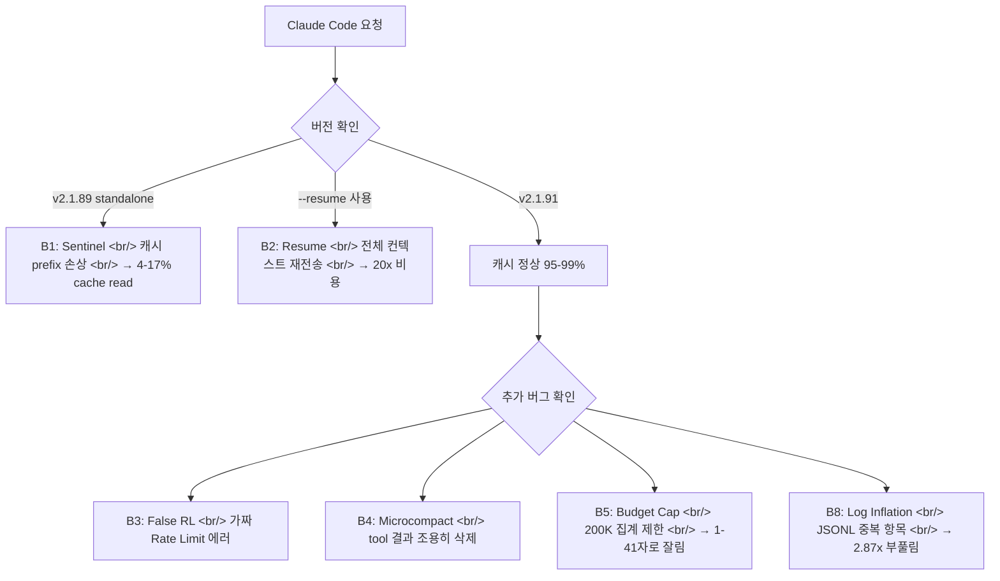

## 개요

2026년 4월 1일, Claude Code Max 20 플랜($200/월)을 사용하던 한 개발자가 평범한 코딩 세션에서 70분 만에 사용량 100%를 소진하는 경험을 했다. JSONL 로그 분석 결과 cache read 비율이 평균 36.1%(최저 21.1%)에 불과했다 — 정상이라면 90% 이상이어야 한다.

이것이 [ArkNill/claude-code-cache-analysis](https://github.com/ArkNill/claude-code-cache-analysis) 레포지토리가 탄생한 배경이다. 개인 디버깅에서 시작해 커뮤니티 기반 체계적 분석으로 발전한 이 프로젝트는, 프록시(cc-relay)를 통한 실측 데이터로 **5개 레이어에 걸친 7가지 버그**를 확인했다.

<!--more-->

## 배경: 70분 만에 소진된 플랜

v2.1.89 standalone 바이너리에서 캐시 read 비율이 급락했다. 즉각적인 workaround로 v2.1.68(npm)로 다운그레이드하자 cache read가 **97.6% 평균**(119 entries)으로 즉시 회복 — 회귀가 v2.1.89에서 발생했음이 확인됐다.

이후 `ANTHROPIC_BASE_URL` 환경 변수를 이용한 투명 모니터링 프록시(cc-relay)를 구성해 요청별 데이터를 수집하기 시작했다. 91개 이상의 관련 GitHub 이슈에서 같은 현상을 보고한 다른 사용자들과 함께, 퍼즐 조각들을 하나의 구조화된 분석으로 통합했다.

## 7가지 확인된 버그 (v2.1.91 기준)



| 버그 | 동작 | 영향 | v2.1.91 상태 |
|------|------|------|--------------|
| **B1** Sentinel | Standalone 바이너리가 캐시 prefix 손상 | 4-17% cache read (v2.1.89) | **수정됨** |
| **B2** Resume | `--resume`이 전체 컨텍스트를 캐시 없이 재전송 | 재시작당 20x 비용 | **수정됨** |
| **B3** False RL | 클라이언트가 가짜 에러로 API 호출 차단 | 즉각적인 "Rate limit reached", API 호출 0건 | **미수정** |
| **B4** Microcompact | 세션 중간에 tool 결과가 조용히 삭제 | 컨텍스트 품질 저하 | **미수정** |
| **B5** Budget Cap | tool 결과 200K 집계 제한 | 이전 결과가 1-41자로 잘림 | **미수정** (MCP만 우회 가능) |
| **B8** Log Inflation | Extended thinking이 JSONL 항목 중복 | 2.87x 로컬 토큰 부풀림 | **미수정** |
| **Server** | 피크 시간 제한 강화 + 1M 빌링 버그 | 실효 쿼터 감소 | **의도적 설계** |

## 핵심 버그 상세 분석

### B1: Sentinel 버그 (수정됨)

Standalone 바이너리는 단일 ELF 64비트 실행 파일(~228MB, 내장 Bun 런타임)로 배포된다. 이 바이너리에는 `cch=00000`으로 캐시 prefix를 교체하는 Sentinel 메커니즘이 포함되어 있었고, 이것이 캐시 prefix를 손상시켰다.

npm 패키지(`cli.js`, ~13MB, Node.js 실행)에는 이 로직이 없어 버그에 면역이었다.

v2.1.91에서 `stripAnsi`가 `Bun.stripANSI`를 통해 라우팅되도록 변경되면서 Sentinel 격차가 닫혔다. **현재 npm과 standalone은 동일하게 84.7% cold-start cache read를 달성한다.**

### B2: Resume 버그 (수정됨)

`--resume` 플래그 사용 시 전체 컨텍스트가 캐시 없이 billable input으로 재전송됐다. 재시작당 최대 20x 비용이 발생하는 심각한 버그였다. v2.1.91에서 transcript chain break fix가 적용됐지만, **`--resume` 및 `--continue` 사용 자체를 피하는 것을 권장한다.**

### B3: False Rate Limiting (미수정)

클라이언트 측에서 실제 API 호출 없이 "Rate limit reached" 에러를 생성한다. 151개 항목 / 65개 세션에서 측정됐다. API를 전혀 호출하지 않으면서 마치 서버 제한에 걸린 것처럼 동작한다.

### B4 & B5: Microcompact와 Budget Cap (미수정)

세션 중간에 tool 결과가 조용히 삭제되는 현상(327건 감지)과, 200K 집계 제한으로 이전 파일 읽기 결과가 1-41자로 잘리는 현상이 함께 작동한다. **약 15-20회 tool 사용 후 이전 컨텍스트가 사실상 사라진다고 볼 수 있다.**

### Cache TTL (버그 아님)

13시간 이상 유휴 상태 후 재개 시 350K 토큰 캐시가 완전 재구성된다. 캐시 write 비용은 $3.75/M, read는 $0.30/M — 12.5x 차이다. 5-26분의 짧은 유휴는 96%+ 캐시를 유지한다. 이것은 버그가 아닌 설계(5분 TTL)지만 알아두어야 할 사항이다.

## npm vs Standalone: v2.1.90 벤치마크

| 지표 | npm | Standalone | 승자 |
|------|-----|-----------|------|
| 전체 cache read % | 86.4% | 86.2% | 동률 |
| 안정 세션 | 95-99.8% | 95-99.7% | 동률 |
| Sub-agent cold start | 79-87% | 47-67% | npm |
| Sub-agent warmed (5+ req) | 87-94% | 94-99% | 동률 |
| 전체 테스트 사용량 | Max 20의 7% | Max 20의 5% | 동률 |

v2.1.91에서는 sub-agent cold start 격차도 닫혀 **양쪽 모두 동일하게 84.7%를 달성한다.**

## Anthropic의 공식 입장

Lydia Hallie(Anthropic)는 4월 2일 X(트위터)에 다음과 같이 게시했다:

> "피크 시간 제한이 더 엄격해졌고 1M 컨텍스트 세션이 더 커졌습니다. 몇 가지 버그를 수정했지만, 과금 초과는 없었습니다."

권장 사항으로는 Sonnet을 기본으로 사용, effort level 낮추기, 재개 대신 새 세션 시작, `CLAUDE_CODE_AUTO_COMPACT_WINDOW=200000` 설정 등을 제시했다.

분석팀의 측정 데이터는 캐시 버그 수정에는 동의하지만, Anthropic이 언급하지 않은 5개의 추가 메커니즘을 식별했다.

## 지금 당장 할 수 있는 것

1. **v2.1.91로 업데이트** — 최악의 캐시 회귀가 수정됨
2. **npm과 standalone 모두 v2.1.91에서 동일** — 어느 쪽이든 괜찮음
3. **`--resume`과 `--continue` 사용 금지** — 전체 컨텍스트가 billable input으로 재전송됨
4. **주기적으로 새 세션 시작** — 200K tool 결과 한도(B5) 때문에 15-20회 tool 사용 후 이전 파일 읽기가 조용히 잘림
5. **`/dream`과 `/insights` 피하기** — 조용히 사용량을 소진하는 백그라운드 API 호출

```jsonc
// ~/.claude/settings.json — 자동 업데이트 비활성화
{
  "env": {
    "DISABLE_AUTOUPDATER": "1"
  }
}
```

## 마치며

이 분석은 개인적인 디버깅에서 시작해 커뮤니티 기반의 체계적 조사로 발전한 좋은 사례다. `ANTHROPIC_BASE_URL`을 이용한 투명 프록시라는 단순한 도구로, 91개 이상의 GitHub 이슈가 공유하는 현상의 근본 원인을 측정 데이터로 뒷받침했다.

캐시 버그(B1, B2)는 v2.1.91에서 수정됐지만, 나머지 5개 버그는 여전히 활성 상태다. Max 플랜 사용자라면 위의 실용적 대응법을 적용하고, 새로운 버전 출시 시 DISABLE_AUTOUPDATER로 검증된 버전을 유지하는 전략이 유효하다.

---

원본 레포: [ArkNill/claude-code-cache-analysis](https://github.com/ArkNill/claude-code-cache-analysis)
