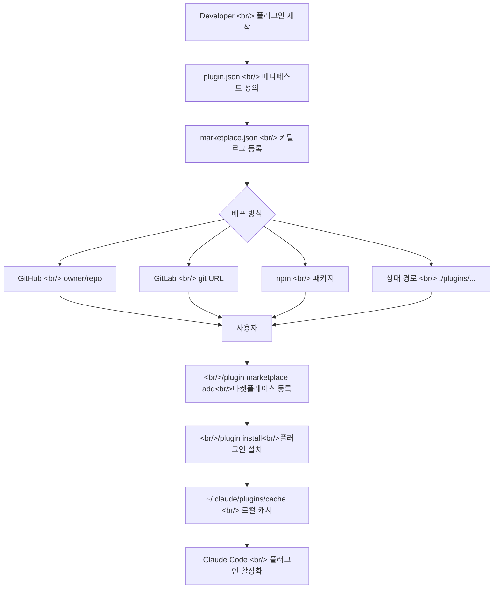

## 개요

Claude Code가 공식 플러그인 마켓플레이스 시스템을 출시했다. 단순한 확장 기능 설치를 넘어 팀 단위 배포, 버전 관리, 권한 제어까지 아우르는 본격적인 생태계다. 이 글에서는 플러그인을 직접 만들고 마켓플레이스로 배포하는 전체 흐름을 기술적으로 분석한다.

<!--more-->

## 마켓플레이스 아키텍처 전체 흐름

플러그인 마켓플레이스 시스템은 크게 세 계층으로 구성된다: 마켓플레이스 카탈로그, 플러그인 소스, 로컬 캐시. 아래 다이어그램은 전체 흐름을 보여준다.



## 플러그인 제작: 구조와 매니페스트

### 플러그인 디렉토리 구조

플러그인은 `.claude-plugin/plugin.json` 매니페스트를 중심으로 구성된다. 핵심 규칙은 하나다: `commands/`, `agents/`, `skills/`, `hooks/`는 반드시 플러그인 루트에 위치해야 하며, `.claude-plugin/` 안에 넣으면 안 된다.

```
my-plugin/
├── .claude-plugin/
│   └── plugin.json        ← 매니페스트만 여기에
├── skills/
│   └── code-review/
│       └── SKILL.md
├── commands/
├── agents/
├── hooks/
│   └── hooks.json
├── .mcp.json
├── .lsp.json
├── bin/                   ← Bash PATH에 추가될 실행파일
└── settings.json          ← 플러그인 기본 설정
```

### plugin.json 매니페스트

```json
{
  "name": "quality-review-plugin",
  "description": "Adds a /quality-review skill for quick code reviews",
  "version": "1.0.0",
  "author": {
    "name": "Your Name",
    "email": "you@example.com"
  },
  "homepage": "https://github.com/you/quality-review-plugin",
  "license": "MIT"
}
```

`name` 필드는 스킬 네임스페이스가 된다. `quality-review-plugin`으로 등록된 플러그인의 `hello` 스킬은 `/quality-review-plugin:hello`로 호출된다. 이 네임스페이싱이 여러 플러그인 간 이름 충돌을 막는다.

### Skills 추가

스킬은 `skills/` 디렉토리 아래 폴더명이 스킬명이 되는 구조다. `SKILL.md`의 frontmatter에 `description`을 적으면 Claude가 자동으로 상황에 맞게 호출한다.

```markdown
---
name: code-review
description: Reviews code for best practices and potential issues. Use when reviewing code, checking PRs, or analyzing code quality.
---

When reviewing code, check for:
1. Code organization and structure
2. Error handling
3. Security concerns
4. Test coverage
```

`$ARGUMENTS` 플레이스홀더를 사용하면 사용자 입력을 동적으로 받을 수 있다: `/my-plugin:hello Alex`.

### LSP 서버 연동

공식 마켓플레이스에는 이미 주요 언어(TypeScript, Python, Rust, Go 등) LSP 플러그인이 제공된다. 지원되지 않는 언어라면 `.lsp.json`으로 직접 구성할 수 있다.

```json
{
  "go": {
    "command": "gopls",
    "args": ["serve"],
    "extensionToLanguage": {
      ".go": "go"
    }
  }
}
```

LSP 플러그인이 설치되면 Claude는 파일 수정 후 자동으로 타입 오류, 누락된 import, 구문 오류를 감지한다.

### 기본 설정 배포

`settings.json`으로 플러그인 활성화 시 기본 설정을 배포할 수 있다. 현재는 `agent` 키만 지원된다.

```json
{
  "agent": "security-reviewer"
}
```

## 마켓플레이스 파일 스키마

### marketplace.json 필수 필드

`.claude-plugin/marketplace.json`이 마켓플레이스의 핵심이다.

```json
{
  "name": "company-tools",
  "owner": {
    "name": "DevTools Team",
    "email": "devtools@example.com"
  },
  "metadata": {
    "description": "Internal developer tools marketplace",
    "version": "1.0.0",
    "pluginRoot": "./plugins"
  },
  "plugins": [
    {
      "name": "code-formatter",
      "source": "./plugins/formatter",
      "description": "Automatic code formatting on save",
      "version": "2.1.0"
    },
    {
      "name": "deployment-tools",
      "source": {
        "source": "github",
        "repo": "company/deploy-plugin"
      },
      "description": "Deployment automation tools"
    }
  ]
}
```

**예약된 이름**: `claude-code-marketplace`, `anthropic-marketplace`, `agent-skills` 등 Anthropic 공식 마켓플레이스 이름은 사용 불가.

### 플러그인 소스 타입 비교

| 소스 타입 | 형식 | 특징 |
|-----------|------|------|
| 상대 경로 | `"./plugins/my-plugin"` | Git 배포 시에만 동작, URL 배포 불가 |
| GitHub | `{"source": "github", "repo": "owner/repo"}` | ref, sha 핀닝 지원 |
| Git URL | `{"source": "url", "url": "https://..."}` | GitLab, Bitbucket, 자체 호스팅 지원 |
| Git 서브디렉토리 | `{"source": "git-subdir", "url": "...", "path": "tools/plugin"}` | 모노레포용 sparse clone |
| npm | `{"source": "npm", "package": "my-plugin"}` | npm registry 활용 |

**중요 구분**: 마켓플레이스 소스(카탈로그 위치)와 플러그인 소스(개별 플러그인 위치)는 별개다. 마켓플레이스 소스는 `ref`만 지원하고, 플러그인 소스는 `ref`와 `sha` 모두 지원한다.

### Strict 모드

```json
{
  "name": "my-plugin",
  "source": "./plugins/my-plugin",
  "strict": true
}
```

`strict: true`(기본값)면 `plugin.json`이 컴포넌트 정의의 권위 소스가 된다. 마켓플레이스에서 오버라이드하려면 `strict: false`로 설정.

## 마켓플레이스 배포 전략

### GitHub 배포 (권장)

```bash
# 마켓플레이스 추가
/plugin marketplace add anthropics/claude-code

# 특정 브랜치나 태그 지정
/plugin marketplace add https://gitlab.com/company/plugins.git#v1.0.0
```

### 팀 자동 설정

`.claude/settings.json`에 마켓플레이스를 등록하면 팀원들이 레포지토리를 신뢰할 때 자동으로 마켓플레이스가 추가된다.

```json
{
  "extraKnownMarketplaces": [
    {
      "name": "company-tools",
      "source": "github",
      "repo": "myorg/claude-plugins"
    }
  ]
}
```

### 컨테이너 환경 사전 설치

CI/CD나 컨테이너 환경에서는 `forcedPlugins`로 특정 플러그인을 강제 설치할 수 있다. Managed settings를 통해 팀 전체에 배포 가능.

### 버전 관리와 릴리즈 채널

```json
{
  "name": "my-plugin",
  "source": {
    "source": "github",
    "repo": "owner/plugin-repo",
    "ref": "v2.0.0",
    "sha": "a1b2c3d4e5f6a7b8c9d0e1f2a3b4c5d6e7f8a9b0"
  }
}
```

`sha`로 정확한 커밋을 핀닝해 재현 가능한 배포를 보장할 수 있다.

## CLI로 마켓플레이스 관리

| 명령 | 설명 |
|------|------|
| `/plugin marketplace add <source>` | 마켓플레이스 등록 |
| `/plugin marketplace list` | 등록된 마켓플레이스 목록 |
| `/plugin marketplace update <name>` | 마켓플레이스 업데이트 |
| `/plugin marketplace remove <name>` | 마켓플레이스 제거 |
| `/plugin install <name>@<marketplace>` | 플러그인 설치 |
| `/plugin disable <name>@<marketplace>` | 플러그인 비활성화 |
| `/plugin uninstall <name>@<marketplace>` | 플러그인 제거 |
| `/reload-plugins` | 재시작 없이 플러그인 리로드 |

스코프 옵션으로 설치 범위를 지정할 수 있다:
- **User scope**: 모든 프로젝트에 적용
- **Project scope**: 해당 레포 협업자 공유 (`.claude/settings.json`)
- **Local scope**: 현재 레포에서 본인만 적용

## 권한 시스템 연동

### 계층적 권한 구조

Claude Code의 권한은 deny → ask → allow 순서로 평가된다. 첫 번째 매칭 규칙이 우선된다.

```json
{
  "permissions": {
    "allow": [
      "Bash(npm run *)",
      "Bash(git commit *)"
    ],
    "deny": [
      "Bash(git push *)"
    ]
  }
}
```

### 권한 모드

| 모드 | 설명 |
|------|------|
| `default` | 첫 사용 시 승인 요청 |
| `acceptEdits` | 파일 수정 자동 허용 |
| `plan` | 분석만 가능, 수정 불가 |
| `auto` | 배경 안전 검사 후 자동 승인 (연구 프리뷰) |
| `dontAsk` | 사전 승인된 툴만 허용 |
| `bypassPermissions` | 권한 프롬프트 전체 우회 (격리 환경 전용) |

### 도구별 권한 규칙

```json
{
  "permissions": {
    "allow": [
      "WebFetch(domain:github.com)",
      "mcp__puppeteer__puppeteer_navigate",
      "Agent(Explore)"
    ],
    "deny": [
      "Agent(Plan)",
      "Read(~/.ssh/**)"
    ]
  }
}
```

### 권한 확장: Hooks

`PreToolUse` 훅으로 런타임에 동적 권한 평가가 가능하다. 훅이 exit code 2를 반환하면 allow 규칙이 있어도 툴 호출이 차단된다.

```json
{
  "hooks": {
    "PreToolUse": [
      {
        "matcher": "Bash",
        "hooks": [{ "type": "command", "command": "validate-command.sh" }]
      }
    ]
  }
}
```

## 공식 마켓플레이스 플러그인 현황

Anthropic 공식 마켓플레이스(`claude-plugins-official`)는 Claude Code 시작 시 자동으로 추가된다.

**코드 인텔리전스**: `clangd-lsp`, `gopls-lsp`, `pyright-lsp`, `rust-analyzer-lsp`, `typescript-lsp` 등 11개 언어 지원

**외부 연동**: GitHub, GitLab, Jira/Confluence, Figma, Vercel, Firebase, Slack, Sentry 등

**개발 워크플로**: `commit-commands`, `pr-review-toolkit`, `agent-sdk-dev`, `plugin-dev`

**출력 스타일**: `explanatory-output-style`, `learning-output-style`

## Quick Links (빠른 링크)

- [플러그인 마켓플레이스 생성 및 배포](https://code.claude.com/docs/en/plugin-marketplaces)
- [플러그인 제작 가이드](https://code.claude.com/docs/en/plugins)
- [플러그인 검색 및 설치](https://code.claude.com/docs/en/discover-plugins)
- [권한 설정](https://code.claude.com/docs/en/permissions)
- [공식 플러그인 제출 (Claude.ai)](https://claude.ai/settings/plugins/submit)
- [공식 플러그인 제출 (Console)](https://platform.claude.com/plugins/submit)

## Insights (인사이트)

**플러그인 vs 독립 설정**: `.claude/` 디렉토리의 독립 설정은 프로젝트별, 개인용으로 적합하다. 팀 공유나 여러 프로젝트 재사용이 필요하면 플러그인으로 패키징하는 것이 맞다. 스킬 이름이 `/hello`에서 `/my-plugin:hello`로 네임스페이스가 붙는 것이 유일한 트레이드오프.

**마켓플레이스 소스와 플러그인 소스는 별개**: 마켓플레이스 카탈로그가 있는 레포와 실제 플러그인이 있는 레포는 다를 수 있다. 이 분리 덕분에 하나의 카탈로그에서 여러 레포의 플러그인을 관리할 수 있다.

**상대 경로의 함정**: `./plugins/my-plugin` 같은 상대 경로는 Git 기반 배포에서만 동작한다. URL로 `marketplace.json`을 직접 배포하면 상대 경로가 해석되지 않는다. URL 배포 시에는 GitHub, npm, git URL 소스를 사용해야 한다.

**sha 핀닝으로 재현성 확보**: `ref`(브랜치/태그)만 사용하면 브랜치 업데이트 시 예상치 못한 변경이 들어올 수 있다. 프로덕션 환경에서는 `sha`로 정확한 커밋을 고정하는 것이 안전하다.

**권한과 샌드박싱은 보완 관계**: 권한 규칙은 Claude가 어떤 툴을 사용할 수 있는지 제어하고, 샌드박싱은 OS 레벨에서 Bash 명령의 파일시스템/네트워크 접근을 제한한다. `Read(./.env) deny` 규칙은 Read 툴을 막지만 `cat .env`는 막지 못한다. 진정한 격리가 필요하면 샌드박싱을 함께 활성화해야 한다.
