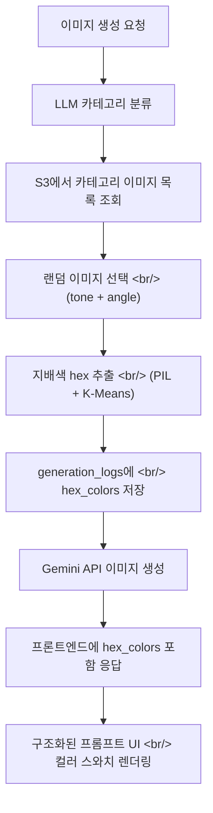

## 개요

[이전 글: Hybrid Image Search 개발기 #7](/ko/posts/2026-04-02-hybrid-search-dev7/)에서 LLM 기반 톤/앵글 카테고리 자동 주입을 구현했다. 이번 스프린트에서는 그 구현을 실제 배포 환경에서 안정적으로 작동하게 다듬는 데 집중했다.

크게 세 축으로 작업이 진행됐다. 첫째, 로컬 파일시스템에 남아있던 카테고리 이미지 읽기 로직을 완전히 S3로 전환했다. 둘째, EC2 프로덕션 인스턴스에서 torch의 CUDA 의존성이 충돌하는 문제를 CPU-only 인덱스 핀으로 해결했다. 셋째, 톤 레퍼런스 이미지에서 지배색 hex 코드를 추출해 DB에 저장하고, 프롬프트 상세 UI에 컬러 스와치로 렌더링했다.

<!--more-->

## 톤/앵글 카테고리 이미지 — S3 읽기로 전환

이전 구현에서 `injection.py`의 `_list_category_images()`는 로컬 `data/tone_angle_image_ref/{category}/` 폴더를 `os.listdir()`으로 읽고 있었다. EC2 인스턴스에는 이 폴더가 없으므로 항상 빈 리스트가 반환되어 주입이 무력화되는 버그가 있었다.

수정 방향은 명확했다. `S3Storage` 인스턴스를 `select_auto_injection()`에 전달하고, 카테고리 폴더 목록을 `s3.list_objects(prefix)` 호출로 교체하는 것이다.

```python
# 변경 전: 로컬 폴더를 직접 읽음
def _list_category_images(category: str) -> list[str]:
    folder = TONE_ANGLE_IMAGE_DIR / category
    return [f.name for f in folder.iterdir() if ...]

# 변경 후: S3에서 prefix 기반으로 조회
def _list_category_images(category: str, s3: S3Storage) -> list[str]:
    prefix = f"refs/tone_angle_image_ref/{category}/"
    keys = s3.list_objects(prefix)
    return [basename(k) for k in keys if k.lower().endswith(IMAGE_EXTS)]
```

동시에 S3 키 캐시(`build_ref_key_cache`) 구조도 수정해, `data/tone_angle_image_ref/a(natural,film)` 같은 중첩 경로가 `refs/tone_angle_image_ref/a(natural,film)/{filename}` 형식으로 올바르게 캐싱되도록 했다.

```python
# storage.py — Path.relative_to("data")로 서브디렉토리 구조 보존
ref_subdir = str(p.relative_to("data"))
self._ref_key_cache[f.name] = f"refs/{ref_subdir}/{f.name}"
```

## EC2 배포 — torch CPU-only 핀

프로덕션 EC2 인스턴스에서 서버 기동 시 `libcudnn.so.9` 파일을 찾지 못해 임베딩 모델 로드에 실패하는 문제가 발생했다. `sentence-transformers`가 `torch`를 의존성으로 끌어오는데, `uv`가 CUDA 지원 torch를 설치하면서 실제로는 없는 CUDA 라이브러리를 참조하게 된 것이다.

개발 환경에서는 `nvidia-cudnn-cu12`와 `nvidia-cudnn-cu13`이 모두 설치되어 있어 우연히 동작했지만, 프로덕션에는 `cu13`만 있어 충돌이 발생했다.

해결책은 개별 cudnn 패키지를 추적하는 대신, `pyproject.toml`의 S3 인덱스 설정에서 CPU-only torch를 명시적으로 핀하는 것이었다.

```toml
# pyproject.toml — CPU-only torch 인덱스 추가
[[tool.uv.index]]
name = "pytorch-cpu"
url = "https://download.pytorch.org/whl/cpu"
explicit = true

[tool.uv.sources]
torch = [{ index = "pytorch-cpu" }]
```

이렇게 하면 `uv sync` 시 항상 CPU-only 빌드가 설치되어, EC2 인스턴스의 CUDA 환경 유무와 무관하게 안정적으로 동작한다.

## Hex 컬러 추출 — 지배색 분석 & DB 저장

톤 레퍼런스 이미지가 어떤 색감을 대표하는지 시각적으로 확인할 수 있도록, 이미지에서 지배색 hex 코드를 추출해 `generation_logs` 테이블에 함께 저장하는 기능을 추가했다.

아래 다이어그램은 데이터 흐름을 보여준다.



지배색 추출은 `scikit-learn`의 `KMeans`를 사용해 이미지를 N개의 클러스터로 나누고, 각 클러스터의 중심색을 hex 형식으로 변환한다.

```python
# hex_color_extractor.py (개념)
from PIL import Image
from sklearn.cluster import KMeans
import numpy as np

def extract_dominant_hex_colors(image_bytes: bytes, n_colors: int = 5) -> list[str]:
    img = Image.open(io.BytesIO(image_bytes)).convert("RGB")
    img = img.resize((100, 100))  # 속도를 위해 축소
    pixels = np.array(img).reshape(-1, 3)
    km = KMeans(n_clusters=n_colors, n_init=3)
    km.fit(pixels)
    centers = km.cluster_centers_.astype(int)
    return [f"#{r:02x}{g:02x}{b:02x}" for r, g, b in centers]
```

추출된 hex 값은 `generation_logs.hex_colors`(JSON 컬럼)에 저장되고, API 응답의 `InjectedReference.hex_colors` 필드를 통해 프론트엔드로 전달된다.

## 구조화된 프롬프트 UI — hex 스와치 포함

기존에 이미지 상세 모달의 "작업 프롬프트" 섹션은 `getFullPrompt()`가 반환하는 원시 텍스트(마크다운 스타일 `###`, `===` 구분자, 날것의 JSON hex 배열)를 `whitespace-pre-wrap`으로 그대로 뿌리고 있었다. 가독성이 매우 낮았다.

이번에 `renderStructuredPrompt()` 함수를 추가해, 같은 데이터를 구조화된 형태로 렌더링하도록 교체했다.

- `###` 헤딩 → 앰버/스카이 컬러 섹션 헤더
- `===` 구분자 → `<hr>` 엘리먼트
- `- 이미지 N:` 줄 → 배지 + 설명 형식의 리스트 아이템
- `hex_colors` 배열 → 컬러 원형 + 모노 hex 코드 pill 배지

복사 기능은 기존 `fullPrompt` raw 텍스트를 그대로 사용하므로 영향 없다.

## 노-텍스트 디렉티브 & 컬러 팔레트 제거

주입된 레퍼런스 이미지의 프롬프트에 "이미지의 텍스트나 워터마크를 생성에 반영하지 말 것"을 명시하는 no-text 디렉티브를 추가했다. 또한 이미지 카드 오버레이와 상세 모달에서 컬러 팔레트 점 표시(dot 시각화)를 제거했다. 구조화된 프롬프트 섹션의 hex 스와치가 그 역할을 충분히 대체하기 때문이다.

## 커밋 로그

| 메시지 | 변경 파일 |
|---|---|
| fix: list tone/angle category images from S3 instead of local filesystem | `injection.py`, `storage.py`, `generation.py` |
| fix: pin torch to CPU-only index to prevent broken CUDA deps on EC2 | `pyproject.toml` |
| fix: fix the injection prompt | `prompt.py`, `injection.py` |
| docs: update README to reflect recent changes | `README.md` |
| feat: extract dominant hex colors from tone reference images | `injection.py`, `schemas.py`, `api.ts`, DB migration |
| feat: structured prompt display with hex color swatches in image detail | `GeneratedImageDetail.tsx` |
| feat: add no-text directive for injected refs and remove color palettes | `prompt.py`, `App.tsx`, `GeneratedImageDetail.tsx` |
| get rid of the test folder | `test/` 삭제 |

## 인사이트

**로컬 개발 환경과 프로덕션 환경의 차이를 코드로 명시하라.** S3 마이그레이션 이후에도 파일 목록 조회 코드가 로컬 경로를 참조하고 있었다. 이런 류의 버그는 개발 환경에서는 조용히 통과되다가 배포 직후에야 드러난다. 추상화 경계(여기서는 `S3Storage`)를 일관되게 사용하는 것이 방어책이다.

**CUDA 의존성은 명시적으로 핀해야 한다.** `torch`는 환경에 따라 CPU/CUDA 빌드가 혼재될 수 있다. EC2처럼 GPU가 없는 인스턴스에서 CUDA 빌드가 설치되면 임포트 시점에 실패한다. `pyproject.toml`의 `[[tool.uv.index]]`로 CPU-only를 명시적으로 강제하면 이 클래스의 문제 전체를 예방할 수 있다.

**UI 렌더링과 데이터 직렬화는 분리해야 한다.** 복사 기능이 필요한 raw 텍스트와, 화면에 보여줄 구조화된 렌더링을 동일한 데이터 소스에서 각각 파생시키는 패턴이 깔끔하다. `getFullPrompt()`는 그대로 유지하고 `renderStructuredPrompt()`를 별도로 추가한 방식이 이 원칙을 잘 따른다.
