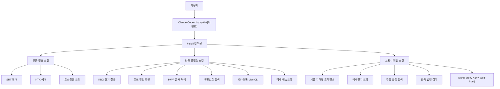

## 개요

[k-skill](https://github.com/NomaDamas/k-skill)은 NomaDamas가 만든 한국인 특화 Claude Code 스킬 컬렉션이다. GitHub 스타 1,371개(포크 113개)를 받은 이 프로젝트는 SRT/KTX 기차 예매, KBO 야구 경기 결과, 카카오톡 메시지 전송, HWP 문서 처리, 미세먼지 조회 같은 한국 일상 업무를 AI 에이전트에게 위임할 수 있도록 설계되었다.

Claude Code, Codex, OpenCode, OpenClaw/ClawHub 등 다양한 코딩 에이전트를 지원하며, 추가 클라이언트 API 레이어 없이 `k-skill-proxy` 같은 프록시 서버로 HTTP 요청만 넣으면 작동한다.

<!--more-->

## 스킬 구조와 통합 아키텍처

k-skill이 Claude Code와 어떻게 연동되는지 전체 흐름을 도식화하면 다음과 같다.



## 포함된 스킬 전체 목록

k-skill은 현재 총 18가지 기능을 제공한다.

### 교통

| 스킬 | 설명 | 인증 |
|---|---|---|
| **SRT 예매** | 열차 조회, 예약, 확인, 취소 | 필요 |
| **KTX 예매** | Dynapath anti-bot 대응 helper 포함 | 필요 |
| **서울 지하철 도착정보** | 실시간 도착 예정 열차 확인 (k-skill-proxy 경유) | 프록시 URL |

### 생활 정보

| 스킬 | 설명 | 인증 |
|---|---|---|
| **미세먼지 조회** | 현재 위치 또는 지역 기준 PM10/PM2.5 확인 | 불필요 |
| **우편번호 검색** | 주소 키워드로 공식 우체국 우편번호 조회 | 불필요 |
| **택배 배송조회** | CJ대한통운·우체국 공식 표면 조회 | 불필요 |
| **근처 블루리본 맛집** | 블루리본 서베이 기준 맛집 검색 | 불필요 |
| **근처 술집 조회** | 카카오맵 기반 영업 상태·메뉴·전화번호 포함 | 불필요 |
| **다이소 상품 조회** | 특정 매장 상품 재고 확인 | 불필요 |
| **중고차 가격 조회** | SK렌터카 타고BUY 기준 인수가/월 렌트료 | 불필요 |

### 스포츠 / 엔터테인먼트

| 스킬 | 설명 | 인증 |
|---|---|---|
| **KBO 경기 결과** | 날짜별 경기 일정·결과·팀별 필터링 | 불필요 |
| **K리그 경기 결과** | K리그1/2 결과·순위 확인 | 불필요 |
| **로또 당첨 확인** | 최신 회차 및 번호 대조 | 불필요 |

### 업무 / 문서

| 스킬 | 설명 | 인증 |
|---|---|---|
| **HWP 문서 처리** | `.hwp` → JSON/Markdown/HTML 변환, 이미지 추출 | 불필요 |
| **한국 법령 검색** | 법령·판례·유권해석 조회 | 로컬만 필요 |
| **카카오톡 Mac CLI** | macOS에서 메시지 읽기·검색·전송 | 불필요 |

### 쇼핑 / 금융

| 스킬 | 설명 | 인증 |
|---|---|---|
| **쿠팡 상품 검색** | coupang-mcp 경유로 로켓배송·특가 조회 | 불필요 |
| **토스증권 조회** | tossctl 기반 계좌·포트폴리오·시세 조회 | 필요 |

## 카카오톡 Mac CLI 상세 — kakaocli

카카오톡 스킬은 k-skill 중에서도 흥미로운 축에 속한다. macOS 전용 CLI 도구 `kakaocli`를 사용해 Claude Code가 카카오톡 대화를 직접 읽고 메시지를 보낼 수 있다.

### 설치

```bash
brew install silver-flight-group/tap/kakaocli
```

터미널 앱에 **Full Disk Access**와 **Accessibility** 권한이 반드시 필요하다. 없으면 읽기 명령도 실패한다.

KakaoTalk for Mac이 없다면 `mas`로 설치 가능하다.

```bash
brew install mas
mas account
mas install 869223134
```

### 주요 명령어

```bash
# 권한 및 DB 접근 확인
kakaocli status
kakaocli auth

# 대화 목록 읽기
kakaocli chats --limit 10 --json

# 특정 채팅방 최근 메시지
kakaocli messages --chat "지수" --since 1d --json

# 키워드 검색
kakaocli search "회의" --json

# 나와의 채팅으로 테스트 전송
kakaocli send --me _ "테스트 메시지"

# dry-run 으로 실제 전송 없이 확인
kakaocli send --dry-run "팀 공지방" "오늘 3시에 만나요"
```

보안 설계가 눈에 띈다. 다른 사람에게 보내는 메시지는 `--dry-run`으로 먼저 확인하고, 사용자 승인 후에만 전송한다. AI 에이전트가 무단으로 메시지를 발송하지 않도록 명시적 안전장치가 내장되어 있다.

## 설치 방법

기본 흐름은 세 단계다.

1. `docs/install.md`를 따라 전체 스킬 설치
2. `k-skill-setup` 스킬로 credential 확보 및 환경변수 확인
3. 각 기능 문서에서 입력값·예시·제한사항 확인

인증이 필요한 스킬(SRT, KTX, 토스증권)은 별도 credential resolution order를 따르며, `docs/security-and-secrets.md`에 저장 원칙과 금지 패턴이 명시되어 있다. 환경변수 이름도 표준화되어 있어 충돌 위험이 낮다.

Node.js와 Python 패키지가 혼재하므로 전역 설치를 기본으로 한다. `k-skill-proxy`는 서울 지하철, 미세먼지 같이 공공 API 직접 호출이 필요한 스킬을 위한 self-host 가능한 프록시 서버다.

## 의의

k-skill의 가장 큰 의의는 **한국 인터넷 생태계의 단편화를 AI 에이전트로 극복**하려는 시도라는 점이다.

한국에는 글로벌 서비스 대신 자체 플랫폼(카카오톡, KBO, Korail, 정부24 등)이 깊게 뿌리내려 있다. 해외 AI 도구들은 이런 한국 특화 서비스를 지원하지 않는다. k-skill은 바로 이 공백을 메운다.

JavaScript와 Python으로 구성된 멀티 런타임 구조, npm Changesets 기반 버전 관리, GitHub Actions CI/CD까지 갖춘 프로덕션급 오픈소스 프로젝트로서, 한국 개발자 커뮤니티의 실용적인 오픈소스 문화를 잘 보여준다.

Claude Code를 쓰는 한국 개발자라면 한 번쯤 설치해 둘 만하다.

---

- GitHub: [NomaDamas/k-skill](https://github.com/NomaDamas/k-skill)
- Stars: 1,371 | Forks: 113
- 주요 언어: JavaScript, Python
