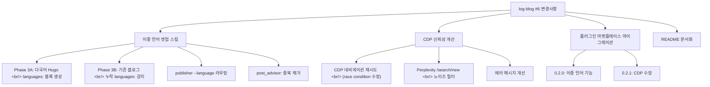

## 개요

[이전 글: Log-Blog 개발기 #5](/ko/posts/2026-04-02-log-blog-dev5/)

#5에서 Firecrawl deep docs 통합과 이중 언어 블로그 배포 파이프라인을 구현했다면, 이번 #6은 그 여파를 정리하는 회차다. 블로그 구조가 `content/ko/posts/`와 `content/en/posts/`로 바뀐 뒤, 새 사용자도 처음부터 이 구조를 설정할 수 있도록 **setup 스킬을 확장**했다. 동시에 실제 운영 중에 마주친 **AI 채팅 CDP 연결 경쟁 조건**을 수정하고, **Perplexity 노이즈 URL 필터**를 추가했다. 플러그인은 글로벌 설치 방식에서 **marketplace 기반 설치**로 마이그레이션했고, 버전은 0.2.0을 거쳐 0.2.1로 올렸다.

<!--more-->

---



---

## 이중 언어 Hugo 셋업 스킬 확장

### 배경

#5에서 블로그 레포를 `content/ko/posts/`와 `content/en/posts/`로 나누고 12개 포스트를 이중 언어로 배포했다. 그런데 막상 `/logblog:setup`으로 새 블로그를 만들면 이 구조를 전혀 생성하지 못했다. setup 스킬은 단일 언어 `content/posts/` 구조만 알고 있었기 때문이다. 새 사용자가 플러그인을 설치해도 이중 언어 워크플로를 바로 시작할 수 없는 상황이었다.

### 구현 — Phase 3A: 신규 블로그 이중 언어 설정

setup 스킬 질문 흐름을 개편했다. 이제 Hugo 사이트 생성 단계에서 세 가지를 묻는다:

1. 블로그 이름
2. 기본 언어 (`en`/`ko`, 기본값: `en`)
3. **다국어 지원 여부** — Yes면 언어 목록을 입력 (예: `en,ko`)

다국어를 선택하면 `hugo.yaml`에 Hugo 공식 `languages:` 블록이 추가된다:

```yaml
languages:
  en:
    languageName: English
    weight: 1
    contentDir: content/en
    menu:
      main: []
      social: []
  ko:
    languageName: 한국어
    weight: 2
    contentDir: content/ko
    menu:
      main: []
      social: []
```

동시에 각 언어별 content 디렉토리와 초기 포스트를 생성한다. 영어는 `content/en/posts/hello-world.md`, 한국어는 `content/ko/posts/hello-world.md`로, 파일명이 같으면 Hugo가 자동으로 번역본으로 인식한다.

### 구현 — Phase 3B: 기존 블로그 마이그레이션 감지

단순 생성보다 까다로운 케이스는 **이미 다국어 디렉토리 구조는 있는데 Hugo config에 `languages:` 블록이 없는** 경우다. 이 경우 Hugo가 언어별 디렉토리를 무시하고 언어 전환기도 동작하지 않는다.

setup 스킬 Step 2.5가 이를 감지한다:

```bash
ls -d "{path}/content/ko/posts" "{path}/content/en/posts" 2>/dev/null
grep -c "^languages:" "{path}/hugo.yaml" 2>/dev/null
```

디렉토리는 있는데 `languages:` 블록이 없으면 경고 후 추가 여부를 묻는다. 사용자가 동의하면 기존 설정을 보존하면서 `languages:` 섹션만 삽입한다.

### publisher와 post_advisor 연동

setup 스킬 변경과 함께 `publisher.py`에도 `--language` 파라미터를 추가했다. 이 파라미터가 전달되면 `config.yaml`의 `language_content_dirs` 매핑에서 해당 언어의 content 경로를 찾아 라우팅한다:

```python
content_dir = config.blog.content_path_for(language)
```

`post_advisor.py`도 수정했다. 기존에는 `content_dir` 하나만 스캔했는데, 이제는 `language_content_dirs`의 모든 경로를 스캔하되 동일 파일명의 중복을 제거한다. 이중 언어 블로그에서 `scan` 명령이 한쪽 언어 포스트만 보는 문제가 해결됐다.

---

## AI 채팅 CDP 신뢰성 개선

### 문제: CDP 네비게이션 경쟁 조건

`uv run log-blog chrome-cdp`로 Chrome을 CDP 모드로 실행하면, 이미 탭이 열려 있는 상태에서 Playwright가 새 페이지를 만들고 URL로 이동할 때 "navigation interrupted" 오류가 간헐적으로 발생했다. Chrome 탭 간 이벤트 충돌이 원인이다.

수정 전 코드는 단순히 한 번 시도하고 실패하면 `None`을 반환했다:

```python
await page.goto(url, wait_until="domcontentloaded", timeout=timeout_ms)
```

### 해결: 재시도 로직

`_NAV_RETRIES = 2` 상수를 추가하고, `"interrupted"` 문자열이 에러 메시지에 포함된 경우에만 재시도한다. 재시도 사이에는 500ms 대기로 탭 이벤트가 안정되길 기다린다:

```python
_NAV_RETRIES = 2  # retry count for CDP navigation race conditions

for attempt in range(_NAV_RETRIES + 1):
    try:
        await page.goto(url, wait_until="domcontentloaded", timeout=timeout_ms)
        last_err = None
        break
    except Exception as nav_err:
        last_err = nav_err
        if attempt < _NAV_RETRIES and "interrupted" in str(nav_err).lower():
            logger.debug("CDP navigation interrupted (attempt %d), retrying", attempt + 1)
            await page.wait_for_timeout(500)
        else:
            raise
```

"interrupted"가 아닌 다른 오류(타임아웃, 네트워크 에러 등)는 즉시 raise해서 불필요한 재시도를 방지한다.

### Perplexity 노이즈 필터

Perplexity 방문 기록에 실제 대화 URL(`perplexity.ai/search/...`) 외에 새 검색 페이지(`perplexity.ai/search/new`)가 섞여 들어왔다. 이 URL은 콘텐츠가 없는 랜딩 페이지인데, 기존 분류기가 이를 `ai_chat_perplexity`로 잘못 분류해 쓸모없는 CDP fetch를 시도했다.

`_AI_NOISE_PATTERNS` 리스트에 한 줄을 추가해 필터링했다:

```python
re.compile(r"perplexity\.ai/search/new(?:[?#]|$)"),  # "new search" landing page
```

### 에러 메시지 개선

CDP fetch 실패 시 로그가 단순히 `"AI chat fetch failed for URL: error"` 였다. 원인을 알기 어렵다. 이제는 실행 가능한 조치를 포함한 메시지를 출력한다:

```python
logger.warning(
    "AI chat fetch failed for %s (%s): %s. "
    "Ensure Chrome is running with: uv run log-blog chrome-cdp",
    url, service, e,
)
```

---

## 플러그인 마켓플레이스 마이그레이션

### 배경: 글로벌 설치의 한계

이전에는 플러그인을 `~/.claude/plugins/logblog/`에 직접 설치하는 방식이었다. 이 방식의 문제는 업데이트 감지가 플러그인 내 `plugin.json`의 `version` 문자열 비교에 의존한다는 점이다. 버전을 올리지 않으면 새 기능이 배포돼도 `/plugin`이 "최신 버전" 으로 판단해 업데이트를 건너뛴다.

#5에서 Firecrawl, 이중 언어 지원 등 15개 커밋을 쌓았지만 `version`은 `"0.1.0"` 그대로였다. 이를 발견한 후 marketplace 기반 설치로 전환했다:

- 설치 위치: `~/.claude/plugins/marketplaces/logblog/`
- 업데이트: marketplace의 버전 체계를 통해 관리

### 버전 체계: 0.2.0과 0.2.1

**0.2.0** — Firecrawl deep docs 통합, 이중 언어 블로그 지원, setup 스킬 다국어 확장, publisher `--language` 라우팅 등 새 기능 묶음이라 minor 버전 업으로 결정했다.

**0.2.1** — CDP 신뢰성 수정과 Perplexity 노이즈 필터. 새 기능이 아니라 버그 수정이므로 patch 버전 업.

`marketplace.json`의 플러그인 항목도 최신 버전 정보를 반영하도록 업데이트했다.

---

## README 문서화

이번 세션에서 README가 크게 업데이트됐다. 추가된 주요 섹션:

- **이중 언어 워크플로**: 한국어 포스트 작성 → 영어 번역 → 각 `content/{lang}/posts/`에 배포하는 전체 흐름
- **Firecrawl 통합**: `--deep` 플래그로 문서 사이트 전체 크롤링하는 방법
- **Dev Log 모드**: 세션 데이터에서 dev log 포스트를 생성하는 스킬 사용법
- **AI 채팅 fetching**: `chrome-cdp` 명령으로 Chrome을 CDP 모드로 실행하는 법, 각 서비스별 `auth_profile` 설정

---

## 커밋 로그

| 메시지 | 변경 |
|--------|------|
| docs: update README with bilingual workflow, Firecrawl, dev logs, and AI chat features | +31 -7 |
| chore: bump plugin version to 0.2.0 | +1 -1 |
| feat: add multi-language Hugo setup to setup skill and publisher | +226 -26 |
| chore: bump plugin version to 0.2.1 | +1 -1 |
| fix: improve AI chat CDP reliability and Perplexity noise filter | +30 -3 |

---

## 인사이트

이번 회차는 "기능을 만들었더니 인프라가 따라오지 못하는" 전형적인 패턴이었다. #5에서 이중 언어 블로그를 구현하고 수동으로 레포를 재구성했는데, setup 스킬이 이를 지원하지 못해 새 사용자가 같은 결과를 얻을 수 없었다. 기능과 셋업 경험을 동기화하는 작업이 항상 뒤를 따라야 한다는 점을 다시 확인했다.

CDP 연결 경쟁 조건은 재현이 어려운 종류의 버그다. Chrome의 탭 이벤트 타이밍에 의존하기 때문에 매번 나타나지 않는다. "interrupted" 문자열로만 재시도를 트리거하는 좁은 조건이 오히려 올바른 선택이었다 — 타임아웃 같은 다른 오류까지 재시도하면 느린 네트워크에서 지연이 두 배로 늘어난다.

플러그인 버전 관리는 단순해 보이지만 배포 신뢰성의 핵심이다. 버전 문자열을 올리지 않으면 사용자가 업데이트를 받지 못한다. marketplace 기반 관리로 전환하면서 이 프로세스가 더 명시적이 됐다.

log-blog 자체가 log-blog로 기록되는 메타적 상황을 즐기고 있다. 포스트를 쓰다 발견한 불편함이 다음 커밋의 동기가 되고, 그 커밋이 다음 포스트의 내용이 된다.
