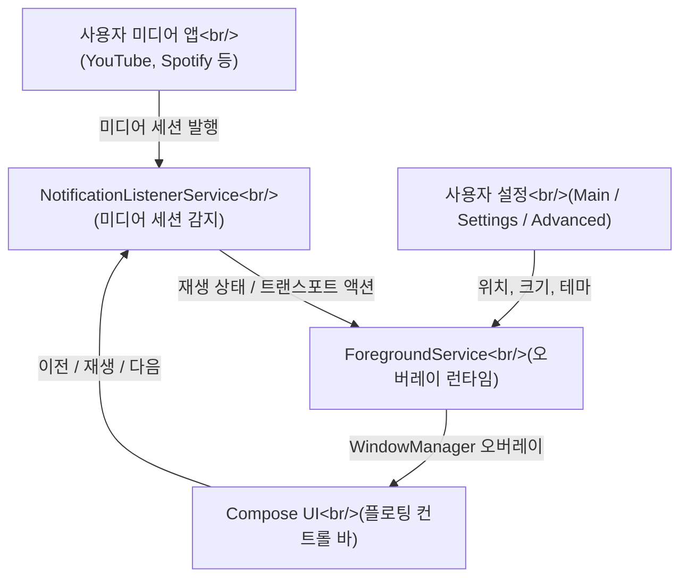
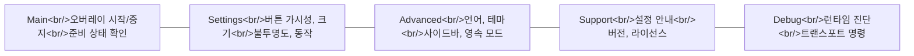

## 개요

Android에서 음악을 들으며 다른 앱을 쓸 때 미디어 컨트롤에 접근하려면 알림 바를 내리거나 앱을 전환해야 한다.
**MediaFloat**는 이 문제를 단 하나의 방법으로 해결한다: 이전/재생·일시정지/다음 버튼을 항상 화면 위에 떠 있는 작은 오버레이 바로 표시하는 것이다.

Kotlin + Jetpack Compose로 작성된 오픈소스 앱으로, Android 10 이상을 지원하며 Apache License 2.0으로 배포된다.
GitHub 저장소: [Leuconoe/MediaFloat](https://github.com/Leuconoe/MediaFloat)

<!--more-->

---

## 핵심 아키텍처

MediaFloat의 구조는 세 가지 Android 시스템 기능의 조합으로 이루어진다.



### 세 가지 핵심 권한과 역할

| 권한 / 접근 | 역할 |
|---|---|
| `SYSTEM_ALERT_WINDOW` | 다른 앱 위에 오버레이 윈도우를 띄움 |
| `FOREGROUND_SERVICE` + `FOREGROUND_SERVICE_SPECIAL_USE` | 오버레이 런타임을 지속적으로 유지 |
| `POST_NOTIFICATIONS` | Foreground service 알림 표시 (Android 13+) |
| Notification listener access | 활성 미디어 세션 상태와 트랜스포트 액션 읽기 |

---

## Android Overlay 구현 방식

`SYSTEM_ALERT_WINDOW` 권한은 Android에서 "다른 앱 위에 표시" 권한으로 불린다.
이 권한을 얻으면 `WindowManager.addView()`를 통해 시스템 레이어에 뷰를 삽입할 수 있다.

MediaFloat는 여기에 **Jetpack Compose**를 결합한다.
전통적인 XML 레이아웃 대신 Compose의 `AndroidView` 또는 `ComposeView`를 `WindowManager`에 붙이는 방식으로 플로팅 UI를 렌더링한다.

### Foreground Service의 역할

Android는 백그라운드에서 UI를 표시하는 컴포넌트를 엄격하게 제한한다.
오버레이가 앱이 백그라운드에 있을 때도 유지되려면 반드시 **Foreground Service** 안에서 실행되어야 한다.

- Foreground Service는 사용자에게 보이는 알림을 반드시 표시해야 한다
- Android 13+에서는 `POST_NOTIFICATIONS` 권한이 추가로 필요하다
- `FOREGROUND_SERVICE_SPECIAL_USE` 타입은 overlay처럼 특수 용도의 서비스에 요구된다

### NotificationListenerService로 미디어 세션 감지

미디어 앱들은 재생 상태를 `MediaSession` API를 통해 시스템에 등록한다.
MediaFloat는 `NotificationListenerService`를 통해 이 세션을 감지하고, `MediaController`로 트랜스포트 액션(이전/재생·일시정지/다음)을 전송한다.

이 경로 덕분에 Spotify, YouTube, 팟캐스트 앱 등 어떤 미디어 앱이든 동일한 인터페이스로 제어할 수 있다.

---

## 앱 구조: 단일 모듈, 다섯 가지 Surface

MediaFloat는 의도적으로 단일 모듈(single-module) 구조를 선택했다.
복잡성을 낮추고 런타임 동작과 복구 경로를 명확하게 유지하기 위함이다.

### 다섯 가지 앱 화면



**Debug** 화면이 특히 흥미롭다. 런타임 준비 상태, 미디어 세션 상태 점검, 트랜스포트 명령 직접 전송, 최근 이벤트 로그 확인 기능을 제공한다. 개발자 도구를 앱 안에 통합한 사례다.

---

## 자동화 연동: Exported Action

MediaFloat는 외부 자동화 도구와 연동할 수 있는 exported intent action을 제공한다:

```text
sw2.io.mediafloat.action.SHOW_OVERLAY
```

Android의 `ShortcutManager`를 통해 런처 단축키도 두 가지 노출한다:
- `Launch widget` — 오버레이 시작
- `Stop widget` — 오버레이 중지

Tasker, MacroDroid, Android Shortcuts 같은 루틴 도구에서 이 action을 직접 호출할 수 있다.

---

## 다국어 지원

v0.2.1은 `AppCompat` app-language API를 사용해 Android 13 이상과 그 이하 버전 모두에서 언어 전환을 지원한다.
지원 언어: System default, English, Korean, Chinese, Japanese, Spanish, French.

한국어가 기본 지원 언어 목록에 포함된 것이 인상적이다.
언어 선택은 **Advanced** 화면에서 가능하고, 현재 언어는 **Support** 화면에 반영된다.

---

## 현재 버전의 의도적 제약

v0.2.1은 다음 기능을 의도적으로 포함하지 않는다:

- 자유로운 크기 조절 (사이즈 프리셋만 지원)
- 여러 컨트롤 패밀리 (수평 단일 레이아웃만 지원)
- 버튼 조합 자유 선택 (이전/재생·일시정지/다음 레이아웃에 한정)

README에서 "intentionally constrained"라고 명시한 것은, 기능 추가보다 안정성과 이해 가능성을 우선한 설계 철학을 보여준다.

최근 커밋을 보면 v0.3.0 릴리스 준비와 thumbnail 지원, 사이드바 스페이싱 정규화 작업이 진행 중이다.

---

## 기술 스택 요약

| 항목 | 내용 |
|---|---|
| 언어 | Kotlin |
| UI | Jetpack Compose + Material 3 |
| 대상 플랫폼 | Android 10+ |
| 빌드 시스템 | Gradle |
| 라이선스 | Apache License 2.0 |
| 주요 Android API | `SYSTEM_ALERT_WINDOW`, `ForegroundService`, `NotificationListenerService`, `MediaController` |

---

## 마치며

MediaFloat는 Android overlay 개발의 좋은 학습 사례다.
`SYSTEM_ALERT_WINDOW` + Foreground Service + NotificationListenerService 세 가지 시스템 기능을 조합하는 패턴은, 플로팅 UI를 구현하는 Android 앱에서 공통적으로 사용된다.

Jetpack Compose를 WindowManager overlay에 적용하는 구체적인 구현, 자동화 도구와 연동하는 exported action 패턴, 그리고 Debug 화면을 앱 내에 통합하는 방식이 주목할 만하다.

저장소에서 직접 빌드해 볼 수 있으며, 릴리스 서명 설정도 문서화되어 있다.
