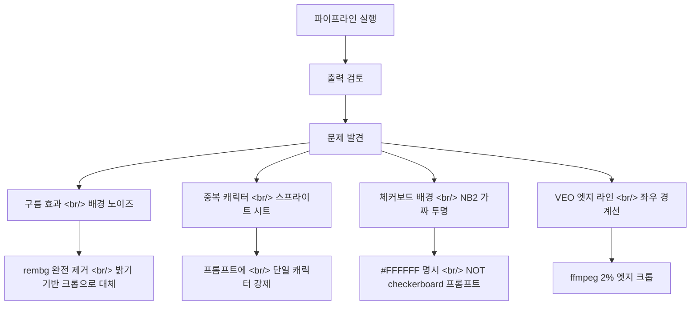

[이전 글: PopCon 개발기 #1](/ko/posts/2026-04-02-popcon-dev1/)

## 개요

오늘은 PopCon의 "겉모습"과 "안정성"을 모두 다듬은 세션이었다. 오전에는 Gemini가 생성한 이미지를 로고와 파비콘으로 변환하고, GitHub에 공개할 수 있는 수준의 README를 작성했다. 오후에는 Docker에서 API 키 오류가 터졌고, 파이프라인 전체를 점검하며 재시도 로직과 이모지별 에러 핸들링까지 구현했다.

<!--more-->

## 1. 로고 & 파비콘 — Gemini 이미지를 브랜드 에셋으로

첫 번째 작업은 Gemini가 생성한 2880×1440 이미지를 PopCon 브랜드 에셋으로 만드는 것이었다. 이미지를 중앙 기준 1:1 정사각형으로 크롭한 뒤, 여러 크기로 변환했다.

| 파일 | 크기 | 용도 |
|---|---|---|
| `logo.png` | 512×512 | 헤더 로고 |
| `favicon.ico` | 16/32/48 멀티 사이즈 | 브라우저 탭 아이콘 |
| `favicon-16x16.png` | 16×16 | 소형 파비콘 |
| `favicon-32x32.png` | 32×32 | 표준 파비콘 |
| `apple-touch-icon.png` | 180×180 | iOS 홈 화면 |
| `icon-192.png` / `icon-512.png` | 192×192 / 512×512 | PWA 아이콘 |

### Docker에서 파비콘이 안 보이는 문제

파비콘을 교체했는데 브라우저에 반영이 안 됐다. 원인이 두 가지였다.

1. **Next.js App Router 우선순위**: `app/favicon.ico`가 `public/favicon.ico`보다 우선한다. 이미 기본 파비콘이 `app/` 디렉토리에 있었고, 이 파일을 교체해야 했다.
2. **Docker 이미지 캐시**: `COPY . .`로 빌드 시점에 파일을 굽기 때문에, 파일을 수정해도 컨테이너를 재빌드하지 않으면 반영되지 않는다.

```bash
docker compose build frontend && docker compose up -d frontend
```

재빌드 후 `curl -I localhost:3000/favicon.ico`로 HTTP 200을 확인하고 마무리했다.

---

## 2. 전체 제품 README 작성

다음은 GitHub에 공개할 README를 제품 개요 수준으로 작성하는 작업이었다.

처음에는 영어·한국어를 하나의 파일에 넣었는데, "두 언어가 구분이 안 된다"는 피드백이 나왔다. 결과적으로 파일을 분리했다.

- `README.md` — 영어, 상단에 `English | [한국어](README.ko.md)` 토글
- `README.ko.md` — 한국어, 상단에 `[English](README.md) | 한국어` 토글

### README 내용이 코드와 달랐던 부분들

첫 커밋 후 실제 코드를 확인하니 README와 다른 점이 여러 곳 있었다.

| 항목 | README 작성 내용 | 실제 코드 |
|---|---|---|
| 이미지 생성 모델 | Google Imagen | Gemini Flash Image |
| VEO 모드 | 듀얼 프레임 I2V | 시작 프레임 + 모션 프롬프트만 (API 미지원) |
| 최소 영상 길이 | "4초 이내" | 4초 고정 (API 최소값), 후처리에서 트리밍 |
| 전처리 단계 | 없음 | 크롭 → 정사각 패딩 → 512×512 리사이즈 |
| 작업 저장소 | 없음 | Redis (24시간 TTL) |
| 누락 엔드포인트 | 없음 | `/api/job/{job_id}/emoji/{filename}` |

두 README 파일 모두 업데이트 후 푸시했다.

---

## 3. Docker 디버깅 — API 키와 씨름한 오후

오후 세션은 Docker 로그부터 시작했다. 서비스가 전혀 동작하지 않았는데, 원인은 `.env` 파일의 API 키 값 뒤에 ` venv`가 붙어 있었던 것이다.

```
POPCON_GOOGLE_API_KEY=AIzaSy...-mAcuv venv
```

아마 터미널에서 복사할 때 `venv` 활성화 명령어가 함께 딸려온 것으로 추정된다. `.env`에서 ` venv`를 제거하고 재시작했지만, 이번엔 키 자체가 만료된 것으로 확인됐다. Google AI Studio에서 새 키를 발급받아 해결했다.

이 과정에서 파이프라인을 실제로 돌려보면서 여러 품질 문제를 발견했다.

### 발견한 문제들과 수정



가장 큰 결정은 `rembg` 라이브러리를 완전히 제거한 것이다. 배경 제거를 시도할수록 문제가 생겼다 — `isnet-general-use` 모델이 구름 같은 아티팩트를 남겼고, `u2net`으로 바꿔도 마찬가지였다. 결국 VEO가 흰 배경으로 영상을 생성하도록 프롬프트를 강화하고, 밝기 기반 크롭으로 콘텐츠 영역만 추출하는 방향으로 전환했다.

```python
# processor.py — 밝기 기반 콘텐츠 감지
brightness = arr.astype(float).mean(axis=2)
content_mask = (brightness > 10) & (brightness < 245)
```

`pyproject.toml`에서 `rembg[cpu]>=2.0.0`을 제거하고 `numpy>=1.26.0`으로 교체하면서 Docker 이미지도 가벼워졌다.

### LINE 규격 파일 명명 수정

LINE Creators Market 가이드라인을 확인하니 파일명이 `001.png`~`040.png` 형식이어야 했다. 기존 코드는 액션 이름으로 저장하고 있었다.

```python
# packager.py
for i, emoji_path in enumerate(emoji_paths):
    line_name = f"{i + 1:03d}.png"
    zf.write(emoji_path, line_name)
```

---

## 4. 재시도 로직 & API 스로틀링

마지막 커밋은 안정성 강화였다. 풀 세트(24개)를 생성하다 보면 VEO나 Gemini API가 간헐적으로 503이나 429를 반환했다. 하나가 실패하면 전체 작업이 멈추는 구조를 개선했다.

### 이모지별 독립적인 에러 처리

기존 구조는 하나의 이모지가 예외를 던지면 전체 `run_emoji_generation` 태스크가 실패했다. 이를 각 이모지별로 try/except를 적용해서 실패한 것만 `"error"` 상태로 기록하고 나머지는 계속 진행하도록 변경했다.

```python
# worker.py — 이모지별 에러 핸들링
failed_indices = set()
for i, action in enumerate(actions):
    try:
        # ... 포즈 생성, 애니메이션, 후처리
    except Exception as e:
        logger.error(f"Emoji {i} ({action.name}) failed: {e}")
        failed_indices.add(i)
        status.results[i].status = "error"
        save_job(status)
```

작업 완료 상태도 세분화했다. `"done"` 외에 `"done_with_errors"` 상태를 추가해서 일부 실패해도 ZIP을 다운로드할 수 있도록 했다.

### API 재시도 로직

Gemini Image와 VEO 모두 지수 백오프 재시도를 추가했다.

```python
# pose_generator.py — 재시도 로직
async def _generate_image(self, prompt, reference_image_path=None, max_retries=3):
    for attempt in range(max_retries):
        try:
            response = await asyncio.to_thread(
                self.client.models.generate_content, ...
            )
            return ...
        except (ServerError, ClientError) as e:
            if attempt == max_retries - 1:
                raise
            wait = 2 ** attempt  # 1s, 2s, 4s
            logger.warning(f"Attempt {attempt+1} failed, retrying in {wait}s: {e}")
            await asyncio.sleep(wait)
```

### 타입 시스템 동기화

모델 상태 타입을 백엔드와 프론트엔드 모두 업데이트했다.

| 계층 | 변경 |
|---|---|
| `backend/models.py` | `EmojiStatus`에 `"error"` 추가, `JobStatusType`에 `"done_with_errors"` 추가 |
| `frontend/lib/api.ts` | 동일한 상태 타입 동기화 |
| `frontend/components/ProgressTracker.tsx` | `"error"` 상태 빨간 카드 UI 추가 |
| `frontend/components/EmojiPreview.tsx` | `"done_with_errors"` 일 때도 ZIP 다운로드 버튼 표시 |

---

## 정리

오늘 작업한 커밋 4개의 흐름을 요약하면 이렇다.

| 순서 | 내용 |
|---|---|
| 1 | 로고/파비콘 생성, 브랜딩 에셋, 전체 제품 README |
| 2 | README 영어/한국어 분리, 언어 토글 |
| 3 | README를 실제 파이프라인 동작에 맞게 업데이트 |
| 4 | 재시도 로직, 이모지별 에러 처리, API 스로틀링 |

Docker 디버깅을 하다 보니 파이프라인 품질 문제들도 많이 잡았다. 특히 `rembg` 제거 결정은 "뭔가를 빼는 게 더 나은 경우"의 전형적인 사례였다 — 복잡성도 줄고, Docker 이미지도 가벼워지고, 결과물도 오히려 더 깔끔해졌다.

다음 세션에서는 실제 LINE Creators Market 제출을 목표로 최종 품질 검증을 할 예정이다.
