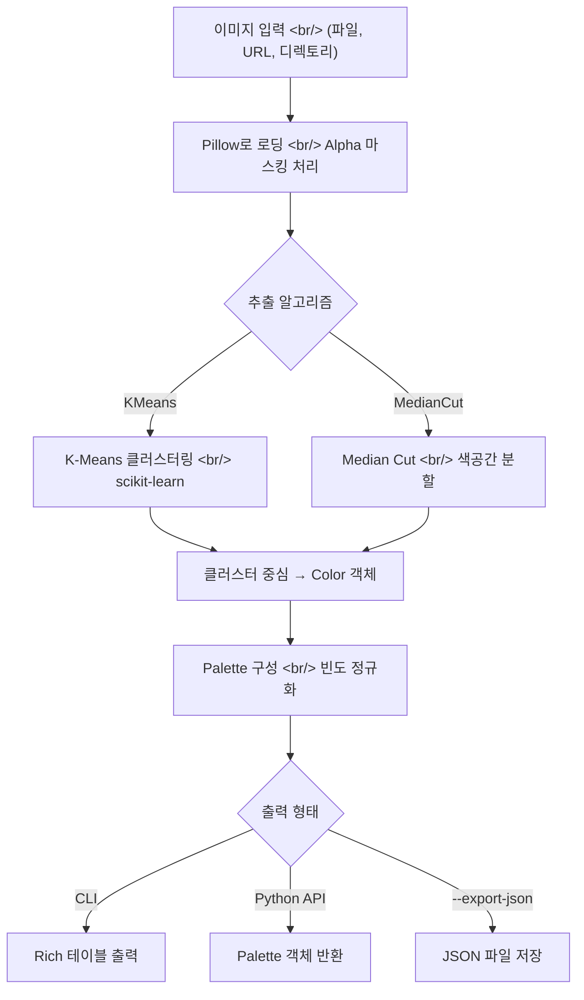

## 개요

[Pylette](https://github.com/qTipTip/Pylette)는 이미지에서 대표 색상 팔레트를 추출해주는 Python 라이브러리다. K-Means 클러스터링과 Median Cut 두 가지 알고리즘을 지원하며, CLI와 Python API 양쪽으로 사용할 수 있다. 164 stars, 16 forks의 소규모 오픈소스 프로젝트지만 설계가 깔끔하고 실용적이다. 이번 글에서는 `color.py` 소스 코드를 중심으로 라이브러리 아키텍처와 Color 클래스 구현을 분석한다.

<!--more-->

## 색상 추출 파이프라인

Pylette의 내부 처리 흐름은 크게 세 단계로 나뉜다: 이미지 로딩, 알고리즘 적용, Color 객체 생성.



## Color 클래스 구현 분석

`Pylette/src/color.py`는 전체 라이브러리의 핵심 데이터 구조다. 106줄의 간결한 코드로 색상의 표현과 변환을 모두 담당한다.

### 초기화와 RGBA 처리

```python
class Color(object):
    def __init__(self, rgba: tuple[int, ...], frequency: float):
        assert len(rgba) == 4, "RGBA values must be a tuple of length 4"
        *rgb, alpha = rgba
        self.rgb = cast(tuple[int, int, int], rgb)
        self.rgba = rgba
        self.a = alpha
        self.freq: float = frequency
        self.weight = alpha / 255.0
```

주목할 점이 두 가지 있다. 첫째, `*rgb, alpha = rgba` 패턴으로 RGBA를 한 번에 언패킹한다. Python의 starred assignment를 활용한 깔끔한 코드다. 둘째, `self.weight = alpha / 255.0`로 알파값을 0~1 범위로 정규화한다. 투명한 픽셀을 `alpha_mask_threshold`로 필터링하는 로직에 이 값이 쓰인다.

### 색공간 변환 프로퍼티

```python
@property
def hsv(self) -> tuple[float, float, float]:
    return colorsys.rgb_to_hsv(
        r=self.rgb[0] / 255,
        g=self.rgb[1] / 255,
        b=self.rgb[2] / 255
    )

@property
def hls(self) -> tuple[float, float, float]:
    return colorsys.rgb_to_hls(
        r=self.rgb[0] / 255,
        g=self.rgb[1] / 255,
        b=self.rgb[2] / 255
    )
```

HSV와 HLS 변환은 Python 표준 라이브러리 `colorsys`를 활용한다. `@property`로 선언되어 있어 `color.hsv`, `color.hls`처럼 속성처럼 접근할 수 있다. 내부적으로는 RGB 값을 0~1 범위로 정규화한 뒤 변환한다.

### 루미넌스(휘도) 계산

```python
luminance_weights = np.array([0.2126, 0.7152, 0.0722])

@property
def luminance(self) -> float:
    return np.dot(luminance_weights, self.rgb)
```

휘도 계산에 `[0.2126, 0.7152, 0.0722]` 가중치를 사용한다. 이는 ITU-R BT.709 표준에 정의된 sRGB 휘도 계수다. 인간의 눈은 녹색(0.7152)에 가장 민감하고, 파란색(0.0722)에 가장 둔감하다는 사실을 반영한다. `sort-by luminance` 옵션이 이 값으로 색상을 정렬한다.

### 비교 연산자와 정렬

```python
def __lt__(self, other: "Color") -> bool:
    return self.freq < other.freq
```

`__lt__`만 구현하고 나머지 비교 연산자는 생략했다. Python의 `sorted()`와 `list.sort()`는 `__lt__`만 있어도 동작하기 때문이다. `functools.total_ordering`을 쓰지 않은 것도 같은 이유다. 빈도 기반 정렬이 기본이고, CLI에서 `--sort-by luminance`를 선택하면 `luminance` 프로퍼티로 재정렬한다.

### 색공간 통합 접근자

```python
def get_colors(
    self, colorspace: ColorSpace = ColorSpace.RGB
) -> tuple[int, ...] | tuple[float, ...]:
    colors = {
        ColorSpace.RGB: self.rgb,
        ColorSpace.HSV: self.hsv,
        ColorSpace.HLS: self.hls
    }
    return colors[colorspace]
```

딕셔너리 디스패치 패턴이다. `if/elif` 체인 대신 딕셔너리로 색공간 선택을 처리한다. `ColorSpace`는 별도의 `types.py`에 정의된 enum이며, 타입 힌트가 `tuple[int, ...] | tuple[float, ...]`인 이유는 RGB가 정수, HSV/HLS가 부동소수점을 반환하기 때문이다.

## 추출 알고리즘 비교

Pylette가 지원하는 두 알고리즘의 특성을 비교하면 다음과 같다.

| 항목 | K-Means | Median Cut |
|------|---------|------------|
| 방식 | 클러스터 중심 탐색 | 색공간 재귀 분할 |
| 결과 | 통계적 대표색 | 균형 잡힌 색상 분포 |
| 속도 | 반복 수렴 필요 | 결정론적, 빠름 |
| 기본값 | 예 | 아니오 |
| 적합한 용도 | 복잡한 그라데이션 | 단순한 블록 이미지 |

K-Means는 반복 수렴이 필요하지만 이미지의 실제 색상 분포를 더 잘 반영한다. Median Cut은 결정론적이라 같은 이미지에 항상 같은 결과를 낸다.

## 사용 예시

### CLI 사용

```bash
# 기본 추출 (5색, K-Means, RGB)
pylette image.jpg

# 8색, HSV 색공간, JSON 내보내기
pylette photo.png --n 8 --colorspace hsv --export-json --output colors.json

# Median Cut 알고리즘, 투명 이미지 처리
pylette logo.png --mode MedianCut --alpha-mask-threshold 128

# 병렬 처리로 여러 이미지 배치 처리
pylette images/*.png --n 6 --num-threads 4
```

출력 예시:
```
✓ Extracted 5 colors from sunset.jpg
┏━━━━━━━━━━┳━━━━━━━━━━━━━━━━━┳━━━━━━━━━━┓
┃ Hex      ┃ RGB             ┃ Frequency┃
┡━━━━━━━━━━╇━━━━━━━━━━━━━━━━━╇━━━━━━━━━━┩
│ #FF6B35  │ (255, 107, 53)  │    28.5% │
│ #F7931E  │ (247, 147, 30)  │    23.2% │
│ #FFD23F  │ (255, 210, 63)  │    18.7% │
│ #06FFA5  │ (6, 255, 165)   │    15.4% │
│ #4ECDC4  │ (78, 205, 196)  │    14.2% │
└──────────┴─────────────────┴──────────┘
```

### Python API 사용

```python
from Pylette import extract_colors

palette = extract_colors(image='image.jpg', palette_size=8)

for color in palette.colors:
    print(f"RGB: {color.rgb}")
    print(f"Hex: {color.hex}")
    print(f"HSV: {color.hsv}")
    print(f"Luminance: {color.luminance:.2f}")
    print(f"Frequency: {color.freq:.2%}")

# JSON으로 내보내기
palette.to_json(filename='palette.json', colorspace='hsv')
```

### 배치 처리

```python
from Pylette import batch_extract_colors

results = batch_extract_colors(
    images=['image1.jpg', 'image2.png', 'image3.jpg'],
    palette_size=8,
    max_workers=4,
    mode='KMeans'
)

for result in results:
    if result.success and result.palette:
        print(f"✓ {result.source}: {len(result.palette.colors)} colors")
        result.palette.export(f"{result.source}_palette")
```

## Python 이미지 처리 생태계에서의 위치

Pylette는 Pillow(이미지 로딩), NumPy(행렬 연산), scikit-learn(K-Means)을 조합해 색상 추출이라는 좁은 문제에 집중한다. 비슷한 도구들과 비교하면:

- **colorgram.py**: 가장 유사한 경쟁 라이브러리. Pylette보다 API가 단순하지만 색공간 변환 지원이 없다.
- **sklearn.cluster.KMeans 직접 사용**: 유연하지만 이미지 처리 파이프라인을 직접 구성해야 한다.
- **PIL.Image.quantize**: Median Cut 기반이지만 팔레트 메타데이터(빈도, 색공간 변환)가 없다.

Pylette의 강점은 CLI와 Python API의 이중 인터페이스, 투명 이미지 지원, 색공간 변환 내장, JSON 내보내기다. 약점은 GPU 가속이 없고 대용량 이미지에서 속도가 느릴 수 있다는 점이다.

## 설계에서 배울 점

Color 클래스 구현에서 몇 가지 파이써닉한 패턴이 눈에 띈다:

1. **`@property` 지연 계산**: HSV, HLS, hex, luminance 모두 프로퍼티로 선언해 필요할 때만 계산한다. 캐싱은 없지만 Color 객체가 immutable하게 사용되므로 문제가 없다.

2. **딕셔너리 디스패치**: `get_colors()`의 딕셔너리 패턴은 새로운 색공간 추가 시 `elif` 체인을 수정하지 않아도 된다.

3. **표준 라이브러리 우선**: 색공간 변환에 `colorsys`를 사용해 외부 의존성을 줄인다.

4. **타입 힌트 일관성**: 반환 타입이 `tuple[int, ...] | tuple[float, ...]`로 명확히 표현되어 있다.

## 마무리

Pylette는 "이미지에서 대표 색상을 뽑는다"는 단순한 문제를 잘 정의된 인터페이스로 해결한다. Color 클래스는 106줄이지만 RGB, HSV, HLS, hex, luminance, 빈도까지 모두 다루는 완결된 데이터 구조다. 디자인 시스템 구축, 이미지 분류, 시각화 도구 제작 같은 실제 작업에서 바로 쓸 수 있는 실용적인 라이브러리다.

---

- GitHub: [qTipTip/Pylette](https://github.com/qTipTip/Pylette)
- 문서: [qtiptip.github.io/Pylette](https://qtiptip.github.io/Pylette/)
- PyPI: `pip install Pylette`
