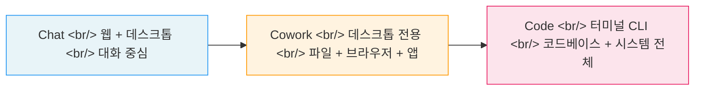
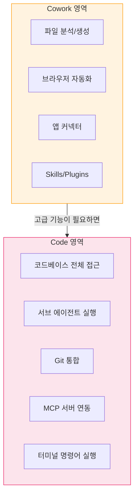
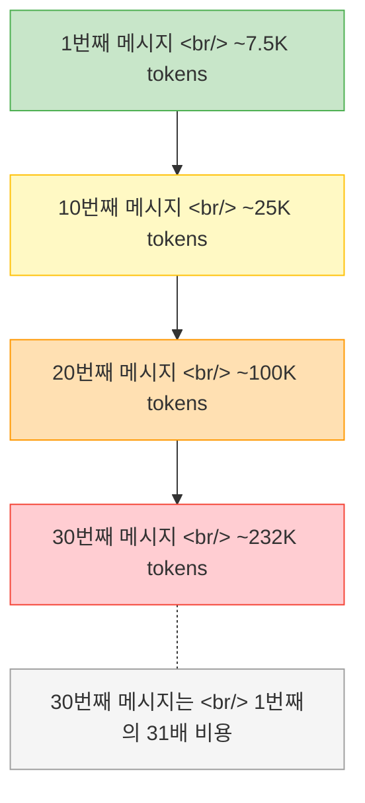

## 개요

Anthropic의 Claude가 단순한 챗봇을 넘어 하나의 생태계로 진화하고 있다. **Chat**은 웹과 데스크톱에서 대화하는 기본 인터페이스, **Cowork**는 파일 시스템과 브라우저를 직접 제어하는 데스크톱 에이전트, **Code**는 터미널에서 코드베이스 전체를 다루는 개발자용 CLI 도구다. 이 글에서는 세 제품의 차이점, 각각의 핵심 사용 사례, 그리고 Claude Code를 쓸 때 토큰 비용이 기하급수적으로 늘어나는 구조와 이를 줄이는 실전 팁을 정리한다.

<!--more-->

## Chat, Cowork, Code — 세 제품의 스펙트럼

Claude의 세 제품은 "접근성 vs 제어력"이라는 스펙트럼 위에 놓여 있다.

### Chat — 대화의 기본기

- **플랫폼**: 웹(claude.ai) + 데스크톱 앱
- **핵심 기능**: Projects(GPTs와 유사), Google Docs 연동, 커넥터, 웹 검색, Research 모드
- **적합한 사용자**: 누구나 — 글쓰기, 요약, 질의응답, 리서치

Claude Chat의 강점은 **긴 문서 처리와 글쓰기 품질**이다. ChatGPT가 창의적 대화에, Gemini가 멀티모달과 Google Workspace 연동에 강하다면, Claude는 대량의 텍스트를 정확하게 다루는 데 특화되어 있다.

### Cowork — 비개발자를 위한 에이전트

Cowork는 한 마디로 **"비개발자를 위한 Claude Code"**다. Windows/Mac 데스크톱 앱에서만 사용 가능하며, Claude Code보다 설치와 사용이 훨씬 간단하다.

**5가지 핵심 기능:**

| 기능 | 설명 | 예시 |
|------|------|------|
| 파일 관리 | 로컬 파일 분석/생성 | 영수증 사진 → Excel 정리 |
| 브라우저 제어 | AI가 Chrome을 직접 클릭 | 웹사이트 자동 탐색/입력 |
| 외부 앱 커넥터 | Gmail, Calendar, Notion, Slack 연동 | Slack 채널 분석, 이메일 자동화 |
| Skills | 반복 워크플로우를 묶어 재사용 | 뉴스레터 자동 생성 |
| Plugins | 커넥터 + Skills 조합 | LinkedIn 포스팅 자동화 |

### Code — 개발자의 터미널 동반자

Claude Code는 터미널에서 실행되는 CLI 도구로, 코드베이스 전체에 접근할 수 있다.

**Cowork와의 핵심 차이:**

- **Cowork**: 일상 업무 자동화 — 파일 분석, 브라우저 제어, 앱 연동
- **Code**: 소프트웨어 개발 — 커스텀 코드 작성, 고급 자동화, 시스템 레벨 제어

**추천 경로**: Cowork부터 시작해서, 고급 기능이 필요해지면 Code로 넘어가면 된다.

### 가격 구조

| 플랜 | 월 가격 | 주요 제한 |
|------|---------|----------|
| Free | $0 | 기본 대화만 |
| Pro | $20 | Chat + Cowork + Code 사용 가능 |
| Max | $100/$200 | 대량 사용, 높은 토큰 한도 |

> 데스크톱 앱 사용을 권장한다. 웹에서는 Cowork/Code 기능이 제한된다.

## Claude Code 토큰 최적화 — 비용이 녹아내리는 구조 이해하기

Claude Code를 무심코 쓰면 토큰 비용이 **기하급수적으로** 증가한다. 핵심 원리를 이해해야 한다.

### 왜 비용이 기하급수적으로 느는가

Claude Code는 매 메시지마다 **전체 대화 내용을 다시 읽는다**. 대화가 길어질수록 한 번의 메시지에 소모되는 토큰이 누적된다.

### 초급자를 위한 핵심 팁 (52개 중 19개)

원본 영상에서 소개된 52개 팁 중 초급편 19개의 핵심을 요약한다.

**대화 관리**
1. **`/clear`를 습관화하라** — 작업 하나 끝나면 바로 초기화. 토큰 누적을 원점으로 돌린다.
2. **프롬프트 범위를 좁혀라** — "이 파일 고쳐줘"가 아니라 "readme 10번째 줄 수정해줘"
3. **간단한 명령은 묶어라** — 쉬운 작업 여러 개를 한 메시지에 배치
4. **필요한 부분만 붙여넣어라** — 파일 전체가 아니라 관련 코드 스니펫만
5. **자리를 비우지 마라** — 무한 루프 위험. 실행 중에는 모니터링

**모델 선택**
6. **기본 모델을 Sonnet으로 설정** — Opus는 비용이 높다
7. **작업에 맞는 모델을 선택하라**:
   - **Haiku**: 단순 질문, 파일 이름 변경 등
   - **Sonnet**: 일반 개발 작업 (기본값으로 적합)
   - **Opus**: 아키텍처 설계, 깊은 디버깅 등 고난도 작업

**기타 설정과 습관**
- 불필요한 파일을 컨텍스트에 포함하지 않기
- `.claudeignore`로 큰 파일/디렉토리 제외
- 작업 단위를 작게 유지
- 결과 확인 후 불필요한 대화는 정리

## 관련 도구 Quick Links

| 도구 | 설명 |
|------|------|
| [Whispree](https://github.com/Arsture/whispree) | macOS 메뉴바 STT 앱. Apple Silicon 전용, 완전 로컬. Whisper + LLM 후처리로 한영 코드스위칭 최적화. 타이핑 대신 음성으로 프롬프트 입력 (3~5배 빠름) |
| [OpenClaude](https://github.com/Gitlawb/openclaude) | Claude Code 스타일의 오픈소스 코딩 에이전트 CLI. OpenAI, Gemini, DeepSeek, Ollama 등 200+ 모델 지원. VS Code 확장도 있음 |
| [WorkMux](https://workmux.raine.dev/) | 터미널에서 여러 AI 에이전트를 병렬 실행하는 도구 |

## 참고 영상

- [클로드 코드보다 '코워크'가 초보자에게 훨씬 쉽고 강력합니다](https://www.youtube.com/watch?v=mcJXTYb0Vt4)
- [클로드 채팅/코워크/코드 차이, 한 번에 이해하기](https://www.youtube.com/watch?v=_5sbWIeBQLk)
- [이렇게 안하면 클로드 코드 토큰이 녹아내립니다 - 1부 초급편](https://www.youtube.com/watch?v=NJDioulY7BA)

## 마무리

Claude 생태계는 "누구나 쓸 수 있는 Chat → 업무 자동화의 Cowork → 개발자의 Code"로 이어지는 명확한 스펙트럼을 갖고 있다. 자신의 기술 수준과 필요에 맞는 도구부터 시작하되, Claude Code를 쓴다면 토큰 구조를 반드시 이해하고 `/clear` 습관부터 들이자. 대화 30번째 메시지가 첫 메시지의 31배 비용이라는 사실을 알면, 최적화는 선택이 아니라 필수다.
