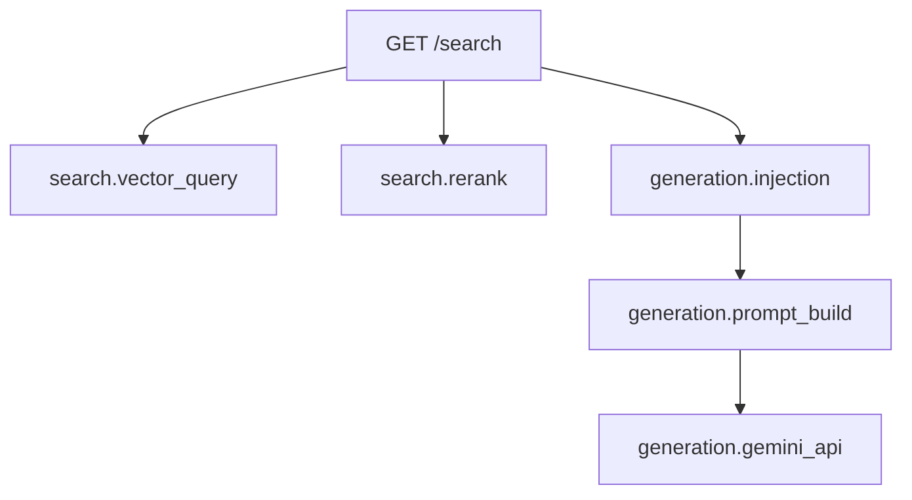

## 개요

`hybrid-image-search` FastAPI 서비스에 OpenTelemetry 기반 분산 추적을 붙였다. 목표는 단순했다 — 이미지 검색 요청이 들어왔을 때 벡터 검색부터 Gemini API 호출까지 어디서 시간이 소요되는지 한눈에 보는 것. 그런데 패키지 설치부터 Grafana에서 트레이스가 실제로 보이기까지 12번의 수정이 필요했다. 이 글에서는 전체 아키텍처, 실제 코드, 그리고 삽질 과정을 정리한다.

<!--more-->

## 아키텍처

옵저버빌리티 파이프라인은 세 계층으로 구성된다. FastAPI 앱이 OpenTelemetry로 트레이스를 생성하고, 같은 EC2 인스턴스의 Grafana Alloy가 수집/배치 처리하며, Grafana Cloud Tempo에 저장된 트레이스를 UI에서 조회한다.


핵심 설계 포인트는 gRPC가 아닌 **OTLP HTTP** (포트 4318)를 사용한 것이다. 이 선택이 왜 중요했는지는 디버깅 섹션에서 다룬다.

## 1단계: 텔레메트리 모듈

설정의 핵심은 import 시점에 OpenTelemetry를 초기화하는 `telemetry.py` 모듈이다:

```python
# backend/src/telemetry.py
import logging, os
from contextlib import contextmanager
import psutil
from opentelemetry import trace
from opentelemetry.exporter.otlp.proto.http.trace_exporter import OTLPSpanExporter
from opentelemetry.instrumentation.sqlalchemy import SQLAlchemyInstrumentor
from opentelemetry.sdk.resources import Resource
from opentelemetry.sdk.trace import TracerProvider
from opentelemetry.sdk.trace.export import SimpleSpanProcessor

_endpoint = os.environ.get(
    "OTEL_EXPORTER_OTLP_ENDPOINT", "http://localhost:4318"
)
_environment = os.environ.get("DEPLOYMENT_ENV", "dev")

_resource = Resource.create({
    "service.name": "hybrid-image-search",
    "deployment.environment": _environment,
})

_provider = TracerProvider(resource=_resource)
_exporter = OTLPSpanExporter(endpoint=f"{_endpoint}/v1/traces")
_provider.add_span_processor(SimpleSpanProcessor(_exporter))
trace.set_tracer_provider(_provider)

tracer = trace.get_tracer("hybrid-image-search")
```

세 가지 포인트:

1. **`TracerProvider`를 모듈 레벨에서 설정한다.** 함수 안에서 하면 안 된다. `FastAPIInstrumentor`가 import 시점에 tracer provider 참조를 캐시하기 때문에, lifespan 함수에서 나중에 설정하면 이미 no-op provider를 잡고 있다.

2. **`SimpleSpanProcessor`를 사용한다.** `BatchSpanProcessor`는 백그라운드 스레드에서 배치 전송하므로 성능은 좋지만, `uv run`으로 실행할 때 프로세스가 flush 전에 종료될 수 있다. `SimpleSpanProcessor`는 동기 전송이라 유실이 없다.

3. **OTLP HTTP exporter를 사용한다.** gRPC는 `grpcio` 의존성이 필요하고 이 환경에서 안정성 문제가 있었다. HTTP exporter는 `requests` 기반이라 그냥 동작한다.

## 2단계: traced_span 헬퍼

자동 계측 외에, 각 스팬별 리소스 사용량 — Gemini API 호출의 메모리 할당량, 벡터 검색의 CPU 시간 — 도 보고 싶었다:

```python
_process = psutil.Process(os.getpid())

@contextmanager
def traced_span(name, **attrs):
    """CPU/메모리 측정이 포함된 스팬 생성."""
    mem_before = _process.memory_info().rss
    cpu_before = _process.cpu_times()
    with tracer.start_as_current_span(name) as span:
        for k, v in attrs.items():
            span.set_attribute(k, v)
        yield span
        mem_after = _process.memory_info().rss
        cpu_after = _process.cpu_times()
        span.set_attribute("process.memory_mb",
                           round(mem_after / 1024 / 1024, 1))
        span.set_attribute("process.memory_delta_kb",
                           round((mem_after - mem_before) / 1024, 1))
        span.set_attribute("process.cpu_user_ms",
                           round((cpu_after.user - cpu_before.user) * 1000, 1))
        span.set_attribute("process.cpu_system_ms",
                           round((cpu_after.system - cpu_before.system) * 1000, 1))
```

generation 라우트에서의 사용 예:

```python
with traced_span("generation.gemini_api", model=model_name):
    response = await model.generate_content_async(prompt)

with traced_span("generation.prompt_build", ref_count=len(references)):
    prompt = build_prompt(query, references)
```

Grafana Tempo에서 이들은 FastAPI 루트 스팬의 하위 스팬으로 표시되며, 스팬 상세 패널에서 메모리/CPU 속성을 확인할 수 있다.

## 3단계: FastAPI 연결

애플리케이션 연결은 두 곳에서 이루어진다:

```python
# main.py — 모듈 레벨 (app 생성 후)
from opentelemetry.instrumentation.fastapi import FastAPIInstrumentor
FastAPIInstrumentor.instrument_app(app)
```

```python
# main.py — lifespan 함수
from telemetry import init_telemetry

@asynccontextmanager
async def lifespan(app):
    try:
        init_telemetry(db_engine=db_engine)
    except Exception as e:
        logger.warning("Telemetry init failed: %s", e)
    yield
```

`init_telemetry`는 SQLAlchemy 계측 같은 선택적 기능을 처리한다. 핵심은 `FastAPIInstrumentor`를 **모듈 레벨**에 두는 것이다. lifespan 안에서 계측하면 잘못된 tracer provider를 캡처할 수 있다.

텔레메트리 초기화의 try/except는 의도적이다 — 관측성 때문에 앱이 죽으면 안 된다. Alloy가 내려가 있거나 엔드포인트 설정이 잘못되어도 서비스는 정상 동작해야 한다.

## 4단계: EC2의 Grafana Alloy

Grafana Alloy는 로컬 컬렉터 역할을 한다. FastAPI 앱으로부터 OTLP 트레이스를 받아 배치 처리 후 Grafana Cloud로 전달한다:

```hcl
otelcol.receiver.otlp "default" {
  grpc { endpoint = "127.0.0.1:4317" }
  http { endpoint = "127.0.0.1:4318" }
  output {
    traces = [otelcol.processor.batch.default.input]
  }
}

otelcol.processor.batch "default" {
  timeout = "5s"
  output {
    traces = [otelcol.exporter.otlphttp.grafana_cloud.input]
  }
}

otelcol.exporter.otlphttp "grafana_cloud" {
  client {
    endpoint = env("GRAFANA_OTLP_ENDPOINT")
    auth     = otelcol.auth.basic.grafana_cloud.handler
  }
}

otelcol.auth.basic "grafana_cloud" {
  username = env("GRAFANA_INSTANCE_ID")
  password = env("GRAFANA_API_TOKEN")
}
```

Alloy는 `127.0.0.1`에만 바인딩되어 외부 노출이 없다. 인증 정보는 환경 변수로 주입하며, EC2의 systemd unit 파일에서 설정한다.

5초 배치 타임아웃은 적절한 균형점이다 — 실시간에 가까운 가시성을 제공하면서도 요청당 여러 스팬을 묶을 수 있다.

## 디버깅 여정

패키지 설치부터 Grafana에서 트레이스가 보이기까지 약 12번의 수정이 필요했다. 주요 이슈와 해결 과정은 다음과 같다:

| 단계 | 문제 | 해결 |
|------|------|------|
| 1 | 트레이스가 전혀 안 보임 | TracerProvider를 lifespan에서 설정했는데, FastAPIInstrumentor가 이미 no-op provider를 캐시한 상태. 모듈 레벨로 이동. |
| 2 | 프로세스 종료 시 트레이스 유실 | `BatchSpanProcessor`의 백그라운드 스레드가 `uv run` 종료 전에 flush 못 함. `SimpleSpanProcessor`로 전환. |
| 3 | gRPC 연결 실패 | EC2에서 `grpcio`의 간헐적 문제. OTLP HTTP exporter로 전환. |
| 4 | Alloy 다운 시 앱 크래시 | `init_telemetry` 주위에 에러 핸들링 없었음. lifespan에 try/except 추가. |
| 5 | FastAPI 스팬에 커스텀 속성 누락 | tracer provider 설정 전에 `FastAPIInstrumentor` 호출. provider를 import 시점에, instrumentor를 `app` 생성 후 모듈 레벨에서 호출하도록 수정. |

가장 미묘한 버그는 1번이었다. OpenTelemetry의 글로벌 tracer provider는 싱글턴이다 — `FastAPIInstrumentor`가 한 번 읽으면 그 참조를 캐시한다. 그 시점에 글로벌 provider가 아직 no-op 기본값이면, 나중에 진짜 provider를 설정해도 자동 계측된 스팬은 전부 허공으로 사라진다.

## Grafana에서 보이는 것

모든 설정이 완료되면, Grafana Tempo에서 `service.name = hybrid-image-search`로 필터링하면 전체 요청 워터폴을 볼 수 있다:



각 스팬에는 다음 정보가 포함된다:
- **Duration** — 소요 시간
- **process.memory_mb** — 스팬 종료 시점의 RSS
- **process.memory_delta_kb** — 스팬 실행 중 할당된 메모리
- **process.cpu_user_ms / process.cpu_system_ms** — 소비된 CPU 시간

예를 들어 `generation.gemini_api` 스팬은 평균 1.2초에 ~8MB를 할당하고, `search.vector_query`는 200ms에 메모리 영향이 거의 없다는 것을 바로 확인할 수 있다.

## 배운 점

1. **TracerProvider는 import 시점에 설정하라.** import나 모듈 레벨에서 실행되는 instrumentor는 그 시점의 provider를 캡처한다. 늦은 초기화는 조용한 no-op을 의미한다.

2. **개발 환경과 단기 프로세스에서는 SimpleSpanProcessor를 쓰라.** BatchSpanProcessor가 프로덕션 처리량에는 유리하지만, 클린 셧다운에 의존한다. 프로세스가 갑자기 종료되면 스팬이 유실된다.

3. **OTLP HTTP가 gRPC보다 이식성이 좋다.** 의존성이 적고, 디버깅이 쉽고 (curl로 엔드포인트 테스트 가능), protobuf 컴파일 문제도 없다.

4. **Alloy를 로컬 컬렉터로 두는 것이 클라우드 직접 전송보다 낫다.** 앱과 Grafana Cloud 인증을 분리하고, 배치 처리와 재시도를 처리하며, 앱은 `localhost:4318`만 알면 된다.

5. **텔레메트리 초기화에 에러 핸들링을 넣어라.** 관측성은 graceful하게 열화되어야 한다. 컬렉터 설정 오류가 애플리케이션을 죽여서는 안 된다.

6. **psutil을 활용한 커스텀 리소스 메트릭은 비용 대비 가치가 높다.** 스팬당 `memory_info()`와 `cpu_times()` 호출의 오버헤드는 무시할 수준이지만, 타이밍 데이터와 함께 메모리/CPU 정보가 있으면 성능 디버깅이 훨씬 풍부해진다.
