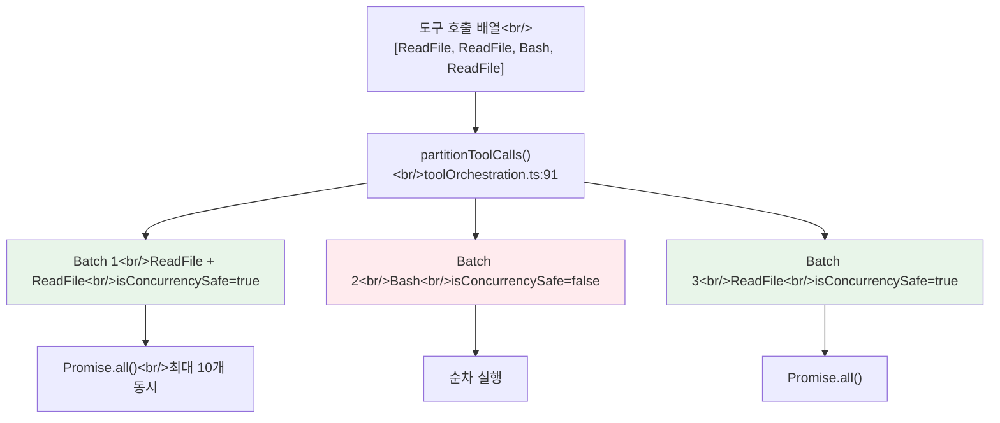
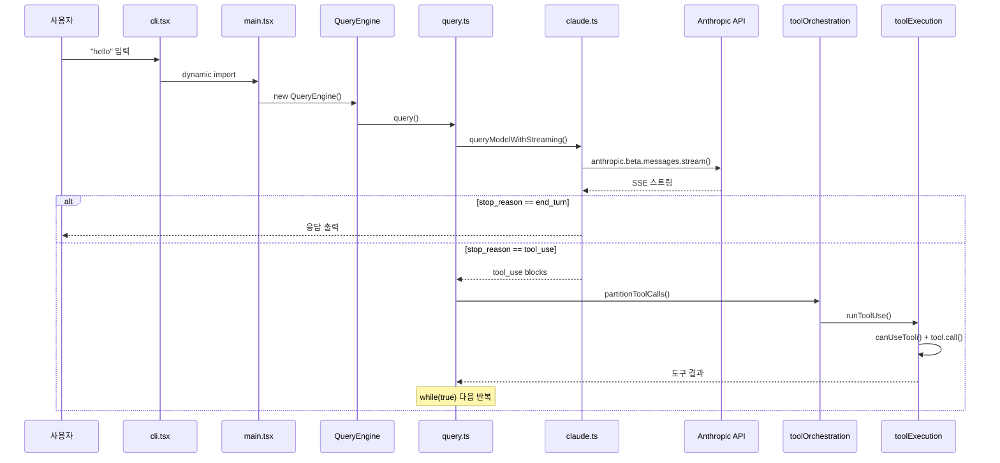

## 개요

Claude Code의 소스 구조를 27세션에 걸쳐 체계적으로 해부하는 시리즈의 첫 번째 글이다. 이 포스트에서는 사용자가 터미널에 "hello"를 입력했을 때, 응답이 화면에 출력되기까지 거치는 **11개 TypeScript 파일의 전체 콜스택**을 추적한다.

<!--more-->

## 분석 대상: 11개 핵심 파일

| # | 경로 | 줄 수 | 역할 |
|---|------|-------|------|
| 1 | `entrypoints/cli.tsx` | 302 | CLI 부트스트랩, 인자 파싱, 모드 라우팅 |
| 2 | `main.tsx` | 4,683 | 메인 REPL 컴포넌트, Commander 설정 |
| 3 | `commands.ts` | 754 | 커맨드 레지스트리 |
| 4 | `context.ts` | 189 | 시스템 프롬프트 조립, CLAUDE.md 주입 |
| 5 | `QueryEngine.ts` | 1,295 | 세션 관리, SDK 인터페이스 |
| 6 | `query.ts` | 1,729 | **핵심 턴 루프** — API + 도구 실행 |
| 7 | `services/api/client.ts` | 389 | HTTP 클라이언트, 4개 프로바이더 라우팅 |
| 8 | `services/api/claude.ts` | 3,419 | Messages API 래퍼, SSE 스트리밍, 재시도 |
| 9 | `services/tools/toolOrchestration.ts` | 188 | 동시성 파티셔닝 |
| 10 | `services/tools/StreamingToolExecutor.ts` | 530 | 스트리밍 중 도구 실행 |
| 11 | `services/tools/toolExecution.ts` | 1,745 | 도구 디스패치, 권한 검사 |

총 **15,223줄**을 추적한다.

## 1. 진입과 부트스트랩: cli.tsx -> main.tsx

`cli.tsx`는 302줄에 불과하지만, 놀라울 정도로 많은 **패스트-패스(fast-path)** 분기가 존재한다:

```
cli.tsx:37  --version        -> 즉시 출력, import 0개
cli.tsx:53  --dump-system    -> 최소 import
cli.tsx:100 --daemon-worker  -> 워커 전용 경로
cli.tsx:112 remote-control   -> 브릿지 모드
cli.tsx:185 ps/logs/attach   -> 백그라운드 세션
cli.tsx:293 기본 경로         -> main.tsx 동적 import
```

**설계 의도**: `--version` 하나를 위해 `main.tsx`의 4,683줄을 로딩하지 않겠다는 것이다. CLI 도구의 체감 응답성에 직접 영향을 미치는 최적화다.

기본 경로에서는 동적 import로 `main.tsx`를 로드한다:

```typescript
// cli.tsx:293-297
const { main: cliMain } = await import('../main.js');
await cliMain();
```

`main.tsx`가 4,683줄인 이유는 다음을 모두 포함하기 때문이다:
1. **사이드 이펙트 import** (1-209행): `profileCheckpoint`, `startMdmRawRead`, `startKeychainPrefetch` — 모듈 평가 시점에 병렬 서브프로세스를 시작하여 약 65ms의 macOS keychain 읽기를 숨긴다
2. **Commander 설정** (585행~): CLI 인자 파싱, 10+개 모드별 분기
3. **React/Ink REPL 렌더링**: 터미널 UI 마운트
4. **헤드리스 경로** (`-p`/`--print`): UI 없이 `QueryEngine` 직접 사용

## 2. 프롬프트 조립: context.ts의 dual-memoize

`context.ts`는 189줄의 작은 파일이지만 시스템 프롬프트의 동적 부분을 전담한다. 두 개의 메모이즈된 함수가 핵심이다:

- **`getSystemContext()`** (context.ts:116): git 상태(branch, status, 최근 커밋)를 수집
- **`getUserContext()`** (context.ts:155): CLAUDE.md 파일들을 탐색/파싱

**왜 분리했는가?** Anthropic Messages API의 프롬프트 캐싱 전략과 직결된다. 시스템 프롬프트와 사용자 컨텍스트의 캐시 수명이 다르므로 `cache_control`을 서로 다르게 적용해야 한다. `memoize`로 감싸서 세션 내 한 번만 계산한다.

context.ts:170-176에서 `setCachedClaudeMdContent()`를 호출하는 것은 **순환 의존성을 끊기 위한 장치**다 — yoloClassifier가 CLAUDE.md 내용을 필요로 하지만, 직접 import하면 permissions -> yoloClassifier -> claudemd -> permissions 순환이 발생한다.

## 3. AsyncGenerator 체인: 아키텍처의 척추

Claude Code의 전체 데이터 플로우는 `AsyncGenerator` 체인으로 구성된다:

```
QueryEngine.submitMessage()* -> query()* -> queryLoop()* -> queryModelWithStreaming()*
```

모든 핵심 함수가 `async function*`이다. 이는 단순한 구현 선택이 아니라 **아키텍처적 결정**이다:

- **Backpressure**: 소비자가 느리면 생산자도 대기
- **취소**: AbortController와 결합하여 즉각적인 취소 가능
- **합성**: `yield*`로 제너레이터 체인을 자연스럽게 연결
- **상태 관리**: 루프 내 로컬 변수가 턴 간 상태를 자연스럽게 유지

`QueryEngine.submitMessage()` (QueryEngine.ts:209)의 시그니처를 보면:

```typescript
async *submitMessage(
  prompt: string | ContentBlockParam[],
  options?: { uuid?: string; isMeta?: boolean },
): AsyncGenerator<SDKMessage, void, unknown>
```

SDK 모드에서 각 메시지는 **yield로 스트리밍**되며, Node.js의 backpressure가 자연스럽게 구현된다.

## 4. 핵심 턴 루프: query.ts의 while(true)

`query.ts`(1,729줄)의 `queryLoop()`가 실제 API+도구 루프다:

```typescript
// query.ts:307
while (true) {
  // 1. queryModelWithStreaming() 호출 -> SSE 스트림
  // 2. 스트리밍 이벤트를 yield
  // 3. 도구 호출 감지 -> runTools()/StreamingToolExecutor
  // 4. 도구 결과를 메시지에 추가
  // 5. stop_reason == "end_turn" -> break
  //    stop_reason == "tool_use" -> continue
}
```

`State` 타입(query.ts:204)이 중요하다. `messages`, `toolUseContext`, `autoCompactTracking`, `maxOutputTokensRecoveryCount` 등 루프 상태를 명시적 레코드로 관리하여, continue 사이트에서 한 번에 갱신한다.

## 5. API 통신: 4개 프로바이더와 캐싱

`client.ts:88`의 `getAnthropicClient()`는 4가지 프로바이더를 지원한다:

| 프로바이더 | SDK | 동적 import 이유 |
|-----------|-----|----------------|
| Anthropic Direct | `Anthropic` | 기본, 즉시 로딩 |
| AWS Bedrock | `AnthropicBedrock` | AWS SDK 수 MB |
| Azure Foundry | `AnthropicFoundry` | Azure Identity 수 MB |
| GCP Vertex | `AnthropicVertex` | Google Auth 수 MB |

`claude.ts`(3,419줄)의 핵심 함수 체인:

```
queryModelWithStreaming() (claude.ts:752)
  -> queryModel()
    -> withRetry()
      -> anthropic.beta.messages.stream() (SDK 호출)
```

캐싱 전략은 `getCacheControl()` (claude.ts:358)이 1시간 TTL 여부를 사용자 유형, 피처 플래그, 쿼리 소스에 따라 결정한다.

## 6. 도구 오케스트레이션: 3-tier 동시성



`StreamingToolExecutor`(530줄)는 이 배치 파티셔닝을 **스트리밍 컨텍스트**로 확장한다. API 응답이 스트리밍되는 도중에 도구 호출을 감지하면 즉시 실행을 시작한다:

1. `addTool()` (StreamingToolExecutor.ts:76) — 큐에 추가
2. `processQueue()` (StreamingToolExecutor.ts:140) — 동시성 확인 후 즉시 실행
3. `getRemainingResults()` (StreamingToolExecutor.ts:453) — 모든 도구 완료 대기

**에러 전파 규칙**: Bash 에러만 형제 도구를 취소한다 (`siblingAbortController`). Read/WebFetch 에러는 다른 도구에 영향을 주지 않는다. 이는 Bash 명령 간의 암묵적 의존성(mkdir 실패 -> 후속 명령 무의미)을 반영한 설계다.

## 전체 데이터 플로우



## Rust 갭 지도 미리보기

동일한 요청을 Rust 포트에서 추적한 결과, **31개 갭**을 식별했다:

| 우선순위 | 갭 수 | 핵심 예시 |
|---------|------|----------|
| P0 (치명적) | 2 | 동기 ApiClient, StreamingToolExecutor 부재 |
| P1 (높음) | 6 | 3-tier 동시성, 프롬프트 캐싱, Agent 도구 |
| P2 (보통) | 7 | 멀티 프로바이더, 노력 제어, 샌드박스 |
| 구현 완료 | 11 | 자동 압축, SSE 파서, OAuth, 설정 로딩 |

**구현 완료율: 36% (11/31)**. 다음 포스트에서 이 갭들의 핵심인 대화 루프를 깊이 파고든다.

## 인사이트

1. **AsyncGenerator가 아키텍처의 척추다** — 단순한 구현 기법이 아니라 backpressure, 취소, 합성을 한 번에 해결하는 설계 결정이다. Rust에서는 `Stream` trait이 대응하지만 `yield*` 합성의 인체공학이 크게 다르다.

2. **main.tsx 4,683줄은 기술 부채다** — Commander 설정, React 컴포넌트, 상태 관리가 한 파일에 혼재. 역사적 성장의 결과로, 모듈 분리의 기회가 된다.

3. **도구 동시성이 단순하지 않다** — "전부 병렬" 또는 "전부 직렬"이 아닌 3계층 모델(읽기 배치, 쓰기 순차, Bash 형제 취소)은 실전 에이전트 하네스의 핵심 설계 요소다.

*다음 포스트: [#2 — 대화 루프의 심장, StreamingToolExecutor와 7개의 continue](/posts/2026-04-06-harness-anatomy-2/)*
