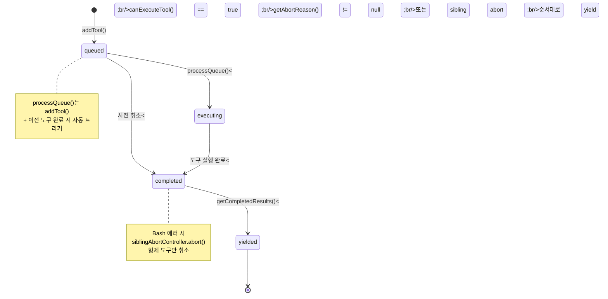
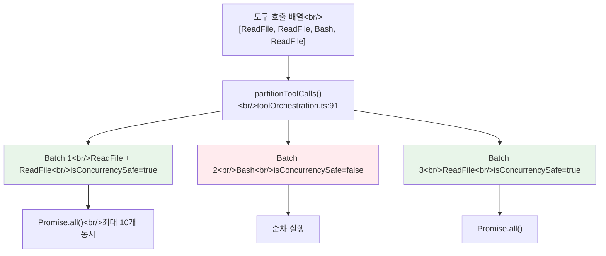
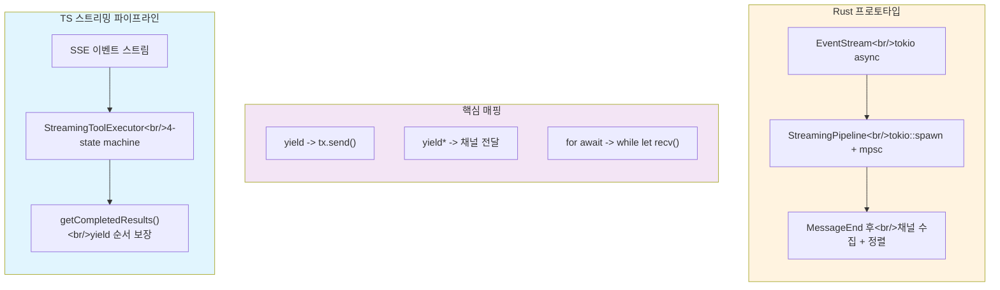

## 개요

시리즈 첫 번째 글에서 "hello" 한마디가 11개 파일을 관통하는 여정을 추적했다. 이번 포스트에서는 그 여정의 심장부인 `query.ts` 1,729줄의 `while(true)` 루프를 완전 해부한다. 7가지 `continue` 경로가 만드는 탄력적 실행 모델, `StreamingToolExecutor`의 4단계 상태 머신, 그리고 `partitionToolCalls()`의 3계층 동시성 모델을 분석한 뒤, Rust 프로토타입에서 이를 어떻게 재현했는지 대조한다.

<!--more-->

## 분석 대상: 10개 핵심 파일

| # | 경로 | 줄 수 | 역할 |
|---|------|-------|------|
| 1 | `query/config.ts` | 46 | 이뮤터블 런타임 게이트 스냅샷 |
| 2 | `query/deps.ts` | 40 | 테스트 가능한 I/O 경계 (DI) |
| 3 | `query/tokenBudget.ts` | 93 | 토큰 예산 관리, 자동 연속/중단 결정 |
| 4 | `query/stopHooks.ts` | 473 | Stop/TaskCompleted/TeammateIdle 훅 |
| 5 | `query.ts` | 1,729 | **핵심** -- while(true) 턴 루프 |
| 6 | `QueryEngine.ts` | 1,295 | 세션 래퍼, SDK 인터페이스 |
| 7 | `toolOrchestration.ts` | 188 | 도구 파티셔닝 + 동시성 제어 |
| 8 | `StreamingToolExecutor.ts` | 530 | SSE 중 도구 파이프라이닝 |
| 9 | `toolExecution.ts` | 1,745 | 도구 디스패치, 권한 검사 |
| 10 | `toolHooks.ts` | 650 | Pre/PostToolUse 훅 파이프라인 |

총 **6,789줄**의 핵심 오케스트레이션 코드를 해부한다.

## 1. queryLoop()의 7가지 continue 경로

`query.ts`의 `queryLoop()` 함수(query.ts:241)는 단순한 API 호출 루프가 아니다. 7가지 `continue` 사유를 가진 **탄력적 실행기**다. 각 경로는 고유한 장애 시나리오를 처리한다:

| 사유 | 행 | 설명 |
|------|-----|------|
| `collapse_drain_retry` | 1114 | 컨텍스트 축소 드레인 후 재시도 |
| `reactive_compact_retry` | 1162 | 반응형 압축 후 재시도 (413 복구) |
| `max_output_tokens_escalate` | 1219 | 8k -> 64k 토큰 에스컬레이션 |
| `max_output_tokens_recovery` | 1248 | "이어서 작성하라" 넛지 메시지 주입 |
| `stop_hook_blocking` | 1303 | Stop 훅이 블로킹 에러 반환 |
| `token_budget_continuation` | 1337 | 토큰 예산 미달로 계속 |
| `next_turn` | 1725 | 도구 실행 완료 후 다음 턴 |

**State 타입이 핵심이다** (query.ts:204-217). 루프 상태를 10개 필드의 레코드로 관리한다. 왜 개별 변수가 아닌 레코드인가? `continue` 사이트가 7곳이며, 각각 `state = { ... }`으로 한 번에 갱신한다. 9개 변수를 개별 할당하면 하나를 빠뜨리는 실수가 발생하기 쉽다. **레코드 갱신은 타입 시스템이 누락을 잡아준다.**

### 루프 한 반복의 전체 흐름

```
1. 전처리 (365-447): snip 압축, 마이크로 컴팩트, 컨텍스트 축소
2. 자동 압축 (454-543): 성공 시 메시지 교체 후 continue
3. 블로킹 한도 검사 (628-648): 토큰 임계값 초과 시 즉시 종료
4. API 스트리밍 (654-863): SSE 이벤트를 for await로 소비
5. 도구 없는 종료 경로 (1062-1357): 413 복구, max_output 복구, stop 훅
6. 도구 있는 계속 경로 (1360-1728): 나머지 도구 실행 -> next_turn
```

## 2. StreamingToolExecutor의 4단계 상태 머신

`StreamingToolExecutor.ts`(530줄)는 Claude Code에서 가장 정교한 동시성 패턴이다. 핵심 아이디어: **API 응답이 아직 스트리밍되는 동안 이미 완성된 도구 호출의 실행을 시작**한다.

모델이 `[ReadFile("a.ts"), ReadFile("b.ts"), Bash("make test")]`를 한 번에 호출하는 경우, 파이프라이닝 없이는 세 도구 블록이 모두 도착한 후에야 실행이 시작된다. 파이프라이닝에서는 `ReadFile("a.ts")` 블록이 완성되는 즉시 파일 읽기가 시작된다.



### 동시성 결정 로직 (canExecuteTool, line 129)

```
실행 가능 조건:
  - 현재 실행 중인 도구가 없음 (executingTools.length === 0)
  - 또는: 이 도구가 concurrencySafe이고 실행 중인 모든 도구도 concurrencySafe
```

read-only 도구끼리는 병렬 실행이 가능하지만, write 도구가 하나라도 있으면 그 도구가 끝날 때까지 다음 도구는 대기한다.

### siblingAbortController -- 계층적 취소

`siblingAbortController`(line 46-61)는 `toolUseContext.abortController`의 자식이다. Bash 도구가 에러를 발생시키면 `siblingAbortController.abort('sibling_error')`를 호출하여 **형제 도구만 취소**한다. 부모 컨트롤러는 영향을 받지 않으므로 전체 쿼리는 계속 실행된다.

왜 Bash 에러만 형제를 취소하는가? `mkdir -p dir && cd dir && make`에서 mkdir이 실패하면 후속 명령은 무의미하다. ReadFile이나 WebFetch 실패는 독립적이므로 다른 도구에 영향을 주지 않아야 한다.

## 3. partitionToolCalls -- 3계층 동시성 모델

`toolOrchestration.ts`(188줄)는 도구 실행의 동시성 모델 전체를 정의한다.



규칙은 단순하다: 연속된 `isConcurrencySafe` 도구는 하나의 배치로 묶고, 그렇지 않은 도구는 각각 독립 배치가 된다. 이 결정은 **도구 정의 자체에서** 나온다 -- `tool.isConcurrencySafe(parsedInput)` 호출로 결정된다. 같은 도구라도 입력에 따라 동시성 안전성이 달라질 수 있다.

### 컨텍스트 수정자와 경쟁 조건

**왜 배치 완료 후 순서대로 적용하는가?** 병렬 실행 중 컨텍스트 수정자를 즉시 적용하면 경쟁 조건이 발생한다. A가 먼저 완료되어 컨텍스트를 수정하면, 아직 실행 중인 B는 수정 전 컨텍스트로 시작했지만 수정 후 컨텍스트를 보게 된다. 배치 완료 후 원래 도구 순서대로 적용하면 결정론적 결과를 보장한다 (toolOrchestration.ts:54-62).

## 4. 도구 실행 파이프라인과 훅

`toolExecution.ts`(1,745줄)의 `runToolUse()`(line 337)가 개별 도구 호출의 전체 생명주기를 관리한다:

```
runToolUse() 진입점
  1. findToolByName() -- deprecated 별칭으로 재시도 (345-356)
  2. abort 체크 -- 이미 취소되었으면 CANCEL_MESSAGE (415)
  3. streamedCheckPermissionsAndCallTool() -- 권한 + 실행 + 훅 (455)
     -> checkPermissionsAndCallTool():
        a. Zod 스키마로 입력 유효성 검사 (615)
        b. tool.validateInput() 커스텀 검증 (683)
        c. 투기적 분류기 (Bash 전용, 740)
        d. runPreToolUseHooks() (800)
        e. resolveHookPermissionDecision() (921)
        f. tool.call() 실제 실행 (1207)
        g. runPostToolUseHooks() 결과 변환
```

### resolveHookPermissionDecision의 핵심 불변식

`resolveHookPermissionDecision()`(toolHooks.ts:332)에서 **훅의 `allow`가 settings.json의 deny/ask 규칙을 바이패스하지 않는다** (toolHooks.ts:373). 훅이 allow해도 `checkRuleBasedPermissions()`를 통과해야 한다. 이것은 "훅은 자동화 도우미이지 보안 우회가 아니다"라는 설계 원칙을 반영한다.

```
훅 결과가 allow일 때:
  -> checkRuleBasedPermissions() 호출
  -> null이면 통과 (규칙 없음)
  -> deny이면 규칙이 훅을 오버라이드
  -> ask이면 사용자 프롬프트 필요
```

## 5. Rust 대조 -- 152줄 vs 1,729줄

Rust의 `ConversationRuntime::run_turn()`은 **152줄의 단일 `loop {}`** (conversation.rs:183-272)로 구성된다. TS의 7가지 continue 경로 중 Rust에 존재하는 것은 `next_turn`(도구 실행 완료 후 다음 턴) 딱 하나뿐이다.

| TS continue 사유 | Rust 상태 | 이유 |
|------------------|----------|------|
| `collapse_drain_retry` | 미구현 | 컨텍스트 축소 없음 |
| `reactive_compact_retry` | 미구현 | 413 복구 없음 |
| `max_output_tokens_escalate` | 미구현 | 8k->64k 에스컬레이션 없음 |
| `max_output_tokens_recovery` | 미구현 | 멀티턴 넛지 없음 |
| `stop_hook_blocking` | 미구현 | Stop 훅 없음 |
| `token_budget_continuation` | 미구현 | 토큰 예산 시스템 없음 |
| `next_turn` | **구현됨** | 도구 결과 후 API 재호출 |

### 가장 치명적인 갭: 동기적 API 소비

Rust의 `ApiClient` 트레이트 시그니처가 모든 것을 말해준다:

```rust
fn stream(&mut self, request: ApiRequest) -> Result<Vec<AssistantEvent>, RuntimeError>;
```

반환 타입이 `Vec<AssistantEvent>`다. **스트리밍이 아니다.** SSE 이벤트를 모두 수집한 후 벡터로 반환한다. 이로 인해 모델이 5개 ReadFile을 호출할 때, TS는 첫 번째 ReadFile이 스트리밍 중에 실행 완료될 수 있지만, Rust는 5개 모두 스트리밍이 끝난 후에야 순차 실행을 시작한다. **레이턴시 차이가 도구 수에 비례하여 증가**한다.

## 6. Rust 프로토타입 -- 갭 브릿지

S04 프로토타입에서 P0 갭 3개를 브릿지하는 오케스트레이션 레이어를 구현했다:



### 프로토타입의 3가지 구현

**1. 비동기 스트리밍**: `ApiClient` 트레이트를 비동기 스트림으로 확장. `MessageStream::next_event()`가 이미 비동기이므로 소비 측만 변경하면 된다.

**2. 도구 파이프라이닝**: `ToolUseEnd` 이벤트 수신 시 누적된 입력으로 `ToolCall`을 조립하고 `tokio::spawn`으로 즉시 백그라운드 실행을 시작한다. `mpsc::unbounded_channel`로 완료 순서로 수집하고 나중에 원래 순서로 정렬한다.

**3. 3-tier 동시성**: `ToolCategory` enum(ReadOnly/Write/BashLike)에 따라 파티셔닝. ReadOnly 배치는 `Semaphore(10)` + `tokio::spawn`으로 최대 10개 병렬. BashLike는 순차 실행 + 에러 시 나머지 중단.

### 프로토타입 커버리지

| TS 기능 | 프로토타입 | 상태 |
|---------|-----------|------|
| `partitionToolCalls()` 3-tier | `partition_into_runs()` + `ToolCategory` | 구현 |
| `runToolsConcurrently()` max 10 | `Semaphore(10)` + `tokio::spawn` | 구현 |
| `siblingAbortController` | BashLike에서 `break` | 단순화 |
| `StreamingToolExecutor.addTool()` | `ToolUseEnd` 시 `tokio::spawn` | 구현 |
| PreToolUse hook deny/allow | `HookDecision::Allow/Deny` | 구현 |
| PostToolUse output transform | `HookResult::transformed_output` | 구현 |
| 4-state machine (queued->yielded) | spawned/completed 2-state | 미완성 |
| 413 복구 / max_output 에스컬레이션 | -- | 미구현 |
| `preventContinuation` | -- | 미구현 |

## 정지 조건 비교

| 조건 | TS | Rust |
|------|-----|------|
| 도구 없음 (end_turn) | `handleStopHooks()` 실행 후 종료 | 즉시 `break` |
| 토큰 예산 초과 | `checkTokenBudget()` 3가지 결정 | 없음 |
| max_output_tokens | 에스컬레이션 + 멀티턴 복구 | 없음 |
| 413 prompt-too-long | 컨텍스트 축소 + 반응형 압축 | 에러 전파 |
| maxTurns | `maxTurns` 파라미터 (query.ts:1696) | `max_iterations` |
| 수확 체감 | 3회 이상 + 500토큰 미만 증가 | 없음 |

`tokenBudget.ts`(93줄)의 `checkTokenBudget()`은 **프롬프트 크기가 아닌 응답 연속 여부**를 제어한다. `COMPLETION_THRESHOLD = 0.9`(전체 버짓의 90% 미만이면 계속), `DIMINISHING_THRESHOLD = 500`(연속 3회 이상 매번 500토큰 미만 생성 시 수확 체감으로 중단). `nudgeMessage`가 명시적으로 "do not summarize"를 지시한다.

## 설계 결정의 핵심 -- 왜 AsyncGenerator인가

전체 파이프라인이 `async function*` 체인이다:

```
QueryEngine.submitMessage()* -> query()* -> queryLoop()* -> deps.callModel()*
runTools()* -> runToolUse()* -> handleStopHooks()* -> executeStopHooks()*
```

이 선택의 핵심 이점: **제어 흐름의 반전 없이 복잡한 상태 기계를 구현**할 수 있다. 7가지 `continue` 경로에서 `state = { ... }`로 상태를 명시적으로 구성하고 `continue`하면 된다. 콜백 기반이었다면 상태 관리가 분산되어 7가지 복구 경로의 정합성을 보장하기 어려웠을 것이다.

Rust에서는 `yield` 키워드가 안정화되지 않았으므로, `tokio::sync::mpsc` 채널로 대체한다. `yield` -> `tx.send()`, `yield*` -> 채널 전달, `for await...of` -> `while let Some(v) = rx.recv()`.

## 인사이트

1. **query.ts의 7가지 continue는 "에러 처리"가 아니라 "탄력성 엔진"이다** -- 413 에러에서 컨텍스트를 축소하고, max_output에서 토큰을 에스컬레이션하며, stop 훅 블로킹에서 에러를 모델에 피드백한다. 이 복구 파이프라인이 장시간 자율 작업의 안정성을 보장한다. Rust에서 이를 재현하려면 단순한 `loop {}` 이상의 상태 관리가 필요하다.

2. **StreamingToolExecutor는 성능 최적화가 아니라 UX 결정이다** -- 도구 5개를 직렬로 실행하면 사용자가 체감하는 대기 시간이 직렬 합산이 된다. 파이프라이닝은 벤치마크 수치가 아니라 "응답을 기다리는" 시간을 줄이는 사용자 경험 요소다. Rust 프로토타입에서 `tokio::spawn` + `mpsc` 채널로 이를 20줄 이내에 구현할 수 있었다.

3. **정적 파티셔닝 + 런타임 동시성의 이중 구조가 안전성과 성능을 양립시킨다** -- `partitionToolCalls()`가 컴파일 타임에 배치를 나누고, `canExecuteTool()`이 런타임에 실행 가능 여부를 판단한다. 이 이중 구조 덕분에 비스트리밍 경로(`runTools`)와 스트리밍 경로(`StreamingToolExecutor`)가 동일한 동시성 의미론을 공유한다.

*다음 포스트: [#3 -- 42개 도구의 설계 철학, BashTool부터 AgentTool까지](/posts/2026-04-06-harness-anatomy-3/)*
