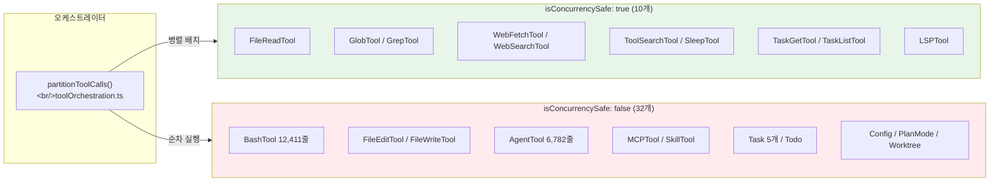
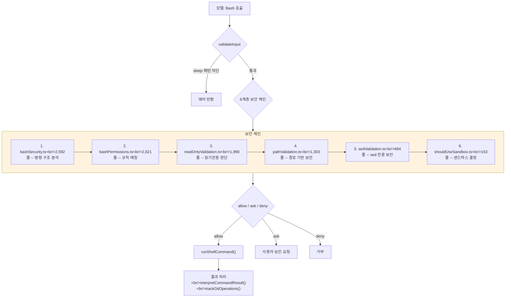

## 개요

Claude Code에는 42개의 도구가 존재한다. 이 포스트에서는 `Tool.ts`의 30+ 멤버 인터페이스가 구현하는 "도구가 자신을 알고 있다" 패턴을 해부하고, 42개 도구를 8개 패밀리로 분류한다. 그 중 가장 복잡한 BashTool(12,411줄)의 6계층 보안 체인, AgentTool(6,782줄)의 4가지 스폰 모드, FileEditTool의 문자열 매칭 전략, MCPTool의 빈 껍데기 프록시 패턴, Task 상태 머신을 심층 분석한다.

<!--more-->

## 1. Tool 인터페이스 -- "도구가 자신을 알고 있다"

`Tool.ts`(792줄)는 도구 시스템의 계약서다. 모든 도구가 구현하는 `Tool` 타입(Tool.ts:362-695)은 **30개 이상의 멤버**로 구성되며 네 영역으로 나뉜다:

| 영역 | 핵심 멤버 | 역할 |
|------|-----------|------|
| 실행 계약 | `call()`, `inputSchema`, `validateInput()`, `checkPermissions()` | 도구의 핵심 로직 |
| 메타데이터 | `name`, `aliases`, `searchHint`, `shouldDefer`, `maxResultSizeChars` | 검색과 표시 |
| 동시성/안전성 | `isConcurrencySafe()`, `isReadOnly()`, `isDestructive()`, `interruptBehavior()` | 오케스트레이션 결정 |
| UI 렌더링 | `renderToolUseMessage()` 등 10개+ | 터미널 표시 |

**왜 이렇게 많은 멤버가 한 인터페이스에?** 오케스트레이터(`toolExecution.ts`)가 도구를 호출할 때 외부 매핑 테이블 없이 도구 객체 자체에서 모든 메타데이터를 읽을 수 있다. 새 도구 추가가 **한 디렉토리 안에서 완결**되는 플러그인 아키텍처의 근간이다.

### ToolUseContext -- 42개 필드의 실행 환경

`ToolUseContext`(Tool.ts:158-300)는 도구 실행 시 주입되는 환경 컨텍스트다. 142줄에 걸쳐 42개 필드가 정의되어 있다:

- `abortController`: 3-tier 동시성 모델의 취소 전파
- `getAppState()`/`setAppState()`: 전역 상태 접근 (권한, todo, 팀)
- `readFileState`: LRU 캐시 기반 변경 감지
- `contentReplacementState`: 대용량 결과를 디스크에 저장하고 요약만 반환

도구는 격리된 함수가 아니라 하네스의 전체 상태에 접근해야 한다. FileReadTool은 캐시로 변경 여부를 판단하고, AgentTool은 서브에이전트 상태를 등록하며, BashTool은 형제 프로세스를 중단한다.

### buildTool()의 fail-closed 기본값

`buildTool()`(Tool.ts:783)은 `ToolDef`를 받아 기본값을 채운 완전한 `Tool`을 반환한다. 기본값은 **fail-closed** 원칙(Tool.ts:757-768):

- `isConcurrencySafe` -> `false` (안전하지 않다고 가정)
- `isReadOnly` -> `false` (쓰기한다고 가정)

새 도구를 만들 때 동시성/읽기전용을 명시적으로 선언하지 않으면 가장 보수적인 경로(순차 실행, 쓰기 권한 요구)를 탄다. **실수로 안전하지 않은 도구를 병렬 실행하는 버그를 구조적으로 방지**한다.

## 2. 42개 도구의 8개 패밀리



| 패밀리 | 도구 수 | 대표 도구 | 핵심 특징 |
|--------|---------|-----------|----------|
| 파일시스템 | 5 | FileReadTool (1,602줄) | PDF/이미지/노트북 지원, 토큰 제한 |
| 실행 | 3 | BashTool (12,411줄) | 6계층 보안, 명령 의미론 |
| 에이전트/팀 | 4 | AgentTool (6,782줄) | 4가지 스폰, 재귀적 하네스 |
| 태스크 관리 | 7 | TaskUpdateTool (484줄) | 상태 머신, 검증 넛지 |
| MCP/LSP | 5 | MCPTool (1,086줄) | 빈 껍데기 프록시 |
| 웹/외부 | 2 | WebFetchTool (1,131줄) | 병렬 안전 |
| 상태/설정 | 5 | ConfigTool (809줄) | 세션 상태 변경 |
| 인프라/유틸 | 11 | SkillTool (1,477줄) | 커맨드-도구 브리지 |

**42개 중 10개(24%)만 병렬 실행 가능하지만, 이 10개가 가장 빈번하게 호출되는 도구(Read, Glob, Grep, Web)이므로 실제 체감 병렬성은 비율보다 높다.**

## 3. BashTool -- 6계층 보안 체인

BashTool은 단순한 셸 실행기가 아니다. **임의 코드 실행**이라는 본질적 위험 때문에 12,411줄의 절반 이상이 보안 레이어다.



각 레이어가 다른 위협을 담당한다:

1. **bashSecurity.ts** (2,592줄): 명령 치환(`$()`, `` ` ``), Zsh 모듈 기반 공격 차단. 핵심: **unquoted 컨텍스트의 메타문자만 위험으로 분류**
2. **bashPermissions.ts** (2,621줄): 규칙 기반 allow/deny/ask. `stripAllLeadingEnvVars()` + `stripSafeWrappers()`로 래퍼 제거 후 실제 명령 추출
3. **readOnlyValidation.ts** (1,990줄): 읽기전용이면 `isConcurrencySafe: true` -- 병렬 실행 허용
4. **pathValidation.ts** (1,303줄): 명령별 경로 추출 규칙으로 경로 안전성 판단
5. **sedValidation.ts** (684줄): sed의 `w`, `e` 플래그는 파일 쓰기/임의 실행 가능 -- 별도 차단
6. **shouldUseSandbox.ts** (153줄): 최종 격리 결정

**명령 의미론** (`commandSemantics.ts`): `grep`과 `diff`는 exit code 1이 에러가 아닌 정상 결과다. `COMMAND_SEMANTICS` Map으로 명령별 해석 규칙을 정의한다.

**Rust 포팅 시사점**: 이 6계층을 통째로 재현하거나, 아예 sandbox-only로 단순화해야 한다. 중간 단계 생략은 보안 구멍을 만든다.

## 4. AgentTool -- 4가지 스폰 모드

AgentTool은 "도구"라기보다 **에이전트 오케스트레이터**다. 핵심: `runAgent()`는 하네스의 `query()` 루프를 재귀 호출한다. 자식 에이전트는 부모와 동일한 도구/API/보안 체크를 받는다.

| 모드 | 트리거 | 컨텍스트 공유 | 백그라운드 |
|------|--------|---------------|-----------|
| 동기 | 기본 | 없음 (프롬프트만) | X |
| 비동기 | `run_in_background: true` | 없음 | O |
| 포크 | `subagent_type` 생략 | 부모 전체 컨텍스트 | O |
| 원격 | `isolation: "remote"` | 없음 | O |

### 포크 서브에이전트 -- byte-identical 프리픽스

포크는 부모의 **전체 대화 컨텍스트를 상속**한다. 프롬프트 캐시 공유를 위해 모든 포크 자식이 byte-identical API 요청 프리픽스를 생성하도록 설계한다:

- 도구 사용 결과를 플레이스홀더로 대체
- `FORK_BOILERPLATE_TAG`로 재귀 포크 방지
- 모델 동일 유지 (`model: 'inherit'`) -- 다른 모델은 캐시 불일치

### 메모리 시스템 (agentMemory.ts)

에이전트별 지속 메모리를 3가지 스코프로 관리:

- **user**: `~/.claude/agent-memory/<type>/` -- 사용자 전역
- **project**: `.claude/agent-memory/<type>/` -- 프로젝트 공유 (VCS)
- **local**: `.claude/agent-memory-local/<type>/` -- 로컬 전용

## 5. FileEditTool -- 부분 대체 패턴

FileEditTool(1,812줄)은 전체 파일 쓰기가 아닌 **`old_string` -> `new_string` 패치**를 수행한다. 모델이 전체 파일을 출력할 필요가 없어 토큰을 절약하고, diff 기반 리뷰를 가능하게 한다.

매칭 전략:
1. **정확한 문자열 매칭**: `fileContent.includes(searchString)`
2. **따옴표 정규화**: curly quote -> straight quote 변환 후 재시도, `preserveQuoteStyle()`로 원본 스타일 보존
3. **고유성 검증**: `old_string`이 파일에서 유일하지 않으면 실패 (또는 `replace_all`)

**동시성 보호**: `readFileState` Map에 파일별 마지막 읽기 타임스탬프를 저장. 편집 시 디스크 수정 시간과 비교하여 외부 변경을 감지한다. 이것이 "Read 후 Edit" 규칙이 프롬프트에서 강제되는 이유다.

## 6. MCPTool -- 빈 껍데기 프록시

MCPTool(1,086줄)은 **하나의 도구 정의가 수백 개의 외부 도구를 대표**한다. 빌드 시점에는 빈 껍데기이고, 런타임에 `mcpClient.ts`가 서버별로 복제 + 오버라이드한다:

```typescript
// MCPTool.ts:27-51 -- 핵심 메서드가 "Overridden in mcpClient.ts" 주석
name: 'mcp',           // 런타임에 'mcp__serverName__toolName'으로 교체
async call() { return { data: '' } },  // 런타임에 실제 MCP 호출로 교체
```

UI 축소 분류(`classifyForCollapse.ts`, 604줄)는 139개 SEARCH_TOOLS, 280개+ READ_TOOLS 이름으로 MCP 도구의 읽기/검색 여부를 판단한다. 알 수 없는 도구는 축소하지 않는다(보수적).

## 7. Task 상태 머신 -- 에이전트 IPC

TaskUpdateTool(406줄)의 상태 흐름: `pending -> in_progress -> completed` 또는 `deleted`.

핵심 행동:
- **소유자 자동 설정**: `in_progress` 변경 시 현재 에이전트 이름 자동 할당
- **검증 넛지**: 3개+ 태스크 완료 후 검증 단계가 없으면 verification agent 스폰 권고
- **메시지 라우팅** (SendMessageTool 917줄): 이름, `*` 브로드캐스트, `uds:path` Unix 도메인 소켓, `bridge:session` 원격 피어, 에이전트 ID 재개

Task/SendMessage는 단순한 유틸리티가 아니라 멀티에이전트 시스템의 **프로세스 간 통신(IPC)** 기초다.

## TS vs Rust 비교

| 측면 | TS (42개 도구) | Rust (10개 도구) |
|------|---------------|-----------------|
| 도구 정의 | `Tool` 인터페이스 + `buildTool()` | `ToolSpec` 구조체 + `mvp_tool_specs()` |
| 입력 스키마 | Zod v4 + `lazySchema()` | `serde_json::json!()` JSON Schema 직접 |
| 동시성 선언 | `isConcurrencySafe(parsedInput)` | 없음 -- 순차 실행 |
| 권한 검사 | `checkPermissions()` -> `PermissionResult` | `PermissionMode` enum |
| UI 렌더링 | 10+ render 메서드 (React/Ink) | 없음 |
| MCP 통합 | MCPTool + `inputJSONSchema` 이중 경로 | 없음 |
| 크기 비교 | ~48,000줄 (도구 코드만) | ~1,300줄 (lib.rs 단일) |

**핵심 격차**: Rust 포트는 실행 계약(`call` 등가물)만 구현하고, 동시성 선언, 권한 파이프라인, UI 렌더링, 지연 로딩 최적화는 모두 없다.

## 인사이트

1. **보안은 단일 체크포인트가 아니라 체인이다** -- BashTool의 6계층은 각 레이어가 다른 위협을 담당한다. bashSecurity는 명령 구조, bashPermissions는 규칙 매칭, pathValidation은 경로 안전성. 이 체인의 어느 한 곳이라도 빠지면 공격 표면이 열린다. fail-closed 원칙과 결합하여 "모르면 차단"이라는 보수적 전략이 전체 시스템을 관통한다.

2. **에이전트는 재귀적 하네스 인스턴스다** -- AgentTool의 `runAgent()`가 하네스의 `query()` 루프를 재귀 호출한다는 것은, "에이전트"가 별개의 시스템이 아니라 **같은 하네스의 다른 구성(configuration)**이라는 아키텍처 결정이다. 도구 풀만 교체하고 동일한 보안/훅/오케스트레이션을 재사용한다.

3. **42개 도구 중 10개만 concurrency-safe이지만 체감 병렬성은 높다** -- 전체의 24%에 불과한 10개 도구(Read, Glob, Grep, Web, LSP)가 가장 빈번하게 호출된다. 이 비대칭이 3-tier 동시성 모델의 실용적 가치를 보여준다. `buildTool()`의 fail-closed 기본값(`isConcurrencySafe: false`)이 안전 경계를 형성하여, 새 도구 개발자가 동시성을 잘못 선언하는 실수를 구조적으로 방지한다.

*다음 포스트: [#4 -- 런타임 훅 26+이벤트와 CLAUDE.md 6단계 디스커버리](/posts/2026-04-06-harness-anatomy-4/)*
