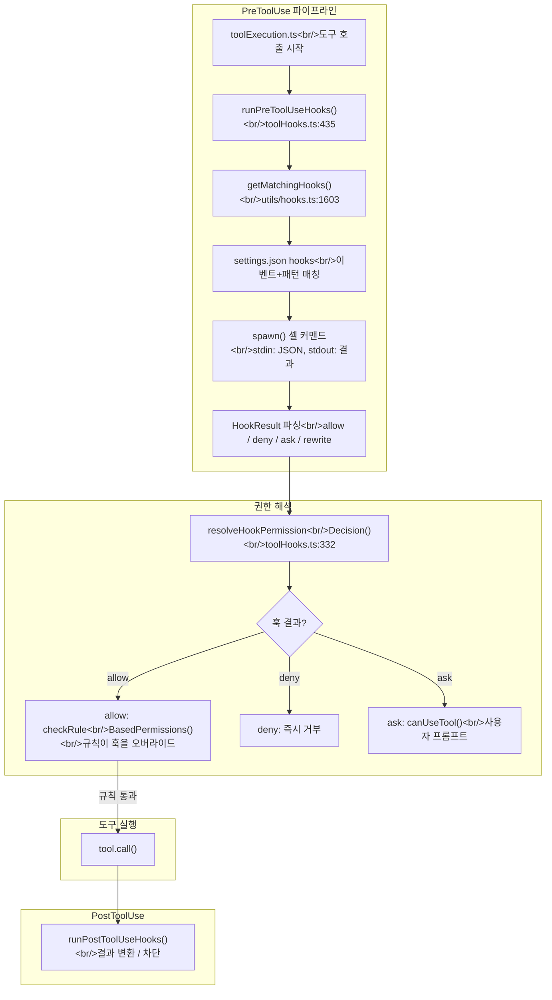
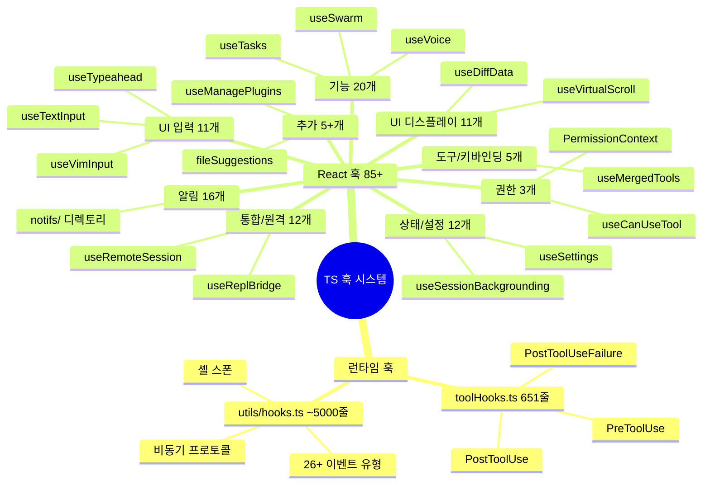

## 개요

Claude Code에서 "hook"이라는 단어는 **두 가지 완전히 다른 시스템**을 가리킨다. 런타임 훅(`toolHooks.ts` + `utils/hooks.ts`)은 도구 실행 전후에 셸 스크립트를 실행하는 보안/확장 파이프라인이고, React 훅(`hooks/*.ts` 85개+)은 터미널 UI의 상태 관리 코드다. 이 구분을 놓치면 Rust 재구현 범위를 85배 오판하게 된다. 이번 포스트에서는 런타임 훅의 PreToolUse/PostToolUse 파이프라인과 `resolveHookPermissionDecision()`의 보안 불변식, 85개 React 훅의 9개 카테고리 분류, 그리고 CLAUDE.md 6단계 디스커버리와 토큰 버짓 관리를 분석한다.

<!--more-->

## 1. 런타임 훅 vs React 훅 -- 핵심 구분

| 차원 | 런타임 훅 (toolHooks.ts + utils/hooks.ts) | React 훅 (hooks/*.ts) |
|------|------------------------------------------|----------------------|
| **실행 주체** | `child_process.spawn()` | React 렌더 사이클 |
| **구성 방법** | settings.json `hooks` 필드, 셸 커맨드 | 소스코드 `import` |
| **실행 시점** | 도구 사용 전/후, 세션 시작 등 26+ 이벤트 | 컴포넌트 마운트/업데이트 |
| **사용자 정의** | 가능 -- 사용자가 셸 스크립트 등록 | 불가능 -- 내부 코드 |
| **결과 형태** | JSON stdout (allow/deny/ask/rewrite) | React state 변경 |
| **Rust 재구현** | 필수 -- 도구 실행 파이프라인의 핵심 | 불필요 -- TUI 전용 |

## 2. PreToolUse 파이프라인 -- 7가지 yield 변형

`runPreToolUseHooks()`(toolHooks.ts:435-650)는 AsyncGenerator로 설계되어 있다. 도구 실행 전에 호출되며 다음 yield 타입들을 방출한다:

1. **`message`**: 진행 상황 메시지 (훅 시작/에러/취소)
2. **`hookPermissionResult`**: allow/deny/ask 결정
3. **`hookUpdatedInput`**: 입력 재작성 (권한 결정 없이 입력만 변경)
4. **`preventContinuation`**: 실행 중단 플래그
5. **`stopReason`**: 중단 사유 문자열
6. **`additionalContext`**: 모델에 전달할 추가 컨텍스트
7. **`stop`**: 즉시 중단

**왜 AsyncGenerator인가?** 훅은 여러 개가 순차 실행되고, 각 훅의 결과가 다음 처리에 영향을 미친다. Promise 체이닝은 최종 결과만 반환하고, 이벤트 이미터는 타입 안전성이 없다. AsyncGenerator는 호출자가 각 결과를 소비하면서 중간에 중단할 수 있는 유일한 패턴이다.



### resolveHookPermissionDecision -- allow != bypass

`resolveHookPermissionDecision()`(toolHooks.ts:332-433)의 핵심 불변식: **훅의 `allow`가 settings.json의 deny/ask 규칙을 바이패스하지 않는다** (toolHooks.ts:325-327).

처리 로직 3단계:

**1단계 -- allow 처리** (toolHooks.ts:347-406):

```
hookResult.behavior === 'allow':
  -> checkRuleBasedPermissions() 호출
  -> null -> 규칙 없음, 훅 허용 통과
  -> deny -> 규칙이 훅을 오버라이드 (보안 우선!)
  -> ask -> 사용자 프롬프트 필요
```

**왜 allow가 bypass하지 않는가?** 이것은 의도적 보안 결정이다. 외부 셸 스크립트가 `{"decision":"allow"}`를 반환한다고 해서 `settings.json`의 `deny` 규칙을 무시하면, 악의적 훅이 보안 정책을 우회할 수 있다. **규칙은 항상 훅보다 우선한다.**

**2단계 -- deny** (toolHooks.ts:408-411): 즉시 거부, 추가 검사 없음.

**3단계 -- ask/없음** (toolHooks.ts:413-432): `canUseTool()` 호출로 사용자 프롬프트.

### 26개 이상의 이벤트 유형

`getMatchingHooks()`(utils/hooks.ts:1603-1682)이 훅 매칭을 담당한다:

- **도구 이벤트**: PreToolUse, PostToolUse, PostToolUseFailure, PermissionRequest, PermissionDenied
- **세션 이벤트**: SessionStart, SessionEnd, Setup
- **에이전트 이벤트**: SubagentStart, SubagentStop, TeammateIdle
- **작업 이벤트**: TaskCreated, TaskCompleted
- **시스템 이벤트**: Notification, ConfigChange, FileChanged, InstructionsLoaded
- **컴팩트 이벤트**: PreCompact, PostCompact
- **입력 이벤트**: UserPromptSubmit, Elicitation, ElicitationResult
- **중단 이벤트**: Stop, StopFailure

매칭된 훅들은 **순차 실행**되며, 하나가 deny하면 이후 훅은 실행되지 않는다.

## 3. 85개 React 훅 -- 9개 카테고리 분류



| 카테고리 | 개수 | Rust 재구현 | 대표 훅 |
|----------|------|------------|---------|
| 권한 | 3 | 부분 (브릿지) | `useCanUseTool` (203줄) |
| UI 입력 | 11 | 불필요 | `useTextInput` (529줄), `useVimInput` (316줄) |
| UI 디스플레이 | 11 | 불필요 | `useVirtualScroll` (721줄) |
| 상태/설정 | 12 | 불필요 | `useSessionBackgrounding` (158줄) |
| 통합/원격 | 12 | 불필요 | `useRemoteSession` (605줄) |
| 기능/알림 | 20 | 불필요 | `useVoice` (1,144줄) |
| 알림/배너 | 16 | 불필요 | `notifs/` 디렉토리 |
| 도구/키바인딩 | 5 | 불필요 | `useMergedTools` (44줄) |
| 추가 | 5+ | 불필요 | `fileSuggestions` (811줄) |

**핵심**: Rust가 재구현해야 하는 것은 `toolHooks.ts`(651줄) + `utils/hooks.ts`(~5,000줄)의 런타임 파이프라인뿐이다. 85개 React 훅 15,000줄+은 범위 밖이다.

## 4. CLAUDE.md 6단계 디스커버리

`claudemd.ts`(1,479줄)의 `getMemoryFiles()`(L790-1074)는 6단계 계층으로 CLAUDE.md를 로드한다:

| 단계 | 소스 | 경로 예시 | 우선순위 |
|------|------|----------|----------|
| 1. Managed | 조직 정책 | `/etc/claude-code/CLAUDE.md` | 최저 |
| 2. User | 개인 습관 | `~/.claude/CLAUDE.md`, `~/.claude/rules/*.md` | |
| 3. Project | 프로젝트 규칙 | cwd에서 루트까지 `CLAUDE.md`, `.claude/rules/*.md` | |
| 4. Local | 로컬 오버라이드 | `CLAUDE.local.md` (gitignore) | |
| 5. AutoMem | 자동 메모리 | `MEMORY.md` 엔트리포인트 | |
| 6. TeamMem | 팀 메모리 | 조직 간 동기화 | 최고 |

**왜 이 순서인가?** 파일 주석(L9)이 명시한다: "Files are loaded in reverse order of priority." LLM은 프롬프트 후반부에 더 주의를 기울이므로, 가장 구체적인 지시(Local > Project > User > Managed)가 **마지막에 위치**한다. 이것은 CSS specificity가 아니라 **LLM 주의 편향**을 활용한 설계다.

### 디렉토리 상향 탐색과 중복 방지

`originalCwd`에서 파일시스템 루트까지 올라간 뒤 `dirs.reverse()`로 **루트부터 아래로** 처리한다 (L851-857). 모노레포에서 상위 `CLAUDE.md`가 먼저 로드되고 하위 프로젝트의 `CLAUDE.md`가 그 위에 오는 효과를 만든다.

**워크트리 중복 방지** (L868-884): git 워크트리가 메인 레포 내부에 중첩되면 동일 `CLAUDE.md`가 두 번 로드되는 것을 `isNestedWorktree` 검사로 방지한다.

**@include 지시자** (L451-535): 마크다운 토큰을 렉싱하여 코드 블록 내부의 `@path`는 무시하고, 텍스트 노드의 `@path`만 재귀적으로 해석한다. 최대 깊이 5.

## 5. 시스템/사용자 컨텍스트 분리 -- dual-memoize 캐시

`context.ts`(189줄)는 시스템 프롬프트를 **두 개의 독립적인 컨텍스트**로 분리한다:

1. **`getSystemContext()`** (L116): git 상태, 캐시 브레이커
2. **`getUserContext()`** (L155): CLAUDE.md 머지 문자열, 현재 날짜

**왜 둘로 나누었는가?** Anthropic API의 프롬프트 캐싱 전략 때문이다. git 상태(세션 고정)와 CLAUDE.md(파일 변경 시에만 무효화)의 캐시 수명이 다르므로, `cache_control`을 서로 다르게 적용해야 한다. 두 함수 모두 `memoize`로 감싸져 세션 내 한 번만 실행된다.

### 3가지 캐시 무효화 경로

1. `setSystemPromptInjection()` (context.ts:29): 양쪽 캐시 모두 클리어
2. `clearMemoryFileCaches()` (claudemd.ts:1119): 메모리 파일만 클리어
3. `resetGetMemoryFilesCache()` (claudemd.ts:1124): 메모리 파일 클리어 + `InstructionsLoaded` 훅 발화

이 분리는 워크트리 전환(리로드 불필요)과 실제 리로드(compaction 후)를 구분하기 위함이다.

## 6. 토큰 버짓 -- 응답 연속 결정

`tokenBudget.ts`(93줄)의 `checkTokenBudget()`은 **프롬프트 크기가 아닌 응답 연속 여부**를 제어한다:

```
COMPLETION_THRESHOLD = 0.9  -- 90% 미만이면 계속
DIMINISHING_THRESHOLD = 500 -- 3회+ 연속, 매번 500토큰 미만 -> 수확 체감

if (!isDiminishing && turnTokens < budget * 0.9) -> continue
if (isDiminishing || continuationCount > 0) -> stop with event
else -> stop without event
```

**왜 0.9인가?** 모델이 버짓 근처에서 요약을 시작하는 경향이 있다. 90%에서 멈추면 "마무리 요약"을 하지 않고 작업을 계속하게 만든다. `nudgeMessage`가 명시적으로 "do not summarize"를 지시한다.

수확 체감 감지는 모델이 반복적 패턴에 빠지는 것을 방지한다. **서브에이전트는 즉시 stop** (L51) -- 자체 버짓을 갖지 않는다.

## Rust 대조

| 관점 | TS | Rust |
|------|-----|------|
| 훅 이벤트 유형 | 26개+ | PreToolUse, PostToolUse 2개 |
| 훅 실행 | 비동기 AsyncGenerator | 동기 `Command::output()` |
| 훅 결과 | 7가지 yield 변형 + JSON | Allow/Deny/Warn 3가지 (exit code) |
| 입력 수정 | `hookUpdatedInput` | 불가능 |
| allow != bypass | 보장됨 | 미구현 (보안 취약) |
| CLAUDE.md | 6단계 디스커버리 | 4후보 per dir |
| @include | 재귀적, 깊이 5 | 미지원 |
| 토큰 버짓 | `checkTokenBudget()` 3가지 결정 | 없음 |
| 프롬프트 캐시 | memoize + 3가지 무효화 | 매번 빌드 |

## 인사이트

1. **"hook"의 이중 의미가 아키텍처의 가장 큰 혼동원이다** -- 85개 React 훅은 Rust 재구현 범위에 포함되지 않는다. 런타임 훅(~5,600줄)만이 포팅 대상이다. 그러나 이 런타임 엔진은 26개 이벤트 유형, 비동기 프로토콜(`{"async":true}` 백그라운드 전환), 프롬프트 요청(stdin/stdout 양방향)까지 포함하는 복잡한 시스템이다. "훅"이라는 단어의 범위를 정확히 파악하는 것이 범위 산정의 출발점이다.

2. **CLAUDE.md의 "마지막이 더 강하다" 패턴은 LLM 주의 편향의 의도적 활용이다** -- 6단계 계층 로딩(Managed -> User -> Project -> Local -> AutoMem -> TeamMem)에서 가장 구체적인 지시가 프롬프트 끝에 위치하여 가장 강한 영향력을 갖는다. 이것은 아키텍처적 깔끔함이 아니라 **API 프롬프트 캐싱 적중률 최적화 + LLM 행동 특성**의 교차점에서 나온 설계다.

3. **`resolveHookPermissionDecision()`의 "allow != bypass" 불변식은 보안의 핵심이다** -- 현재 Rust hooks.rs는 exit code만으로 allow/deny를 판단한다. JSON 결과 파싱과 `checkRuleBasedPermissions` 후속 검사를 구현하지 않으면, 악의적 훅이 deny 규칙을 우회할 수 있는 보안 취약점이 생긴다. 편의 자동화와 보안 정책의 경계를 명확히 하는 것이 훅 시스템의 근본 과제다.

*다음 포스트: [#5 -- MCP 서비스와 플러그인 스킬 확장 생태계](/posts/2026-04-06-harness-anatomy-5/)*
