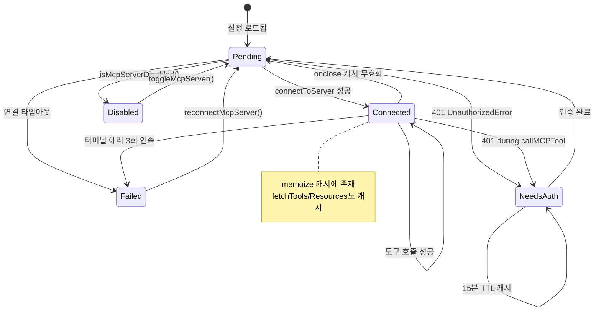
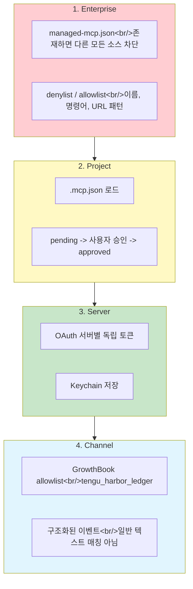
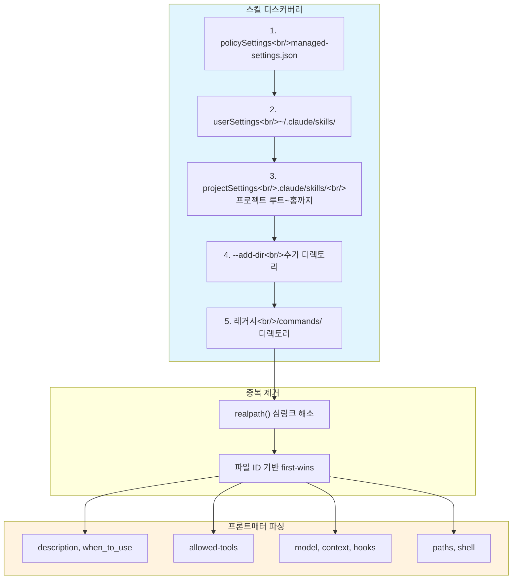

## 개요

Claude Code는 42개의 내장 도구 외에 MCP(Model Context Protocol)를 통해 외부 도구를 무제한으로 확장할 수 있다. 이 포스트에서는 `client.ts`(3,348줄)의 연결 관리 아키텍처, `auth.ts`(2,465줄)의 OAuth 인증 체계, 4계층 보안 모델, 설정 중복 제거를 분석한다. 이어서 플러그인과 스킬의 구조적 차이, 5계층 스킬 디스커버리 엔진, `mcpSkillBuilders.ts`의 순환 참조 해결 패턴까지 해부한다.

<!--more-->

## 1. MCP 클라이언트 -- 연결 관리가 프로토콜보다 어렵다

### 메모이제이션 기반 커넥션 풀

`connectToServer`는 `lodash.memoize`로 래핑되어 있다. 캐시 키는 `name + JSON(config)`. MCP 서버는 stateful(stdio 프로세스, WebSocket 연결)이므로 매 도구 호출마다 새 연결을 만들면 성능이 치명적으로 나빠진다.

- `onclose` 핸들러가 캐시를 무효화 -> 다음 호출이 자동으로 재연결
- `fetchToolsForClient`, `fetchResourcesForClient`도 각각 LRU 캐시(20개)

### 도구 프록시 패턴

MCP 도구는 네이티브 `Tool` 인터페이스로 변환된다:

- `name`: `mcp__<normalized_server>__<normalized_tool>` 형식
- `call()`: `ensureConnectedClient` -> `callMCPToolWithUrlElicitationRetry` -> `callMCPTool`
- `checkPermissions()`: 항상 `passthrough` -- MCP 도구는 별도 권한 시스템
- `annotations`: `readOnlyHint`, `destructiveHint` 등 MCP 어노테이션 매핑

**URL Elicitation Retry**: OAuth 기반 MCP 서버는 도구 호출 중간에 인증을 요구할 수 있다(에러 코드 -32042). retry 루프가 사용자에게 URL을 보여주고 인증 완료 후 재시도한다.

### 연결 상태 머신과 3-strike 터미널 에러

**3-strike 규칙**: 터미널 에러가 3회 연속 발생하면 `Failed` 상태로 강제 전환. 이는 죽은 서버에 계속 재시도하는 것을 방지한다.

**15분 needs-auth 캐시**: 401을 받은 서버를 매번 재시도하면 30개 이상의 커넥터가 동시에 네트워크 요청을 만든다. TTL 캐시로 불필요한 재시도를 방지한다.

## 2. OAuth -- 2,465줄의 현실

`auth.ts`가 2,465줄인 이유는 **현실의 OAuth 서버들이 RFC를 일관성 있게 구현하지 않기 때문**이다:

| 구성 요소 | 설명 |
|-----------|------|
| RFC 9728 + 8414 디스커버리 | 서버가 별도 호스트에서 AS 운영 가능 -> PRM으로 AS URL 탐색 |
| PKCE | 공개 클라이언트 -- code_verifier/code_challenge 필수 |
| XAA (Cross-App Access) | IdP의 id_token으로 MCP 서버 AS에서 access_token 교환 |
| 비표준 에러 정규화 | Slack은 HTTP 200에 `{"error":"invalid_grant"}` 반환 |
| Keychain 저장 | macOS Keychain 연동 (`getSecureStorage()`) |

Rust 포팅 시사점: OAuth는 SDK 의존이 아니라 **복잡한 비동기 상태 머신**이다. 디스커버리(2단계) -> PKCE -> 콜백 서버 -> 토큰 저장 -> 갱신 -> 폐기 -> XAA. 이 전체를 이식하는 것은 비현실적이므로, stdio MCP + API 키 인증으로 시작하는 것이 현실적이다.

## 3. 4계층 보안 모델

MCP 보안은 단일 게이트가 아니라 **트러스트 레벨의 합성**이다:

각 레이어가 독립적으로 동작하며, **Enterprise가 최우선**이다. `.mcp.json`이 프로젝트에 있어도 enterprise denylist에 걸리면 차단된다.

### 설정 소스와 중복 제거 (config.ts 1,578줄)

설정 소스 우선순위 (높은 것이 이긴다):

1. Enterprise managed (`managed-mcp.json`)
2. Local (사용자별 프로젝트 설정)
3. User (글로벌 `~/.claude.json`)
4. Project (`.mcp.json`)
5. Plugin (동적)
6. claude.ai connectors (최저)

**왜 중복 제거가 필요한가?** 같은 MCP 서버가 `.mcp.json`과 claude.ai 커넥터 모두에 존재할 수 있다. `getMcpServerSignature`가 `stdio:[command|args]` 또는 `url:<base>` 시그니처를 만들어, CCR 프록시 URL도 원본 벤더 URL로 언래핑한 뒤 비교한다.

환경 변수 확장: `${VAR}` 및 `${VAR:-default}` 문법 지원. 누락 변수는 에러 대신 경고로 보고하여 부분적 연결 실패를 방지한다.

## 4. 플러그인 vs 스킬 -- 구조적 차이

| 차원 | 스킬 | 플러그인 |
|------|------|---------|
| **본질** | 프롬프트 확장 (SKILL.md = 텍스트) | 시스템 확장 (스킬 + 훅 + MCP) |
| **설치** | 파일 하나 배치 | 마켓플레이스 git 클론 |
| **런타임 코드** | 없음 (순수 텍스트) | 있음 (MCP 서버, 훅 스크립트) |
| **토글** | 암묵적 (파일 존재 여부) | 명시적 (`/plugin` UI) |
| **ID 체계** | 파일 경로 | `{name}@builtin` 또는 `{name}@marketplace` |

스킬은 "파일 = 확장"이라는 원칙의 구현이다. `SKILL.md` 하나가 설치/빌드 없이 즉시 확장으로 작동한다.

### 플러그인 서비스의 관심사 분리

| 파일 | 역할 | 부작용 |
|------|------|--------|
| `pluginOperations.ts` | 순수 라이브러리 함수 | 없음 |
| `pluginCliCommands.ts` | CLI 래퍼 | `process.exit`, console 출력 |
| `PluginInstallationManager.ts` | 백그라운드 조정기 | AppState 업데이트 |

`pluginOperations`의 순수 함수는 CLI와 대화형 UI 양쪽에서 재사용된다.

**마켓플레이스 조정**: `diffMarketplaces()`로 선언된 마켓플레이스와 실재 설치를 비교. 신규 설치면 자동 새로고침, 기존 업데이트면 `needsRefresh` 플래그만 설정. 신규는 "플러그인 못 찾음" 오류 방지가 필요하지만, 업데이트는 사용자가 적용 시점을 선택해야 한다.

## 5. 5계층 스킬 디스커버리 엔진

`loadSkillsDir.ts`(1,086줄)의 로딩 소스 우선순위:

### 프론트매터 시스템

`SKILL.md`의 YAML 프론트매터에서 15개+ 필드를 추출한다:

- `description`, `when_to_use`: 모델이 스킬 선택에 사용
- `allowed-tools`: 스킬 실행 시 허용 도구 목록
- `model`: 특정 모델 강제 지정
- `context: fork`: 별도 컨텍스트에서 실행
- `hooks`: 스킬 전용 훅 설정
- `paths`: 경로 기반 활성화 필터
- `shell`: 인라인 셸 명령 실행

### 번들 스킬의 지연 디스크 추출

CLI 바이너리에 컴파일되는 17개 번들 스킬(`skills/bundled/`)은 `files` 필드가 있으면 **첫 호출 시 디스크에 추출**한다:

- `O_NOFOLLOW | O_EXCL` 플래그로 심링크 공격 차단
- `0o600` 퍼미션으로 접근 제한
- `resolveSkillFilePath()`가 `..` 경로를 거부하여 디렉토리 탈출 방지

**왜 디스크에 추출하는가?** 모델이 `Read`/`Grep` 도구로 참조 파일을 읽을 수 있게 하기 위해서다. 메모리에만 두면 모델이 접근할 수 없다.

### mcpSkillBuilders -- 44줄짜리 순환 참조 해결

`mcpSkillBuilders.ts`(44줄)는 작지만 아키텍처적으로 중요하다.

**문제**: `mcpSkills.ts`가 `loadSkillsDir.ts`의 함수를 필요로 하지만, 직접 임포트하면 순환 참조가 발생한다 (`client.ts -> mcpSkills.ts -> loadSkillsDir.ts -> ... -> client.ts`).

**해법**: write-once 레지스트리. `loadSkillsDir.ts`가 모듈 초기화 시 함수를 등록하고, `mcpSkills.ts`가 필요할 때 가져간다. 동적 임포트는 Bun 번들러에서 실패하고, 리터럴 동적 임포트는 dependency-cruiser 순환 검사를 트리거하기 때문에 **이 방식이 유일한 해결책**이다.

의존성 그래프의 리프 모듈이 타입만 임포트하고, 런타임 등록은 시작 시 한 번만 수행한다.

## Rust 대조

| 영역 | TS (완성) | Rust (현재) |
|------|-----------|-------------|
| 이름 정규화 | `normalization.ts` | `mcp.rs` -- 동일 로직 |
| 서버 시그니처 | `getMcpServerSignature` | `mcp_server_signature` -- CCR 프록시 언래핑 포함 |
| stdio JSON-RPC | SDK 의존 | `mcp_stdio.rs` -- 직접 구현 (initialize, tools/list, tools/call) |
| OAuth | 2,465줄 완전 구현 | 없음 -- 타입만 정의 |
| 연결 관리 | memoize + onclose 재연결 | 없음 |
| 스킬 로딩 | 5계층 + 프론트매터 15필드 | 2 디렉토리, SKILL.md만 |
| 번들 스킬 | 17개 내장 | 없음 |
| 플러그인 | 빌트인 + 마켓플레이스 | 없음 |
| 보안 | 4계층 (Enterprise->Channel) | 없음 |

**핵심 격차**: Rust는 부트스트랩(설정 -> 트랜스포트)과 stdio JSON-RPC까지 구현했다. `mcp_stdio.rs`의 SDK 없는 JSON-RPC 구현은 의미 있는 진전이다. 그러나 OAuth, 연결 생명주기, 채널 보안, 스킬 디스커버리 전체가 부재한다.

## 인사이트

1. **MCP는 "프로토콜"이 아니라 "통합 프레임워크"다** -- 3,348줄의 `client.ts`가 말해주는 것은, 어려운 부분이 JSON-RPC가 아니라 **연결 생명주기 관리**라는 점이다. 메모이제이션, 자동 재연결, 세션 만료 감지, 401 retry, 3-strike 터미널 에러, needs-auth 캐시. 외부 프로세스(stdio)와 원격 서비스(HTTP/SSE)는 예측 불가능하게 죽고, OAuth 토큰은 만료되고, 네트워크는 끊긴다. "한번 연결하면 끝"이 아닌 현실을 반영하는 코드다.

2. **스킬은 "파일 = 확장"이라는 원칙의 구현이다** -- SKILL.md 하나가 설치/빌드 없이 즉시 확장으로 작동한다. 이 단순성이 프론트매터를 통한 점진적 복잡성 추가(모델 지정, 훅, 경로 필터)와 결합되어 초보자와 파워 유저를 모두 수용한다. 플러그인은 스킬의 상위 조직 단위로, "스킬 + 훅 + MCP 서버"를 묶는 패키지다.

3. **`mcpSkillBuilders.ts`는 44줄짜리 아키텍처 교훈이다** -- Bun 번들러의 동적 임포트 제약과 dependency-cruiser의 순환 검사를 동시에 만족시키는 유일한 해법이 "write-once 레지스트리"였다. 의존성 그래프의 리프 모듈이 타입만 임포트하고 런타임 등록은 시작 시 한 번만 수행하는 패턴은, 복잡한 모듈 시스템에서 순환 참조를 해결하는 범용적인 접근법으로 기억할 가치가 있다.

*다음 포스트: [#6 -- Claude Code를 넘어서, 7크레이트 독자 하네스 구축 회고](/posts/2026-04-06-harness-anatomy-6/)*
