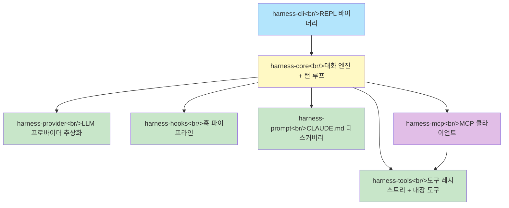
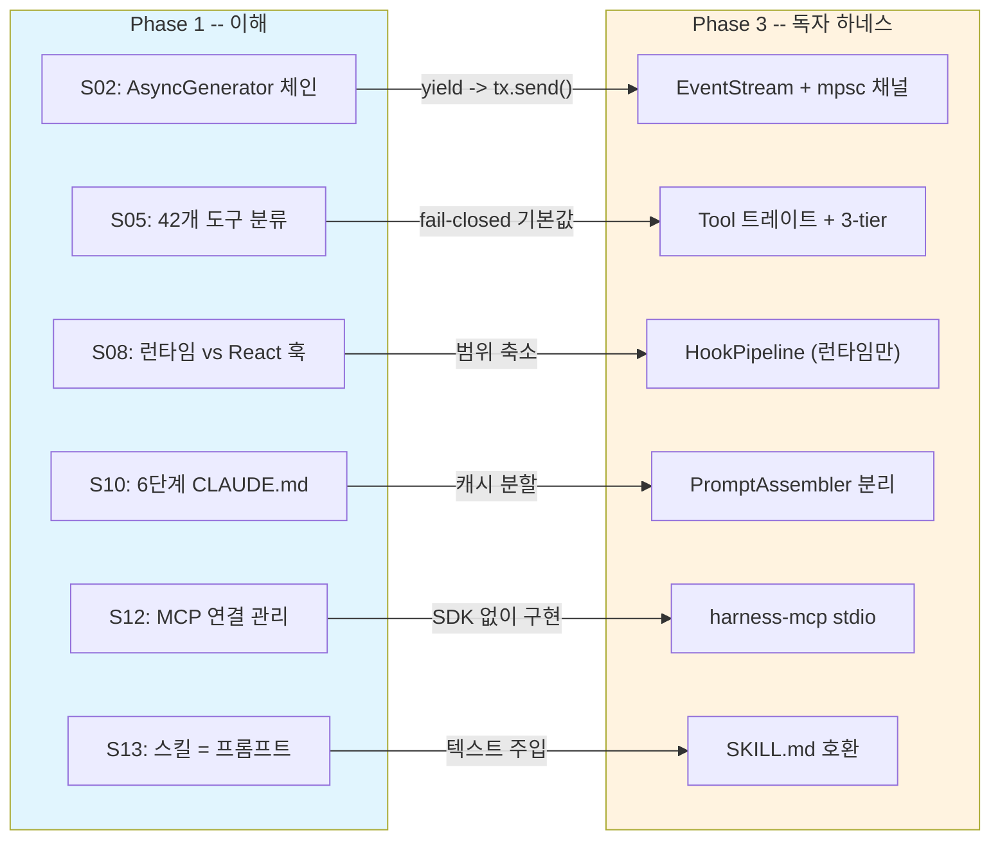

## 개요

Claude Code의 TypeScript 소스를 27세션에 걸쳐 체계적으로 해부한 여정의 마지막 포스트다. Phase 1에서 10만줄+ TS 코드의 아키텍처를 이해하고, Phase 2에서 핵심 패턴을 Rust로 재구현한 뒤, Phase 3에서 발견한 8가지 한계점을 극복하는 독자 에이전트 하네스를 설계-구축했다. 이 포스트에서는 한계점 분석, 5가지 설계 원칙, 7크레이트 아키텍처, 61개 테스트, 그리고 전체 여정의 회고를 정리한다.

<!--more-->

## 1. Claude Code 아키텍처의 8가지 한계점

27세션의 분석에서 발견한 강점과 한계를 구분했다. 강점(AsyncGenerator 파이프라인, 3-tier 동시성, 훅 확장성, CLAUDE.md 디스커버리, MCP 지원, 자기 완결적 도구 인터페이스, 7가지 에러 복구)은 설계의 우수한 면이다. 그러나 다음 8가지 한계가 독자 하네스의 동기가 되었다:

| # | 한계점 | 근거 세션 | 영향 |
|---|--------|----------|------|
| 1 | React/Ink 의존 -- 무거운 TUI | S08 | headless 모드에서 불필요한 의존 |
| 2 | 단일 프로바이더 (실질 Anthropic 전용) | S01 | OpenAI, 로컬 모델 사용 불가 |
| 3 | main.tsx 4,683줄 모놀리스 | S01 | CLI/REPL/세션이 단일 파일에 혼재 |
| 4 | 동기적 도구 실행 (Rust 포트) | S03 | 스트리밍 파이프라이닝 불가 |
| 5 | TS 생태계에 묶인 플러그인 | S13 | 언어 중립적 확장 불가 |
| 6 | 85개 React 훅의 UI/런타임 혼재 | S08 | "hook" 용어의 이중 의미 |
| 7 | 프롬프트 캐싱의 암묵적 의존 | S10 | 3가지 캐시 무효화 경로가 암묵적 |
| 8 | MCP OAuth 2,465줄의 복잡성 | S12 | RFC 비일관성이 근본 원인 |

## 2. 5가지 설계 원칙

한계점을 극복하기 위해 5가지 핵심 원칙을 정립했다:

**원칙 1 -- 멀티 프로바이더**: Anthropic, OpenAI, 로컬 모델(Ollama)을 단일 추상화로 지원.

```rust
#[async_trait]
pub trait Provider: Send + Sync {
    async fn stream(&self, request: ProviderRequest)
        -> Result<EventStream, ProviderError>;
    fn available_models(&self) -> &[ModelInfo];
    fn name(&self) -> &str;
}
```

`ProviderRequest`는 프로바이더 중립적 구조체로, 각 구현체가 자신의 API 형식으로 변환한다.

**원칙 2 -- 네이티브 비동기**: tokio 기반 완전 비동기. `yield` -> `tx.send()`, `yield*` -> 채널 전달로 AsyncGenerator 패턴을 대체.

**원칙 3 -- 모듈 분리**: 대화 엔진, 도구, 훅, 프롬프트를 각각 독립 크레이트로 분리. `main.tsx` 모놀리스를 반복하지 않는다.

**원칙 4 -- 언어 중립 확장**: SKILL.md 호환 + MCP 서버를 플러그인 단위로 활용.

**원칙 5 -- MCP 통합 활용**: 도구뿐 아니라 리소스, 프롬프트, 샘플링까지 전체 스펙 활용.

## 3. 7크레이트 아키텍처



**핵심 설계**: `harness-core`만 다른 크레이트를 의존한다. 나머지는 서로 독립적이다(`harness-mcp` -> `harness-tools` 제외). 이 구조 덕분에:

- 각 크레이트를 독립적으로 `cargo test` 가능
- 프로바이더 추가 시 `harness-core` 수정 불필요
- MCP 도구가 내장 도구와 동일한 `Tool` 트레이트 구현

| 크레이트 | 핵심 책임 | 테스트 수 |
|----------|----------|----------|
| `harness-provider` | LLM API 호출, SSE 파싱, 재시도 | 11 |
| `harness-tools` | 도구 레지스트리, 3-tier 동시성 | 12 |
| `harness-hooks` | 셸 훅 실행, deny short-circuit, rewrite 체인 | 9 |
| `harness-prompt` | 6단계 CLAUDE.md, SHA-256 중복 제거 | 9 |
| `harness-core` | 대화 엔진, `StreamingToolExecutor` | 6 |
| `harness-mcp` | JSON-RPC, stdio 트랜스포트 | 14 |
| `harness-cli` | REPL 바이너리 | -- |

### Provider 트레이트 -- 멀티 프로바이더

기존 Rust 포트의 `ApiClient` 트레이트는 Anthropic 전용이었다(`ApiRequest`에 Anthropic 필드). `Provider` 트레이트는 프로바이더 중립적 `ProviderRequest`를 받아 각 구현체가 자신의 API 형식으로 변환한다. `Box<dyn Provider>`로 런타임에 폴백 체인 구현 가능.

### ConversationEngine -- 턴 루프

```rust
pub struct ConversationEngine {
    session: Session,
    provider: Box<dyn Provider>,
    tool_executor: StreamingToolExecutor,
    hook_pipeline: HookPipeline,
    prompt_builder: PromptBuilder,
    budget: TokenBudget,
}
```

기존 Rust 포트의 `ConversationRuntime<C, T>` 제네릭 패턴 대신 트레이트 객체를 사용한다. 런타임에 프로바이더를 교체할 수 있어야 하고(모델 폴백), 제네릭은 컴파일 타임에 타입이 고정되므로 유연성이 부족하다.

### 스트리밍 도구 실행 (파이프라이닝)

기존 Rust 포트의 가장 큰 제약인 "모든 SSE 이벤트를 수집 후 도구 실행"을 해결했다:

1. `EventStream`에서 `ContentBlockStop(ToolUse)` 이벤트 도착 시 즉시 전달
2. `is_concurrency_safe()` 검사 후 `tokio::spawn`으로 병렬 처리
3. API가 아직 스트리밍 중인 동안 도구 실행 병행

## 4. Phase 2 회고 -- 기존 포트 확장

Phase 3의 독자 하네스 이전에, Phase 2에서 기존 `rust/` 프로토타입을 확장했다:

| 스프린트 | 성과 | 핵심 패턴 |
|---------|------|----------|
| S14-S15 | 오케스트레이션 모듈 + 3-tier 동시성 | `tokio::JoinSet` 기반 병렬 실행 |
| S16-S17 | 도구 확장 (19 -> 26개) | Task, PlanMode, AskUser 추가 |
| S18-S19 | 훅 실행 파이프라인 | stdin JSON, deny short-circuit |
| S20-S21 | 스킬 디스커버리 | `.claude/skills/` 스캔, 프롬프트 주입 |

Phase 2의 코드 대부분은 Phase 3에서 재작성되었다. 그러나 **프로토타입 과정에서 발견한 질문들**("왜 AsyncGenerator인가?", "왜 도구가 UI를 몰라야 하는가?")이 최종 설계를 결정했다.

## 5. 61개 테스트와 MockProvider 패턴

모든 크레이트가 독립적으로 테스트 가능하다. `MockProvider`를 통해 실제 API 호출 없이 대화 엔진의 전체 턴 루프를 검증한다:

```
harness-provider: 11 테스트 (SSE 파싱, 재시도, 스트림)
harness-tools:    12 테스트 (레지스트리, 동시성, 실행)
harness-hooks:     9 테스트 (deny 단락, rewrite 체인, 타임아웃)
harness-prompt:    9 테스트 (6단계 디스커버리, 해시 중복제거)
harness-core:      6 테스트 (턴 루프, 도구 호출, 최대 반복)
harness-mcp:      14 테스트 (JSON-RPC, 초기화, 도구 목록)
```

## 6. Phase 1-2 교훈이 설계에 반영된 방식



| 교훈 | 출처 | 설계 반영 |
|------|------|----------|
| `StreamingToolExecutor` 4단계 상태 기계 | S03 | `harness-core`에 async 구현 |
| `QueryDeps` 콜백 DI의 타입 안전성 한계 | S03 | 트레이트 객체 DI |
| 6층 Bash 보안 체인 | S06 | `check_permissions()` + 훅 분리 |
| 에이전트 = 하네스 재귀 인스턴스 | S06 | `ConversationEngine` 재사용 |
| `ApiClient` 동기 트레이트가 파이프라이닝 차단 | S03 | `Provider` async 트레이트 |
| Deny 단락 + Rewrite 체이닝 | S09 | `HookPipeline` 동일 패턴 |
| SHA-256 콘텐츠 해시가 경로 해시보다 우수 | S11 | `harness-prompt` 콘텐츠 해시 |

## 7. 학습한 아키텍처 패턴 TOP 10

27세션에서 추출한 핵심 아키텍처 패턴:

1. **AsyncGenerator/Stream 파이프라인**: 스트리밍 LLM 응답의 핵심 추상화
2. **3-tier 도구 동시성**: ReadOnly/Write/Dangerous 분류로 안전성과 성능 균형
3. **ToolSpec + ToolResult 이원화**: 메타데이터(LLM 전달용)와 실행 결과 분리
4. **훅 체인 실행**: deny short-circuit, rewrite 체인, 독립 post-hook 변환
5. **6단계 프롬프트 디스커버리**: managed -> user -> project -> local 오버라이드
6. **MCP 어댑터 패턴**: 외부 프로토콜 도구를 내부 Tool 트레이트로 통일
7. **Provider 추상화**: 동일 인터페이스로 Anthropic/OpenAI 교체 가능
8. **SSE 점진적 파싱**: 네트워크 청크를 이벤트 프레임으로 조립
9. **MockProvider 테스트**: 사전 정의 이벤트 시퀀스로 엔진 동작 검증
10. **스킬 = 프롬프트**: 복잡한 플러그인 시스템 대신 텍스트 주입으로 충분

## 8. 전체 여정 회고

| Phase | 세션 | 핵심 산출물 |
|-------|------|-------------|
| Phase 1 -- 이해 | S00-S13 | 14개 분석 문서, Rust 프로토타입 |
| Phase 2 -- 재구현 | S14-S21 | 오케스트레이션, 26 도구, 훅, 스킬 |
| Phase 3 -- 독자 하네스 | S22-S27 | 7크레이트 워크스페이스, 61+ 테스트 |

Claude Code는 **프롬프트 엔지니어링 런타임**이다. 핵심 루프가 메시지를 조립하고, 도구 시스템이 세상과의 상호작용 능력을 부여하고, 권한 시스템이 경계를 설정한다. CLAUDE.md가 컨텍스트를 주입하고, MCP가 외부를 통합하며, 훅과 에이전트가 자동화/위임을 가능케 하고, 플러그인/스킬이 사용자 확장 플랫폼으로 전환한다.

### 향후 방향

- 진정한 스트리밍: SSE 바이트 스트림을 청크 단위로 처리
- 권한 시스템: 도구별 사용자 승인 워크플로우
- MCP SSE 전송: stdio 외에 HTTP SSE 지원
- 토큰 예산 통합: 컨텍스트 윈도우 예산 자동 관리
- 멀티턴 에이전트 모드: 자율 반복 + 중단점 시스템

## 인사이트

1. **좋은 추상화는 경계에서 나온다** -- Provider 트레이트, Tool 트레이트, HookRunner 트레이트. 모든 핵심 추상화는 모듈 간 경계를 정의하는 트레이트다. 기존 Rust 포트의 `ConversationRuntime<C, T>` 제네릭은 컴파일 타임 보장이 강하지만, 런타임에 프로바이더를 교체하거나 MCP 도구를 동적 등록하는 시나리오에서 한계가 있었다. `Box<dyn Provider>` + `Box<dyn Tool>` 트레이트 객체가 약간의 vtable 비용으로 런타임 유연성을 확보한다. LLM API 지연시간(수백 ms~수 s) 대비 vtable 비용은 측정 불가능한 수준이다.

2. **프로토타입의 가치는 코드가 아니라 질문이다** -- Phase 1-2의 프로토타입 코드 대부분은 Phase 3에서 재작성되었다. 그러나 "왜 AsyncGenerator인가?", "왜 도구가 UI를 몰라야 하는가?", "왜 allow가 bypass하지 않는가?" 같은 질문들이 최종 설계를 결정했다. 10만줄 코드를 읽는 행위 자체가 답이 아니라, 읽으면서 발견하는 **설계 의도(왜)**가 진정한 산출물이다.

3. **TS 코드의 복잡성은 대부분 방어선이다** -- 권한 계층, 프론트매터 파싱, 중복 제거, symlink 방지. 이것들은 기능이 아니라 방어선이다. Rust는 타입 시스템과 소유권 모델로 일부를 컴파일타임에 보장할 수 있지만, 파일시스템 보안과 사용자 설정 우선순위 같은 런타임 정책은 명시적으로 구현해야 한다. 27세션은 이 방어선의 지도를 그리는 과정이었고, 그 지도가 독자 하네스의 설계를 안내했다.

*시리즈 완결. 전체 분석 문서는 [claw-code 리포지토리](https://github.com/lsr/claw-code)에서 확인할 수 있다.*
