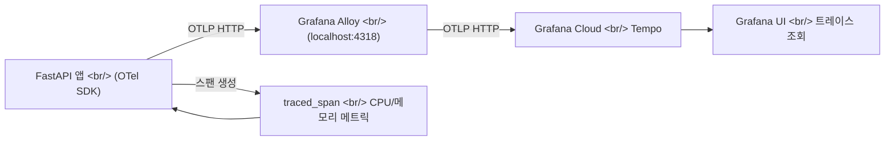

## 개요

[이전 글: Hybrid Image Search 개발기 #8](/ko/posts/2026-04-03-hybrid-search-dev8/)에서 톤/앵글 S3 마이그레이션과 EC2 배포 수정, hex 컬러 추출을 다뤘다. 이번에는 한 발짝 물러서서 관측 가능성(observability)에 집중했다.

FastAPI 서버에 OpenTelemetry를 도입해 검색 파이프라인과 이미지 생성 파이프라인의 각 단계를 스팬으로 추적하고, EC2에 Grafana Alloy를 설치해 트레이스를 Grafana Cloud로 전송하는 구성을 완성했다. 이틀에 걸친 작업이었는데, 1일차의 깔끔한 구현과 2일차의 현실적인 디버깅이 극명하게 대비되었다.

<!--more-->

## 아키텍처 — 트레이스 수집 경로

아래 다이어그램은 트레이스가 앱에서 Grafana Cloud까지 전달되는 경로를 보여준다.



핵심 구성요소는 세 가지다. 앱 내부의 OTel SDK가 스팬을 생성하고, EC2 로컬의 Grafana Alloy가 OTLP 수신 후 배치 처리하며, Grafana Cloud Tempo가 최종 저장 및 조회를 담당한다.

## 1일차 — 깔끔한 초기 구현

첫날은 순조로웠다. OpenTelemetry 패키지를 추가하고, 텔레메트리 모듈을 만들고, 앱 라이프사이클에 연결하고, 두 파이프라인에 스팬을 삽입했다.

### 텔레메트리 모듈 구조

```python
# telemetry.py — Provider를 임포트 시점에 설정
_resource = Resource.create({
    "service.name": "hybrid-image-search",
    "deployment.environment": _environment,
})
_provider = TracerProvider(resource=_resource)
_exporter = OTLPSpanExporter(endpoint=f"{_endpoint}/v1/traces")
_provider.add_span_processor(SimpleSpanProcessor(_exporter))
trace.set_tracer_provider(_provider)
tracer = trace.get_tracer("hybrid-image-search")
```

`TracerProvider`를 모듈 수준에서 설정하는 이유는, uvicorn이 ASGI 앱을 바인딩하기 전에 provider가 준비되어야 `FastAPIInstrumentor`가 올바른 provider를 참조하기 때문이다.

### 파이프라인 스팬 삽입

검색 파이프라인에는 임베딩 생성, 벡터 검색, 재랭킹 등 단계별로 스팬을 삽입했다. 생성 파이프라인에는 레퍼런스 주입(`generation.injection`), 프롬프트 빌드(`generation.prompt_build`), Gemini API 호출(`generation.gemini_api`) 스팬을 추가했다.

DB 인덱스도 함께 추가했다. 검색과 생성 쿼리 성능이 트레이스에서 병목으로 보이기 전에 미리 정리한 것이다.

## 2일차 — 현실과의 충돌

EC2에 Grafana Alloy를 설치하고 Grafana Cloud 연동을 설정한 후, 트레이스가 전혀 나타나지 않았다. 여기서부터 연속 6개의 fix 커밋이 이어졌다.

### 문제 1: TracerProvider 초기화 시점

uvicorn이 앱을 로드하는 시점에 `TracerProvider`가 아직 설정되지 않아 `FastAPIInstrumentor`가 기본(no-op) provider를 참조했다. 해결: 모듈 임포트 시점에 provider를 설정하도록 변경.

### 문제 2: BatchSpanProcessor의 비동기 플러시

`uv run`으로 실행하면 프로세스가 빠르게 종료되면서 `BatchSpanProcessor`의 백그라운드 스레드가 스팬을 내보내기 전에 죽었다. 해결: `SimpleSpanProcessor`로 교체해 스팬 생성 즉시 동기적으로 전송.

### 문제 3: gRPC exporter 침묵

gRPC exporter가 연결 실패를 로그 없이 삼키고 있었다. 해결: OTLP HTTP exporter로 전환. HTTP는 디버깅이 용이하고 Alloy의 기본 HTTP 엔드포인트(4318)와 바로 호환된다.

### 문제 4: 텔레메트리 초기화 크래시

OTel 초기화 중 예외가 발생하면 앱 전체가 죽었다. 해결: `try/except`로 감싸서 텔레메트리 실패가 앱 가동을 막지 않도록 변경.

### 문제 5: FastAPIInstrumentor provider 누락

`FastAPIInstrumentor().instrument()`가 글로벌 provider를 자동으로 찾지 못하는 경우가 있었다. 해결: `tracer_provider`를 명시적으로 전달.

### 문제 6: 모듈 임포트 순서

`main.py`에서 `app = FastAPI()`와 instrumentation 호출의 순서 문제. 해결: `FastAPIInstrumentor`를 모듈 수준에서 `app` 생성 직후에 호출.

## Grafana Alloy 구성

EC2에 배포한 Alloy 설정은 간결하다.

```
otelcol.receiver.otlp "default" {
  grpc { endpoint = "127.0.0.1:4317" }
  http { endpoint = "127.0.0.1:4318" }
  output { traces = [otelcol.processor.batch.default.input] }
}
otelcol.processor.batch "default" {
  timeout = "5s"
  output { traces = [otelcol.exporter.otlphttp.grafana_cloud.input] }
}
otelcol.exporter.otlphttp "grafana_cloud" {
  client {
    endpoint = env("GRAFANA_OTLP_ENDPOINT")
    auth     = otelcol.auth.basic.grafana_cloud.handler
  }
}
otelcol.auth.basic "grafana_cloud" {
  username = env("GRAFANA_INSTANCE_ID")
  password = env("GRAFANA_API_TOKEN")
}
```

앱은 localhost:4318로 OTLP HTTP를 보내고, Alloy가 5초 배치로 묶어 Grafana Cloud Tempo로 전송한다. 인증 정보는 환경 변수로 관리한다.

## traced_span — CPU/메모리 메트릭 자동 수집

마지막으로 `traced_span` 컨텍스트 매니저를 만들어, 스팬 전후의 CPU 시간과 메모리 사용량을 자동으로 측정해 스팬 속성에 기록하도록 했다.

```python
@contextmanager
def traced_span(name, **attrs):
    """CPU/메모리 측정이 포함된 스팬 생성."""
    mem_before = _process.memory_info().rss
    cpu_before = _process.cpu_times()
    with tracer.start_as_current_span(name) as span:
        for k, v in attrs.items():
            span.set_attribute(k, v)
        yield span
        mem_after = _process.memory_info().rss
        cpu_after = _process.cpu_times()
        span.set_attribute("process.memory_mb",
            round(mem_after / 1024 / 1024, 1))
        span.set_attribute("process.memory_delta_kb",
            round((mem_after - mem_before) / 1024, 1))
        span.set_attribute("process.cpu_user_ms",
            round((cpu_after.user - cpu_before.user) * 1000, 1))
        span.set_attribute("process.cpu_system_ms",
            round((cpu_after.system - cpu_before.system) * 1000, 1))
```

`psutil.Process`로 현재 프로세스의 RSS 메모리와 CPU user/system 시간을 스팬 시작/종료 시점에 측정한다. 이를 통해 Grafana에서 각 파이프라인 단계가 소비하는 리소스를 개별적으로 확인할 수 있다. 검색 파이프라인과 생성 파이프라인 모두 `traced_span`으로 교체 완료했다.

## 커밋 로그

| 메시지 | 변경 파일 |
|---|---|
| feat: add no-text directive for injected refs and remove color palettes | `prompt.py`, `App.tsx`, `GeneratedImageDetail.tsx` |
| deps: add OpenTelemetry packages for observability | `requirements.txt` |
| feat: add telemetry module with OpenTelemetry init and tracer | `telemetry.py` |
| feat: wire OpenTelemetry init into app lifespan | `main.py` |
| feat: add OpenTelemetry spans to search pipeline stages | `search.py` |
| feat: add OpenTelemetry spans to generation pipeline | `generation.py` |
| add indices | DB migration |
| infra: add Grafana Alloy config and EC2 setup guide | `infra/alloy/config.alloy` |
| deps: move OpenTelemetry packages to pyproject.toml | `pyproject.toml` |
| fix: set OTel TracerProvider at import time | `telemetry.py` |
| fix: use SimpleSpanProcessor for reliable export under uv run | `telemetry.py` |
| fix: switch to OTLP HTTP exporter for reliable trace delivery | `telemetry.py` |
| fix: add error handling for telemetry init | `telemetry.py` |
| fix: pass tracer_provider explicitly to FastAPIInstrumentor | `main.py` |
| fix: move FastAPI instrumentation to module level in main.py | `main.py` |
| feat: add traced_span helper with CPU/memory resource metrics | `telemetry.py` |
| feat: use traced_span for CPU/memory metrics in search and generation pipelines | `search.py`, `generation.py` |

## 인사이트

**OTel 초기화는 반드시 임포트 시점에 완료하라.** uvicorn 같은 ASGI 서버는 앱 모듈을 임포트한 직후 라우터와 미들웨어를 바인딩한다. `FastAPIInstrumentor`가 이 시점에 유효한 `TracerProvider`를 찾지 못하면 no-op tracer를 캐시해 버리고, 이후 아무리 provider를 설정해도 계측이 동작하지 않는다. 모듈 최상단에서 provider를 설정하는 패턴이 이 문제를 근본적으로 방지한다.

**BatchSpanProcessor는 장수(long-lived) 프로세스 전용이다.** `uv run`이나 테스트처럼 프로세스가 빠르게 종료되는 환경에서는 백그라운드 플러시 스레드가 작동할 틈이 없다. `SimpleSpanProcessor`는 성능 대비 안정성 트레이드오프가 명확하지만, 개발/소규모 프로덕션에서는 합리적인 선택이다.

**gRPC보다 HTTP를 먼저 시도하라.** OTLP gRPC exporter는 연결 실패를 조용히 처리해 디버깅을 어렵게 만든다. HTTP exporter는 상태 코드와 에러 메시지를 명확히 반환하므로, 새 인프라를 연결할 때 HTTP로 먼저 동작을 확인한 뒤 필요시 gRPC로 전환하는 것이 효율적이다.
