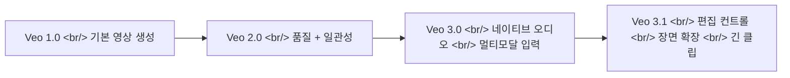
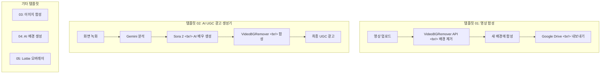

## 개요

Google의 Veo 모델 시리즈가 실험적인 영상 생성 도구에서 본격적인 프로덕션 도구로 빠르게 진화하고 있다. 2025년 10월 출시된 Veo 3.1은 향상된 리얼리즘, 네이티브 오디오 생성, 세밀한 편집 기능을 Vertex AI와 Flow App을 통해 제공한다. 동시에 AI 생성 영상의 배경 제거와 합성을 위한 실용적인 도구 생태계도 성장 중이다. VideoBGRemover 같은 서비스와 n8n 워크플로우 템플릿이 자동화된 영상 파이프라인을 크리에이터와 개발자 모두에게 열어주고 있다.

<!--more-->

## Veo의 진화: 1.0에서 3.1까지

Google은 Veo를 놀라운 속도로 발전시켜 왔다. 매 버전마다 점진적 개선이 아닌 의미 있는 도약이 있었다.

### Veo 3.1의 주요 변화

- **리얼리즘과 물리 시뮬레이션 향상** --- 조명, 그림자, 오브젝트 상호작용이 눈에 띄게 자연스러워짐
- **장면 일관성** --- 긴 시퀀스에서도 캐릭터와 환경이 일관되게 유지
- **더 긴 클립** --- 기존 한계를 넘어선 확장 생성
- **장면 확장(Scene Expansion)** --- 기존 영상을 AI가 자연스럽게 연장
- **편집 컨트롤** --- 오브젝트 제거, 조명 조절, 그림자 조작을 파이프라인 내에서 직접 처리
- **오디오 개선** --- 영상 콘텐츠와 동기화되는 네이티브 오디오 생성 고도화
- **Flow App 통합** --- "Ingredients to Video", "Frames to Video" 모드로 다양한 크리에이티브 워크플로우 지원

Veo 3.1은 **Standard**(고품질, 느림)와 **Fast**(빠른 처리) 두 가지 변형으로 제공된다. 모두 720p, 1080p를 지원하며 Vertex AI API를 통해 접근 가능하다.

## Vertex AI에서의 오브젝트 제거

Veo 3.1의 실용적인 기능 중 하나가 Vertex AI Studio에서 제공하는 마스크 기반 오브젝트 제거다. 워크플로우는 간단하다:

| 단계 | 작업 내용 | 소요 시간 |
|------|----------|----------|
| 준비 | 영상 업로드, 제거할 오브젝트 식별 | 2--5분 |
| 마스킹 | 프레임별 또는 트래킹으로 마스크 그리기 | 3--8분 |
| 생성 | AI가 마스크 영역을 맥락에 맞는 배경으로 채움 | 1--3분 |
| 검수 | 결과 확인, 아티팩트 발생 시 반복 | 회당 3--6분 |

깔끔한 결과를 위한 팁:
- 오브젝트보다 약간 넓게 마스킹해서 경계 아티팩트 방지
- 제거 후 배경이 어떻게 보여야 하는지 명시적으로 프롬프트에 기술
- Google Flow 에디터에서 Add/Remove 도구가 점진적으로 배포 중

## 배경 제거 도구 생태계

Veo가 생성과 기본 편집을 담당한다면, 전용 배경 제거 도구는 영상이나 이미지에서 피사체를 알파 투명도와 함께 추출하는 특정 영역을 커버한다.

### 클라우드 서비스

**VideoBGRemover**는 영상 특화 클라우드 서비스다:
- 초당 과금 (기본 $4.80/분, 대량 시 $2.50/분까지)
- MP4, MOV, WEBM, GIF 포맷 지원
- 알파 채널 출력 포함 9가지 내보내기 포맷
- 일반적인 클립 5분 이내 처리
- 프로그래밍 방식 연동을 위한 API

**withoutBG**는 오픈소스 배경 제거 API와 고품질 클라우드 처리를 위한 Pro 티어를 제공한다.

### 오픈소스 옵션

오픈소스 생태계는 특히 Meta의 SAM(Segment Anything Model) 기반 도구가 풍부하다:

- **[SAM-remove-background](https://github.com/MrSyee/SAM-remove-background)** --- SAM을 직접 활용한 오브젝트 추출 및 배경 제거
- **[remback](https://github.com/duriantaco/remback)** --- 배경 제거 특화 SAM 파인튜닝
- **[carvekit](https://github.com/cubantonystark/carvekit)** --- 여러 세그멘테이션 모델을 래핑한 자동화 배경 제거 프레임워크
- **[remove-bg (WebGPU)](https://github.com/ducan-ne/remove-bg)** --- WebGPU로 브라우저에서 직접 배경 제거, 서버 비용 제로

WebGPU 접근이 특히 흥미롭다. 추론을 클라이언트 GPU로 옮기면 API 비용이 없고 데이터가 사용자 기기를 떠나지 않는다. 프라이버시 민감 사용 사례나 대량 처리에서 클라우드 API보다 실용적일 수 있다.

RGBA 출력(RGB 컬러 채널 + Alpha 투명도 채널)이 합성을 가능하게 하는 핵심이다. 깔끔하게 분리된 피사체를 원하는 배경 위에 레이어링할 수 있다.

## n8n 워크플로우 템플릿: 영상 자동화

가장 흥미로운 부분은 **videobgremover/videobgremover-n8n-templates** 리포지토리다. 완전한 자동화 파이프라인을 n8n 워크플로우로 패키징해 제공한다:

### UGC 광고 파이프라인 (템플릿 02)

템플릿 02가 특히 주목할 만하다. 여러 AI 서비스를 하나의 자동화 플로우로 연결한다:

1. **입력**: 제품이나 앱의 화면 녹화
2. **Gemini**: 녹화 영상을 분석해 제품이 하는 일을 파악
3. **Sora 2**: 제품을 소개하는 리얼한 AI 배우 영상 생성
4. **VideoBGRemover**: AI 배우의 배경을 제거하고 화면 녹화 위에 합성
5. **출력**: 바로 게시할 수 있는 UGC 스타일 광고

n8n 같은 오케스트레이션 도구가 개별 AI 기능을 엔드투엔드 프로덕션 워크플로우로 만드는 구체적인 사례다.

## Veo vs. 경쟁 모델

Veo 3.1의 주요 경쟁자는 OpenAI의 Sora와 기타 영상 생성 모델이다. 핵심 차별점은 Google의 통합 깊이다. Veo는 Vertex AI 안에 위치하기 때문에 다른 Google Cloud 서비스와 바로 연결되고, Flow App이 시각적 편집 레이어를 제공하며, API를 통해 커스텀 파이프라인(위의 n8n 워크플로우 포함)에 내장할 수 있다.

Sora가 크리에이티브 생성 품질에 집중하는 반면, Veo는 편집, 제거, 합성 기능이 내장된 보다 완전한 영상 프로덕션 툴킷으로 포지셔닝하고 있다.

## 참고 링크

- [Veo 3.1 소개](https://www.aicloudit.com/blog/ai/google-veo-3-1-complete-guide-ai-video-model/) --- 기능 정리 및 다른 영상 AI 모델과의 비교
- [Veo 오브젝트 제거 가이드](https://skywork.ai/blog/how-to-remove-objects-veo-3-1-clean-backgrounds/) --- Vertex AI Studio에서의 마스킹 및 프롬프트 워크플로우
- [VideoBGRemover](https://videobgremover.com/ai-video/veo) --- API 제공하는 영상 배경 제거 서비스
- [withoutBG](https://withoutbg.com/) --- 오픈소스 배경 제거 + Pro API 티어
- [n8n 워크플로우 템플릿](https://github.com/videobgremover/videobgremover-n8n-templates) --- 영상 합성 파이프라인 자동화 템플릿
- [2026 배경 제거 도구 비교](https://claid.ai) --- 클라우드 및 로컬 옵션 비교
- [rembg vs Cloud API](https://ai-engine.net) --- 배경 제거 방식 선택 가이드
- [carvekit과 rembg 비교](https://42morrow.tistory.com) --- Python 배경 제거 라이브러리 비교
- [RGBA 설명](https://pyvisuall.tistory.com/87) --- RGB vs RGBA, 알파 투명도 기초 설명

## 정리

영상 AI 분야가 "클립 하나 생성"에서 "영상 프로덕션"으로 전환되고 있다. Veo 3.1은 편집 컨트롤과 장면 조작 기능으로 이 흐름을 대표한다. 하지만 진짜 이야기는 도구 레이어에 있을 수 있다. Gemini + Sora + 배경 제거를 연결해 자동화된 광고 파이프라인을 만드는 n8n 템플릿이 이 분야의 방향을 보여준다. 개별 AI 모델이 더 큰 프로덕션 시스템의 컴포넌트가 되고 있으며, 실질적인 가치는 오케스트레이션 레이어에서 복리로 쌓인다.
