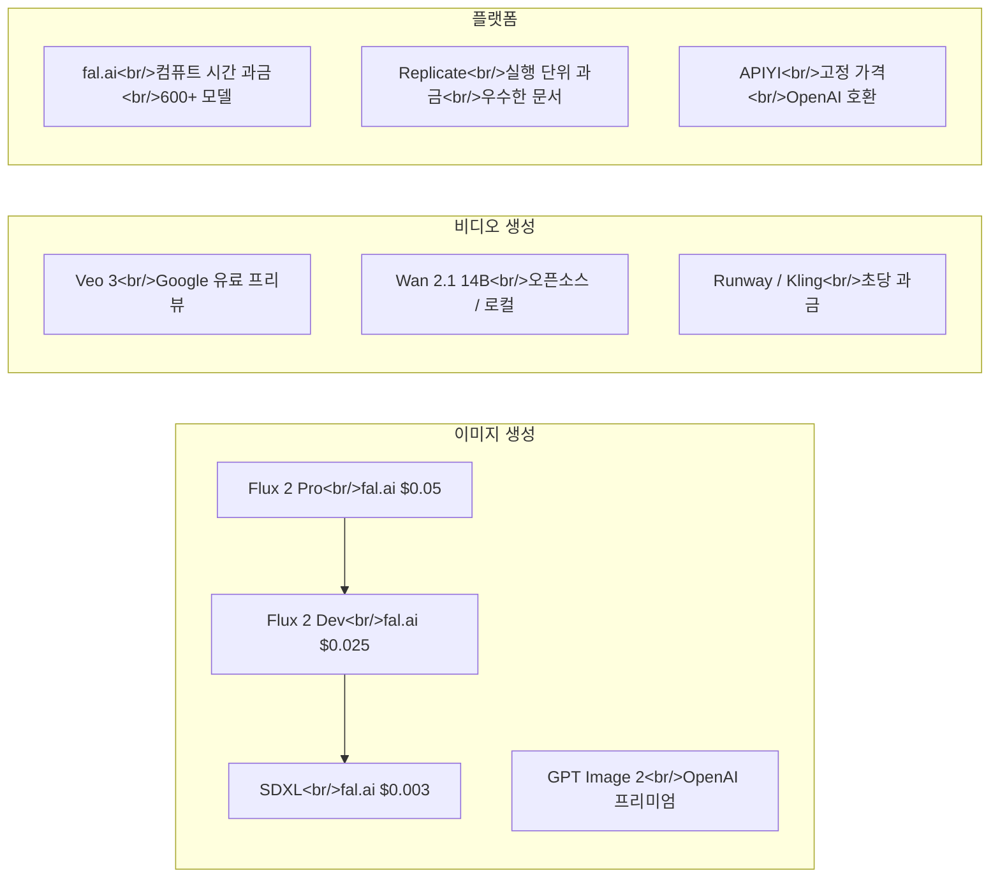

## 개요

2026년 초, AI 생성 미디어 API 시장이 변곡점을 맞이했다. Google은 네이티브 오디오 생성이 가능한 Veo 3를 출시했고, OpenAI의 차세대 이미지 모델이 Chatbot Arena를 통해 유출되었으며, 알리바바의 Wan 2.1은 로컬 비디오 생성을 현실적인 선택지로 만들었다. fal.ai와 Replicate 간의 가격 경쟁은 생성 비용을 빠르게 낮추고 있다. 이 글에서는 현재 시장의 지형도를 정리한다 — 각 플랫폼이 무엇을 제공하고, 실제 비용은 얼마이며, 숨겨진 함정은 어디에 있는지.

<!--more-->

## 가격 지형도 한눈에 보기

## 이미지 생성 가격 상세 비교

TeamDay.ai의 2026년 가격 조사 결과, 플랫폼과 모델별로 명확한 계층 구조가 드러난다.

### 이미지당 비용 비교

| 모델 | fal.ai | Replicate | OpenAI | 비고 |
|---|---|---|---|---|
| Flux 2 Pro | $0.05 | ~$0.06 | — | 품질 대비 가격 최적 |
| Flux 2 Dev | $0.025 | ~$0.03 | — | 프로토타이핑용 |
| SDXL | $0.003 | ~$0.005 | — | 저예산 옵션 |
| GPT Image (4o) | — | — | ~$0.02–0.08 | 이미지 내 텍스트 렌더링 최강 |
| GPT Image 2 | — | — | 미정 | 유출 상태, 미출시 |

**핵심 정리**: 대부분의 사용 사례에서 fal.ai가 가장 저렴하다. Replicate는 약간 비싸지만 문서화와 개발자 경험이 훨씬 낫다. OpenAI는 프리미엄 가격이지만, 이미지 내 텍스트를 정확하게 렌더링해야 할 때는 여전히 최선의 선택이다.

### 비용 최적화 전략

1. **작업에 맞는 모델 선택** — 썸네일 생성에 Flux 2 Pro를 쓸 필요가 없다. $0.003짜리 SDXL이면 충분한 경우가 많다. 프리미엄 모델은 히어로 이미지나 고객 대면 에셋에 아껴두자.
2. **배치 처리** — 대부분의 API가 일괄 요청 시 볼륨 할인이나 레이턴시 오버헤드 감소를 제공한다.
3. **해상도 최적화** — 512x512 프리뷰 생성 후 선별적으로 1024x1024 업스케일하는 것이 모든 이미지를 최대 해상도로 생성하는 것보다 저렴하다.

## 비디오 생성: 세 가지 접근법

### Google Veo 3와 3.1

Veo 3가 Gemini API와 Vertex AI를 통해 유료 프리뷰로 공개되었다. 핵심 기능은 **네이티브 오디오 생성** — 텍스트에서 비디오를 만들 때 영상과 동기화된 사운드(음성, 환경음, 효과음)를 한 번에 생성한다. 이미지-투-비디오 지원은 곧 추가될 예정이다.

이미 소비자 대면 도구를 통해 수천만 개의 비디오가 생성되었고, API 출시로 개발자에게도 문이 열렸다.

**Veo 3.1 개선 사항**:
- 물리 시뮬레이션과 사실성 향상
- 프롬프트 준수도 및 다중 장면 일관성 개선
- 장면 확장 컨트롤로 더 긴 클립 생성 가능
- 음성 합성과 환경음 동기화 등 오디오 업그레이드
- Standard / Fast 두 가지 변형, 720p / 1080p 지원
- Flow App 연동으로 생성 후 편집 가능

API 가격은 아직 완전히 공개되지 않았으며, Vertex AI 사용 시 Google 표준 컴퓨트 과금이 적용된다.

### GPT Image 2 — 그레이스케일 유출 사건

2026년 4월 4일, 개발자 Pieter Levels가 Chatbot Arena에서 세 개의 코드네임 모델을 발견했다: `maskingtape-alpha`, `gaffertape-alpha`, `packingtape-alpha`. 이것들이 OpenAI의 차세대 이미지 모델 GPT Image 2로 밝혀졌다.

커뮤니티 테스트 결과 핵심 발견:

- **완전히 새로운 아키텍처** — 기존 4o 이미지 파이프라인 기반이 아님
- **텍스트 렌더링 돌파** — 디퓨전 모델의 오랜 약점이었던 이미지 내 읽을 수 있는 텍스트 생성을 안정적으로 수행
- **세계 지식 통합** — 실제 사물, 브랜드, 공간 관계에 대한 이해도가 이전 세대보다 훨씬 뛰어남
- **포토리얼리스틱 출력** — 사실성에서 눈에 띄는 도약

**트리거 방법**: 일부 ChatGPT 사용자에게 무작위로 새 모델이 제공된다. Plus와 Pro 구독자가 더 높은 확률을 보이는 것으로 관찰되었다. 16:9 와이드스크린 출력을 요청하면 새 모델로 라우팅될 확률이 높아진다는 보고가 있으나 확인되지 않았다.

### Wan 2.1 — 오픈소스 비디오 생성

알리바바의 Wan AI가 만든 Wan 2.1은 경제학을 근본적으로 바꾸는 오픈소스 대안이다. 14B 파라미터 모델로 텍스트-투-비디오와 이미지-투-비디오를 480p, 720p 해상도로 지원하며, ComfyUI를 통해 로컬에서 실행할 수 있다.

**왜 중요한가**: 하드웨어만 있으면 생성 한계 비용이 제로다. 24GB 이상 VRAM의 소비자급 GPU에서 구동 가능하고, ComfyUI의 노드 기반 워크플로우 인터페이스로 코드 없이도 실험할 수 있다. 한국어와 영어 튜토리얼이 모두 공개되어 있어 진입 장벽이 낮다.

트레이드오프는 명확하다 — 생성 속도와 최대 품질은 클라우드 API에 뒤지지만, 프로토타이핑이나 교육, 대량 생성이 품질보다 중요한 사용 사례에서는 로컬 생성이 이제 현실적인 옵션이다.

## 플랫폼 비교: fal.ai vs. APIYI vs. Replicate

### fal.ai

- **과금 방식**: 컴퓨트 시간 기반 (생성 건수가 아닌 GPU 초 단위 과금)
- **모델 카탈로그**: 600+ 모델, 미디어 생성에 집중
- **강점**: 가장 넓은 모델 선택지, 인기 모델 기준 최저 생성 비용
- **리스크**: 컴퓨트 시간 과금은 본질적으로 예측 불가능 — 어제 8초 걸린 모델이 오늘은 12초 걸릴 수 있다

**$110 청구서 사건**: Reddit r/n8n에서 한 사용자가 $10 크레딧 소진 후 $110 청구서를 받고 충격을 받은 사례가 화제가 되었다. 커뮤니티 토론에서 fal.ai의 컴퓨트 시간 과금이 비용 예측을 어렵게 만든다는 점이 부각되었다. 자동화 워크플로우에서 파이프라인이 실패 시 재시도하거나 예상보다 많은 항목을 처리하면, 건당 고정 가격이 없어 비용이 빠르게 폭증할 수 있다.

### APIYI

- **과금 방식**: 생성 건당 고정 가격
- **API 스타일**: OpenAI 호환 REST API (기존 코드에 드롭인 교체 가능)
- **범위**: 풀스택 — LLM, 이미지 생성, 비디오 생성 모두 커버
- **예시**: Nano Banana Pro가 APIYI에서 $0.05, fal.ai에서 $0.15

고정 가격 모델이 APIYI의 핵심 차별점이다. 예산 예측 가능성이 중요한 프로덕션 워크로드에서, 각 생성의 정확한 비용을 알 수 있으면 용량 계획이 단순해진다.

### Replicate

- **과금 방식**: 실행 단위 가격, 명확한 예상 비용 제시
- **문서화**: 세 플랫폼 중 최고 수준
- **커뮤니티**: 강력한 오픈소스 모델 호스팅 생태계

### 8가지 차원 비교

| 차원 | fal.ai | APIYI | Replicate |
|---|---|---|---|
| 과금 모델 | 컴퓨트 시간 | 건당 고정 | 실행 단위 |
| 가격 예측 가능성 | 낮음 | 높음 | 중간 |
| 모델 카탈로그 | 600+ | 성장 중 | 대규모 |
| API 호환성 | 독자 규격 | OpenAI 호환 | 독자 규격 |
| 초점 | 미디어 생성 | 풀스택 AI | 모델 호스팅 |
| 문서화 | 양호 | 양호 | 우수 |
| 과금 서프라이즈 | 가능 | 거의 없음 | 거의 없음 |
| 최적 용도 | 실험 | 프로덕션 | 프로토타이핑 |

## Gemini API 이미지 입력 가격

별도이지만 관련된 이슈: 이미지를 AI 모델에 분석용으로 보낼 때의 비용이다. Google 개발자 포럼에서 Gemini API의 이미지 입력 가격에 대한 혼란이 지속되고 있다. 이미지를 생성하면서 동시에 분석하는 파이프라인을 구축할 때, 이 입력 비용이 누적되므로 총 소유 비용 산정에 반드시 포함해야 한다.

## 실전 권장 사항

**스타트업과 MVP**: fal.ai로 시작해 최저 생성 비용을 활용하되, 반드시 지출 한도를 설정하고 사용량을 면밀히 모니터링하자. 컴퓨트 시간 과금은 최적화에 보상하지만 방심에는 가혹하다.

**프로덕션 애플리케이션**: APIYI의 고정 가격을 고려하자. 과금 서프라이즈를 피할 수 있다. OpenAI 호환 API이므로 이미 OpenAI와 통합된 코드의 변경이 최소화된다.

**실험과 학습**: ComfyUI를 통해 Wan 2.1을 로컬에서 실행하자. 한계 비용 제로로 프롬프트와 워크플로우를 마음껏 반복할 수 있다. 과금 대시보드를 신경 쓸 필요가 없다.

**최고 품질이 필요할 때**: 비디오는 Google Veo 3/3.1 (특히 동기화된 오디오가 필요한 경우), 이미지는 OpenAI (텍스트 콘텐츠 포함 시). 비용은 더 들지만 품질 차이가 실제로 존재한다.

## 앞으로 주목할 것

- **GPT Image 2 공식 출시** — 가격과 API 접근이 이미지 생성 시장을 재편할 것
- **Veo 3 GA(일반 가용성)** — 유료 프리뷰에서 표준 API 가격으로 전환
- **Wan 2.1 커뮤니티 모델** — 파인튜닝 변형과 ComfyUI 워크플로우 팩이 빠르게 등장 중
- **가격 수렴** — 경쟁 심화로 2026년 내내 생성 단가 하락 예상

AI 미디어 생성 API 시장은 가격표의 유효 기간이 주 단위로 측정될 정도로 빠르게 움직이고 있다. 그러나 구조적 역학은 명확하다: 클라우드 API는 가격 경쟁을 벌이면서 품질과 기능으로 차별화하고, 오픈소스 모델은 로컬 생성을 점점 더 현실적으로 만들고 있다. 승자는 전적으로 당신의 구체적인 제약 조건에 달려 있다 — 예산 예측 가능성, 품질 요구 사항, 인프라 관리 의지.
