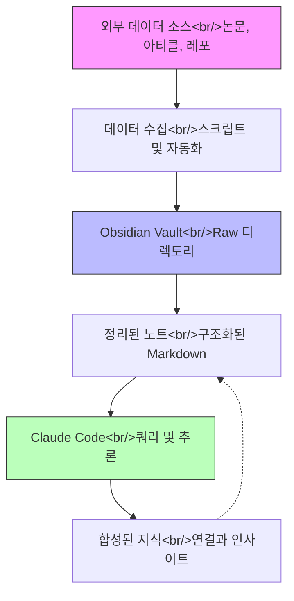
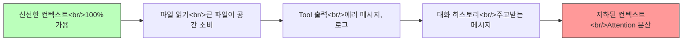

## 개요

Claude Code가 단순한 터미널 코딩 어시스턴트에서 본격적인 개발 환경으로 빠르게 진화하고 있다. 이 글에서는 최근 주목할 만한 네 가지 발전을 다룬다: 웹 기반 울트라 플래닝 모드, Karpathy의 놀랍도록 단순한 Obsidian RAG 시스템, 코딩 에이전트를 위한 자기 진화형 메모리, 그리고 컨텍스트 윈도우 최적화를 위한 실용적 규칙들. 이것들은 단순한 개선이 아니라 AI 기반 개발 워크플로우의 근본적인 병목을 해결하는 접근 방식이다.

<!--more-->

## Ultra Plan Mode — 웹 속도의 플래닝

첫 번째 변화는 Claude Code의 플래닝 단계를 웹 인터페이스로 이전하는 "ultra plan mode"다. 핵심 통찰은 간단하지만 강력하다: **플래닝과 구현은 근본적으로 다른 연산 프로파일을 가진다.**

터미널에서 로컬로 플래닝할 때, Claude Code는 CLI 환경의 제약 안에서 작업해야 한다 — 순차적 토큰 생성, 제한된 시각적 출력, 그리고 나중에 구현에도 사용될 동일한 컨텍스트 윈도우. Ultra plan mode는 이 결합을 끊어준다.

### 동작 방식

1. 터미널에서 평소처럼 **플래닝을 시작**
2. **플래닝이 웹의 Claude Code로 전환** — 전용 컨텍스트에서 실행
3. **웹 UI가 구조화된 출력을 제공**: 컨텍스트 요약, 아키텍처 다이어그램, 신규 파일 명세, 수정 계획
4. **인터랙티브 리뷰**: 개별 플랜 요소에 이모지 리액션과 코멘트 가능
5. **플랜 승인** 후 실행이 터미널로 다시 텔레포트

속도 차이가 상당하다 — 웹에서 약 1분 vs 로컬에서 4분 이상. 하지만 속도만이 장점이 아니다. 웹 인터페이스는 터미널이 표현할 수 없는 풍부한 플래닝 포맷을 가능하게 한다. 시각적 구조, 펼칠 수 있는 섹션, 그리고 구현 전에 플랜의 특정 부분에 주석을 달 수 있는 기능이 있다.

### 왜 중요한가

이것은 **멀티 서피스 AI 워크플로우**의 초기 사례다. 작업의 각 단계가 해당 단계에 최적화된 다른 환경에서 이루어져야 한다는 개념이다. 플래닝은 풍부한 UI에서 이득을 보는 시각적이고 반복적인 활동이다. 구현은 파일 시스템 중심의 순차적 활동으로 터미널에 속한다. Ultra plan mode는 이 구분을 존중한다.

## Karpathy의 Obsidian RAG — Anti-RAG 접근법

Andrej Karpathy의 LLM 기반 개인 지식 관리 방식은 사용하지 **않는** 것으로 주목받는다: vector database 없음, embedding 없음, chunking 전략 없음, retrieval 파이프라인 없음. 대신 Obsidian을 구조화된 파일 시스템으로, Claude Code를 쿼리 레이어로 사용한다.

### 아키텍처

### Embedding 없이 왜 작동하는가

전통적인 RAG 시스템은 특정 문제를 해결한다: 쿼리가 주어지면 대규모 코퍼스에서 가장 관련 있는 청크를 찾는 것. 이를 위해 시맨틱 검색 공간을 만드는 embedding이 필요하다. 하지만 Karpathy의 시스템은 두 가지에 의존하여 이를 완전히 우회한다:

1. **파일 시스템 구조가 암묵적 인덱싱 역할** — 설명적인 파일명과 폴더로 잘 정리된 디렉토리 트리가 사람이 읽을 수 있는 인덱스로 작동한다. Claude Code는 이 구조를 탐색하고 파일명을 읽어 embedding 없이도 관련 콘텐츠의 범위를 좁힐 수 있다.

2. **LLM 컨텍스트 윈도우가 충분히 크다** — 200K+ 토큰 컨텍스트 윈도우로, 상당한 양의 원본 텍스트를 모델에 직접 전달할 수 있다. LLM 자체가 콘텐츠를 읽고 추론하여 "retrieval"을 수행한다.

이 접근법은 실행 비용이 사실상 무료이고, 인프라가 필요 없으며, 개인 규모의 knowledge base에서 전통적 RAG와 비슷한 결과를 낸다. 트레이드오프는 수백만 개의 문서로는 확장되지 않는다는 것 — 하지만 솔로 개발자나 소규모 팀에게 그런 규모는 거의 필요하지 않다.

### 핵심 인사이트

파일 시스템은 LLM 상호작용을 위한 과소평가된 데이터 구조다. 명확한 네이밍 컨벤션으로 사려 깊게 정리된 디렉토리는 LLM이 효율적으로 탐색할 수 있는 충분한 구조를 제공한다. 파일 시스템 자체가 데이터베이스가 될 수 있다면 별도의 데이터베이스는 필요 없다.

## 자기 진화형 에이전트 메모리

Karpathy의 knowledge base 개념을 바탕으로, 같은 패턴을 Claude Code의 자체 메모리에 적용하는 접근이 있다 — 중요한 차이점이 있다. 외부 데이터를 수집하는 대신, 코딩 대화에서 발생하는 **내부 데이터**를 캡처하고 구조화한다.

### 외부 데이터에서 내부 지식으로

Karpathy의 원래 패턴:
- **입력**: 논문, 아티클, 레포 (외부)
- **저장**: Obsidian vault
- **쿼리**: Claude Code가 vault를 읽음

코딩 에이전트 적용 패턴:
- **입력**: 대화 히스토리, 내린 결정, 발견한 패턴 (내부)
- **저장**: 프로젝트 내 구조화된 메모리 파일
- **쿼리**: Claude Code가 시작 시 자체 메모리를 읽음

이것은 정적 지시 파일인 CLAUDE.md와 근본적으로 다르다. 자기 진화형 메모리는 개발 세션 중 일어나는 일을 기반으로 스스로를 업데이트한다. Claude Code가 특정 접근법이 당신의 코드베이스에서 잘 작동한다는 것을 발견하거나 아키텍처 결정에 대해 학습하면, 그 지식이 세션 간에 유지된다.

### 실용적 구현

메모리 시스템은 Karpathy의 vault 구조를 반영한다:
- 대화에서 **raw 캡처** (무엇이 논의되었고, 무엇이 결정되었는지)
- 토픽별로 정리된 **구조화된 노트** (아키텍처 결정, 디버깅 패턴, 사용자 선호)
- 관련 지식 간의 **크로스 레퍼런스**

결과적으로 매 대화마다 백지에서 시작하는 것이 아니라, 특정 코드베이스에서의 작업에 시간이 갈수록 진정으로 나아지는 코딩 에이전트를 얻게 된다.

## 컨텍스트 최적화 — 12가지 규칙

컨텍스트 윈도우 관리는 AI 기반 개발에서 가장 과소평가되는 기술이다. 모든 파일 읽기, 모든 tool call, 모든 메시지가 토큰을 소비한다. 컨텍스트가 노이즈로 채워지면 모델의 attention이 분산되고 출력 품질이 저하된다.

### 컨텍스트 부풀림 문제

### 주목할 규칙들

**규칙 1: CLAUDE.md 줄이기** — 910줄짜리 CLAUDE.md와 33줄짜리의 차이는 컨텍스트 윈도우의 약 4%다. 적어 보이지만 모든 대화에서 로드된다. 수백 번의 세션에 걸쳐 이 오버헤드는 복리처럼 쌓인다. CLAUDE.md에는 **모든** 작업에 필요한 것만 남기고, 전문 지식은 필요할 때 로드되는 토픽별 파일로 옮겨야 한다.

**규칙 2: 50% 임계값** — 컨텍스트가 50%를 넘으면 새 대화를 시작하거나 sub-agent를 사용하라고 제안하도록 지시를 추가한다. 직관에 반하는 이야기다 — 대부분의 사용자는 하나의 세션에서 끝까지 밀어붙이려 한다. 하지만 명확하고 구체적인 작업을 가진 신선한 컨텍스트가 모든 것을 처리하려는 부풀린 컨텍스트보다 일관되게 더 나은 결과를 낸다.

### 멘탈 모델

컨텍스트를 저장소가 아니라 **작업 기억**으로 생각해야 한다. 단일 함수를 디버깅하면서 전체 코드베이스를 머릿속에 담으려 하지 않을 것이다. 마찬가지로, LLM은 컨텍스트에 현재 작업과 관련된 것만 있을 때 가장 잘 작동한다.

12가지 규칙은 하나의 원칙을 향한다: **에이전트가 수동적으로 모든 것을 축적하는 대신, 능동적으로 컨텍스트를 깨끗하게 유지하도록 만들어라.**

## 네 가지 주제의 연결

이 네 가지 주제는 하나의 일관된 시스템을 형성한다:

| 구성 요소 | 해결하는 문제 | 메커니즘 |
|---|---|---|
| Ultra Plan Mode | 터미널에서의 플래닝이 느리고 제한적 | 멀티 서피스 워크플로우 |
| Obsidian RAG | 지식 검색이 과도하게 엔지니어링됨 | 파일 시스템을 데이터베이스로 활용 |
| 자기 진화형 메모리 | 에이전트가 세션 간 지식을 잊음 | 구조화된 대화 캡처 |
| 컨텍스트 최적화 | 컨텍스트가 노이즈로 채워짐 | 능동적 컨텍스트 관리 |

공통 줄기는 **구조를 통한 단순함**이다. Karpathy는 파일 시스템이 잘 정리되어 있기에 vector database가 필요 없다. Ultra plan mode는 플래닝과 구현을 깔끔하게 분리하기에 복잡한 오케스트레이션이 필요 없다. 컨텍스트 최적화는 몇 가지 명확한 규칙으로 충분하기에 화려한 토큰 관리가 필요 없다.

AI 기반 워크플로우를 구축하는 개발자에게 시사하는 바는 분명하다: 복잡한 인프라에 손을 대기 전에, 이미 가진 것의 더 나은 조직이 문제를 해결할 수 있는지 먼저 물어보라.

## 참고 영상

- [Planning In Claude Code Just Got a Huge Upgrade](https://www.youtube.com/watch?v=example1) — nate herk
- [I Built Self-Evolving Claude Code Memory w/ Karpathy's LLM Knowledge Bases](https://www.youtube.com/watch?v=example2) — nate herk
- [Karpathy Just Replaced RAG With Obsidian + Claude Code](https://www.youtube.com/watch?v=example3)
- [How I Save Over 50% of My Claude Code Context (12 Rules)](https://www.youtube.com/watch?v=example4)
