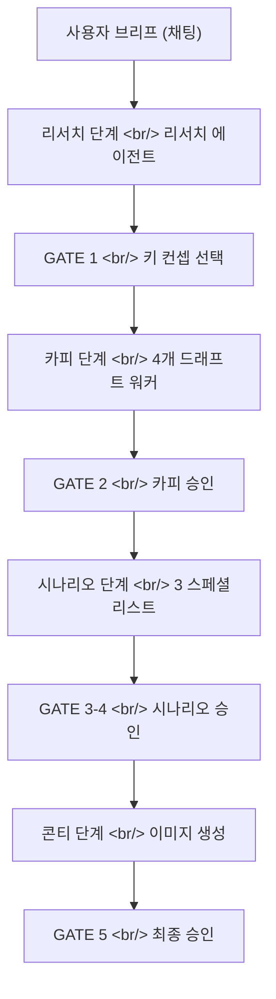

## 개요

**Creative Agent Studio**의 첫 개발일지다 — 한국어 기반 광고 크리에이티브 멀티 에이전트 시스템. 사용자의 단일 메시지가 채팅 우선 파이프라인에 진입해 네 가지 프레젠테이션 단계 — **리서치 → 카피 → 시나리오 → 콘티** — 를 거치며, 단계 사이에 명시적 사람 승인 게이트를 둔다.

4월은 목업의 시대였다. 이틀 동안 12개의 커밋이 캔버스의 정적 HTML/JS 프로토타입, 런타임 흐름 스펙, 결국 React 재작성에서도 살아남는 "Creative Warmth" 디자인 테마, 그리고 Vercel에 올릴 배포 모양을 만들어냈다. 나중에 버려지는 코드는 핵심이 아니었다 — 핵심은 `interaction-model.md`에 적어둔 결정들과 목업에 박힌 디자인 토큰이었다.

<!--more-->



12개 커밋, 한 가지 관통하는 주제 — **구현이 녹슬기 전에 원칙을 못 박는다.**

---

## 목업보다 오래 살아남은 세 가지 결정

4월에 추가된 가장 중요한 파일은 코드가 아니라 `interaction-model.md`였다 — 세 가지 제품 결정을 단일 결정문서로 결정화한 문서:

> **결정 1. 인터랙션 모델 — 채팅 우선.** 사용자의 주 입력 수단은 자유형 채팅이다. 단계를 직접 클릭하거나 버튼으로 다음으로 넘어가는 방식은 사용하지 않는다. 오케스트레이터가 사용자의 발화를 해석해 적절한 에이전트를 호출한다.

> **결정 2. 에이전트 투명성 — 한 줄 상태 표시.** 에이전트 실행 중에는 피드에 한 줄짜리 상태 메시지만 표시한다. 전체 에이전트 대시보드나 실시간 로그는 노출하지 않는다.

> **결정 3. 게이트 기반 자동 실행.** 각 단계가 완료되면 파이프라인은 멈추고, 다음 단계를 자동으로 실행하기 전에 명시적 사람 승인을 기다린다.

뒤이은 모든 UI 커밋은 — 4월 내내, 그리고 5월 재작성을 가로질러 — 이 세 규칙에 비춰 검증됐다. 목업의 첫 커밋(`b67eb98 Add Diffs creative agent studio mockup`)부터 이미 DOM 구조로 인코딩돼 있었다 — "다음 단계" 버튼 없음, 에이전트는 대시보드가 아니라 글머리 기호 목록으로, 컴포저가 유일한 진입점.

---

## "Creative Warmth" — 디자인 테마

세 번째 커밋(`72e0fdc`)이 모든 걸 견뎌낸 비주얼 베이스라인이었다 — **"Redesign: Apply Creative Warmth theme (warm white, DM Serif Display, Caveat)."**

토큰 셋, 이유 셋:

| 토큰 | 값 | 이유 |
|---|---|---|
| 배경 | Warm white (#FAF7F2) | 순백은 소프트웨어처럼 읽힌다. 따뜻한 톤은 작업실처럼 읽힌다. |
| 본문 서체 | DM Serif Display | 크리에이티브 도구는 생산성 코드가 아니라 문학적인 느낌이어야 한다. |
| 손글씨 라벨 | Caveat | 스페셜리스트 에이전트 이름에 손글씨 배지를 — 밀도 높은 작업면에 인간미를 한 줄 입히는 작은 장치. |

규칙은 부정형이었다 — **순흑도, 순백도, 어디에도 쓰지 않는다.** 후속 커밋(`640c755`)이 로고 가시성을 고쳐야 했는데 — 원본 SVG가 어두운 색이라 따뜻한 배경 위에서 보이지 않았다 — 수정 방법은 에셋을 재출력하는 대신 `filter: brightness(0)` CSS 핵으로 반전시키는 것이었다. 실용적이긴 했지만, 기저 제약은 그대로였다 — 디자인 시스템이 시스템과 싸우는 에셋을 위해 굽혀지지는 않는다.

이 토큰들은 6주 뒤 React 측 첫 feat(web) 커밋에서 `web/tailwind.config.ts`로 그대로 이주한다 — 디자인 결정이 옳은 하중 지지 레이어였다는 증거.

---

## 목업을 정직하게 만든 세 가지 UI 정리

연속된 세 커밋(`3c225c9`, `1be5253`, `d37b4c9`)이 세 결정을 위반하던 것들을 공격했다.

```diff
- <p class="eyebrow">Project Management</p>
- <ul class="agents">
-   <li><span class="dot dot-1"></span>Agent 1</li>
-   <li><span class="dot dot-2"></span>Agent 2</li>
- </ul>
+ <ul class="agents">
+   <li>리서치 에이전트</li>
+   <li>Copy Draft Workers</li>
+ </ul>
```

`3c225c9` — 전체를 PM 도구로 프레임하던 "Project Management" eyebrow 제거. 색상 코드 칩 대신 글머리 기호로 에이전트 이름을 표시 — 칩은 대시보드를 암시했기 때문.

`1be5253` — 상태 레일에서 "Background Agents" 섹션을 완전히 제거. 결정 2(한 줄 상태, 전체 대시보드 없음)를 위반했다.

`d37b4c9` — **컴포저 개편.** 모델 셀렉터를 입력 바 안으로 옮기고, 파일 첨부 아이콘을 추가하고, 모델 목록을 업데이트했다. 왜 중요한가 — 컴포저는 결정 1의 전체 표면적이다. "더 도전적으로" 또는 "이 두 개 합쳐줘"를 타이핑할 적절한 장소처럼 느껴지지 않는다면, 채팅 우선 원칙은 사고로 실패한다.

이것들은 기능이 아니었다 — 스펙을 강제하는 *삭제*였다.

---

## 런타임 흐름 다듬기 — 목업 아래 뼈대

2026-04-07의 세 문서와 한 feat 커밋이 런타임 토대를 깔았다.

- `ecac2e5 docs: add production poc state and routing spec` — 런타임이 네 단계에 걸쳐 어떤 상태를 들고 다닐지 정의.
- `7e26c12 docs: add runtime state cleanup spec` — 실행 간 상태가 어떻게 정리될지 정의 (나중에 React 앱이 세션별 상태를 격리해야 할 때 의미를 가짐).
- `97df876 feat: refine workspace runtime flow` — 실제 흐름 코드를 다듬음.
- `21f0ebc chore: add deployment and design reference files` — 배포 모양과 디자인 참조 폴더를 커밋.

"배포 참조"는 목업 디렉토리를 가리키는 Vercel buildCommand였다. 그 배포 타깃은 재작성에서도 살아남았다 — 5월에 React 프론트엔드가 출시됐을 때 `vercel.json`의 유일한 변경은 `outputDirectory: "web/dist"`였다.

---

## 커밋 로그

| 날짜 | 메시지 |
|---|---|
| 2026-04-06 | Add Diffs creative agent studio mockup |
| 2026-04-06 | Fix logo path for Vercel deployment |
| 2026-04-06 | Redesign: Apply Creative Warmth theme (warm white, DM Serif Display, Caveat) |
| 2026-04-06 | Fix logo visibility: apply brightness(0) filter for dark logo on light bg |
| 2026-04-06 | UI: Remove 'Project Management' eyebrow, show agent names as bullets, add LLM dropdown |
| 2026-04-06 | Remove Background Agents section from status rail |
| 2026-04-06 | Composer: move model selector into input bar, add file attach icon, update models |
| 2026-04-07 | docs: add production poc state and routing spec |
| 2026-04-07 | docs: add runtime state cleanup spec |
| 2026-04-07 | feat: refine workspace runtime flow |
| 2026-04-07 | chore: ignore local workspace artifacts |
| 2026-04-07 | chore: add deployment and design reference files |

---

## 인사이트

4월은 한 조각의 소프트웨어(정적 목업)와 세 조각의 글(`interaction-model.md`, 라우팅 스펙, 런타임 클린업 스펙)을 만들었다. 목업은 6주 뒤 삭제된다 — `chore: remove legacy mockup/ vanilla-JS SPA` 커밋이 메가푸시에 떨어진다 — 하지만 글의 모든 단락은 여전히 하중을 지탱한다.

새겨둘 만한 교훈 — **제품 원칙은 구현보다 오래 산다.** "채팅 우선, 한 줄 상태, 게이트 기반 자동 실행"을 — 기능으로도, UI 요구사항으로도 아니라 — `결정` 헤딩과 `이유` 헤딩이 붙은 결정으로 적어두니, 뒤이은 모든 UI 커밋이 통과해야 할 재판소가 생겼다. 5월에 React 재작성이 시작됐을 때, 그 세 결정은 새 `web/` 트리의 원칙으로 그대로 복사됐다. 목업은 일회용이었다 — 원칙은 아니었다.

다음 — 비트버킷 마이그레이션, 런타임 production-readying, 그리고 한 주말 동안 목업 전체를 대체하게 될 React+Vite+TypeScript 재작성의 시작.
