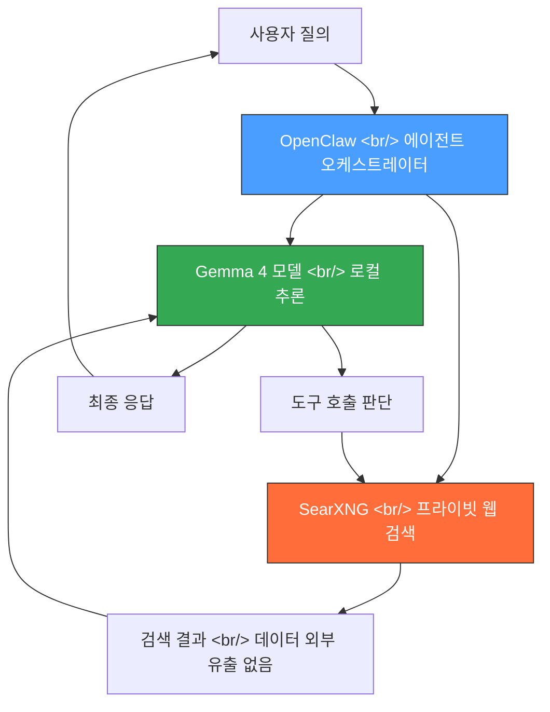

## 개요

Google이 Gemma 4를 공개했습니다. 유료 서비스인 Gemini 3, 이미지 생성 모델 Nano Banana와 같은 계열의 오픈소스 모델입니다. 여기에 프라이빗 웹 검색 엔진 SearXNG와 에이전트 오케스트레이터 OpenClaw를 결합하면, 클라우드 AI에 버금가는 완전 셀프 호스팅 AI 어시스턴트를 무료로, 데이터 유출 없이 구축할 수 있습니다.

이 글에서는 Gemma 4 모델 선택부터 SearXNG 로컬 실행, OpenClaw 연동까지 전체 셋업 과정을 정리합니다.

<!--more-->

## Gemma 4 모델 라인업

Google이 새로 공개한 Gemma 4는 크기와 멀티모달 지원 범위에 따라 두 그룹으로 나뉩니다.

### 소형 모델 (모바일 구동 가능)

| 모델 | 파라미터 | 지원 모달리티 | 대상 하드웨어 |
|------|---------|-------------|-------------|
| **E2B** | ~2B | 텍스트, 이미지, 비디오, 오디오 | 모바일 |
| **E4B** | ~4B | 텍스트, 이미지, 비디오, 오디오 | 모바일 |

### 대형 모델 (데스크탑/서버)

| 모델 | 파라미터 | 지원 모달리티 | 대상 하드웨어 |
|------|---------|-------------|-------------|
| **26B** | ~26B | 텍스트, 이미지 | 데스크탑 GPU, 서버 |
| **31B** | ~31B | 텍스트, 이미지 | 데스크탑 GPU, 서버 |

소형 모델인 E2B와 E4B는 텍스트, 이미지, 비디오, 오디오를 모두 처리할 수 있다는 점이 인상적입니다. 대형 모델은 오디오/비디오를 포기하는 대신 텍스트와 이미지 추론 능력이 더 깊습니다.

OpenClaw의 에이전트 도구 호출 워크플로에서는 **E4B 모델**이 가장 균형 잡힌 선택입니다. 4B 파라미터임에도 구조화된 함수 호출과 다단계 추론을 꽤 안정적으로 수행합니다. VRAM 여유가 있다면 26B나 31B가 더 좋겠지만, 대부분의 환경에서는 E4B가 가성비 최적입니다.

## 아키텍처: 전체 구성도



동작 흐름은 다음과 같습니다:

1. **사용자**가 OpenClaw에 질의를 보냅니다
2. OpenClaw가 로컬에서 돌아가는 **Gemma 4** 모델에 질의를 전달합니다
3. Gemma 4가 웹 검색이 필요한지 판단하여 SearXNG에 **도구 호출**을 보냅니다
4. **SearXNG**가 검색을 완전히 로컬에서 실행합니다 — 사용자 질의가 제3자 API에 전송되지 않습니다
5. 검색 결과가 Gemma 4에 다시 전달되어 종합됩니다
6. 최종 응답이 사용자에게 반환됩니다

전 과정에서 데이터가 외부로 나가지 않습니다. SearXNG는 메타 검색 엔진 프록시 역할을 하고, Gemma 4는 전적으로 로컬 하드웨어에서 실행됩니다.

## 1단계: Gemma 4 모델 로컬 실행

로컬 추론 서버로 **Ollama**가 가장 간편합니다:

```bash
# Ollama 설치 (macOS/Linux)
curl -fsSL https://ollama.com/install.sh | sh

# E4B 모델 다운로드 (대부분의 환경에 권장)
ollama pull gemma4:e4b

# VRAM 16GB 이상이면 27B 모델도 가능
ollama pull gemma4:27b

# 확인
ollama list
```

Ollama는 기본적으로 `http://localhost:11434`에서 OpenAI 호환 API를 제공합니다. OpenClaw에서 바로 연결할 수 있습니다.

### VRAM 요구 사항

| 모델 | 양자화 | 최소 VRAM |
|------|-------|----------|
| E2B | Q4_K_M | ~2 GB |
| E4B | Q4_K_M | ~3 GB |
| 26B | Q4_K_M | ~16 GB |
| 31B | Q4_K_M | ~20 GB |

Apple Silicon Mac의 통합 메모리는 VRAM으로 사용됩니다. 16GB M 시리즈 Mac이면 E4B는 여유 있게, 26B도 공격적 양자화를 적용하면 구동할 수 있습니다.

## 2단계: SearXNG로 프라이빗 검색 구성

SearXNG는 무료 오픈소스 메타 검색 엔진입니다. Google, Bing, DuckDuckGo 등의 결과를 수집하면서도 사용자의 검색어를 추적 가능한 형태로 외부에 노출하지 않습니다.

Docker로 가장 쉽게 배포할 수 있습니다:

```bash
# SearXNG Docker 설정 클론
git clone https://github.com/searxng/searxng-docker.git
cd searxng-docker

# 환경 변수 설정
cp .env.example .env

# SearXNG 시작
docker compose up -d
```

`http://localhost:8080`에서 SearXNG에 접속할 수 있습니다.

### 핵심 설정: JSON API 활성화

OpenClaw가 SearXNG를 도구로 사용하려면 JSON API가 필요합니다. `searxng/settings.yml`을 수정합니다:

```yaml
server:
  secret_key: "랜덤-시크릿-키"
  limiter: false  # 로컬 전용이므로 속도 제한 비활성화

search:
  formats:
    - html
    - json  # API 접근에 필요
```

수정 후 컨테이너를 재시작합니다:

```bash
docker compose restart
```

## 3단계: OpenClaw에 연동

OpenClaw 설정에서 로컬 Gemma 4와 SearXNG를 연결합니다:

```yaml
# openclaw 설정
llm:
  provider: ollama
  model: gemma4:e4b
  base_url: http://localhost:11434

tools:
  web_search:
    provider: searxng
    base_url: http://localhost:8080
    format: json
    categories:
      - general
      - news
      - science
```

설정 완료 후 OpenClaw를 실행하면 웹 검색이 가능한 AI 어시스턴트가 완전 셀프 호스팅으로 동작합니다.

## 실사용 소감

이 구성으로 실제 사용해보면 몇 가지 주목할 점이 있습니다.

**E4B의 도구 호출 능력이 의외로 뛰어납니다.** 4B 파라미터 모델치고는 에이전트 워크플로를 잘 처리합니다. 검색이 필요한 시점을 정확히 판단하고, 합리적인 검색 쿼리를 생성하며, 결과를 일관성 있게 종합합니다. GPT-4o나 Claude 수준은 아니지만, 무료 로컬 모델로서는 인상적인 품질입니다.

**SearXNG 응답 속도는 실용적입니다.** 검색 쿼리 응답은 보통 1~3초입니다. 병목은 대개 검색이 아니라 LLM 추론 쪽에 있습니다.

**프라이버시는 실제로 보장됩니다.** 세션 중 `tcpdump`를 실행해보면 질의 데이터가 외부 AI API로 전송되지 않는 것을 확인할 수 있습니다. SearXNG는 검색 엔진에 아웃바운드 요청을 하지만, 사용자 질의와 연결되는 영속 식별자 없이 일반적인 웹 요청으로 처리됩니다.

**26B/31B 모델은 복잡한 추론에서 확실히 낫습니다.** 하지만 E4B에서 26B로의 점프는 하드웨어 요구 사항이 크게 증가하는 반면, 일반적인 검색 기반 Q&A에서는 결과 차이가 그에 비례하지 않습니다.

## 이 구성이 적합한 경우 vs. 클라우드 AI

이 셋업이 적합한 경우:

- **프라이버시가 절대적** — 법률, 의료, 금융 관련 질의를 제3자에게 노출하고 싶지 않을 때
- **비용을 완전히 없애고 싶을 때** — API 요금도, 구독료도 없음
- **제한된 네트워크 환경** — 클라우드 AI 서비스가 차단된 곳
- **셀프 호스팅 자체를 즐기는 경우** — 직접 구성하는 재미가 있을 때

클라우드 AI가 나은 경우:

- 복잡한 태스크에서 최상위 추론 품질이 필요할 때
- 로컬 모델의 컨텍스트 윈도우를 초과하는 긴 문서를 처리할 때
- 가동 시간과 안정성이 프라이버시보다 중요할 때

## 마무리

Gemma 4 + SearXNG + OpenClaw 조합은 셀프 호스팅 AI의 의미 있는 이정표입니다. 1년 전만 해도 웹 검색이 가능한 에이전트 AI를 로컬에서 돌리려면 고가의 하드웨어가 필요했고 결과도 그저 그랬습니다. 지금은 RAM 8GB 노트북에서 E4B와 SearXNG를 조합해 실용적인 결과를 얻을 수 있습니다 — 무료로, 완전한 프라이버시와 함께.

Docker와 패키지 매니저가 이미 설치되어 있다면 셋업은 15분 정도면 됩니다. 로컬 AI가 실용적 수준에 도달하기를 기다려왔다면, 이 조합을 시도해볼 가치가 있습니다.

## 참고 자료

- [Gemma 4 모델 카드 — Google](https://ai.google.dev/gemma)
- [SearXNG 공식 문서](https://docs.searxng.org/)
- [OpenClaw GitHub 저장소](https://github.com/openclaw)
- [Ollama — 로컬 LLM 실행기](https://ollama.com/)
