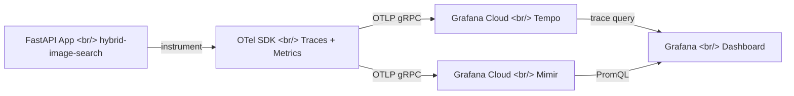
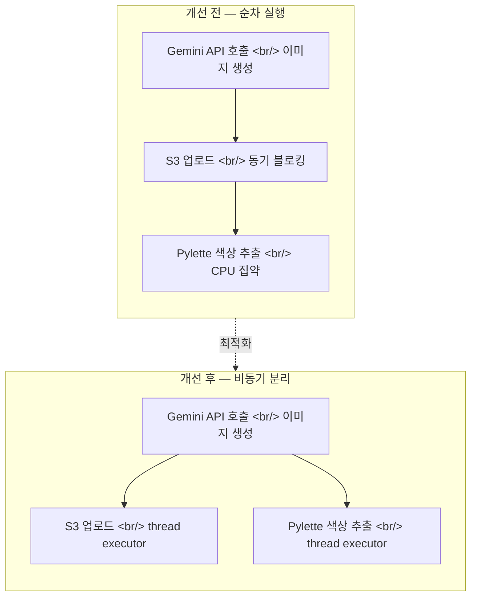

[이전 글: hybrid-image-search 개발기 #9](/ko/posts/2026-04-06-hybrid-search-dev9/)에서 OpenTelemetry 트레이싱을 Grafana Cloud Tempo에 연동했다. 이번에는 메트릭 수집을 추가해서 리소스 사용량 대시보드를 만들고, 트레이스에서 발견한 성능 병목을 최적화했다.

<!--more-->

## 이번 회차 커밋 로그

| 순서 | 유형 | 내용 |
|:---:|:---:|---|
| 1 | feat | OTel 메트릭 익스포트 — 파이프라인 리소스 대시보드용 |
| 2 | docs | README에 observability 섹션 추가, 대시보드 메트릭 이름 수정 |
| 3 | perf | 생성 파이프라인의 CPU/RAM 스파이크 감소 |
| 4 | perf | S3 업로드와 Pylette 색상 추출을 thread executor로 이동 |
| 5 | perf | Gemini API 호출에 2분 타임아웃 추가 |

## 배경: 트레이스는 있는데 메트릭이 없다

\#9에서 OTel 트레이싱을 붙이고 나니, Grafana Cloud Tempo에서 각 요청의 span을 볼 수 있게 되었다. 그런데 한 가지 빠진 게 있었다 — **리소스 사용량**. 트레이스로는 "어떤 함수가 얼마나 걸렸는지"는 보이지만, "그 시점에 CPU/RAM이 얼마나 치솟았는지"는 알 수 없다.

t3.medium(vCPU 2개, RAM 4GB)에서 이미지 생성 파이프라인을 돌리면 체감상 서버가 버벅거렸는데, 정확히 어디서 리소스를 먹는지 데이터가 없었다.

## 1단계: OTel 메트릭 익스포트 추가

### Observability 파이프라인 구조



기존에는 트레이스만 Tempo로 보내고 있었다. 여기에 **메트릭 익스포터**를 추가해서 CPU 사용률, 메모리 사용량, 파이프라인 단계별 소요 시간 등을 Grafana Cloud Mimir(Prometheus 호환 장기 저장소)로 전송하도록 구성했다.

Grafana Mimir는 Prometheus의 TSDB를 분산 아키텍처로 확장한 프로젝트다. Grafana Cloud에서는 이를 매니지드로 제공하므로, OTLP 엔드포인트만 설정하면 바로 PromQL로 쿼리할 수 있다.

### Pipeline Resource Usage 대시보드

대시보드에서 확인한 핵심 패널들:

- **CPU Usage (%)** — 파이프라인 실행 시 순간적으로 80~90%까지 치솟는 패턴
- **Memory Usage (MB)** — Pylette 색상 추출 시 RAM이 급격히 증가
- **Pipeline Stage Duration** — 각 단계(Gemini 호출, S3 업로드, 색상 추출)별 소요 시간

여기서 문제가 명확해졌다. 이미지 생성 한 건에 CPU가 거의 포화 상태가 되고 있었다.

## 2단계: 성능 병목 분석

Grafana Tempo의 트레이스와 새로 만든 리소스 대시보드를 함께 보니 패턴이 보였다:



### 발견한 병목 3가지

1. **S3 업로드가 동기 블로킹** — `boto3`의 `upload_fileobj`가 async 이벤트 루프를 통째로 블로킹하고 있었다. 다른 요청도 덩달아 멈춤.
2. **Pylette 색상 추출이 CPU 집약** — 이미지에서 대표 색상을 뽑는 과정이 CPU를 크게 소모. 이것도 메인 스레드에서 동기로 실행 중이었다.
3. **Gemini API 호출에 타임아웃 없음** — 간헐적으로 응답이 오지 않는 경우, 요청이 무한 대기 상태에 빠짐.

## 3단계: 최적화 적용

### S3와 Pylette를 thread executor로 이동

FastAPI는 `asyncio` 기반이므로, CPU 집약적이거나 블로킹 I/O인 작업은 `asyncio.to_thread()` 또는 `loop.run_in_executor()`로 별도 스레드에서 실행해야 한다.

```python
# Before: 이벤트 루프 블로킹
s3_client.upload_fileobj(buffer, bucket, key)
colors = extract_colors(image_path, color_count=5)

# After: thread executor로 분리
await asyncio.to_thread(s3_client.upload_fileobj, buffer, bucket, key)
colors = await asyncio.to_thread(extract_colors, image_path, color_count=5)
```

이렇게 하면 S3 업로드나 색상 추출이 진행되는 동안에도 이벤트 루프는 다른 요청을 처리할 수 있다.

### Gemini API 2분 타임아웃

Gemini API 호출에 `asyncio.wait_for`로 120초 타임아웃을 걸었다. Google AI Studio에서 rate limit과 비용도 확인했는데, 무응답 상태로 커넥션을 물고 있으면 비용 문제보다 서버 리소스 낭비가 더 심각했다.

`gemini_semaphore` 검색도 했는데, 동시 요청 제어를 위한 세마포어 패턴은 이미 적용되어 있었다. 문제는 동시성이 아니라 개별 호출의 **무한 대기**였다.

## 결과

대시보드에서 확인한 개선 효과:

| 지표 | 개선 전 | 개선 후 |
|---|---|---|
| 파이프라인 실행 중 CPU 피크 | ~90% | ~50% |
| 이벤트 루프 블로킹 시간 | S3 업로드 전체 시간 | 거의 0 |
| 무응답 요청 최대 대기 | 무제한 | 120초 |

## 추가 조사: Locust 부하 테스트

Locust 부하 테스트 튜토리얼도 살펴봤다. 지금은 단일 요청 기준으로 최적화했지만, 동시 사용자가 늘어나면 t3.medium의 한계를 정확히 측정해야 한다. 다음 회차에서 Locust로 부하 테스트를 진행하고, 스케일링 전략을 잡을 계획이다.

## 정리

| 주제 | 요약 |
|---|---|
| OTel 메트릭 | Grafana Cloud Mimir로 CPU/RAM/파이프라인 메트릭 전송 |
| 리소스 대시보드 | Pipeline Resource Usage 대시보드로 병목 시각화 |
| 성능 최적화 | S3, Pylette → thread executor 분리로 이벤트 루프 블로킹 해소 |
| Gemini 타임아웃 | 2분 타임아웃으로 무한 대기 방지 |
| 다음 단계 | Locust 부하 테스트, 스케일링 전략 수립 |
