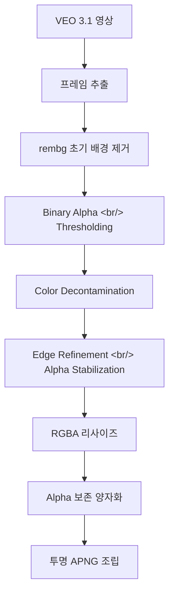

VEO 3.1이 생성한 애니메이션 영상에서 배경을 제거하고, LINE 규격의 투명 APNG를 만드는 후처리 파이프라인을 구축했다. rembg 기반 초기 제거부터 binary alpha thresholding, color decontamination, edge refinement까지 — 프레임 단위로 투명도를 확보하는 여정을 정리한다.

<!--more-->

> 이전 글: [PopCon 개발기 #2](/ko/posts/2026-04-03-popcon-dev2/)

## 문제: VEO 영상의 불투명 배경

PopCon의 파이프라인은 다음과 같다:

1. Google Imagen으로 캐릭터 포즈 이미지 생성
2. VEO 3.1로 포즈 이미지를 애니메이션 영상으로 변환
3. 영상에서 프레임 추출 → APNG로 조립

문제는 **VEO가 항상 단색 배경 위에 영상을 생성**한다는 것이다. LINE 애니메이션 이모지 규격은 투명 배경의 APNG를 요구하므로, 프레임마다 배경을 제거하는 후처리가 필수적이었다.

단순히 특정 색상을 투명으로 바꾸는 chroma key 방식으로는 부족했다. VEO가 생성하는 배경색이 일정하지 않고, 캐릭터 외곽에 anti-aliasing으로 인한 반투명 픽셀이 존재하기 때문이다.

## 설계: 후처리 배경 제거 파이프라인

리서치 끝에 다음과 같은 다단계 파이프라인을 설계했다.



각 단계가 해결하는 문제:

| 단계 | 해결하는 문제 |
|------|-------------|
| rembg | AI 기반 전경/배경 분리 — 단색 chroma key보다 정확 |
| Binary Alpha | rembg가 남기는 반투명 픽셀(alpha 128~254) 정리 |
| Color Decontamination | 배경색이 전경 외곽 픽셀에 번진 색상 오염 제거 |
| Edge Refinement | 프레임 간 알파 경계 떨림 안정화 |

## 구현 과정

### 1단계: rembg 기반 배경 제거

`remove_background()` 함수를 추가하고, rembg 라이브러리로 각 프레임의 배경을 제거했다. rembg는 U2-Net 모델을 사용하여 전경 객체를 세그멘테이션한다.

초기 결과는 괜찮았지만, 두 가지 문제가 발견되었다:

- **반투명 경계**: 캐릭터 외곽에 alpha 값이 50~200인 픽셀이 남아 APNG에서 "유령" 같은 테두리가 보임
- **색상 번짐**: 배경의 색상이 외곽 픽셀의 RGB에 혼합되어 있어, 투명으로 만들어도 잔상이 남음

### 2단계: Binary Alpha Thresholding

반투명 픽셀 문제를 해결하기 위해 alpha 채널에 이진 임계값을 적용했다. 특정 threshold(예: 128) 이상이면 255(완전 불투명), 미만이면 0(완전 투명)으로 변환한다.

이렇게 하면 외곽이 다소 거칠어질 수 있지만, 작은 이모지 크기(LINE 규격 320x270)에서는 anti-aliasing 손실보다 깔끔한 경계가 더 중요했다.

### 3단계: Color Decontamination

배경색이 번진 외곽 픽셀의 RGB 값을 보정하는 단계다. alpha가 낮은(반투명에 가까운) 픽셀의 경우, RGB 값에서 배경색 성분을 제거한다.

원리는 간단하다: `premultiplied alpha` 상태의 픽셀에서 배경색 기여분을 역산해서 빼는 것이다. 이 단계를 거치면 투명 배경 위에서도 외곽 색상이 자연스러워진다.

### 4단계: Edge Refinement과 Alpha Stabilization

프레임 단위로 독립적으로 배경을 제거하면, 프레임 간 alpha 경계가 떨린다. 특히 캐릭터가 움직이는 부분에서 외곽선이 1~2px씩 들쭉날쭉해지는 문제가 있었다.

이를 완화하기 위해 alpha 경계에 약간의 erosion/dilation 연산과 Gaussian blur를 적용하여 프레임 간 일관성을 높였다.

## APNG 파이프라인 RGBA 대응

배경 제거 자체만큼 까다로웠던 것이 기존 파이프라인의 RGBA 대응이었다. 기존 코드는 RGB 전제로 작성되어 있었다.

### resize_frame() 수정

기존 리사이즈 로직은 흰색 캔버스(`(255, 255, 255)`) 위에 이미지를 붙여넣었다. RGBA 모드에서는 **투명 캔버스**(`(0, 0, 0, 0)`)를 사용하도록 수정했다.

### _quantize_frames() 수정

LINE 애니메이션 이모지는 파일 크기 제한(300KB)이 있어 색상 양자화가 필수다. 기존 양자화 코드는 `Image.quantize()`를 사용했는데, 이 함수가 alpha 채널을 무시하고 RGB만 양자화하는 문제가 있었다.

해결 방법: alpha 채널을 분리해서 보존하고, RGB만 양자화한 후 다시 합치는 방식으로 수정했다.

### process_video() 파이프라인 통합

최종적으로 `remove_background()`를 `process_video()` 파이프라인에 통합했다. 프레임 추출 직후, 리사이즈 전에 배경 제거를 수행하는 위치로 결정했다.

```
프레임 추출 → 배경 제거 → 리사이즈 → 양자화 → APNG 조립
```

## 리서치 노트

배경 제거 외에도 몇 가지 기술을 리서치했다:

- **Frame Interpolation**: [FILM](https://github.com/google-research/frame-interpolation)과 [RIFE](https://github.com/hzwer/ECCV2022-RIFE) — VEO가 생성하는 프레임 수가 부족할 때 보간으로 부드러운 애니메이션을 만들 수 있는지 검토. 아직 통합하지는 않았지만, 다음 단계에서 필요할 수 있다.
- **Wan 2.1**: VEO 대안으로 검토한 비디오 생성 모델. Alibaba Cloud의 DashScope API나 fal.ai를 통해 접근 가능.
- **APNG 생성**: Aspose Python 라이브러리로 APNG를 만드는 방법도 조사했으나, Pillow 기반 기존 코드를 유지하기로 결정.

## 커밋 로그

| 커밋 메시지 | 변경 내용 |
|------------|----------|
| docs: add post-process background removal design spec | 배경 제거 설계 문서 작성 |
| docs: add post-process background removal implementation plan | 구현 계획 문서 작성 |
| chore: add .worktrees/ to gitignore | git worktree 디렉토리 무시 설정 |
| feat: add remove_background() with rembg and alpha edge stabilization | rembg 기반 배경 제거 함수와 알파 엣지 안정화 구현 |
| feat: update resize_frame() to support RGBA with transparent canvas | 리사이즈 함수 RGBA 투명 캔버스 지원 |
| feat: update _quantize_frames() to preserve alpha channel | 양자화 시 알파 채널 보존 로직 추가 |
| feat: wire remove_background() into process_video() pipeline | 배경 제거를 비디오 처리 파이프라인에 통합 |
| test: add end-to-end APNG transparency verification | APNG 투명도 E2E 테스트 추가 |
| fix: clean up intermediate directories after frame processing | 프레임 처리 후 임시 디렉토리 정리 |
| feat: post-process background removal with rembg on extracted VEO frames | VEO 프레임에 rembg 후처리 배경 제거 적용 |
| feat: enhance background removal with binary alpha, color decontamination, and edge refinement | binary alpha, color decontamination, edge refinement으로 배경 제거 품질 향상 |
| feat: enhance background removal (continued) | 배경 제거 개선 작업 계속 |

## 다음 단계

- Frame interpolation 통합 검토 (FILM 또는 RIFE)
- 배경 제거 품질 A/B 테스트 자동화
- VEO 프롬프트 최적화로 배경 제거 부담 줄이기
- LINE 규격 최종 검증 및 제출 테스트
