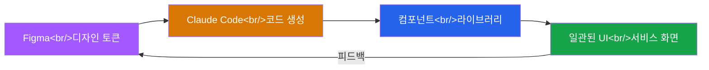

## 개요

Figma 커뮤니티에서 Claude Code와 Figma를 결합한 디자인 워크플로우 자료들이 늘어나고 있습니다. AI 코딩 도구를 디자인 프로세스에 통합하면 디자인 토큰 관리, 반복 작업 자동화, 접근성 검증까지 하나의 흐름으로 처리할 수 있습니다.

이 글에서는 피그마 튜터(@figma_tutor)의 주간라이브 자료를 기반으로, Claude Code + Figma 조합의 활용 방향을 정리합니다.

<!--more-->

## Claude Code + Figma 워크플로우

핵심 아이디어는 Figma에서 정의한 디자인 토큰(색상, 타이포그래피, 간격 등)을 Claude Code가 읽어서 실제 코드 컴포넌트로 변환하는 것입니다. 수동으로 디자인 시스템 문서를 보고 코드를 작성하는 대신, AI가 토큰 값을 그대로 반영한 코드를 생성합니다.

## 일관된 디자인 유지

디자인 일관성이 깨지는 가장 흔한 원인은 디자인 파일과 코드 사이의 간극입니다. Claude Code를 활용하면 이 간극을 줄일 수 있습니다.

**디자인 토큰 동기화**

- Figma Variables(변수)나 스타일에서 디자인 토큰을 추출
- Claude Code가 이를 CSS 변수, Tailwind 설정, 또는 테마 객체로 변환
- 토큰 값이 바뀌면 코드도 자동 업데이트

**컴포넌트 코드 생성**

- Figma 컴포넌트 구조를 분석하여 React/Vue 등의 컴포넌트 코드 생성
- 변형(Variant) 정보를 props로 매핑
- 반복적인 보일러플레이트 코드 작성을 자동화

## 콘텐츠 디자인 자동화

콘텐츠가 자주 바뀌는 서비스(이벤트 배너, 프로모션 페이지 등)에서는 같은 레이아웃에 다른 텍스트/이미지를 반복적으로 적용해야 합니다.

Claude Code + Figma 조합으로 자동화할 수 있는 작업:

| 작업 | 수동 | 자동화 |
|------|------|--------|
| 배너 텍스트 교체 | Figma에서 하나씩 수정 | 데이터 기반 일괄 생성 |
| 다국어 버전 생성 | 복사 후 번역 텍스트 붙여넣기 | 번역 API 연동 자동 생성 |
| 반응형 변형 | 각 breakpoint별 수동 조정 | 규칙 기반 자동 리사이즈 |
| 이미지 에셋 내보내기 | 수동 Export | 스크립트로 일괄 내보내기 |

## 웹 접근성 자동화

피그마 튜터의 또 다른 주간라이브에서는 Figma 단계에서부터 웹 접근성을 고려한 디자인을 다루고 있습니다. Claude Code를 접근성 검증에 활용하면:

- **색상 대비 검증** — WCAG 기준(AA/AAA)에 맞는 대비율을 자동 체크
- **포커스 순서 설계** — 탭 이동 순서가 논리적인지 AI가 분석
- **대체 텍스트 생성** — 이미지 컴포넌트에 적절한 alt 텍스트 제안
- **시맨틱 구조 검증** — 디자인의 시각적 계층이 HTML 시맨틱과 일치하는지 확인

디자인 단계에서 접근성을 잡으면, 개발 단계에서 뒤늦게 수정하는 비용을 크게 줄일 수 있습니다.

## 참고 자료

아래 Figma 커뮤니티 파일들에서 더 자세한 내용을 확인할 수 있습니다.

1. **[주간라이브] 클로드 코드 & 피그마로 일관된 디자인 하는 방법** — [@figma_tutor](https://www.figma.com/@figma_tutor)
   - Claude Code와 Figma를 함께 사용하여 서비스 전반의 디자인 일관성을 유지하는 방법

2. **[피그마 튜터] 클로드코드+피그마 조합으로 우리 서비스 콘텐츠 디자인 자동화 하기** — [@figma_tutor](https://www.figma.com/@figma_tutor)
   - 서비스 콘텐츠 디자인을 Claude Code + Figma 조합으로 자동화하는 실습

3. **[주간라이브] 피그마로 웹 접근성까지 고려한 웹 화면 그리기** — [@figma_tutor](https://www.figma.com/@figma_tutor)
   - Figma에서 웹 접근성을 고려한 화면 설계 방법

## 마무리

AI 코딩 도구와 디자인 도구의 결합은 아직 초기 단계지만, 이미 디자인 토큰 동기화, 반복 작업 자동화, 접근성 검증 같은 영역에서 실질적인 효과를 보이고 있습니다. 특히 한국 Figma 커뮤니티에서 이런 워크플로우를 적극적으로 공유하고 있다는 점이 고무적입니다.

디자이너와 개발자 사이의 핸드오프를 줄이고, 디자인 시스템의 단일 소스(Single Source of Truth)를 유지하는 것이 이 조합의 핵심 가치입니다.
